# Perform Advanced Usage Tracking with Java Management Service

## Introduction

This lab walks you through the steps to use the advanced usage tracking with Java Management Service. The advance usage tracking consist of:
 - Tracking the Java Servers in the fleet
 - Tracking the libraries of the applications running in the fleet.

Both of these task can be done in parallel.

Estimated Time: 40 minutes

[Lab 3](videohub:1_uqh7nh75)

### Objectives

In this lab, you will:

* Scan for Java servers in the fleet and view the applications running on them
* Scan the Java libraries of the running Java applications

### Prerequisites

* You have signed up for an account with Oracle Cloud Infrastructure and have requested workshop reservation on LiveLabs.
* A running compute instance with preloaded Java Runtimes and Java applications (already created for you) that you will be monitoring.
* A running compute instance with preloaded Java servers which are supported (already created for you). The supported versions of Java servers are:
     - WebLogic: 14.1.1.0.0, 12.2.1.4.0
     - JBoss: 7.0 to 7.4
     - Tomcat: 8.5 to 10
* Access to the cloud environment and resources configured in [Lab 1](?lab=setup-a-fleet) and [Lab 2](?lab=install-management-agent-script).

## Task 1: Initialize a Java server scan

1. Open the navigation menu, click **Observability & Management**. Click **Fleets** under **Java Management**. Select the fleet that was created in [Lab 1](?lab=setup-a-fleet).

      

2. On the Fleet details page, click **More actions** and select **Scan for Java servers**.

     

3. Click **Scan** on the  **Scan for Java servers** confirmation screen.

     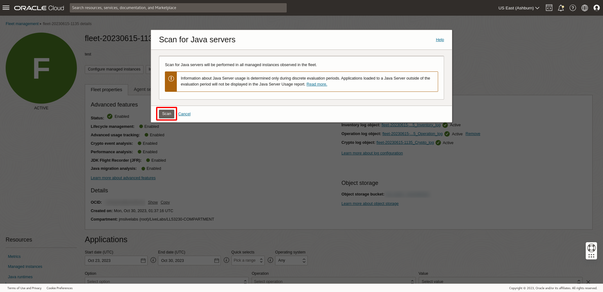

   If your request is submitted successfully, you should receive a notification in green as seen below:
     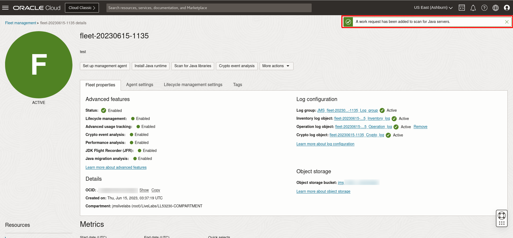

4. Scroll down the Fleet details page. Under **Resources** menu, select **Work requests**. You should see the **Scan for Java servers** work request you submitted in step 3. Wait for the work request to complete.

     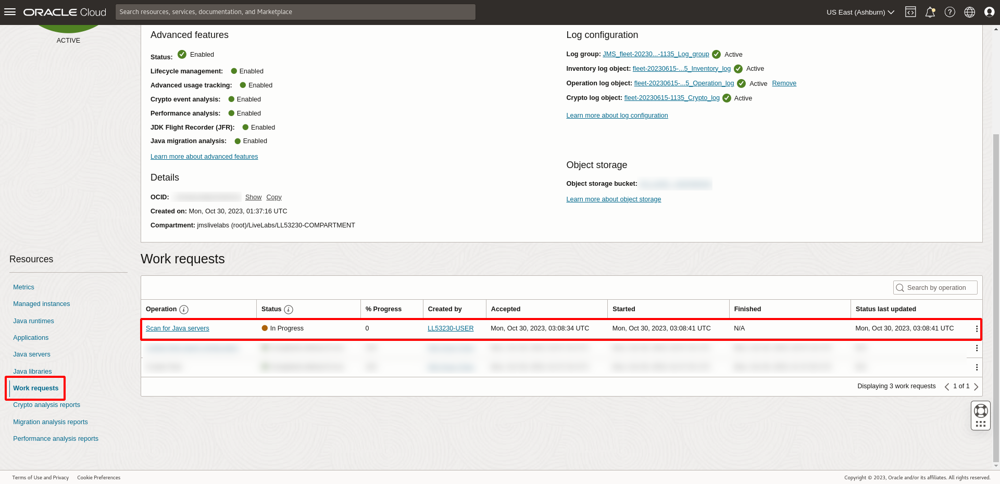

5. If your request is successful, you should see that the Status of the request is marked as **Completed without errors**.
      It will take approximately 10 minutes for the request to be completed.
     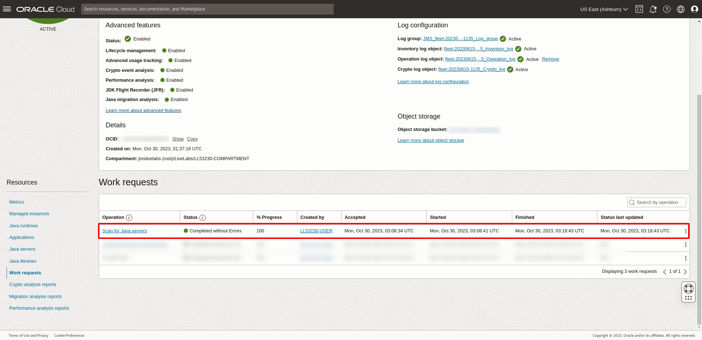

6. Under the **Resources** menu on the Fleet details page, select **Java servers**. You should be able to see 3 types of Java servers present.
     - Apache Tomcat
     - WildFly Full (JBoss)
     - WebLogic Server
     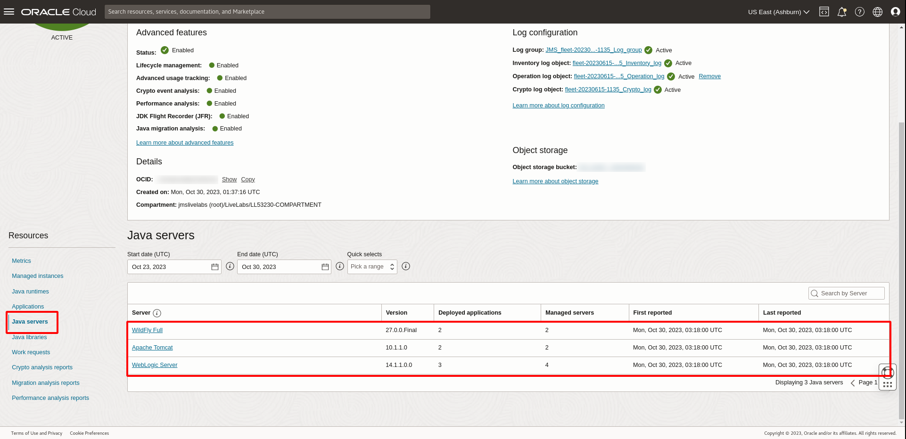

7. Click **WebLogic Server** under Java servers. The **Deployed applications** menu displays the different applications deployed on the servers and their target type (clustered / non-clustered). There are two different applications deployed on the WebLogic server in the preloaded compute instance. 
     - webAppWebLogic : non-clustered
     - webAppWebLogic_Cluster : clustered

     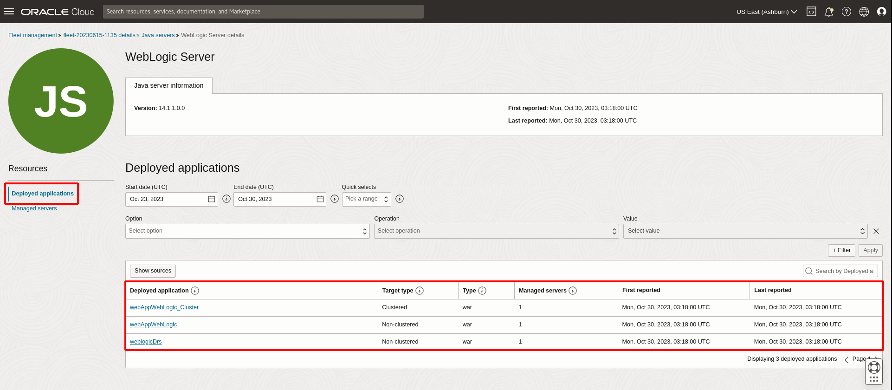

8. Click on the **Managed servers** under Resources. This will show all the different managed servers present and the number of deployed applications.
     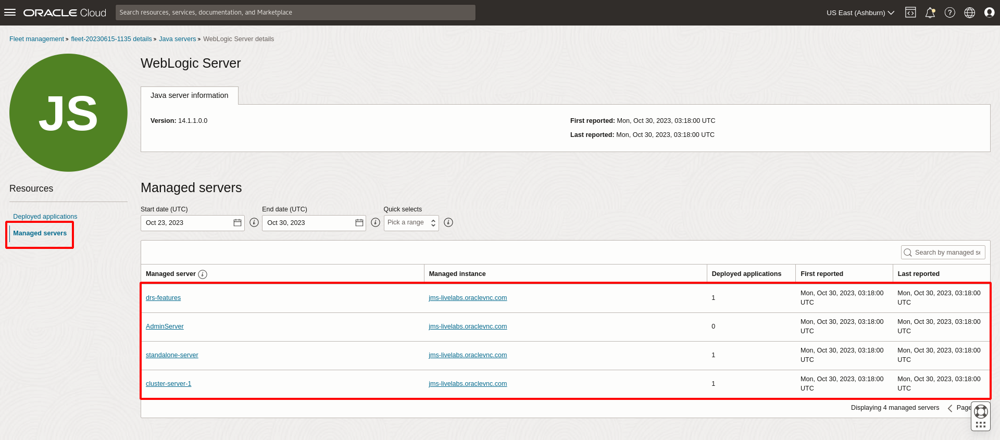

## Task 2: Initialize a Java libraries scan

1. Open the navigation menu, click **Observability & Management**. Click **Fleets** under **Java Management**. Select the fleet that was created in [Lab 1](?lab=setup-a-fleet).
     

2. On the Fleet details page, click **Scan for Java libraries**.
     

3. Click **Scan** on the  **Scan for Java libraries** confirmation screen.
     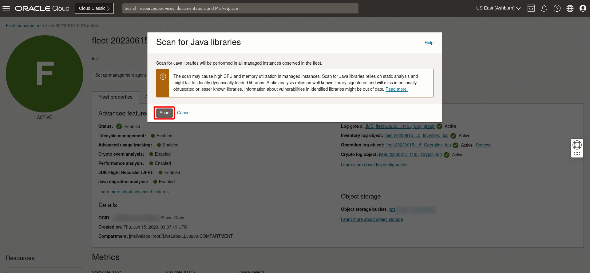

   If your request is submitted successfully, you should receive a notification in green as seen below:
     

4. Scroll down the Fleet details page. Under **Resources** menu, select **Work requests**. You should see the **Scan for Java libraries** work request you submitted in step 3. Wait for the work request to complete.
     

5. If your request is successful, you should see that the Status of the request is marked as **Completed without errors**. It will take approximately 10 minutes for the request to be completed.
     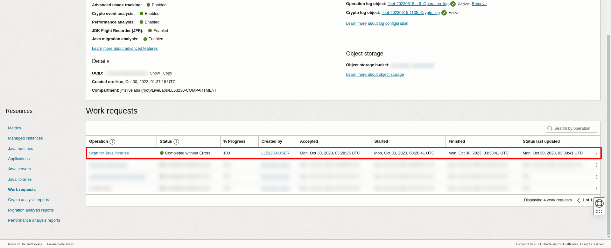

6. Scroll down the Fleet details page. Under the **Resources** menu on the Fleet details page, select **Java libraries**. A list of Java libraries included in the applications running in the fleet is displayed.
     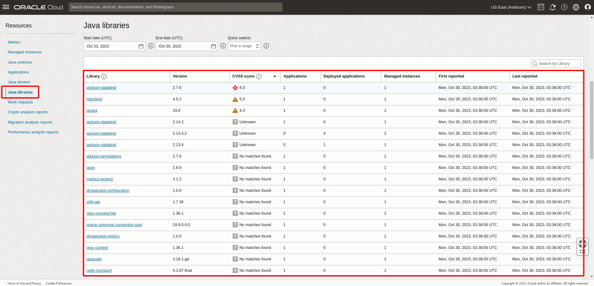

     The CVSS score is the indication of the security vulnerability associated with the Java library. The score varies over time and there might be new vulnerabilities affecting your application since JMS refreshes data from the National Vulnerability Database (NVD) on a weekly basis.

     Based on the assigned numerical scores, 0 to 10, from NVD, we could interpret based on the following:

      - When the Java library is found in the NVD and a CVSS score is obtained, the CVSS score will be displayed with a score and severity status. Severity statuses have categories of High (red), Medium (yellow), and Low (green) as per CVSS score categories.
      - When a Java library is found in the NVD but a CVSS score is not computed, Unknown will be shown under the CVSS score column.
      - When the Java library is not found in the NVD, No matches found will be shown under the CVSS score column.

      To see more details on this, hover over the CVSS score column tooltip.

      

     > **Note:** Java library detection is not supported for JBoss/Wildfly.

7. To find a library, click on search bar at the the top right corner of the Java libraries table and type the keyword.

     Example when searching for **OCI**.
     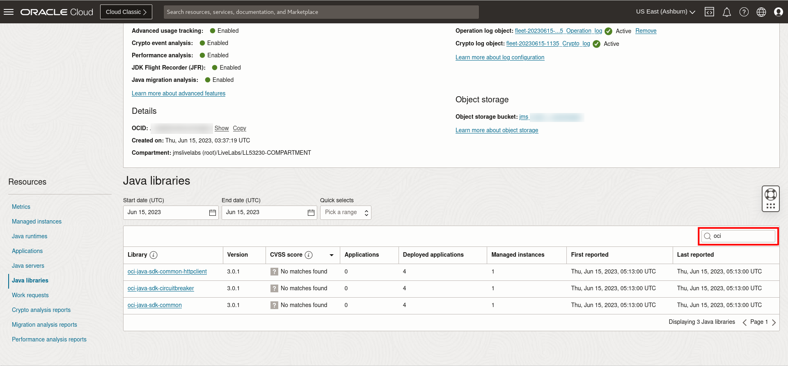

You may now **proceed to the next lab**.

## Learn More
* Refer to the [Advance Usage Tracking](https://docs.oracle.com/en-us/iaas/jms/doc/advanced-features.html#GUID-3BBAC7A7-6C29-4885-9FB1-A4309D7C75C3), [Work Request](https://docs.oracle.com/en-us/iaas/jms/doc/using-java-management-service.html#GUID-77AEEBC0-93A5-4E99-96D6-BEE0FEE4539F) sections of the JMS documentation for more details. sections of the JMS documentation for more details.

* Refer to [National vulnerability database](https://nvd.nist.gov/) for more details on CVSS score.

* Use the [Troubleshooting](https://docs.oracle.com/en-us/iaas/jms/doc/troubleshooting.html#GUID-2D613C72-10F3-4905-A306-4F2673FB1CD3) chapter for explanations on how to diagnose and resolve common problems encountered when installing or using Java Management Service.

* If the problem still persists or it is not listed, then refer to the [Getting Help and Contacting Support](https://docs.oracle.com/en-us/iaas/Content/GSG/Tasks/contactingsupport.htm) section. You can also open a support service request using the **Help** menu in the OCI console.

## Acknowledgements

* **Author** - Bao Jin Lee, Java Management Service
* **Last Updated By** - Ivan Eng, June 2023
