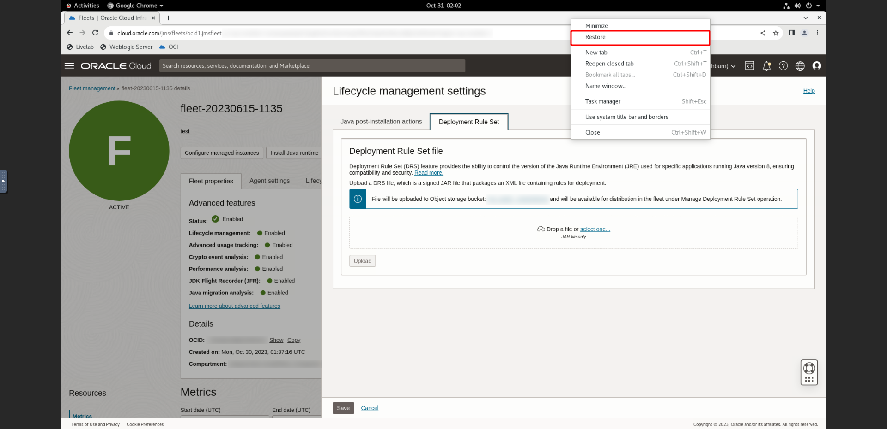

# Apply Deployment Rule Set

## Introduction

This lab will guide you through the process of applying Deployment Rule Set (DRS) on your compute instance. It's important to note that DRS functionality is only supported up to JDK 8.

Estimated Time: 20 minutes

### Objectives

In this lab, you will:

   * Upload a signed DRS JAR file to manage rules across all the managed instances in a fleet
   * Apply the DRS to the Managed Instance
   * Verify DRS actions has been applied on the Managed Instance

### Prerequisites

   * You have signed up for an account with Oracle Cloud Infrastructure and have requested workshop reservation on LiveLabs.
   * A running compute instance with preloaded Java runtimes and Java applications (already created for you) that you will be monitoring.
   * Access to the cloud environment and resources configured in [Lab 1](?lab=setup-a-fleet) and [Lab 2](?lab=install-management-agent-script).

## Task 1: Upload Deployment Rule Set Jar File

1. This task makes use of the noVNC Graphical Remote Desktop to connect to the compute instance to upload the Deployment Rule Set (DRS) Jar file. Open the navigation menu, click **Observability & Management**. Click **Fleets** under **Java Management** and select the fleet that was created in [Lab 1](?lab=setup-a-fleet).
      > **Note:** The noVNC Graphical Remote Desktop has already been setup in the provided compute instance for you. Refer to the previous [Lab 2](?lab=install-management-agent-script) for more information on how to connect to the compute instance using noVNC.

   

2. On the Fleet details page, click **More actions** and select **Modify Java runtime lifecycle management settings**. This opens the **Lifecycle management settings** panel.
   

3. In the **Lifecycle management settings**, click on the **Deployment Rule Set** tab.
   

4. You can reduce the size of the browser window. Right click the top of the browser and click restore.
   

5. Click on the **Activities** button at the top left corner of the noVNC graphical remote desktop and click on the **Files** to open files.
   

6.  In the **Files** window, double click on the **Desktop** folder.
   
   
    Double click on the **drs** folder.
    

7.  Drag and drop the **DeploymentRuleSet.jar** from the **drs** folder into the chrome browser to upload the **DeploymentRuleSet.jar** file into the OCI console.
      > **Note:** To learn more about **Deployment Rule Set** you can refer to the links below: [Learn More](#LearnMore)

   

8.  You can maximize the browser window in the graphical remote desktop. Right click the top of the browser and select maximize. 
   

      Then click **upload**.
      

9.  A work request will be submitted. If your request is submitted successfully, you should receive a notification in green as seen below. Click **save**.
      

10. To view the work request, scroll down to the **Resources** menu and select **Work requests**. You should see a list of the work requests that are currently in your Fleet. **Upload DRS file in LCM settings** should be present in the table below. If the work request has been completed successfully, the status will change to **Completed without Errors**.

   

## Task 2: Distribute the DRS Jar File to Managed Instances in Fleet

1. After the **DeploymentRuleSet.jar** file has been uploaded successfully, in the Fleet details page, click **More actions** and select **Manage Deployment Rule Set**.
   

2.  In **Manage Deployment Rule Set**, select **Distribute DRS** and click **Submit**. 
   

3.  If your request is submitted successfully, you should receive a notification in green as seen below:
   
   
4.  To view the work request, scroll down to the **Resources** menu and select **Work requests**. You should see a list of the work requests that are currently in your Fleet. **Distribute DRS file to instance(s)** that was started should be at the top of the list.
   

5.  Wait for the work request to be processed. When the work request has been completed successfully, the status will change to **Completed without Errors**.
      
      >**Note:** It will take approximately 15 minutes for the work request to be completed.

## Task 3: View Permissions Specified By Deployment Rule Set

1. After the **Deployment Rule Set** has been applied successfully, you can see the effects of **Deployment Rule Set** in action. Click on the **Activities** button at the top left corner of the noVNC graphical remote desktop and type **firefox** in the search bar. Double click on the icon to open the browser.
   
   
2. In the firefox browser, you can maxmimise it by double clicking the top of the browser. Click on the **Deployment Rule Set** bookmark.
   

3. To view the **run** permission specified in the **Deployment Rule Set**, click on the link shown below:
             

4. This action initiates the download of a JNLP file, and Java Web Start will be used to launch the JNLP file. You will be able to see that the **Deployment Rule Set** has granted permission for this application to launch.
   > **Note:** To learn more about **Java Web Start** you can refer to the links below: [Learn More](#LearnMore)

Click **ok**.

5. You will be able to view the application that was launched. Click **x** to close the application.
   

6. To view the **block** permission specified in the **Deployment Rule Set**, click on the link shown below:
   

7. This action initiates the download of a JNLP file, and Java Web Start will be used to launch the JNLP file. You will be able to see that the **Deployment Rule Set** has blocked this application from launching.
   

   Click **ok**.
               

8. To view the **using specific version** permission specified in the **Deployment Rule Set**, click on the link shown below:
   

9.  This action initiates the download of a JNLP file, and Java Web Start will be used to launch the JNLP file. You will be able to see the condition specified by the **Deployment Rule Set**.
   

10. You will be able to see that the JNLP application is currently restricted due to a version mismatch specified by the **Deployment Rule Set**. Click **ok**.
   

## Task 4: (Optional) Locate the Uploaded DRS File in Object Storage

1. In order to view the **object storage** location the **DeploymentRuleSet.jar** file was uploaded to, navigate to fleet details. This can be done by opening the navigation menu and clicking on **Observability & Management**. Click **Fleets** under **Java Management**.
   

2. On the Fleet details page, click on the link for the **Object storage bucket**.
   

3. The file is stored in the location: LCM > DRS > fleet-ocid > **DeploymentRuleSet.jar**.
   

You may now **proceed to the next lab**.

## Learn More

* Use the [Troubleshooting](https://docs.oracle.com/en-us/iaas/jms/doc/troubleshooting.html#GUID-2D613C72-10F3-4905-A306-4F2673FB1CD3) chapter for explanations on how to diagnose and resolve common problems encountered when installing or using Java Management Service.

* If the problem still persists or it is not listed, then refer to the [Getting Help and Contacting Support](https://docs.oracle.com/en-us/iaas/Content/GSG/Tasks/contactingsupport.htm) section. You can also open a support service request using the **Help** menu in the OCI console.

* For more in-depth information about DRS, you can explore the official Oracle documentation: [Deployment Rule Set](https://docs.oracle.com/javase/8/docs/technotes/guides/deploy/deployment_rules.html)

* To learn more about Java Web Start, you can refer to the official Oracle documentation: [Java Web Start](https://docs.oracle.com/javase/8/docs/technotes/guides/javaws/)

## Acknowledgements

* **Author** - Chan Wei Quan, Java Management Service
* **Last Updated By** - Chan Wei Quan, October 2023
