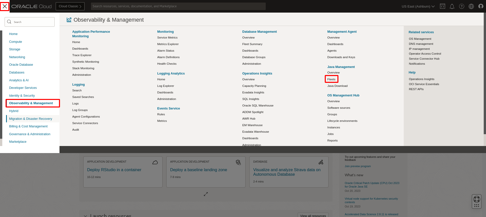
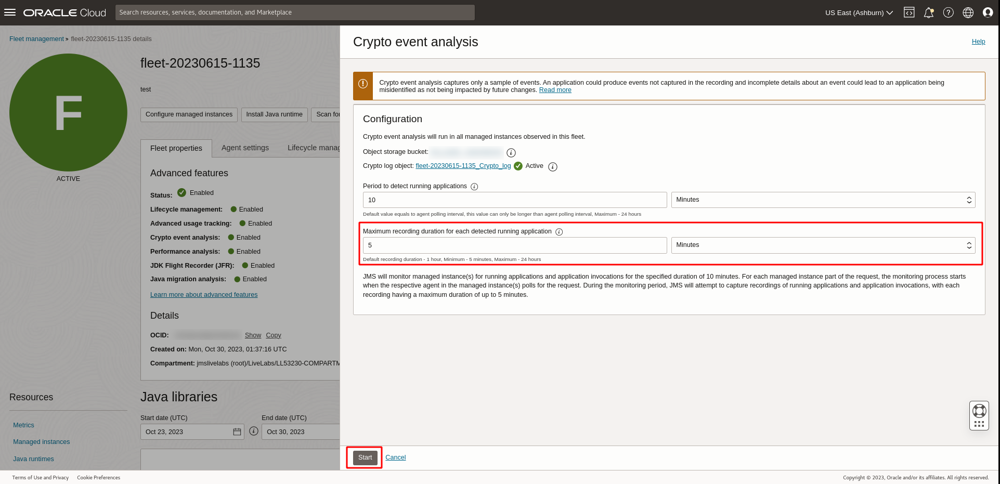
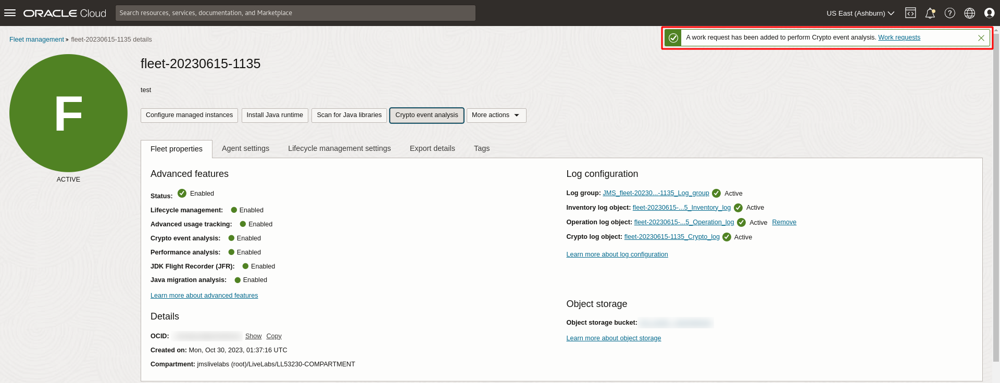
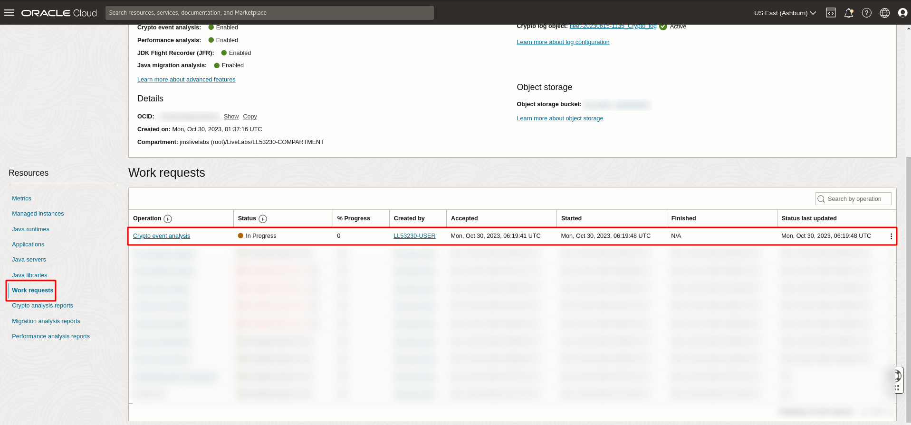
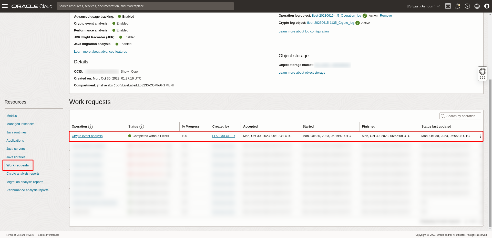
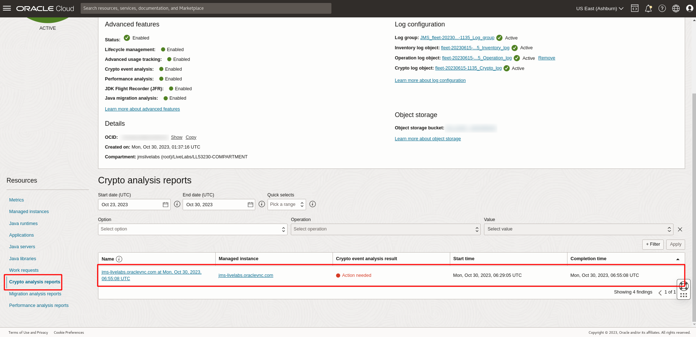
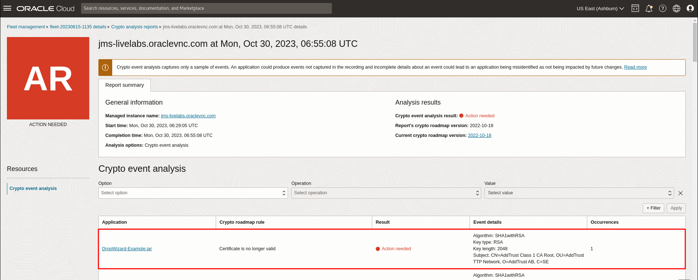
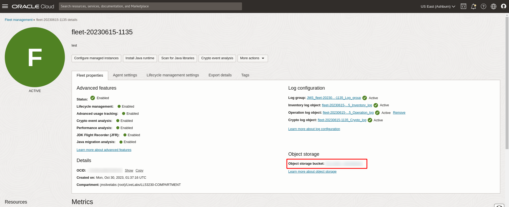
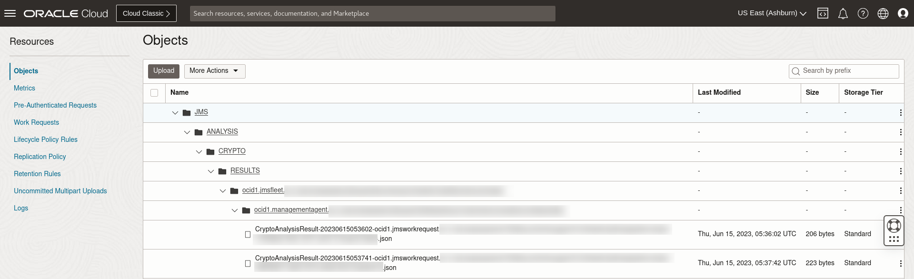

# Perform Crypto event analysis on Java applications

## Introduction

This lab walks you through the steps to perform a Crypto Event Analysis on the Java applications running in a fleet. 

Estimated Time: 30 minutes

### Objectives

In this lab, you will:

* Perform a cryptographic analysis on the Java applications running in the fleet

### Prerequisites

* You have signed up for an account with Oracle Cloud Infrastructure and have requested workshop reservation on LiveLabs.
* A running compute instance with preloaded Java Runtimes and Java applications (already created for you) that you will be monitoring.
* Access to the cloud environment and resources configured in [Lab 1](?lab=setup-a-fleet) and [Lab 2](?lab=install-management-agent-script).

## Task 1: Submit a Crypto event analysis request

1. Open the navigation menu, click **Observability & Management**. Click **Fleets** under **Java Management**. Select the fleet that was created in [Lab 1](?lab=setup-a-fleet).
   

2. On the Fleet details page, click the button labeled Crypto event analysis.
   

3. Under the **Recording duration**, set the recording duration to 5 minutes. Click the Start button.
   

   If your request is submitted successfully, you should receive a notification in green as seen below: 
   

4. Scroll down the Fleet details page. Under **Resources** menu, select **Work Request**. You should see the **Crypto Event Analysis** Work Request you submitted in step 3. Wait for the work request to complete. 
   

5. If your request is successful, you should see that the Status of the request is marked as **Completed without errors**.
It will take approximately 15 to 30 minutes for the request to be completed. 
    

   The work request may also be marked as **Completed with errors** as there are some short running applications (< 5mins ) in the compute instance which may interrupt the crypto event analysis of that particular application

   

   Continue with the subsequent step if the work request is marked as **Completed with errors**.

6. Once the work request status shows **Completed**, scroll down to the **Resource** menu and select **Analysis reports**.

   You should see a list of Crypto analysis reports that have been conducted in your Fleet. The latest **Crypto event analysis** that has been completed is displayed at the top of the list.

   The **Crypto event analysis** result should display **Attention needed**.
   

   In the event that there are no issues found, the result should display **No warnings found**.

   >**Note:** Crypto event analysis captures only a sample of events. An application could produce events not captured in the recording and incomplete details about an event could lead to an application being misidentified as not being impacted by future changes. 

7. Click on the analysis report. A list of actions needed will be displayed.
   


## Task 2: (Optional) Download Crypto event analysis report

1. To access the report, navigate to the Fleet details page and click on the **Object storage bucket** name under **Object storage**.
    

2. The raw copies of the **Crypto event analysis** report is stored in the file: **JMS > ANALYSIS > CRYPTO > RESULTS > fleet-ocid > instance-ocid > CryptoAnalysisResult** json. Each application running on a Java runtime will generate a report.
    

   <details>
      <summary>JSON schema of Crypto Analysis Result</summary>

      ```javascript
      {
        timeAnalyzed: date-time,
        cryptoRoadmapVersion: string,
        jvmVendor: string,
        jvmVersion: string,
        jvmDistribution: string,
        applicationName: string,
        applicationCommand: string,
        events: [
          {
            eventType: string,
            occurrences: int32,
            fields: [
              {
                key: string,
                value: string
              }
            ],
            findings: [
              {
                detectorName: string,
                detectorCategory: string,
                severity: string,
                detailsLink: url
              }
            ]
          }
        ]
      }
      ```
    </details>

3. The summarized raw copy of the **Crypto event analysis** report is stored in the file: **JMS > ANALYSIS > CRYPTO > RESULTS > fleet-ocid > instance-ocid > CryptoAnalysisResultMerged** json.

   <details>
      <summary>JSON schema for merged Crypto Analysis Result per Managed Instance</summary>

      ```javascript
      {
        timeAnalyzed: date-time,
        cryptoRoadmapVersion: string,
        managedInstanceOcid: OCID,
        managedInstanceName: string,
        applications: [{
          name: string,
          command: string,
          events: [{
            eventType: string,
            occurrences: int32,
            fields: [{
              key: string,
              value: string
            }],
            findings: [{
              detectorName: string,
              detectorCategory: string,
              severity: string,
              detailsLink: url
            }]
          }]
        }]
      }
      ```
    </details>

You may now **proceed to the next lab**.

## Learn More
* Refer to the [Crypto Event Analysis](https://docs.oracle.com/en-us/iaas/jms/doc/advanced-features.html#GUID-08673CB1-D87D-4BC5-A61D-E59DCC879ABB), [Work Request](https://docs.oracle.com/en-us/iaas/jms/doc/getting-started-java-management-service.html#GUID-47C63464-BC0C-4059-B552-ED9F33E77ED3) and [Viewing a Work Request](https://docs.oracle.com/en-us/iaas/jms/doc/fleet-views.html#GUID-F649F0E5-DD54-4DEC-A0F1-942FE3552C93) sections of the JMS documentation for more details.

* Use the [Troubleshooting](https://docs.oracle.com/en-us/iaas/jms/doc/troubleshooting.html#GUID-2D613C72-10F3-4905-A306-4F2673FB1CD3) chapter for explanations on how to diagnose and resolve common problems encountered when installing or using Java Management Service.

* If the problem still persists or it is not listed, then refer to the [Getting Help and Contacting Support](https://docs.oracle.com/en-us/iaas/Content/GSG/Tasks/contactingsupport.htm) section. You can also open a support service request using the **Help** menu in the OCI console.


## Acknowledgements

* **Author** - Bao Jin Lee, Java Management Service
* **Last Updated By** - Bao Jin Lee, January 2023
