# Install Management Agent on your Managed Instance using OCI console

## Introduction

<<<<<<< HEAD
This lab walks you through the steps to set up Java Management Service (JMS) and Management Agent plugins on your OCI compute instance host using OCI console. JMS allows Java Usage Tracking and Lifecycle Management.
=======
This lab walks you through the steps to set up Java Management Service and Management Agent plugins on your OCI compute instance host using OCI console to allow Java Usage Tracking and Lifecycle Management by the Java Management Service (JMS).
>>>>>>> upstream/main

Estimated Time: 15 minutes

### Objectives

In this lab, you will:

* Enable Java Management Service and Management Agent plugins on Compute Instances
* Deploy the Java Usage Tracking plugin on Management Agent
* Associate the Management Agent with your fleet
* Monitor the Java Runtimes and Java applications in JMS fleet

### Prerequisites

* You have signed up for an account with Oracle Cloud Infrastructure and have requested workshop reservation on LiveLabs.

## Task 1: Enable Java Management Service and Management Agent plugins on Compute Instances

1. In the Oracle Cloud Console, open the navigation menu, click **Compute**, and then click **Instances**. Select the instance **LLxxxxx-INSTANCE-JMS**. This instance should be in the same compartment in [Lab 1](?lab=setup-a-fleet).

  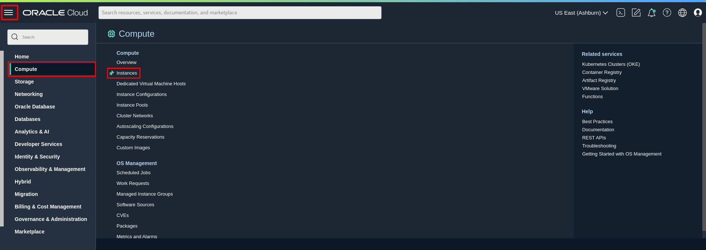

2. Click the **Oracle Cloud Agent** (OCA) tab. The list of OCA plugins is displayed. Toggle the Enabled switch for the **Oracle Java Management Service** and **Management Agent** plugins.

  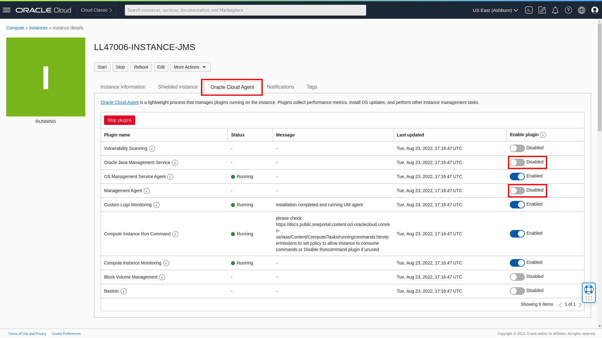

3. The status of the plugins may be set to **Stopped** initially. It may take 5-10 minutes before the status is changed to **Running**.
Do not disturb the setup in this time and only proceed after the status of the plugins are set to **Running**.
  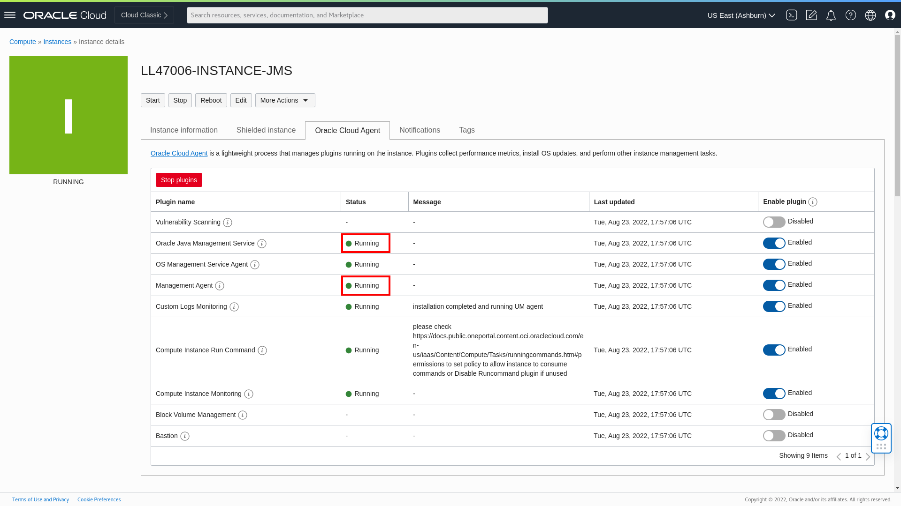

5. We will need to verify that our agent is enabled successfully. In the Oracle Cloud Console, open the navigation menu, click **Observability & Management**, and under **Management Agent**, click **Agents**.

  

6. Ensure that your agent is in the list of agents. The name of the Agent should be of the form of  `Agent(<YOUR-INSTANCE-NAME>)`. This Agent should also be in the same compartment in [Lab 1](?lab=setup-a-fleet).

  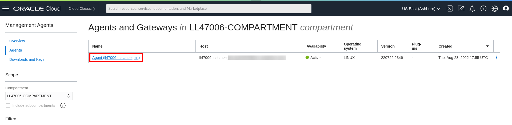

## Task 2: Deploy Java Usage Tracking plugin

1. In your agent, click **Deploy plug-ins**.
  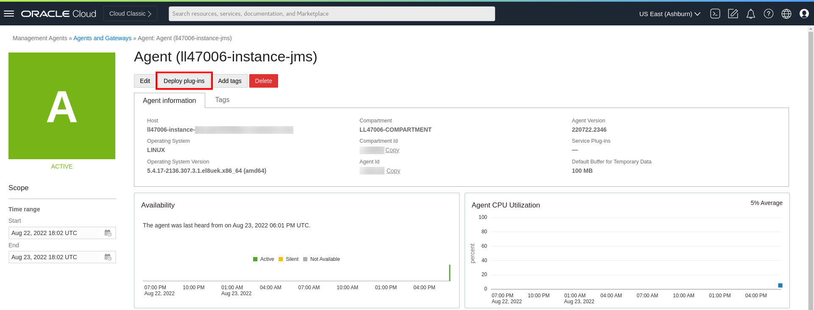

2. Check the **Java Usage Tracking** box and click **Update**. This will deploy the Java Usage Tracking service plugin.
  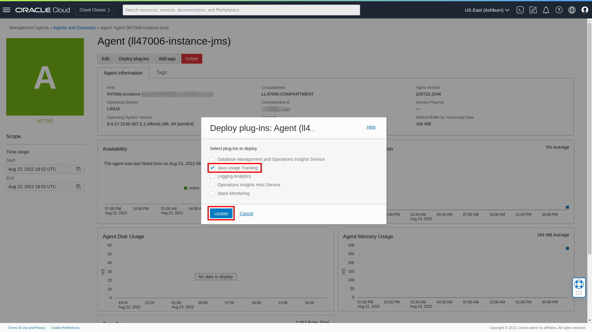

## Task 3: Associate the management agent with your fleet

1. In the Oracle Cloud Console, open the navigation menu, click **Observability & Management**, and then click **Fleets** under **Java Management**.

  

2. Select the fleet you would like to associate your agent with.

3. Take note of the fleet ocid for your fleet.

  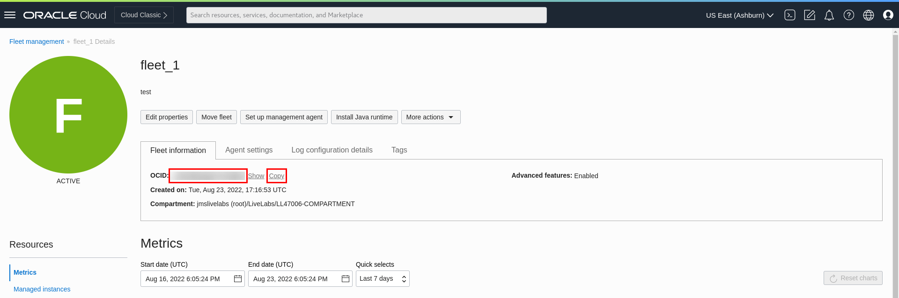

4. In the Oracle Cloud Console, open the navigation menu, click **Observability & Management**, and under **Management Agent**, click **Agents**.

    

5. Select the agent that you have just enabled in Task 1.

6. Click the **Add Tags** button. Alternatively, you can click the **Tags** tab, followed by **Add Tags**.

  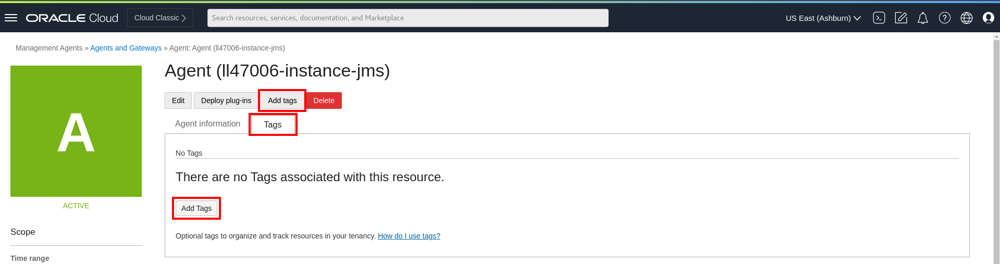

7. Add a `jms` tag to the management agent with the following details and click **Add Tags** once done:
    * **Tag namespace**: jms
    * **Tag key**: fleet_ocid
    * **Tag value**: the OCID of your fleet

  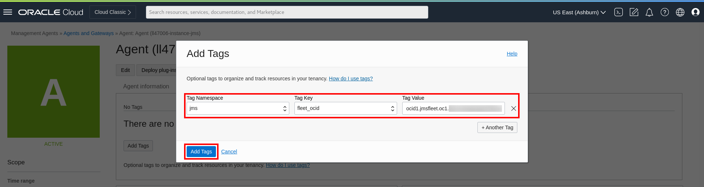

## Task 4: Verify detection of Java Runtimes and applications
Now that the Management Agent has been set up in your compute instance, it will be able to detect the Java applications that have been executed in the compute instance. This can be observed in the Oracle Cloud Console.

1. In the Oracle Cloud Console, open the navigation menu, click **Observability & Management**, and then click **Fleets** under **Java Management**.

  

2. Select the compartment that the fleet is in and click the fleet.

3. Click **Managed instances** under **Resources**. If tagging and installation of the management agent is successful, the tagged Managed Instance will be indicated on the Fleet Main Page after 5 minutes.

  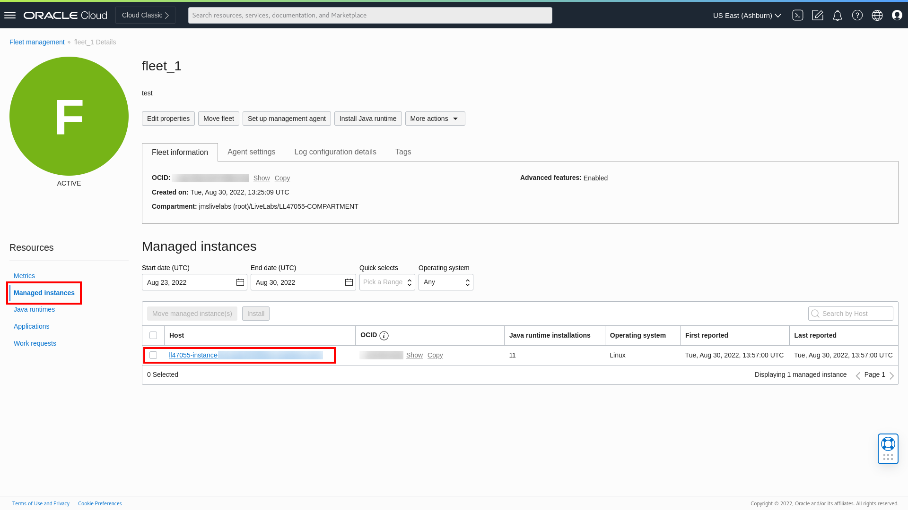

4. Click **Java Runtimes** under **Resources**. You should see a list of Java Runtimes from Java 8 to Java 18, these Java Runtimes are preloaded in the compute instance in Task 1.

  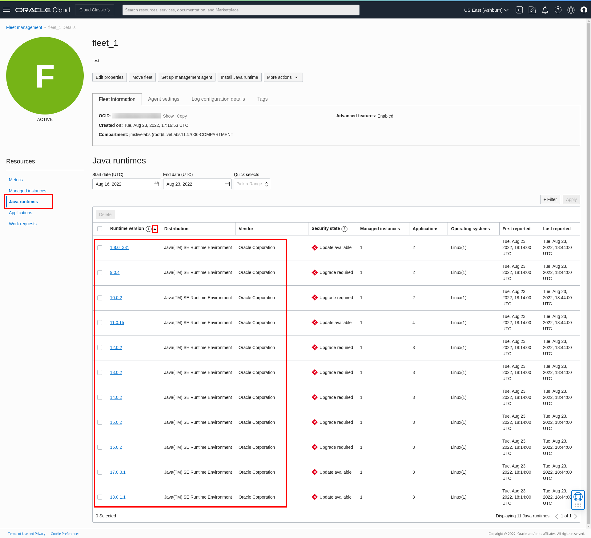

5. Click **Applications** under **Resources**. You should now see four applications. The first three are examples of DropWizard, SpringBoot and Micronaut, these applications are preloaded and running in the compute instance in Task 1. The fourth is the Oracle Java Management Service plugin.

  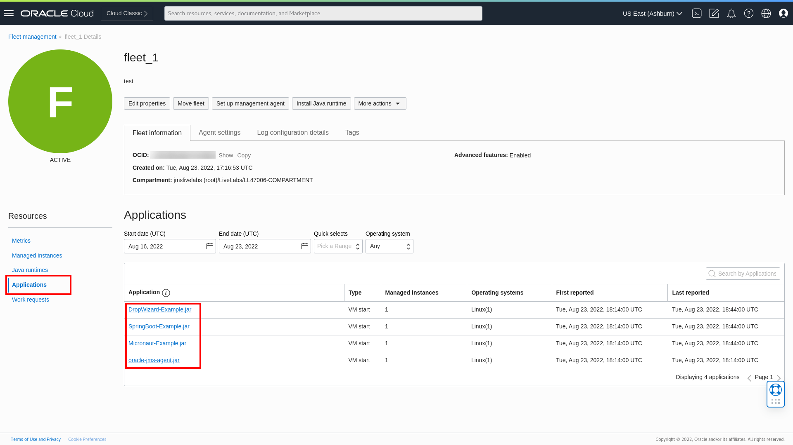

  You may now **proceed to the next lab.**

## Learn More
* Refer to the [Management Agent Concepts](https://docs.oracle.com/en-us/iaas/management-agents/doc/you-begin.html) and
[Configuring a Management Agent on an OCI Compute Instance](https://docs.oracle.com/en-us/iaas/jms/doc/agent-management.html) sections of the JMS documentation for more details.

* Use the [Troubleshooting](https://docs.oracle.com/en-us/iaas/jms/doc/troubleshooting.html#GUID-2D613C72-10F3-4905-A306-4F2673FB1CD3) chapter for explanations on how to diagnose and resolve common problems encountered when installing or using Java Management Service.

<<<<<<< HEAD
* If the problem still persists or it is not listed, then refer to the [Getting Help and Contacting Support](https://docs.oracle.com/en-us/iaas/Content/GSG/Tasks/contactingsupport.htm) section. You can also open a support service request using the **Help** menu in the OCI console.
=======
* If the problem still persists or if the problem you are facing is not listed, please refer to the [Getting Help and Contacting Support](https://docs.oracle.com/en-us/iaas/Content/GSG/Tasks/contactingsupport.htm) section or you may open a support service request using the **Help** menu in the Oracle Cloud Console.
>>>>>>> upstream/main

## Acknowledgements

* **Author** - Yixin Wei, Java Management Service
* **Last Updated By** - Yixin Wei, September 2022
