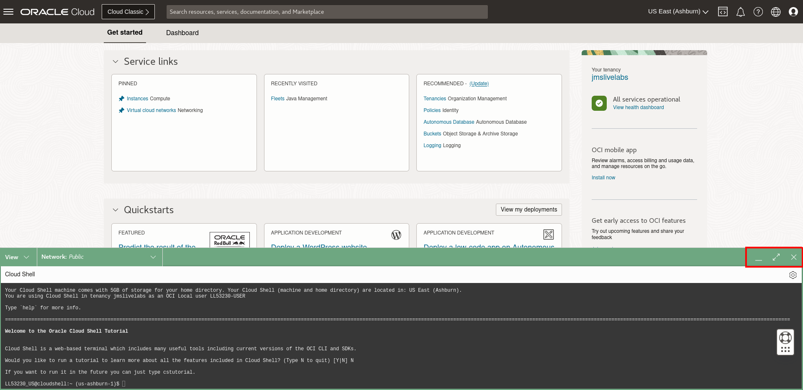
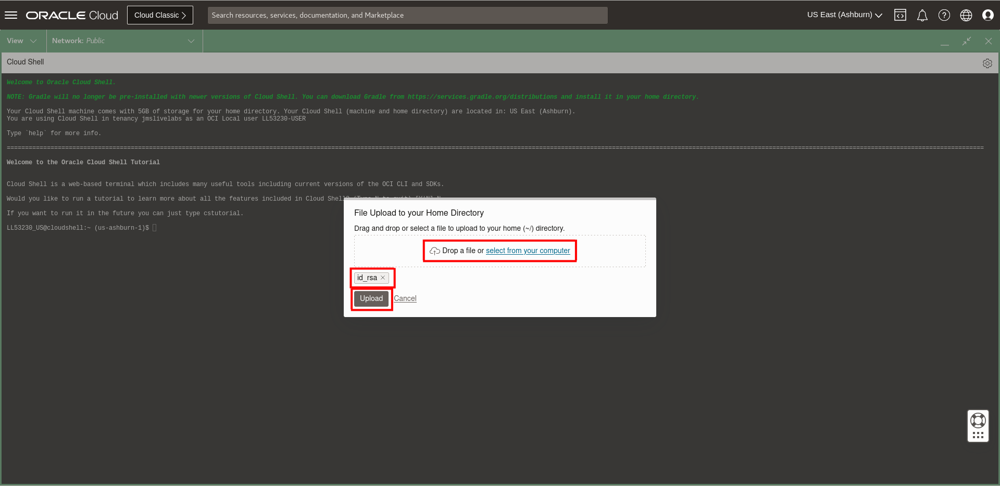
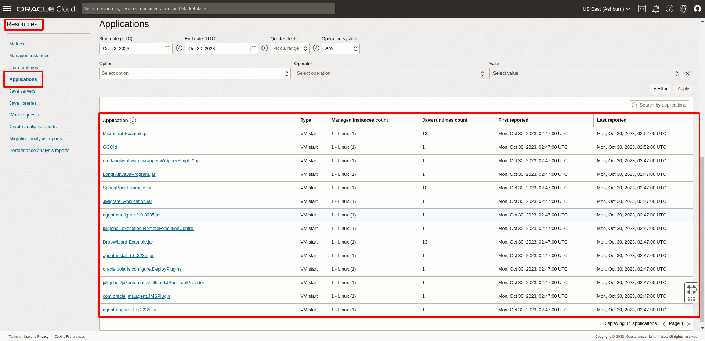

# Install Management Agent on your Managed Instances using Cloud Shell

## Introduction

This lab walks you through the steps to set up Java Management Service (JMS) and Management Agent plugins on your OCI compute instance host using the installation script. JMS allows Java Usage Tracking and Lifecycle Management.

Estimated Time: 15 minutes

### Objectives

In this lab, you will:

- Install a Management Agent on a compute instance
- Monitor the Java Runtimes and Java applications in JMS

### Prerequisites

* You have signed up for an account with Oracle Cloud Infrastructure and have requested workshop reservation on LiveLabs.
* A running compute instance with preloaded Java Runtimes and Java applications (already created for you) that you will be monitoring.

## Task 1: Transfer installation script to the compute instance

> **Note:** The following tasks make use of OCI Cloud Shell to use SSH to connect to the compute instance. You can also use your own preferred command line interface to perform the same tasks. However, we recommend using OCI Cloud Shell instead if your local machine has network restrictions and proxies preventing SSH connections. 

1. Click the Cloud Shell icon in the console header.

  

  OCI Cloud Shell web terminal will open.
  

  OCI Cloud Shell is a web browser-based terminal accessible from the Oracle Cloud Console. Cloud Shell provides access to a Linux shell, with a pre-authenticated Oracle Cloud Infrastructure CLI, a pre-authenticated Ansible installation, and other useful tools for following Oracle Cloud Infrastructure service tutorials and labs. Read more about using Cloud Shell [here](https://docs.oracle.com/en-us/iaas/Content/API/Concepts/cloudshellintro.htm).

  You can use the icons in the upper right corner of the Cloud Shell window to minimize, maximize, and close your Cloud Shell session.
  

2. Prepare the SSH private key pair of the public key provided for the reservation and the installation script for Linux downloaded in [Lab 1](?lab=setup-a-fleet). Click **Cloud Shell Menu** and **Upload**.
  

3. In the popup windows, select your file and click **Upload**. You should upload SSH private key and the installation script separately.
  

4. Check that both files have been uploaded.
  

5. In the Cloud Shell, enter the following command to set the file permissions so that only you can read the file.

    ```
    <copy>
    chmod 400 <your-private-key-file>
    </copy>
    ```

6. In the Oracle Cloud Console, open the navigation menu, click **Compute**, and then click **Instances**. Select the instance **LLxxxxx-INSTANCE-JMS**. This instance should be in the same compartment in [Lab 1](?lab=setup-a-fleet).
  

7. Under **Instance information**, copy the public IP address.
  

8. In the Cloud Shell, enter the following command to transfer the installation script to the instance. Type **yes** and **Enter** to continue.

    ```
    <copy>
    scp -i <your-private-key-file> <your-installation-script-file> opc@<copied-ip-address>:~/
    </copy>
    ```

  The output may look like this:
  

## Task 2: Perform Management Agent Installation using Installation Script

1. In the Cloud Shell, enter the following command to connect to your instance using SSH. The IP address should be the one you copied in task 1.

    ```
    <copy>
    ssh -i <your-private-key-file> opc@<copied-ip-address>
    </copy>
    ```

2. Enter the following command to change file permissions.

     ```
     <copy>
     chmod +x JMS_<your-fleet-name>_Linux.sh
     </copy>
     ```

3. Enter the following command to run the installation script. The installation may take around 10 minutes to complete. Please do not close your browser, Cloud Shell or your terminal while the installation is taking place.

     ```
     <copy>
     sudo ./JMS_<your-fleet-name>_Linux.sh
     </copy>
     ```

4. If installation is successful, you'll see a message similar to the following:

     ```
     <copy>
     ...
     Management Agent installation has been completed.
     Management Agent plugin 'Java Management Service' installation has been completed.
     Management Agent plugin 'Java Usage Tracking' installation has been completed.
     Management Agent was successfully registered using key YourFleetName (ocid1.managementagentinstallkey.oc1.iad.<some ocid hash>).
     Assigned JMS Fleet is YourFleetName (ocid1.jmsfleet.oc1.iad.<some ocid hash>).
     </copy>
     ```

## Task 3: Verify detection of Java Runtimes and applications

Now that the Management Agent has been set up in your compute instance, it will be able to detect the Java applications that have been executed in the compute instance. This can be observed in the Oracle Cloud Console.

1. In the Oracle Cloud Console, open the navigation menu, click **Observability & Management**, and then click **Fleets** under **Java Management**.

  

2. Select the compartment that the fleet is in and click the fleet.

3. Click **Managed instances** under **Resources**. If tagging and installation of the management agent is successful, the tagged Managed Instance will be indicated on the Fleet Main Page after 5 minutes.

  

4. Click **Java Runtimes** under **Resources**. You should see a list of Java Runtimes from Java 8 to Java 18, these Java Runtimes are preloaded in the compute instance in Task 1.

  

5. Click **Applications** under **Resources**. You should now see four applications. The first three are examples of DropWizard, SpringBoot and Micronaut, these applications are preloaded and running in the compute instance in Task 1. The fourth is the Oracle Java Management Service plugin.

  

  You may now **proceed to the next lab.**


## Learn More

- Refer to the [Management Agent Concepts](https://docs.oracle.com/en-us/iaas/management-agents/doc/you-begin.html) and [Installation of Management Agents](https://docs.oracle.com/en-us/iaas/management-agents/doc/install-management-agent-chapter.html) sections of the JMS documentation for more details.

- Use the [Troubleshooting](https://docs.oracle.com/en-us/iaas/jms/doc/troubleshooting.html#GUID-2D613C72-10F3-4905-A306-4F2673FB1CD3) chapter for explanations on how to diagnose and resolve common problems encountered when installing or using Java Management Service.

- If the problem still persists or it is not listed, then refer to the [Getting Help and Contacting Support](https://docs.oracle.com/en-us/iaas/Content/GSG/Tasks/contactingsupport.htm) section. You can also open a support service request using the **Help** menu in the OCI console.


## Acknowledgements

- **Author** - Yixin Wei, Java Management Service
- **Last Updated By** - Yixin Wei, September 2022