# Install Management Agent on your Managed Instances

## Introduction

This lab walks you through the steps to set up Java Management Service (JMS), install Management Agent and deploy JMS plug-in on your OCI compute instance host using the installation script.

Estimated Time: 15 minutes

[Lab 2](videohub:1_ohg7tob6)

### Objectives

In this lab, you will:

- Install a Management Agent and deploy JMS plug-in on a compute instance
- Monitor the Java runtimes and Java applications in JMS

### Prerequisites

* You have signed up for an account with Oracle Cloud Infrastructure and have requested workshop reservation on LiveLabs.
* A running compute instance with preloaded Java runtimes and Java applications (already created for you) that you will be monitoring.
* Access to the cloud environment and resources configured in [Lab 1](?lab=setup-a-fleet).

## Task 1: Download installation script to the compute instance using noVNC

1. This task makes use of the noVNC Graphical Remote Desktop to connect to the compute instance and download the installation script directly into it. If you are more comfortable with the command line option, proceed to Task 2.
    > **Note:** The noVNC Graphical Remote Desktop has already been setup in the provided compute instance for you.

2. On the LiveLabs page, click on the **View Login Info** at the top left corner.
    

3. Open the generated remote desktop URL located at the bottom of the **Reservation Information** panel.
    

4. The remote graphical desktop of the compute instance will be displayed on the browser. On the left side of the screen is the LiveLabs workshop. On the right side of the screen is the Oracle Cloud Infrastructure (OCI) login page.
    > **Note:** If you encounter any issues with noVNC please refer to [Troubleshoot noVNC issues](#TroubleshootnoVNCIssues)

  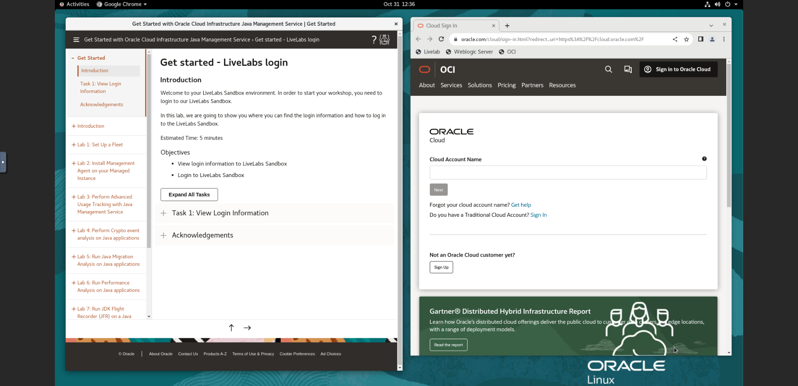

5. You can also access the Oracle Cloud Infrastructure (OCI) login page by clicking on the **OCI** bookmark in the bookmarks bar. This opens the Oracle Cloud Infrastructure (OCI) login page.
   

6. Use the reservation info provided to login to OCI. The password should be the new password that you have set when you first logged in.
    

    The reservation info can be found on the **Reservation Information** panel.
    

7. You can maximize the browser window in the graphical remote desktop. Right click the top of the browser and select maximize.
   

8. Open the navigation menu, click **Observability & Management**. Click **Fleets** under **Java Management**. Select the fleet that was created in [Lab 1](?lab=setup-a-fleet).
   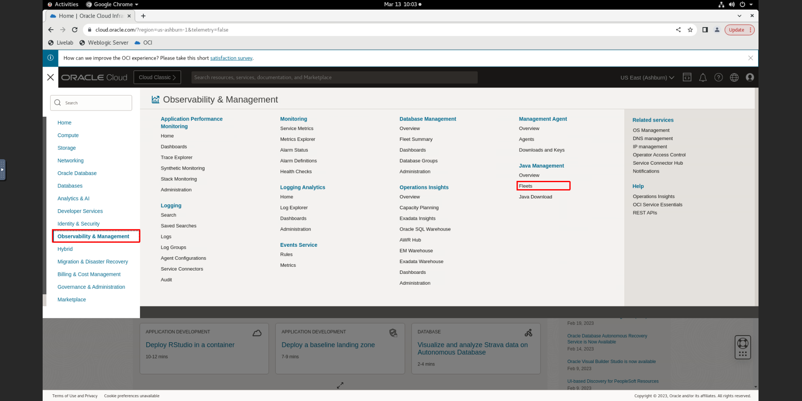

9.  On the fleet details page, click **Configure managed instances**.
    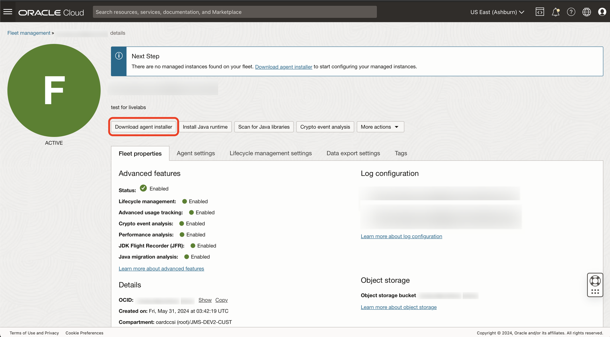

10.    Under **Download management agent software**, select **Linux-x86_64**, "RPM" package type and click to download it. Under **Install using installation script** select the Linux version of the installation script and click to download it. The management agent software and installation script will be downloaded to the Downloads folder.

  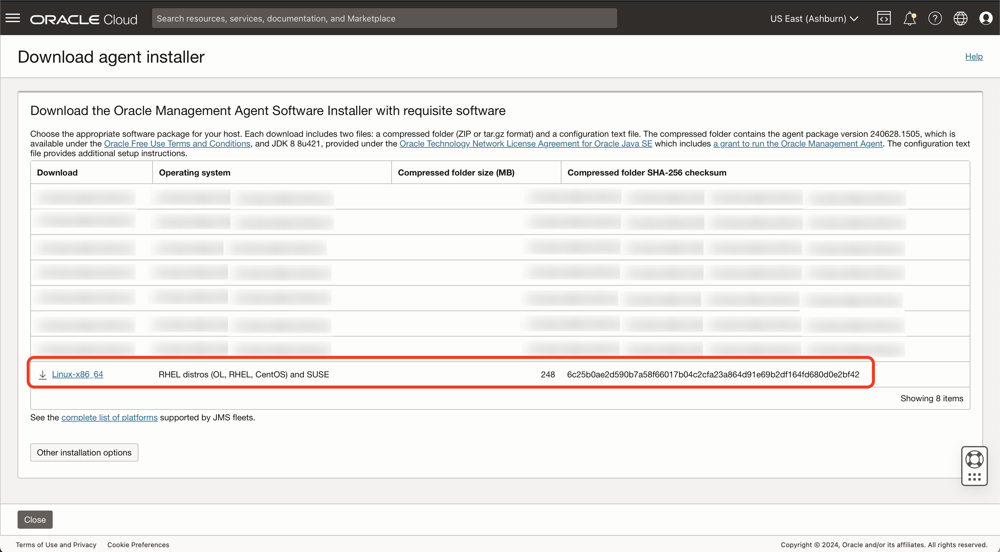

11.   Click on the **Activities** button at the top left corner of the noVNC graphical remote desktop.
    

12.   Click on the **Terminal** icon to open the terminal.
    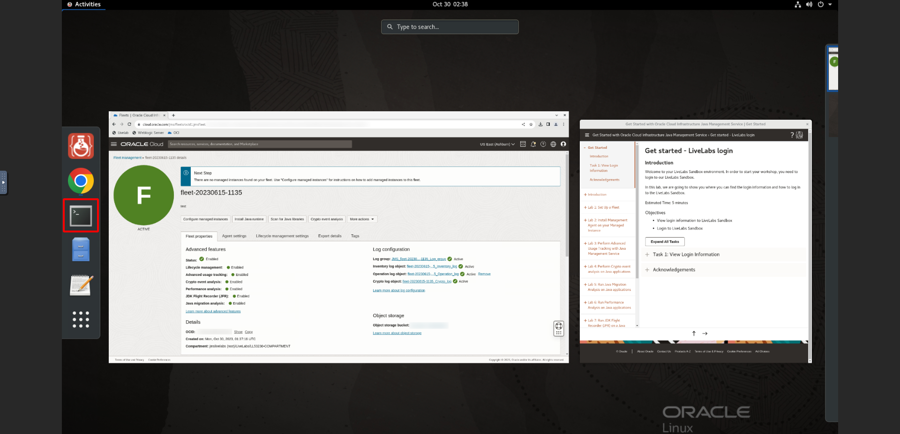

13.   Change the directory to the Downloads folder where the installation script is located.

    ```
    <copy>
    cd ~/Downloads
    </copy>
    ```

14. Check that the installation script and management agent software has been downloaded.
    ```
    <copy>
    ls
    </copy>
    ```

    The management agent software **oracle.mgmt_agent.rpm** and the installation script **JMS\_your-fleet-name\_linux.sh** should be displayed.
    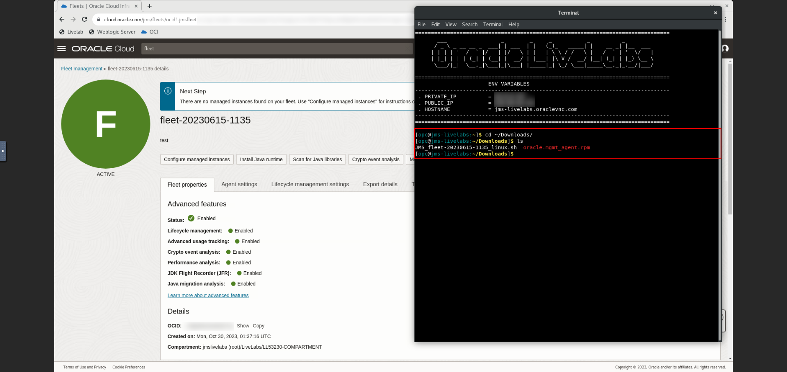

15. Proceed to **Task 3** to install the management agent.


## Task 2: (Optional) Transfer installation script to the compute instance using Cloud Shell

1. This task makes use of OCI Cloud Shell to use SSH to connect to the compute instance. If you have completed Task 1, skip this task and proceed to **Task 3**.

   >**NOTE:** For this task, you can also use your own preferred command line interface to perform the same tasks. However, we recommend using OCI Cloud Shell instead if your local machine has network restrictions and proxies preventing SSH connections. 

2. Click the Cloud Shell icon in the console header and select Cloud shell.

   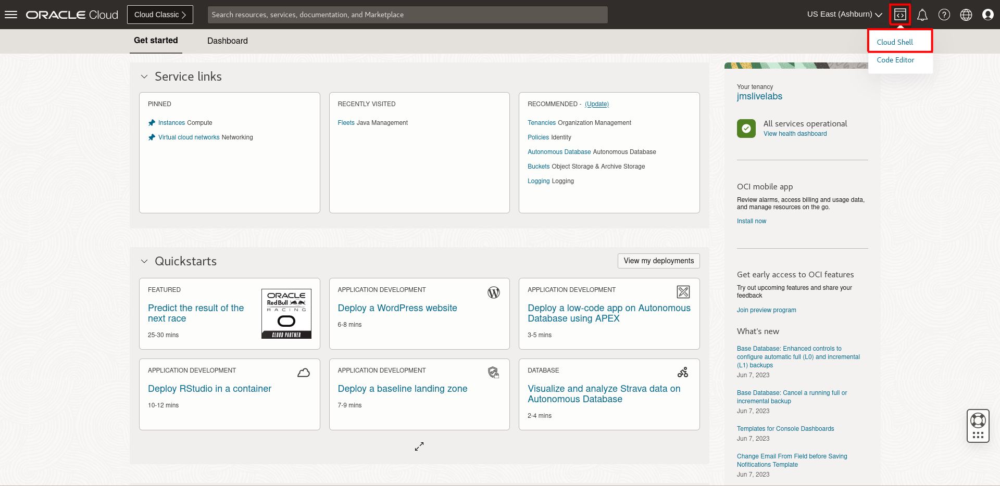

   OCI Cloud Shell web terminal will open.

  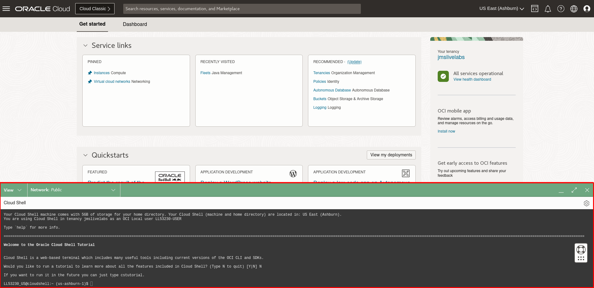

   OCI Cloud Shell is a web browser-based terminal accessible from the Oracle Cloud Console. Cloud Shell provides access to a Linux shell, with a pre-authenticated Oracle Cloud Infrastructure CLI, a pre-authenticated Ansible installation, and other useful tools for following Oracle Cloud Infrastructure service tutorials and labs. Read more about using Cloud Shell [here](https://docs.oracle.com/en-us/iaas/Content/API/Concepts/cloudshellintro.htm).

   You can use the icons in the upper right corner of the Cloud Shell window to minimize, maximize, and close your Cloud Shell session.
  

3. Prepare the SSH **private key** pair of the public key provided for the reservation and the installation script for Linux downloaded in [Lab 1](?lab=setup-a-fleet). Click **Cloud Shell Menu** and **Upload**.
  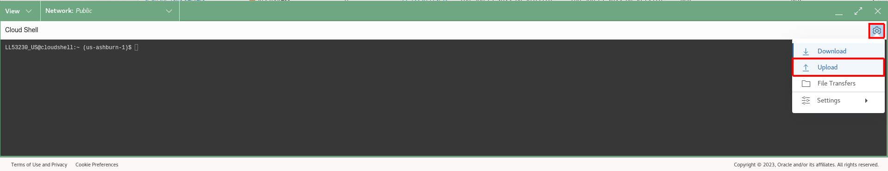

4. In the popup windows, select your file and click **Upload**. You should upload SSH **private key** and the **installation script** separately.
  

5. Check that both files have been uploaded.
  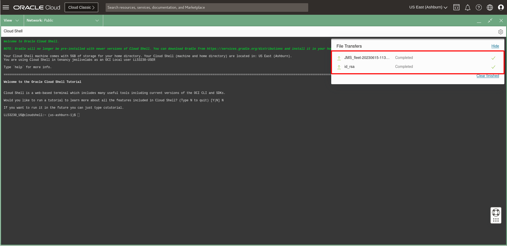

6. In the Cloud Shell, enter the following command to set the file permissions so that only you can read the file.

    ```
    <copy>
    chmod 400 <your-private-key-file>
    </copy>
    ```

7. In the Oracle Cloud Console, open the navigation menu, click **Compute**, and then click **Instances**. Select the instance **LLxxxxx-INSTANCE-JMS**. This instance should be in the same compartment in [Lab 1](?lab=setup-a-fleet).
  

8. Under **Instance information**, copy the **Public IP address**.
  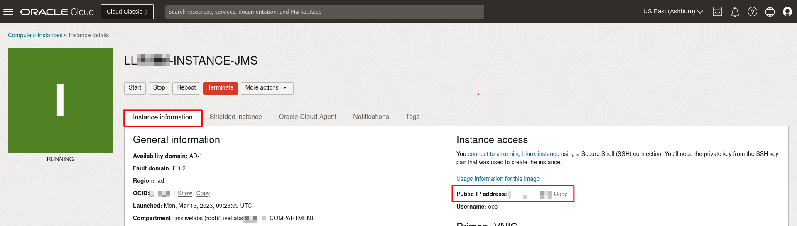

9. In the Cloud Shell, enter the following command to transfer the installation script and management agent software to the instance. Type **yes** and **Enter** to continue.

    ```
    <copy>
    scp -i <your-private-key-file> <your-installation-script-file> opc@<copied-ip-address>:~/
    scp -i <your-private-key-file> <your-management-agent-software> opc@<copied-ip-address>:~/
    </copy>
    ```

   The output may look like this:
   

10. Access the compute instance via Cloud Shell using SSH by entering the following command. The IP address should be the one you copied in task 1.
    ```
    <copy>
    ssh -i <your-private-key-file> opc@<copied-ip-address>
    </copy>
    ```

## Task 3: Perform Management Agent Installation using Installation Script

1. You should now have a terminal / cloud shell open and connected to the instance. Ensure that you are in the directory where the installation script is located.
    >**NOTE:** If you have downloaded the installation script and management agent software in **Task 1**, ensure that the terminal is in the Downloads directory. (Step 14 of **Task 1**)

2. Enter the following command to run the installation script. Note that both the installation script and management agent software must be in the same directory. The installation may take around 10 minutes to complete. Do not close your browser, Cloud Shell or your terminal while the installation is taking place.

     ```
     <copy>
     sudo bash <path-to-your-installation-script/your-installation-script-file.sh> --install-mgmt-agent
     </copy>
     ```

3. If installation is successful, you'll see a message similar to the following:

    ```
    ...
    Management Agent installation has been completed with 'Java Usage Tracking service plugin (Service.plugin.jms)'
      JMS basic features will be enabled on this instance.
    Management Agent installation has been completed with 'Java Management service plugin (Service.plugin.jm)'
      JMS advanced features can be enabled on this instance.
    Management Agent was successfully registered using key YourFleetName (ocid1.managementagentinstallkey.oc1.iad.<some ocid hash>).
    Instance has been assigned to JMS Fleet is YourFleetName (ocid1.jmsfleet.oc1.iad.<some ocid hash>).
    ```

4. Remove the installation script and management agent software.
      ```
     <copy>
     rm <path-to-your-installation-script/your-installation-script-file.sh>
     rm <path-to-your-management-agent-software/your-management-agent-software.rpm>
     </copy>
     ```

## Task 4: Verify detection of Java runtimes and applications

Now that the Management Agent and JMS plug-in has been set up in your compute instance, it will be able to detect the Java applications that have been executed in the compute instance. This can be observed in the Oracle Cloud Console. If tagging and installation of the management agent is successful, the tagged Managed Instance will be indicated on the Fleet Main Page after **10 minutes**.

1. If you are using the noVNC graphical remote desktop, close the browser for the remote desktop and return to the browser tab containing the **Oracle Cloud Console**.

2. In the Oracle Cloud Console, open the navigation menu, click **Observability & Management**, and then click **Fleets** under **Java Management**.

  

3. Select the compartment **LLxxxxx-COMPARTMENT** indicated in your Login Info and click on the fleet that was created in [Lab 1](?lab=setup-a-fleet).

4. Scroll down the Fleet details page. Under **Resources** menu, select **Managed instances**. If tagging and installation of the management agent is successful, the tagged Managed Instance will be indicated on the Fleet Main Page after **10 minutes**.
    > **Note:** If only one Java Runtime Installation shows in the OCI console, wait another 10 minutes and it will show up.

  

5. Under the **Resources** menu, click on **Java Runtimes**. You should see a list of Java Runtimes from Java 8 to Java 20, these Java Runtimes are preloaded in the compute instance in **Task 1**.

  

6. Under the **Resources** menu, click on **Applications**. You should now see some applications.

   Seven of them are preloaded and running in the compute instance in **Task 1**.

     - 3 applications are examples of DropWizard, SpringBoot and Micronaut respectively.
     - 3 applications are continuously running applications: LongRunJavaProgram and GCOld and JMigrate_Application.
     - 1 application is running using jshell.
     - The other applications are related to the deployment of the JMS Plug-in.

   

You may now **proceed to the next lab.**

## Troubleshoot noVNC Issues

1. If you encounter **Failed to connect to server** error, check if you are currently connected to a VPN. If you are using a VPN, disconnecting from it may resolve the issue.

   

2. If the noVNC browser has difficulties registering keyboard input, try refreshing the page and then reconnecting to noVNC.

## Learn More

- Refer to the [JMS Plug-in](https://docs.oracle.com/en-us/iaas/jms/doc/management-agent.html) section of the JMS documentation for more details.

- Use the [Troubleshooting](https://docs.oracle.com/en-us/iaas/jms/doc/troubleshooting.html#GUID-2D613C72-10F3-4905-A306-4F2673FB1CD3) chapter for explanations on how to diagnose and resolve common problems encountered when installing or using Java Management Service.

- If the problem still persists or it is not listed, then refer to the [Getting Help and Contacting Support](https://docs.oracle.com/en-us/iaas/Content/GSG/Tasks/contactingsupport.htm) section. You can also open a support service request using the **Help** menu in the Oracle Cloud console.


## Acknowledgements

- **Author** - Yixin Wei, Java Management Service
- **Last Updated By** - Chan Wei Quan, October 2023