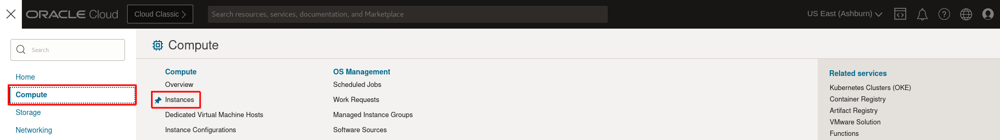

# Introduction

## About Java Management Service

Java Management Service (JMS) is a reporting and management infrastructure integrated with Oracle Cloud Infrastructure (OCI) Platform services to observe and manage your use of Java SE (on-premises or in the Cloud).

As the stewards of Java, Oracle uniquely leverages its expertise to help enterprises gain critical insights into Java application behavior, compliance, and performance through JMS and equips you to:

* Use insights from JMS to optimize your workloads across your enterprise (desktop, server, cloud); and
* Protect your Java SE investments by identifying outdated Java installations, unauthorized applications, and Java runtime and application mismatches. For example, your application is using JDK 11, but you learn it's also using JDK 14, which is no longer supported.

Watch the video below for an introduction to Java Management Service and a brief demo.

[video of introduction to Java Management Service](youtube:YCgJxqvglCI)

JMS offers two levels of capabilities:

1. Basic features, which includes the Java discovery and usage tracking capabilities available through Java Usage Tracker and file scanning.    Basic features allow you to:
    * View the versions and vendor information of Java runtimes running in your systems
    * Identify which Oracle Java versions are being used
    * Identify how many Oracle Java installations are not up to date
    * View the applications running on Oracle Java runtimes
    * Identify which systems run Oracle Java runtimes

2. Advanced features allow you to:
    * Identify and report potential vulnerabilities (CVE) associated with 3rd party Java libraries used by applications
    * Optimize Java workload performance with JVM tuning recommendations
    * Evaluate the effort and feasibility of migrating Java applications to newer JDK versions
    * Assess the impact of Oracle JRE and JDK Cryptographic Roadmap on your applications
    * Analyze the usage of application servers
    * Use JDK Flight Recorder (JFR) to gather your application details
    * Download and install Oracle Java versions
    * Remove reported Oracle Java versions
    * Configure JDK post installation actions
    * Apply the Deployment Rule Set (DRS) to your Managed Instances

## About this Workshop

 This workshop will walk you through the process of setting up and using Java Management Service (JMS) on Oracle Cloud Infrastructure (OCI).

 The first step is to create a fleet, which is the primary collection that you work with when using JMS. A fleet consists of Managed Instances that share rules and policies. You will then learn the process of deploying the JMS Plug-in on a host machine to monitor and view Java applications inside a fleet. A host that contains deployed JMS plug-ins is a Managed Instance.

 Next, you will proceed to use the advanced features available in JMS:
 - Run Advanced Usage Tracking to to analyze the usage and deployment of Java services in the application servers, such as WebLogic.
 - Run Advanced Usage Tracking to identify and report potential vulnerabilities (CVE) associated with 3rd party Java libraries used by applications.
 - Perform a crypto event analysis to access the impact of Oracle JRE and JDK Cryptographic roadmap changes on the applications running in your fleet.
 - Run the Java Migration Analysis on a Java application to evaluate the effort and feasibility of migrating the application to newer JDK versions.
 - Run the Performance Analysis on a Java application to optimize Java workload performance with JVM tuning recommendations.
 - Utilize the Lifecycle Management (LCM) operation to upload a Deployment Rule Set (DRS) Jar file, then apply the uploaded DRS to the Managed Instances in the fleet.
 - Run the JDK Flight Recorder (JFR) on a Java application which is running on the fleet to gather application insights.
 - Use the Lifecycle Management (LCM) operation to remove a Java runtime.
 - Use the Lifecycle Management (LCM) operation to install a Java runtime and run the post Java installation actions.

Finally, you will learn how to view and monitor work requests, understand the logs and cancel unwanted requests.

 In this workshop, we have created an Oracle Linux compute instance with preloaded Java runtimes, running Java servers and different running Java applications. To view this compute instance, in the navigation menu, click **Compute**, and then click **Instances**.

 In the following labs, we will setup JMS and deploy the JMS plug-in on this compute instance, to monitor and manage the Java runtimes and Java applications.

After setting up JMS:
- **Labs 3, 4, 5, and 6 can be done in parallel**.
- Labs 7, 8 and 9 should be attempted after the previous Labs are completed.
- Lab 10 can be attempted at any time.

*Estimated Time:* 190 minutes

### Objectives

* Set up a Fleet
* Install Management Agent and deploy JMS Plug-in on Managed Instances
* Scan for Java servers
* Scan for Java libraries
* Perform cryptographic analysis of Java applications
* Perform Java Migration Analysis on Java applications
* Perform performance analysis of Java applications
* Apply Deployment Rule Set to Managed Instances
* Run a JDK Flight Recorder (JFR) for a Java application
* Understand and perform LCM operations with JMS

### Prerequisites

* This workshop requires an Oracle Cloud account. You may use your existing account or create one in the following lab.

## Extension Workshops

To try JMS on your own tenancy, see:

* [Manage Java Runtimes, Applications and Managed Instances Inventory with Java Management Service](https://livelabs.oracle.com/pls/apex/dbpm/r/livelabs/view-workshop?wid=912)
* [Use Java Management Service Advanced Features](https://livelabs.oracle.com/pls/apex/dbpm/r/livelabs/view-workshop?wid=3202)
* [Integrate OCI Services with Java Management Service](https://livelabs.oracle.com/pls/apex/dbpm/r/livelabs/view-workshop?wid=3203)

## Learn More

* [Getting Started with Java Management Service](https://docs.oracle.com/en-us/iaas/jms/doc/getting-started-jms.html)
* [JMS Advanced Features](https://docs.oracle.com/en-us/iaas/jms/doc/advanced-features.html)
* [Announcing Java Management Service](https://blogs.oracle.com/java/post/announcing-java-management-service)
* [Oracle University](https://mylearn.oracle.com/ou/home)

## Acknowledgements

* **Author** - Yixin Wei, Java Management Service
* **Last Updated By/Date** - Chan Wei Quan, October 2023
