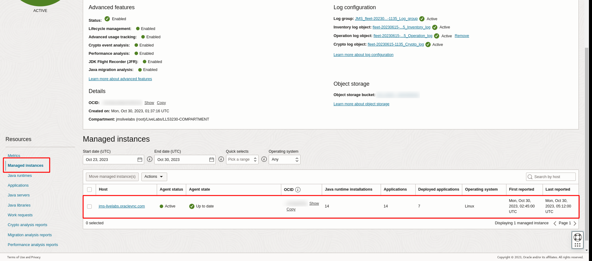
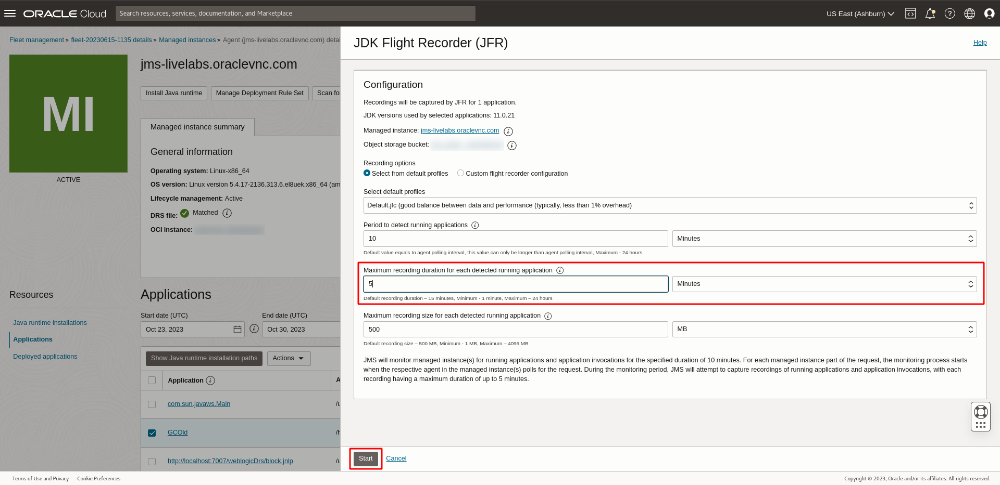
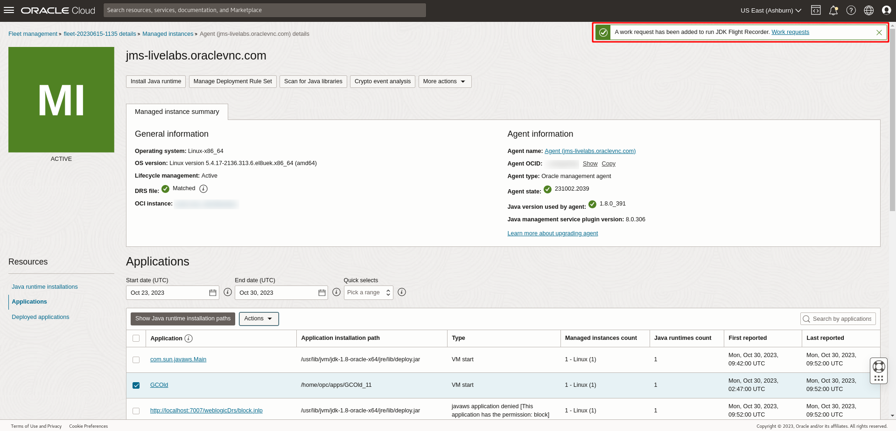
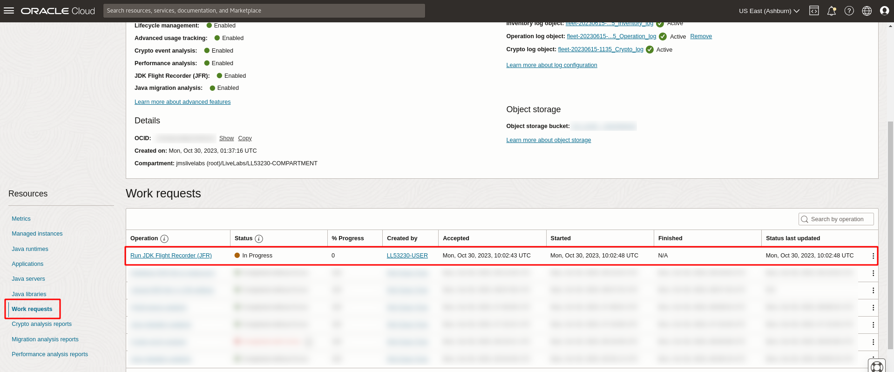
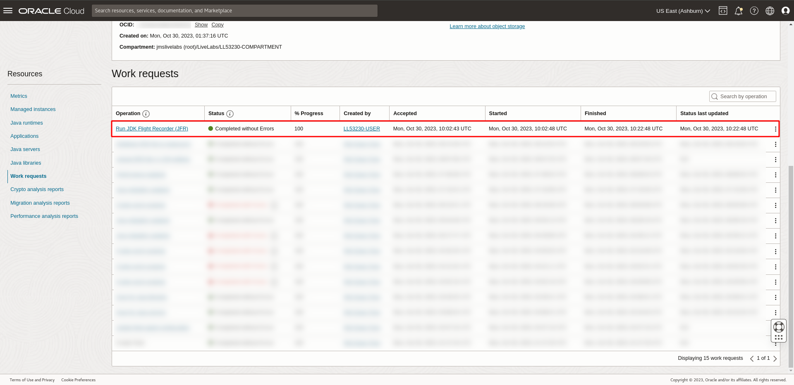
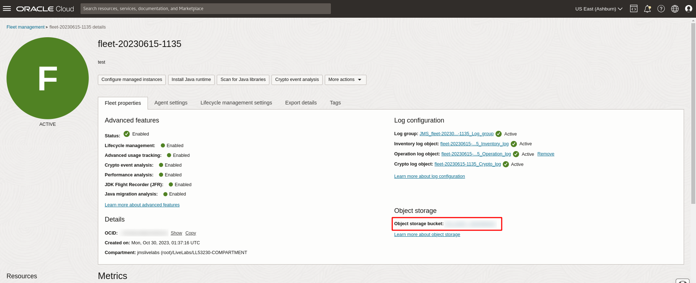
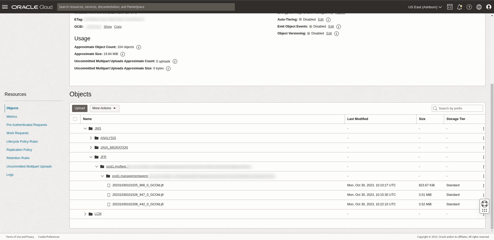

# Run JDK Flight Recorder (JFR)

## Introduction

This lab walks you through the steps to run JDK Flight Recorder on a Java application running in a fleet in order to collect diagnostic and profiling data for the application.

Estimated Time: 30 minutes

### Objectives

In this lab, you will:

* Run JDK Flight Recorder (JFR) on a Java application running in the fleet and download the resulting recording.

### Prerequisites

* You have signed up for an account with Oracle Cloud Infrastructure and have requested workshop reservation on LiveLabs.
* A running compute instance with preloaded Java runtimes and Java applications (already created for you) that you will be monitoring.
* Access to the cloud environment and resources configured in [Lab 1](?lab=setup-a-fleet) and [Lab 2](?lab=install-management-agent-script).

## Task 1: Run JDK Flight Recorder (JFR) on a Java application

**Submit JDK Flight Recorder Work Request**

1. Open the navigation menu, click **Observability & Management**. Click **Fleets** under **Java Management**. Select the fleet that was created in [Lab 1](?lab=setup-a-fleet).
    

2. Scroll down the Fleet details page. Under **Resources** menu, select **Managed instances**. You should see the managed instance set up in [Lab 2](?lab=install-management-agent-script). Click on the managed instance.
    

3. Scroll down the **Managed instance** page. Under the **Resources** menu, select **Applications**. A list of Java applications running in this instance is shown. Check the box beside **GCOld**, select the **Actions** drop-down menu and click the **Run JDK Flight Recorder** button. 
    

4. In the **JDK Flight Recorder** (JFR) Window, select **Recording option: Select from default profiles**

    Under the **Select default profiles**, click on the drop-down menu and select **Default.jfc**

    Lower the **Maximum recording duration for each detected application** to 5 mins and keep **Maximum recording size for each detected application** at 500MB. Click **Start** to begin the JFR recording.

    >**Note:** The application should run longer than the duration of the JFR specified.

    

    If your request is submitted successfully, you should receive a notification in green as seen below:
    

5. Click on the fleet name at the top of the Managed Instance page to navigate back to the Fleet details page.
    

6. Scroll down the Fleet details page. Under **Resources** menu, select **Work requests**. You should see the **Run JDK Flight Recorder (JFR)** work request you submitted in step 5. Wait for the work request to complete.
    

7. If your request is successful, you should see that the status of the request is marked as **Completed without errors**. It will take approximately 15 minutes for the request to be completed.
    

8. To access the JDK Flight Recorder recording, scroll up the Fleet details page and click on the **Object storage bucket** under **Object storage**.
    

9. The raw **JDK Flight Recorder recording** is stored in the file: **JMS \> JFR > fleet-ocid \> instance-ocid \> application-name.jfr**.

    

10. You can open the **JDK Flight Recorder** recording in your favorite JFR viewer or you can use the Oracle's **JDK Mission Control** to view the files.

    JMC download link: https://www.oracle.com/java/technologies/jdk-mission-control.html

You may now **proceed to the next lab**.

## Learn More
* Refer to the [Run JDK Flight Recorder](https://docs.oracle.com/en-us/iaas/jms/doc/advanced-features.html#GUID-2CC8411E-F283-43CD-860A-B73E760FFC7A), [Work Request](https://docs.oracle.com/en-us/iaas/jms/doc/using-java-management-service.html#GUID-77AEEBC0-93A5-4E99-96D6-BEE0FEE4539F) sections of the JMS documentation for more details.

* Use the [Troubleshooting](https://docs.oracle.com/en-us/iaas/jms/doc/troubleshooting.html#GUID-2D613C72-10F3-4905-A306-4F2673FB1CD3) chapter for explanations on how to diagnose and resolve common problems encountered when installing or using Java Management Service.

* If the problem still persists or it is not listed, then refer to the [Getting Help and Contacting Support](https://docs.oracle.com/en-us/iaas/Content/GSG/Tasks/contactingsupport.htm) section. You can also open a support service request using the **Help** menu in the OCI console.

## Acknowledgements

* **Author** - Bao Jin Lee, Java Management Service
* **Last Updated By** - Ivan Eng, June 2023
