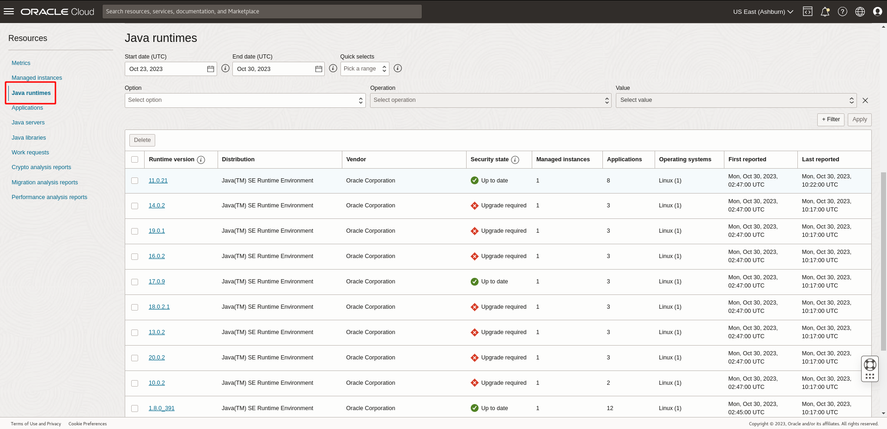
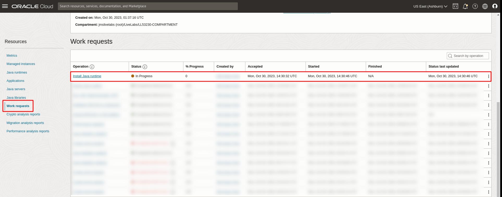
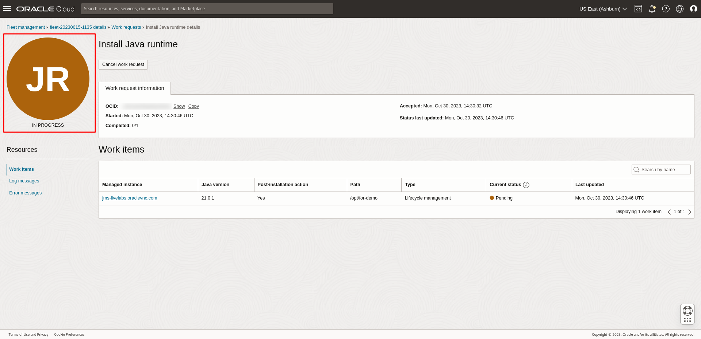

# Perform Java Lifecycle Management with Java Management Service

## Introduction

Lifecycle Management (LCM) is a part of JMS's reporting and management infrastructure. JMS enables users to observe and manage the lifecycles of their Java SE Runtimes (on-premises or in the Cloud) by performing LCM operations such as Installing or Removing Java Runtimes.

As a customer, you can:
  * View and identify the Java Runtimes.
  * Install Java Runtimes.
  * Remove unwanted Java Runtimes.
  * View and understand various status and logs of LCM work requests.

Estimated Time: 40 minutes

### Objectives

In this lab, you will:

* Understand LCM operations
* Install Java Runtimes
* Remove Java Runtimes
* View and monitor LCM Work Requests

### Prerequisites

* You have signed up for an account with Oracle Cloud Infrastructure and have requested workshop reservation on LiveLabs.
* A running compute instance with preloaded Java Runtimes and Java applications (already created for you) that you will be monitoring.
* Access to the cloud environment and resources configured in [Lab 1](?lab=setup-a-fleet) and [Lab 2](?lab=install-management-agent-script).

## Task 1: Remove Java Runtimes

**Submit Delete Java Runtime Work Request**

1. First, open the navigation menu, click **Observability & Management**, and then click **Fleets** under **Java Management**. Select the fleet that you are interested in.
 

2. Under **Resources**, select **Java Runtimes**. You should see a list of the Java Runtimes that are currently in your Fleet.
 

3. Select the Runtime that you would like to remove from your fleet and click **Delete**.

    > **Note:** Currently, OpenJDKs cannot be removed through Lifecycle Management.

  

4. The Delete Java Runtimes summary window will open. You will see a message with an archives link to the Oracle Java Runtime Download. You will also see a Summary table that lists the affected resources, including **Applications, Runtime versions, Managed Instances** and **Installations**. By default, the Summary table is sorted by applications, so the runtimes are presented in the order of least invoked to most invoked in the timeframe selected. You may also click the link under Runtime version to open its details page in a new window.

  Click **Delete** to confirm the deletion and submit a request for removal. This request is termed as a **Work Request**.

  

  If your request is submitted successfully, you should receive a notification in green as seen below:
  

**Verify Java Runtime Deletion**

> **Note:** The Delete Java Runtime Work Request will take around 10 minutes to complete.

1. In the same **Java Management** page, under **Resources**, select **Work Requests**. You should see the Remove Java Runtime Work Request you submitted in Task 1. Click on the Work Request to view its details.
 

2. If your request has been accepted, the status will change to **In Progress**. It will take some time to complete.
  

3. If your request has completed successfully, the status will change to **Completed without Errors**.
  

4. Return to your fleet page, under **Java Runtimes**, the deleted Java Runtime should not be reported after next scanning.
  

5. Alternatively, you may use SSH command to connect to the compute instance and enter the following command to check the deletion manually.

    ```
    <copy>
    ls /usr/java
    </copy>
    ```

## Task 2: Install Java Runtimes

> **Note:** Installing Java Runtimes can be performed **30 minutes** after the Java Management Service plugin status changes to **RUNNING**.

**Submit Install Java Runtime Work Request**

1. First, open the navigation menu, click **Observability & Management**, and then click **Fleets** under **Java Management**. Select the fleet that you are interested in.
 

2. Under **Resources**, select **Java Runtimes**. You should see a list of the Java Runtimes that are currently in your Fleet.
 

3. Click **Install Java Runtime**.

  

4. You will see an Install Java Runtime window with current and archive releases of the Oracle Java Runtimes. You will also see a Summary table that lists the metadata, including **Runtime versions**, **Security State**, **Release date**, **End of service life** and **Release notes**. You may click the link under Release notes to open the details page in a new window.

  Select the Java Runtime version you want to install, click **Install** to confirm the installation and submit a request for installation. This request is termed as a **Work Request**.

  

  If your request is submitted successfully, you should receive a notification in green as seen below:
  

**Verify Java Runtime Installation**

> **Note:** The Install Java Runtime Work Request will take around 10 minutes to complete.

1. In the same **Java Management** page, under **Resources**, select **Work Requests**. You should see the Install Java Runtime Work Request you submitted in Task 1. Click on the Work Request to view its details.
 


2. If your request has been accepted, the status will change to **In Progress**. It will take some time to complete.
  

3. If your request has completed successfully, the status will change to **Completed without Errors**.
  

4. Return to your fleet page, under **Java Runtimes**, the installed Java Runtime should be indicated after next scanning. The installed Java Runtime may take up to 180 minutes to show up in the console.
  

5. Alternatively, you may use SSH command to connect to the compute instance and enter the following command to check the installation manually.

    ```
    <copy>
    ls /usr/java
    </copy>
    ```

## Task 3: View and Monitor Lifecycle Management Requests

**Overview of Work Request detailed views**

1. First, open the navigation menu, click **Observability & Management**, and then click **Fleets** under **Java Management**. Select the fleet that you are interested in.
 

2. Under **Resources**, select **Work Requests**. You should see a list of the Work Requests that you have created. Select a **Work Request** that you are interested to view in detail.
 

3. The detailed view of a Work Request is divided into two sections:
    * Information about the Work Request, including:
        * The **OCID** of the Work Request.
        * **Date and time** when the Work Request **started**, **accepted** and **last updated**.
        * **Number of sub-tasks** completed for the Work Request.
    * A list of resources from which you can view the individual metrics for the Work Requests:
        * Associated Resources
        * Log Messages
        * Error Messages

  

4. For the list of resources which include **Associated Resources**, **Log Messages** and **Error Messages**, each list displays **50** rows at a time. You may click the header of a column to sort the list based on the title of the column, or use the text field to search the contents of the table.

  For the list of **Associated Resources**, you may find the following information:
   * **Managed instance**: Name of the managed instance affected by the Work Request.
   * **Path**: The Java Runtime installation path in the managed instance affected by the operation.
   * **Status**: Operational status of the associated resource.
   * **Last updated**: Date and time when the status for this associated resource was last updated.

  


  For the list of **Log Messages**, you may find the following information:
  * **Message**: Log message reported by the agent while carrying out the Work Request.
  * **Timestamp**: Date and time when the message was generated.

  


  For the list of **Error Messages**, you may find the following information. Note that error messages can be observed if your Work Request was not successful.
  * **Message**: Error message reported by the agent while carrying out the Work Request.
  * **Timestamp**: Date and time when the message was generated.

  

**View status and logs of a Work Request**

1. In the **Fleet** page, under **Resources**, select **Work Requests**. Click on the Work Request you are interested in to view its details.
 

2. If your request was successful, you should see that the **Status** of the request is marked as **Succeeded** and **Completed without errors**.
 

3. If you would like to view the log messages for the Work Request, select **Log Messages** under **Resources**. You should see the log messages in detail.
 

4. If your Work Request was unsuccessful, you may view the error messages by selecting **Error Messages** under **Resources**. You should see the status as **Failed** and the corresponding error messages.
  

**Cancel a Work Request**

1. In the **Fleet** page, under **Resources**, select **Work Requests**. You should see the Work Requests you submitted. Click on the Work Request to view its details.
  

2. If your Work Request is still in progress and you would like to cancel it, click **Cancel Work Request**.
  

3. Click **Cancel work request** again to confirm.
  

4. If your request has been canceled successfully, you should see that the **Status** of the request is marked as **Canceled**.
  


## Learn More
* Refer to the [Java Runtime Lifecycle Management](https://docs.oracle.com/en-us/iaas/jms/doc/java-runtime-lifecycle-management.html), [Work Request](https://docs.oracle.com/en-us/iaas/jms/doc/getting-started-java-management-service.html#GUID-47C63464-BC0C-4059-B552-ED9F33E77ED3) and [Viewing a Work Request](https://docs.oracle.com/en-us/iaas/jms/doc/fleet-views.html#GUID-F649F0E5-DD54-4DEC-A0F1-942FE3552C93) sections of the JMS documentation for more details.

* Use the [Troubleshooting](https://docs.oracle.com/en-us/iaas/jms/doc/troubleshooting.html#GUID-2D613C72-10F3-4905-A306-4F2673FB1CD3) chapter for explanations on how to diagnose and resolve common problems encountered when installing or using Java Management Service.

* If the problem still persists or if the problem you are facing is not listed, please refer to the [Getting Help and Contacting Support](https://docs.oracle.com/en-us/iaas/Content/GSG/Tasks/contactingsupport.htm) section or you may open a a support service request using the **Help** menu in the OCI console.

## Acknowledgements

* **Author** - Yixin Wei, Java Management Service
* **Last Updated By** - Yixin Wei, September 2022
