# Perform Java Lifecycle Management with Java Management Service

## Introduction

Lifecycle Management (LCM) is a part of JMS's reporting and management infrastructure. JMS enables users to observe and manage the lifecycles of their Java SE Runtimes (on-premises or in the Cloud) by performing LCM operations such as Installing or Removing Java Runtimes.

As a customer, you can:
  * View and identify the Java Runtimes.
  * Install Java Runtimes.
  * Remove unwanted Java Runtimes.
  * View and understand various status and logs of LCM work requests.

Estimated Time: 40 minutes

### Objectives

In this lab, you will:

* Understand LCM operations
* Remove Java runtime
* Create a set of post Java installation action consisting of changing the minimum key length for RSA to >2048 bits and disabling TLS 1.0 and TLS 1.1
* Install Java Runtimes
* View and monitor LCM Work Requests

### Prerequisites

* You have signed up for an account with Oracle Cloud Infrastructure and have requested workshop reservation on LiveLabs.
* A running compute instance with preloaded Java Runtimes and Java applications (already created for you) that you will be monitoring.
* Access to the cloud environment and resources configured in [Lab 1](?lab=setup-a-fleet) and [Lab 2](?lab=install-management-agent-script).

## Task 1: Remove Java Runtimes

**Submit Delete Java Runtime Work Request**

1. Open the navigation menu, click **Observability & Management**. Click **Fleets** under **Java Management**. Select the fleet that was created in [Lab 1](?lab=setup-a-fleet).
 

2. Under **Resources**, select **Java Runtimes**. You should see a list of the Java Runtimes that are currently in your Fleet.
 

3. Select the Runtime (e.g. jdk-9) that you would like to remove from your fleet and click **Delete**. Do not select jdk1.8 and jdk-11 as they are required to run JMS and the Java servers.

    > **Note:** Currently, OpenJDKs cannot be removed through Lifecycle Management.

   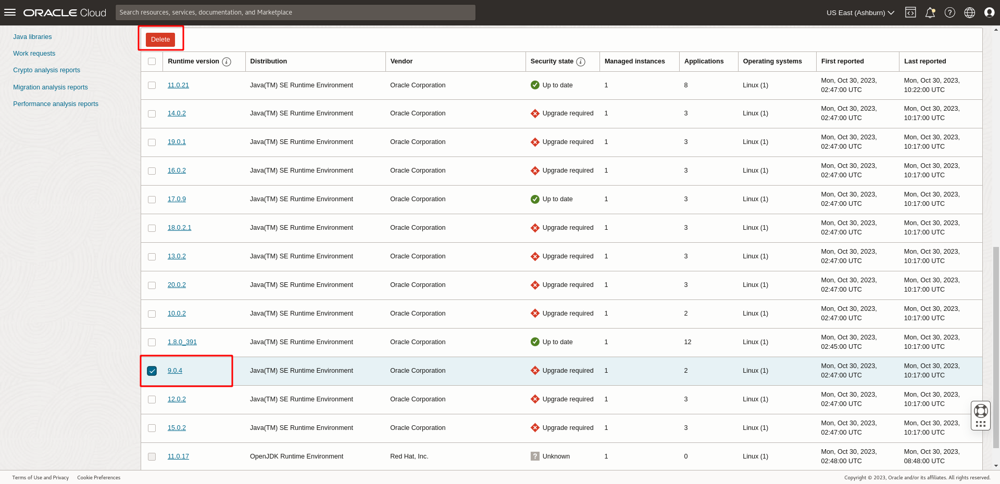

4. The Delete Java Runtimes summary window will open. You will see a message with an archives link to the Oracle Java Runtime Download. You will also see a Summary table that lists the affected resources, including **Applications, Runtime versions, Managed Instances** and **Installations**. By default, the Summary table is sorted by applications, so the runtimes are presented in the order of least invoked to most invoked in the timeframe selected. You may also click the link under Runtime version to open its details page in a new window.

    Click **Delete** to confirm the deletion and submit a request for removal. This request is termed as a **Work Request**.

    

    If your request is submitted successfully, you should receive a notification in green as seen below:
    

**Verify Java Runtime Deletion**

> **Note:** The Delete Java Runtime Work Request will take around 10 minutes to complete.

1. In the same **Java Management** page, under **Resources**, select **Work Requests**. You should see the Remove Java Runtime Work Request you submitted in Task 1. Click on the Work Request to view its details.
 

2. If your request has been accepted, the status will change to **In Progress**. It will take some time to complete.
  

3. If your request has completed successfully, the status will change to **Completed without Errors**.
  

4. Return to your fleet page, under **Java Runtimes**, the deleted Java Runtime should not be reported in the subsequent scanning.
  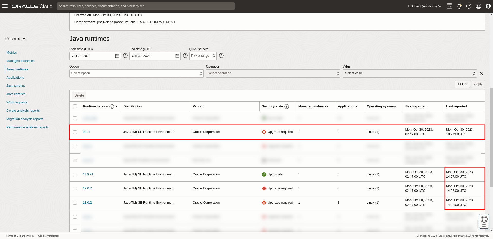

5. Alternatively, you may use SSH command to connect to the compute instance and enter the following command to check the deletion manually. 

    ```
    <copy>
    ls /usr/java
    </copy>
    ```


## Task 2: Setup post Java installation actions

1. Open the navigation menu, click **Observability & Management**. Click **Fleets** under **Java Management**. Select the fleet that was created in [Lab 1](?lab=setup-a-fleet).
  

2. On the Fleet details page, click **More actions** and select **Modify Java runtime lifecycle management settings**. This opens the **Lifecycle management settings** window.
  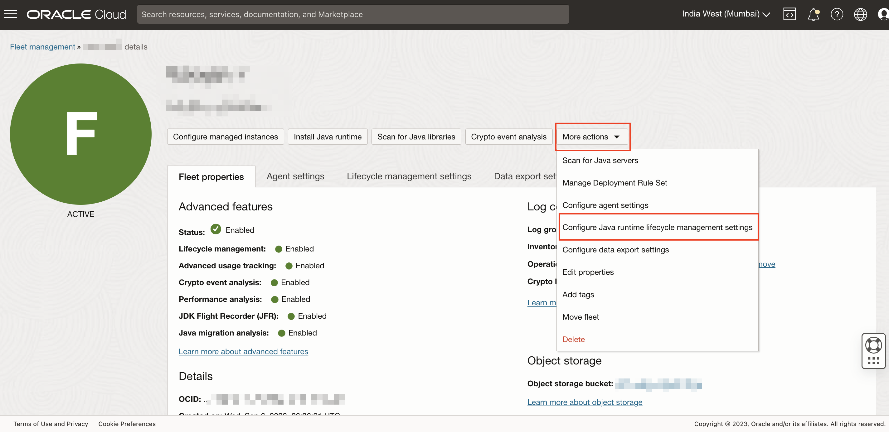
  
3. In the **Lifecycle management settings**, there is a combo box containing the placeholder "Select an action". 

   

4. Click on the combo box. A dropdown list of available post Java installation actions will be shown.

   
   
   There are a total of 6 different post Java installation actions to choose from.
   | Actions                                | Options   |
   |----------------------------------------|-----------|
   | Change minimum key length for EC       | 256 bits|
   | Change minimum key length for DSA      | 2048 bits |
   | Change minimum key length for Diffie-Hellman | 2048 bits |
   | Change minimum key length for RSA      | 2048 bits |
   | Disable TLS                            | TLS 1.0 , TLS 1.0 and TLS 1.1 |
   |Replace JDK root certificates with default operating system certificates| N/A |
   {: title="Available Post Java Installation Actions"}


5. This lab will simulate the setting up of 2 different installation actions as follows:
      * Minimum key length for RSA > 2048 bits (e.g. for signed jars)
      * Disable TLS 1.0 and TLS 1.1

      The post Java installation actions can be configured differently based on different requirements.
  
6. Select the  **Change minimum key length for RSA** option from the dropdown list. Another combo box will appear to the right. This contains the new minimum key length (in bits) that will be set for RSA signed jars.

   

   Click on the combo box that appeared on the right. Select **2048**.

   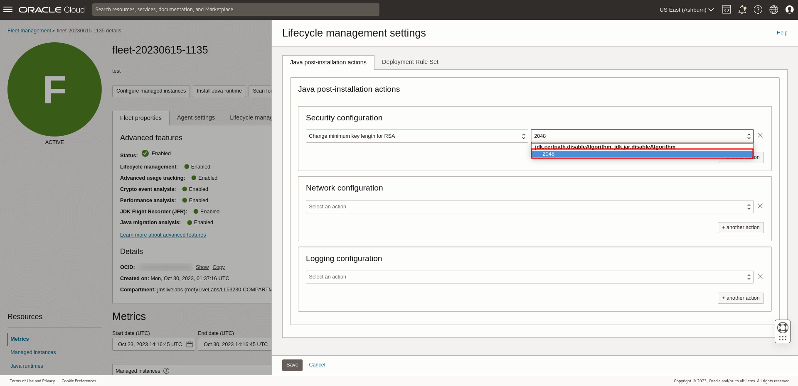

7. Click on the **+ another action** button to add an additional post Java installation action. Another combo box with the placeholder "Select an action" should appear in the next line. 

   

8. Click on the combo box and select the **Disable TLS** option. 

   

   Click on the combo box that appeared on the right. Select **TLS 1.0 and TLS 1.1**.

   

9. Click on the **Save** button below. This should save all the defined post Java installation actions.

    

10. Return to the fleet details page, click on the tab **Lifecycle management settings**. The post Java installation actions that had been defined earlier will be shown.

    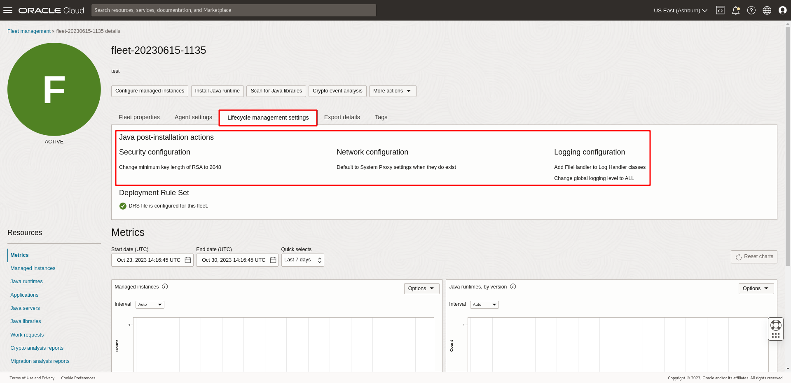

## Task 3: Install Java Runtimes

> **Note:** Installing Java Runtimes can be performed **30 minutes** after the Java Management Service plugin status changes to **RUNNING**.

**Submit Install Java Runtime Work Request**

1. Open the navigation menu, click **Observability & Management**. Click **Fleets** under **Java Management**. Select the fleet that was created in [Lab 1](?lab=setup-a-fleet).
 

2. Under **Resources**, select **Java Runtimes**. You should see a list of the Java Runtimes that are currently in your Fleet.
 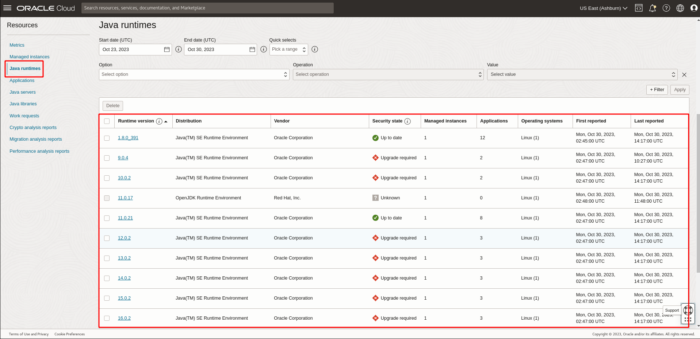

3. Click **Install Java Runtime**.
  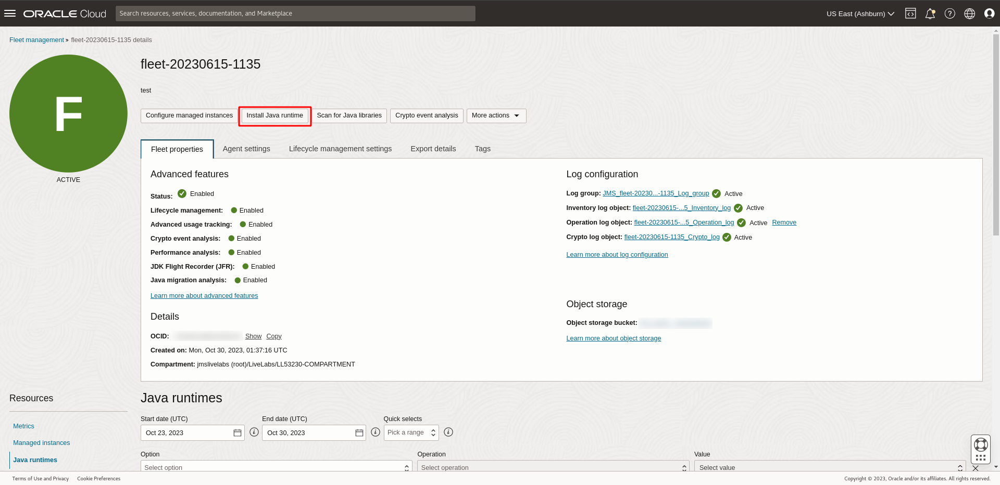

4. You will see an Install Java Runtime window with current and archive releases of the Oracle Java Runtimes. You will also see a Summary table that lists the metadata, including **Runtime versions**, **Security State**, **Release date**, **End of service life** and **Release notes**. You may click the link under Release notes to open the details page in a new window.
   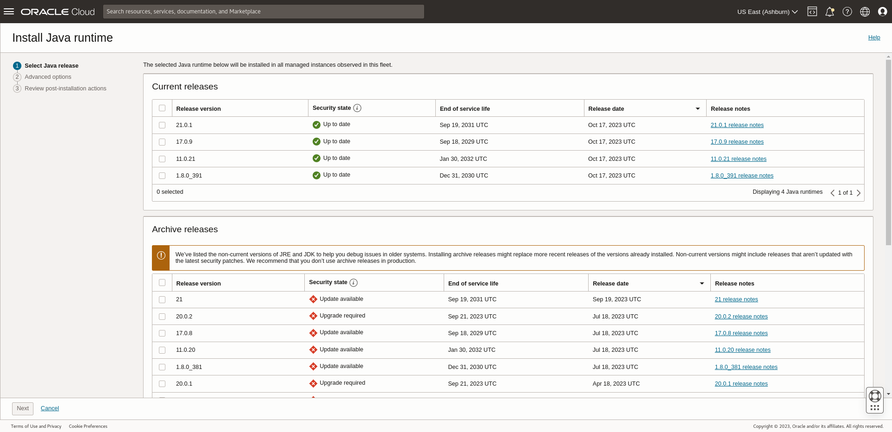

   Select the Java Runtime version you want to install.Click **Next**
   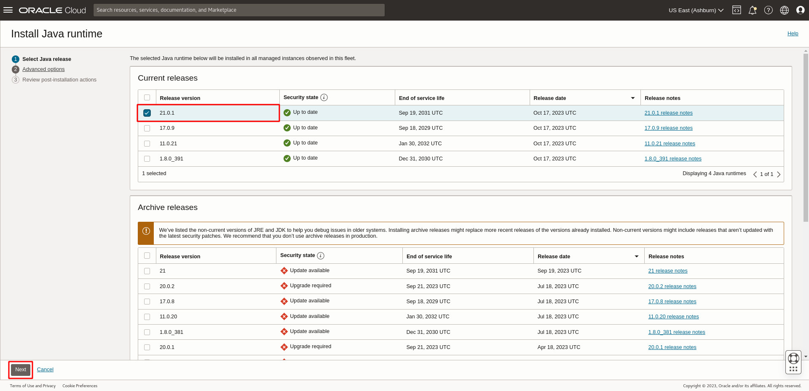
  
5. The next page should display a list of post Java installation actions which had been defined previously in [Task 2](#Task2:SetuppostJavainstallationactions). Select the post Java installation you want to perform. 

   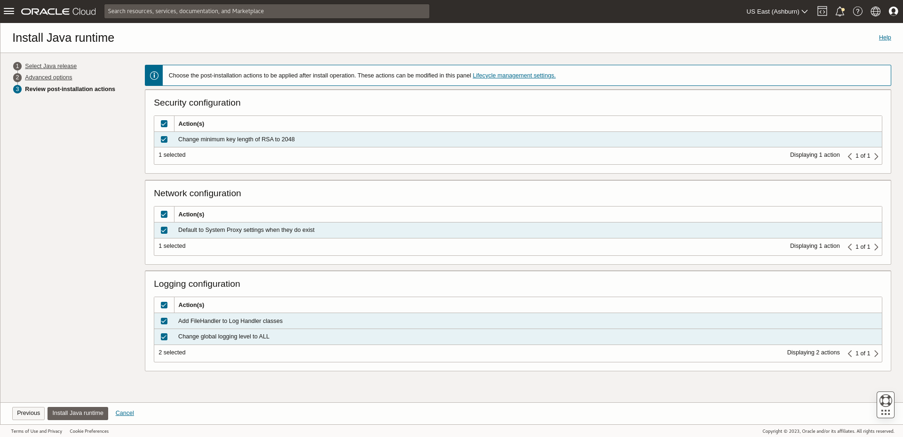

   >**Note:** If no post Java installation action is selected, no post-install action will be executed after the java installation

6. Click **Install** to confirm the installation and submit a request for installation. This request is termed as a **Work Request**.

    

    If your request is submitted successfully, you should receive a notification in green as seen below:
    
    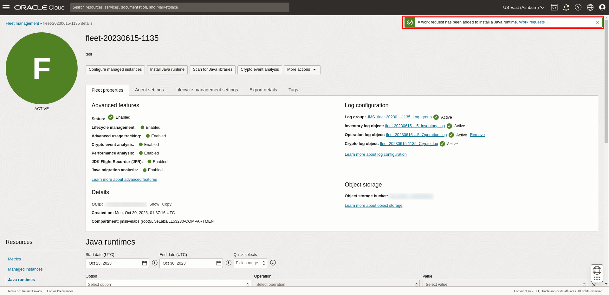

**Verify Java Runtime Installation**

> **Note:** The Install Java Runtime Work Request will take around 10 minutes to complete.

1. In the same **Java Management** page, under **Resources**, select **Work Requests**. You should see the Install Java Runtime Work Request you submitted in Task 1. Click on the Work Request to view its details.
 


2. If your request has been accepted, the status will change to **In Progress**. It will take some time to complete.
  

3. If your request has completed successfully, the status will change to **Completed without Errors**.
  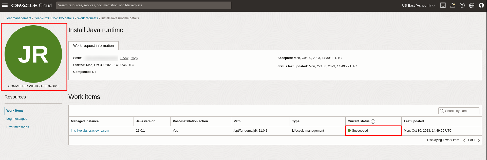

4. Click on the work request. Under the **Resources** menu, click on the **Log messages**. Verify that the post Java installation actions has been executed.
   

5. Return to your fleet page, under **Java Runtimes**, the installed Java Runtime should be indicated after next scanning. 

   The pre-build compute instance is designed to detect the new runtime and run some applications on it to speed up the detection.

    >**Note:** The installed Java Runtime may take up to 180 minutes to show up in the console if no application was run with it

    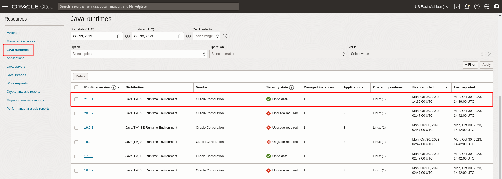

6. Alternatively, you may use SSH command to connect to the compute instance and enter the following command to check the installation manually. 

    ```
    <copy>
    ls /usr/java
    </copy>
    ```

## Task 4: (Optional) Modifying/Removing Post Java Installation Action
1. This task is applicable if changes are to be made to the post Java installation action.

2. On the fleet details page, click on **More actions** and select **Modify Java runtime lifecycle management setting**. 

   

   The **Lifecycle management settings** window should appear. It should show a list of actions defined earlier in [Task 2](#Task2:SetuppostJavainstallationactions). 
   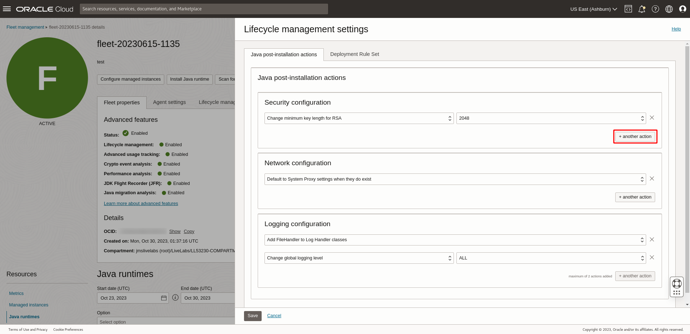

3. To add another action, click on the **+ another action** button. Another combo box with the placeholder "Select an action" should appear in the next line. 

   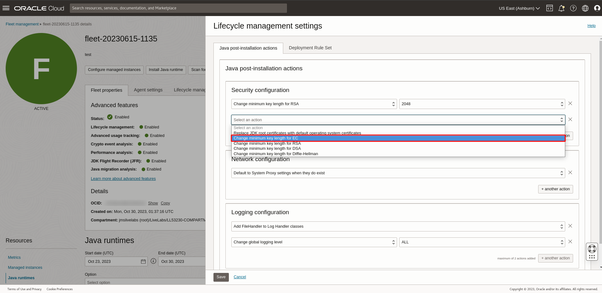

   Select an action from the dropdown list.

4. To modify an existing action, click on the combo box of the action and select a new action. A list of available actions should appear

   

   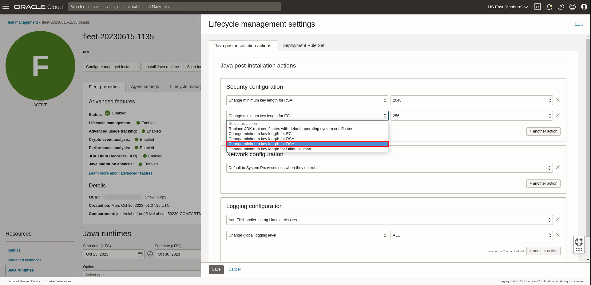

5. To remove an existing action, click on the **X** beside the action to remove it.

   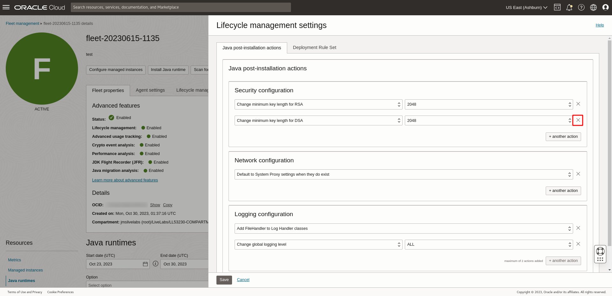

   >**Note:** To remove all existing action, click on the **X** beside all of the actions until no action remains

6. Once all the modifications are made, click on the **Save** button below to save all the changes

7. Return to the fleet details page, click on the tab **Lifecycle management settings** to view the updated post Java installation actions.

You may now **proceed to the next lab**.

## Learn More
* Refer to the [Java Runtime Lifecycle Management](https://docs.oracle.com/en-us/iaas/jms/doc/advanced-features.html#GUID-08673CB1-D87D-4BC5-A61D-E59DCC879ABB), [Work Request](https://docs.oracle.com/en-us/iaas/jms/doc/getting-started-java-management-service.html#GUID-47C63464-BC0C-4059-B552-ED9F33E77ED3) and [Viewing a Work Request](https://docs.oracle.com/en-us/iaas/jms/doc/viewing-work-request.html#GUID-F649F0E5-DD54-4DEC-A0F1-942FE3552C93) sections of the JMS documentation for more details.

* Use the [Troubleshooting](https://docs.oracle.com/en-us/iaas/jms/doc/troubleshooting.html#GUID-2D613C72-10F3-4905-A306-4F2673FB1CD3) chapter for explanations on how to diagnose and resolve common problems encountered when installing or using Java Management Service.

* If the problem still persists or it is not listed, then refer to the [Getting Help and Contacting Support](https://docs.oracle.com/en-us/iaas/Content/GSG/Tasks/contactingsupport.htm) section. You can also open a support service request using the **Help** menu in the OCI console.


## Acknowledgements

* **Author** - Yixin Wei, Java Management Service
* **Last Updated By** - Ivan Eng, March 2023
