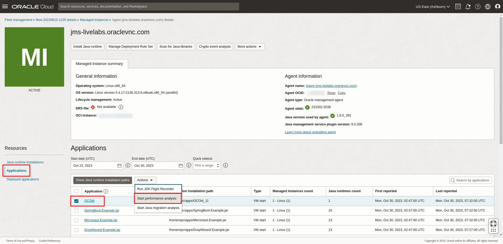
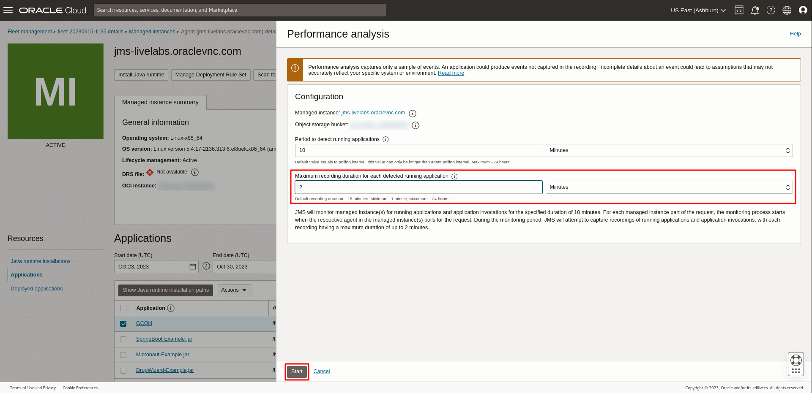
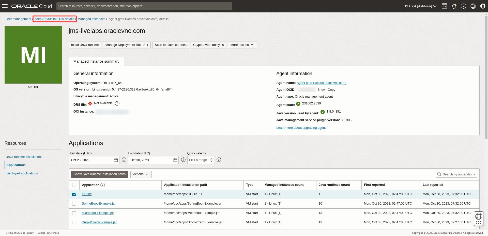
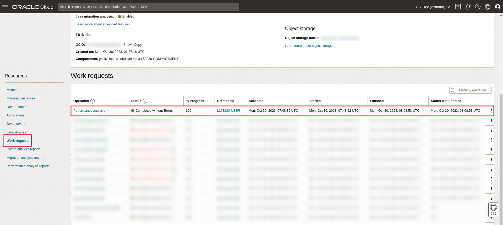
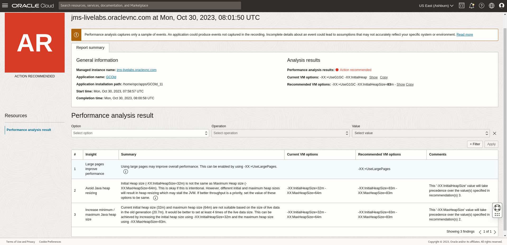
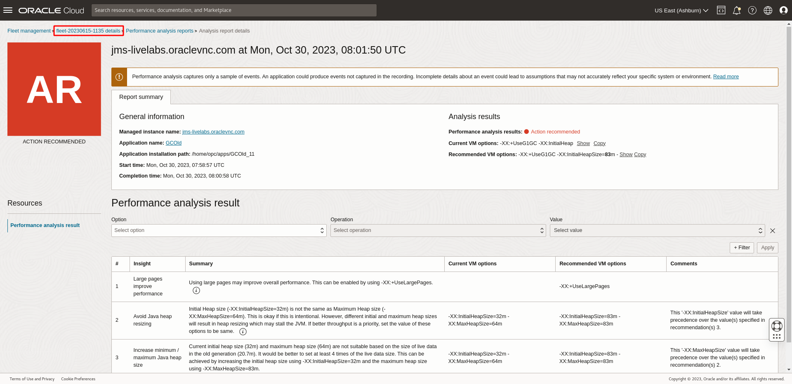
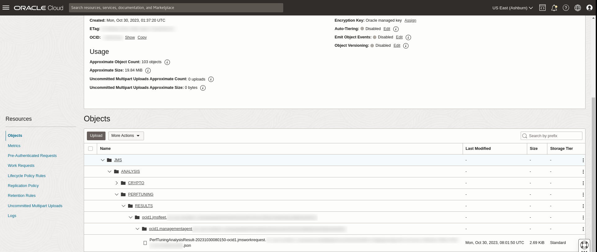

# Run Performance Analysis

## Introduction

This lab walks you through the steps to run Performance Analysis on a Java application on your Fleet.

Estimated Time: 30 mins

[Lab 6](videohub:1_hicl2gar)

### Objectives

In this lab, you will:

* Create a performance analysis work request using the Java Management Service on a Java application.
* View and monitor the status of the work request created using the Java Management Service console interface.
* View the performance analysis results of your Java application.

### Prerequisites

* You have signed up for an account with Oracle Cloud Infrastructure and have requested workshop reservation on LiveLabs.
* A running compute instance with preloaded Java runtimes and Java applications (already created for you) that you will be monitoring.
* Access to the cloud environment and resources configured in [Lab 1](?lab=setup-a-fleet) and [Lab 2](?lab=install-management-agent-script).

## Task 1: Submit Performance Analysis Work Request

1. Open the navigation menu, click **Observability & Management**. Click **Fleets** under **Java Management**. Select the fleet that you have configured in [Lab 1](?lab=setup-a-fleet).

   

2. Scroll down the **Fleet** details page. Under the **Resources** menu, select **Managed instances**.

   You should see the managed instance set up in [Lab 2](?lab=install-management-agent-script). Click on the managed instance

   

3. Scroll down and under **Resources**, select **Applications**. You should see a list of Java applications running in this Managed instance. Check the box beside **GCOld**, select the **Actions** drop-down menu and click the **Start performance analysis** button.

   

4. In the Performance analysis panel, keep the **Period to detect running applications** as 10 minutes. Lower the **Maximum recording duration for each detected running application** to 2 mins. Click **Start** to submit the work request.

   >**Note:** The selected application should run longer than the duration specified in Performance analysis.

   

   If your request is submitted successfully, you should receive a notification in green as seen below:

   

5. Click on the **fleet** name at the top of the **Managed Instance** page. This should navigate back to the **Fleet** details page.

   

6. Scroll down to the **Resources** menu and select **Work requests**. You should see a list of the work requests that are currently in your Fleet. **Performance analysis** that was started should be at the top of the list.

   

7. Wait for the work request to be processed. If the work request has been completed successfully, the status will change to **Completed without Errors**.

   

   >**Note:** It will take approximately 20 minutes for the request to be completed.

8. Once the work request status shows **Completed without Errors**, scroll down to the **Resources** menu and select **Performance analysis reports**.

   You should see a list of Performance analysis reports that have been conducted in your Fleet. The latest **Performance analysis** that has been completed should be displayed at the top of the list.

   

9. Click on the **Name** of the **Performance analysis report** and scroll down to get more details.

   

   The performance analysis result details are shown under **Performance analysis result**.

10. You can hover over the information icon, and click **Learn more** to read more about the recommendation.

    

## Task 2: (Optional) Download Performance Analysis Report

1. Click on the **fleet** name at the top of the **Managed Instance** page to navigate back to the **Fleet** details page.

    

2. To access the report, navigate to the **Fleet** details page and click on the **Object storage bucket** name under **Object storage**.

   

3. The raw copy of the **Performance analysis** report is stored in the file: **JMS** > **ANALYSIS** > **PERFTUNING** > **RESULTS** > **fleet-ocid** > **managed-instance-ocid** > **PerfTuningAnalysisResult-** json.

   

    <details>
      <summary>JSON schema of Performance Analysis Result</summary>

      ```javascript
      {
        applicationName: string,
        applicationId: string,
        applicationInstallationId: string,
        jfrFileName: string,
        timeAnalyzed: date-time,
        summary: {
            warnings: [
                {
                    key: int,
                    code: string,
                    description: string,
                    message: string,
                    currentVMOptions: string,
                    recommendedVMOptions: string,
                    detailsLink: url,
                    comment: string
                }
            ]
        },
        version: string
      }
      ```
    </details>

## Learn More

* Refer to the [Performance Analysis](https://docs.oracle.com/en-us/iaas/jms/doc/advanced-features.html#GUID-6568DD07-E651-4426-92FC-56A81B5357E4), [Work Request](https://docs.oracle.com/en-us/iaas/jms/doc/using-java-management-service.html#GUID-77AEEBC0-93A5-4E99-96D6-BEE0FEE4539F) sections of the JMS documentation for more details.

* Use the [Troubleshooting](https://docs.oracle.com/en-us/iaas/jms/doc/troubleshooting.html#GUID-2D613C72-10F3-4905-A306-4F2673FB1CD3) chapter for explanations on how to diagnose and resolve common problems encountered when installing or using Java Management Service.

* If the problem still persists or it is not listed, then refer to the [Getting Help and Contacting Support](https://docs.oracle.com/en-us/iaas/Content/GSG/Tasks/contactingsupport.htm) section. You can also open a support service request using the **Help** menu in the OCI console.

## Acknowledgements

* **Author** - Ivan Eng, Java Management Service
* **Last Updated By** - Chan Wei Quan, October 2023
