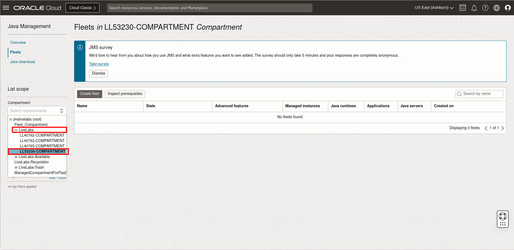
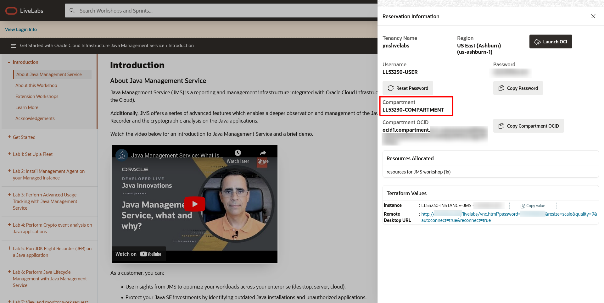
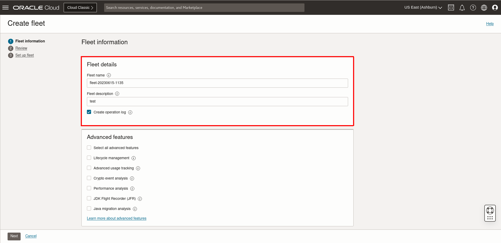
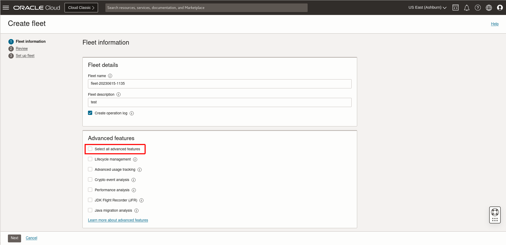
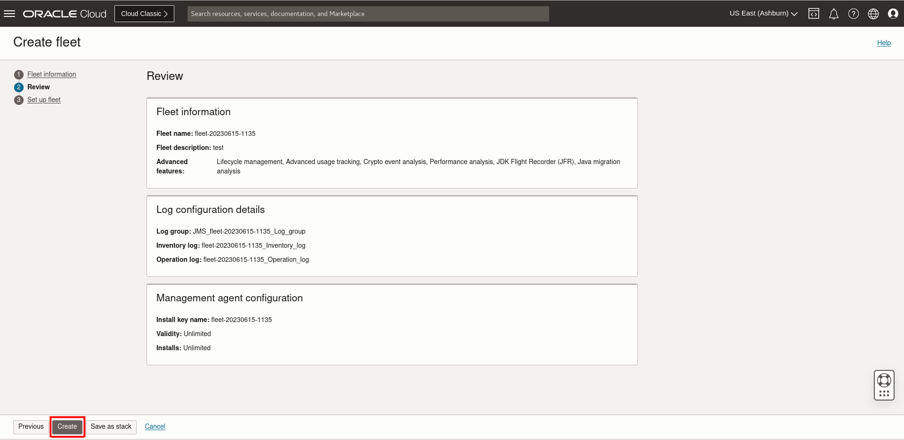
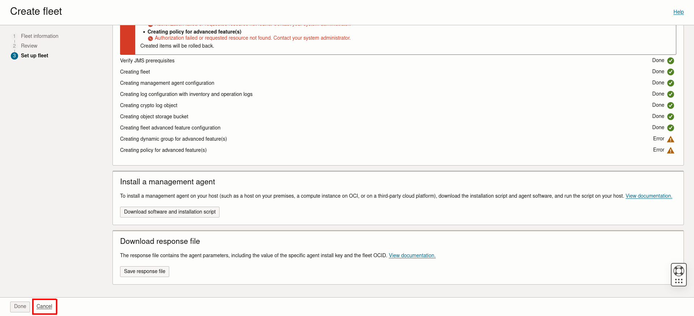
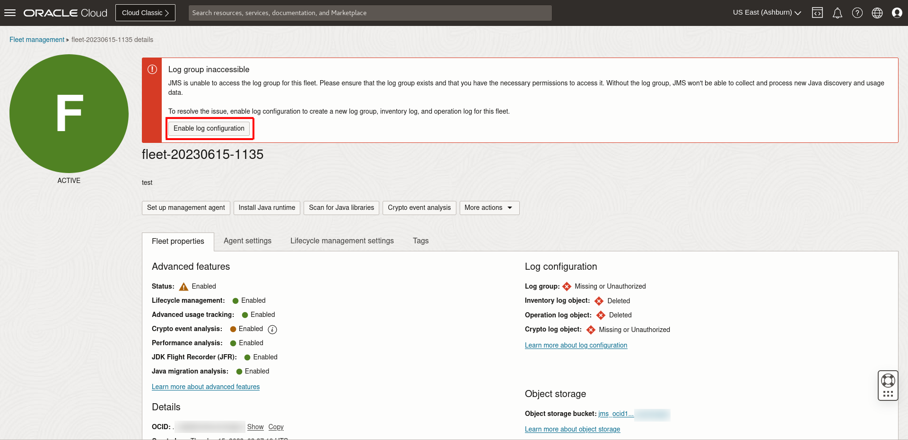
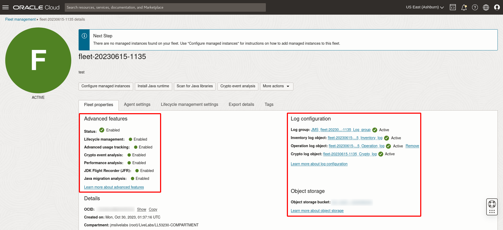
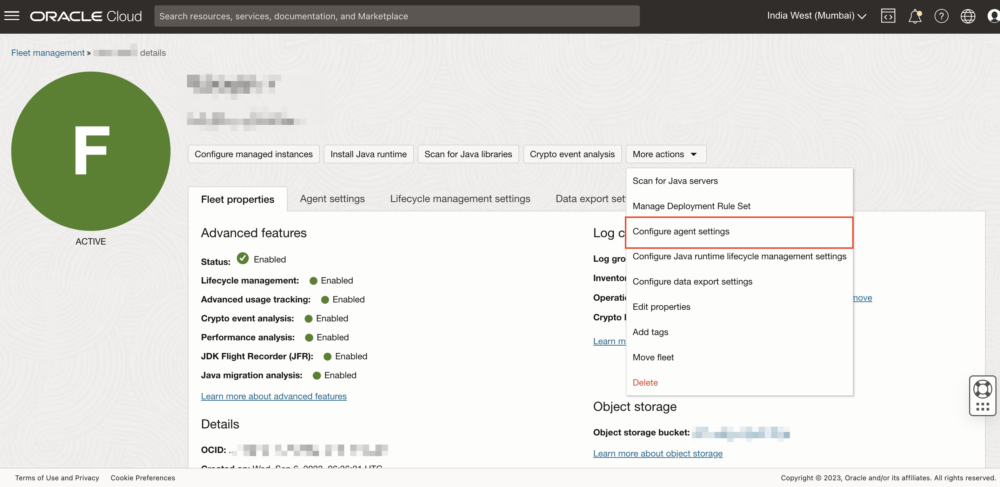
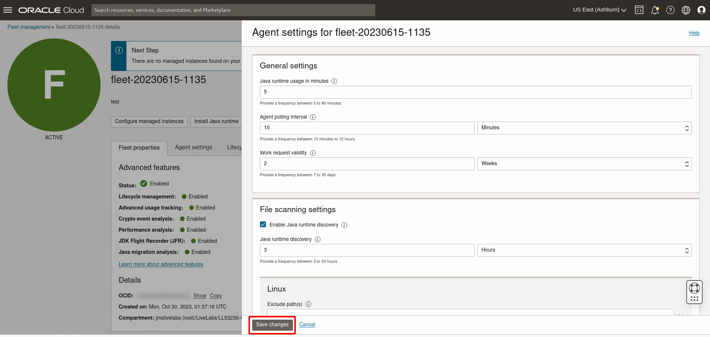

# Set up a Fleet

## Introduction

This lab walks you through the steps to set up a new fleet in Java Management Service (JMS).

Estimated Time: 10 minutes

### Objectives

In this lab, you will:

* Set up a Fleet using the Java Management Service console interface

### Prerequisites

* You have signed up for an account with Oracle Cloud Infrastructure and have requested workshop reservation on LiveLabs.

## Task 1: Set Up Java Management Service Fleet

1. In the Oracle Cloud Console, open the navigation menu, click **Observability & Management**, and then click **Fleets** under **Java Management**.

     

2. Under the compartment section at the left, expend the compartment **LiveLabs**.

    Select the sub compartment **LLxxxxx-COMPARTMENT** indicated in your Login Info (Compartment should be under **jmslivelabs(root)** -> **LiveLabs**).

    

    

    >**Note:** There is an occasional issue with the compartment naming which is in the midst of being resolved. If the compartment stated in the reservation info cannot be found in the **LiveLabs** compartment or if there is a **Authorization failed or requested resource not found error** in that compartment, please refer to the guide below.

    

    Locating the correct compartment:

     - Ensure that you are viewing a sub compartment in **LiveLabs**.

       

     - Check for other compartments named **ZZ-EMPTY-20XXXXXX-XXXXXX-XXXX**. 

       

     - Select the compartment. Check that able to show **No fleets found**.

       
     
     - You may have to check all the **ZZ-EMPTY** compartments if there are multiple of them.

     - The compartment where you are able to view 'No fleets found' has the permissions for fleet creation, even though the compartment name is different from login page details. Utilise this compartment for subsequent steps.
         
3. Click **Create Fleet**.

     >**Note:** You **do not** need to click **Inspect Prerequisites** here as the prerequisites are already set up for you.

     

4. In the Create Fleet dialog box, enter a description. 
   
   Please keep the **default fleet name** here (for example, fleet-20220901-0900).
   
   

5. Under advanced features, check the box for **Select all advanced features**. 

   

   Click **Agree**. This enables all the advanced features. You can still change the enabled advanced features after the fleet is created.

   

   There are 4 different advanced features available:
    - Lifecycle management (LCM) - Manage the lifecycle of Java runtimes in your fleet by installing or removing reported Java runtime.
    - Advanced usage tracking - Analyze the usage of Java servers and identify potential vulnerabilities associated with the Java libraries used by your application
    - Crypto event analysis - Assess the impact of Oracle JRE and JDK Cryptographic roadmap on the applications running in your fleet.
    - Java Flight Recorder (JFR) - Collect information about events in the application running in your fleet using Java Flight Recorder (JFR), a tool for collecting diagnostic and profiling data about a running Java application.

   To learn more about the advanced features available, see [Using Java Management Service Advanced Features](https://apexapps.oracle.com/pls/apex/dbpm/r/livelabs/view-workshop?wid=3202).

6. Click **Next**. 
    

7. You are prompted to review the fleet information and management agent configuration. 

8. Click **Create**. This creates a new fleet and its configuration.
    

    >**Note:** If you wish to modify your choices, click **Previous**.

9. Wait for the progress to complete. 2 errors related to the **Dynamic group** and **Policies** creation for the **Advanced features** will pop up. 

   Ignore these errors as these policies and dynamic groups has already been configured. 
   
    > **Note:** For the sandbox environment, customised policies and dynamic groups have been pre-configured and sandbox users will not experience any disruptions. These error messages can be safely ignored, they arise from the policies and dynamic groups needing an administrator with necessary privileges at fleet creation, which sandbox users have not been granted.

    

10. Scroll down and click **Download software and installation script**.

   

   Under the download installation script, select the Linux version of the installation script and click to download it.

   

    Click **Close** once the download is complete. The downloaded file will be used in [Lab 2: Install Management Agent on your Managed Instances using Cloud Shell](?lab=install-management-agent-script) to install the Management Agent. You can still download the installation script after the fleet is created.

    Click **Cancel**. The **Done** button is not enabled due to the errors in the policies and dynamic group creation.

    

11. On the **Java Management** page, click on the fleet that was created. 
    

12. A **Log group is deleted** error will be displayed at the top of the Fleet details page. This is related to the errors when creating the fleet. Click **Enable log configuration**. This will enable the logs required for the fleet.

    

13. Wait for the fleet to update. 

    Another error, **Crypto log object is deleted** should appear. Click on the **Enable crypto log**. This will enable the logs for the crypto event analysis.
    

14. Wait for the fleet to update. All the advanced features should be enabled and the required logs should be active.
    

15. After JMS is linked to the management agent, it will collect information on your Java Runtimes. The rate at which the information is updated is dependent on the scan frequency of the management agent on the instance. This may not occur immediately. The scanning frequency can be changed from the Fleet details page.

16. In the Fleet details page, click **More actions** and select **Modify Agent Settings**.
   

17. An **Agent settings** window will appear with the following settings:

    **Java Runtime Usage**: How frequent agents reports Java usage.
    
    **Agent Polling Interval**: How frequent which agents check for work request to execute.
    
    **Work Request Validity**: The time period for accepting the work request by the agents involved.
    
    **Java Runtime Discovery**: How frequent agents scan for Java installation.
     
18. For the purpose of this workshop, change **Java Runtime Discovery** to **3 hours**, and **Java Runtime Usage** to **5 minutes**.
    

19. Click **Save changes** to save the new setting
    

You may now **proceed to the next lab**.

## Learn More

* Refer to the [Fleet Management](https://docs.oracle.com/en-us/iaas/jms/doc/fleet-management.html) section of the JMS documentation for more details.

* Refer to the [Enabling Advanced Features](https://docs.oracle.com/en-us/iaas/jms/doc/advanced-features.html#GUID-F5F4C42D-7BBB-4448-B898-82E4F7E999FB) section of the JMS documentation for details on how to enable advanced features.

* Use the [Troubleshooting](https://docs.oracle.com/en-us/iaas/jms/doc/troubleshooting.html#GUID-2D613C72-10F3-4905-A306-4F2673FB1CD3) chapter for explanations on how to diagnose and resolve common problems encountered when installing or using Java Management Service.

* If the problem still persists or it is not listed, then refer to the [Getting Help and Contacting Support](https://docs.oracle.com/en-us/iaas/Content/GSG/Tasks/contactingsupport.htm) section. You can also open a support service request using the **Help** menu in the OCI console.

## Acknowledgements

* **Author** - Yixin Wei, Java Management Service
* **Last Updated By** - Bao Jin Lee, January 2023
