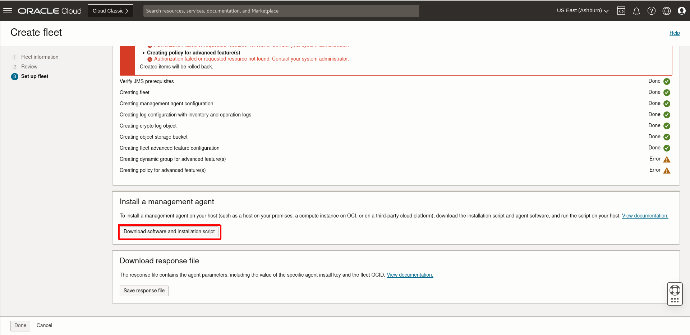
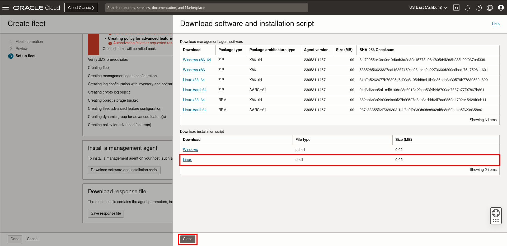
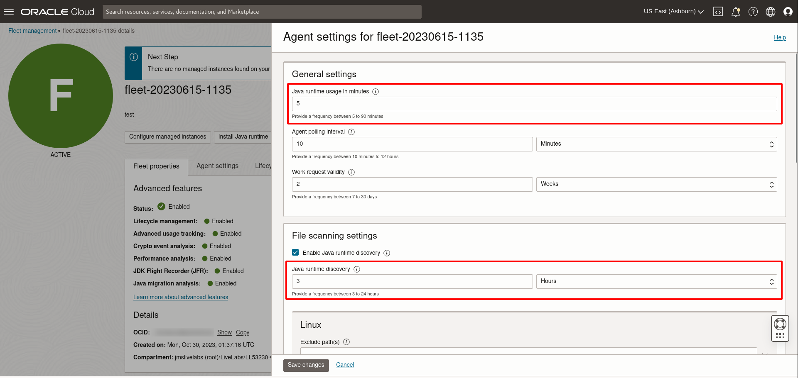

# Set up a Fleet

## Introduction

This lab walks you through the steps to set up a new fleet in Java Management Service (JMS).

Estimated Time: 5 minutes

### Objectives

In this lab, you will:

* Set up a Fleet using the Java Management Service console interface

### Prerequisites

* You have signed up for an account with Oracle Cloud Infrastructure and have requested workshop reservation on LiveLabs.

## Task 1: Set Up Java Management Service Fleet

1. In the Oracle Cloud Console, open the navigation menu, click **Observability & Management**, and then click **Fleets** under **Java Management**.

  

2. Select the compartment **LLxxxxx-COMPARTMENT** indicated in your Login Info (Compartment should be under **jmslivelabs(root)** -> **LiveLabs**).

  Click **Create Fleet**.

    > **Note:** You do not need to click **Inspect Prerequisites** here as the prerequisites are already set up for you.

    

3. In the Create Fleet dialog box, enter a description. Please keep the **default fleet name** here (for example, fleet-20220901-0900).

4. Select **Enable advanced features**.

  

  Click **Agree**. This is to enable advanced Lifecycle Management (LCM) operations. You can still edit it after the fleet is created.

  

  LCM is a part of JMS's reporting and management infrastructure. JMS enables users to observe and manage the lifecycles of their Java SE Runtimes (on-premises or in the Cloud) by performing LCM operations such as installing or removing Java Runtimes. To learn more about the Lifecycle Management feature, see [Perform Java Lifecycle Management with Java Management Service](https://apexapps.oracle.com/pls/apex/dbpm/r/livelabs/view-workshop?wid=3202).

5. Click **Next**. You are prompted to review the fleet information and management agent configuration. If you wish to modify your choices, click **Previous**.

6. Click **Create**. This creates a new fleet and its configuration.

  

7. Click **Download installation script**.

  

  Click the Linux version of the installation script to download it.

  

  Click **Close** and **Done** once the download is complete. The downloaded file will be used in [Lab 2: Install Management Agent on your Managed Instances using Cloud Shell](?lab=install-management-agent-script) to install the Management Agent. You can still download the installation script after the fleet is created.

8. After JMS is linked to the management agent, it will collect information on your Java Runtimes. As the management agent scans the instance periodically, the information may not appear immediately. The scanning frequency can be changed here.

9. Click the fleet. In the detail page, click **Modify Agent Settings**.

  

10. Change the **Java Runtime Discovery** and **Java Runtime Usage** to the desired value. For this example, change **Java Runtime Discovery** to **3 hours**, and **Java Runtime Usage** to **5 minutes**.

  

You may now **proceed to the next lab**.

## Learn More

* Refer to the [Fleet Management](https://docs.oracle.com/en-us/iaas/jms/doc/fleet-management.html) section of the JMS documentation for more details.

* Use the [Troubleshooting](https://docs.oracle.com/en-us/iaas/jms/doc/troubleshooting.html#GUID-2D613C72-10F3-4905-A306-4F2673FB1CD3) chapter for explanations on how to diagnose and resolve common problems encountered when installing or using Java Management Service.

* If the problem still persists or it's not listed, then refer to the [Getting Help and Contacting Support](https://docs.oracle.com/en-us/iaas/Content/GSG/Tasks/contactingsupport.htm) section. You can also open a support service request using the **Help** menu in the OCI console.

## Acknowledgements

* **Author** - Yixin Wei, Java Management Service
* **Last Updated By** - Yixin Wei, September 2022
