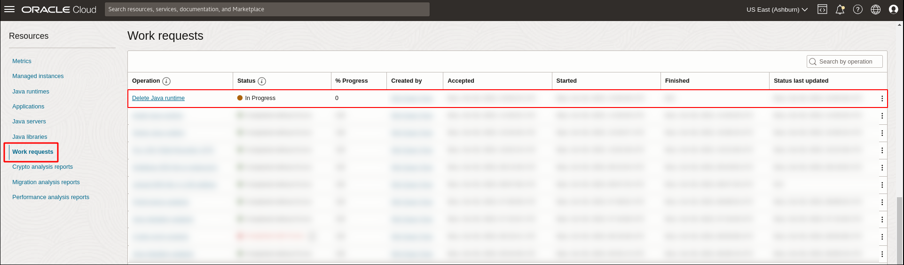
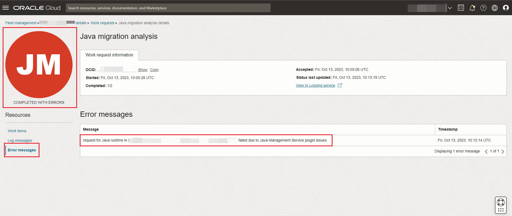
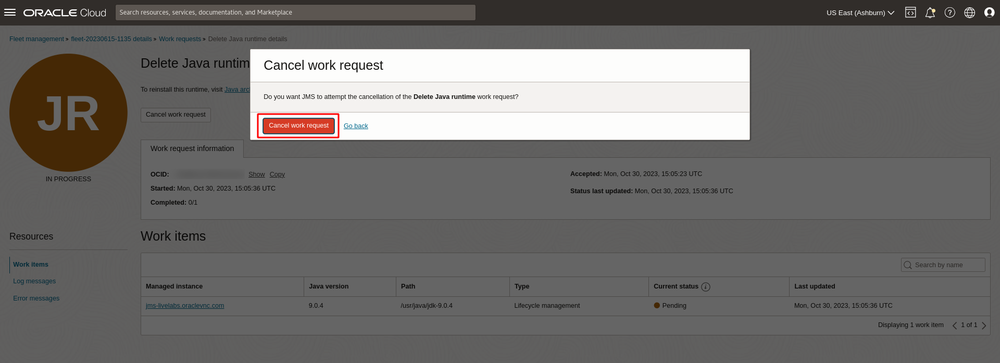
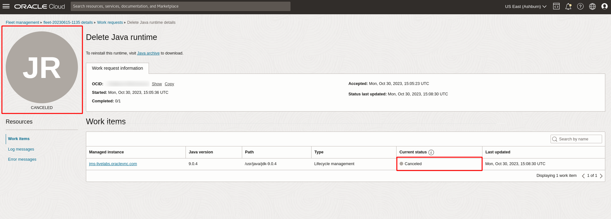

# View and monitor work request

## Introduction

This lab walks you through the steps to view and monitor the Work Requests you have created.

Estimated Time: 5 minutes

### Objectives

In this lab, you will:

* Understand the different components of a Work Request view
* View and monitor the status of Work Requests created using the Java Management Service console interface
* Cancel a Work Request using the the Java Management Service console interface

### Prerequisites

* You have signed up for an account with Oracle Cloud Infrastructure and have requested workshop reservation on LiveLabs.
* A running compute instance with preloaded Java Runtimes and Java applications (already created for you) that you will be monitoring.
* Access to the cloud environment and resources configured in [Lab 1](?lab=setup-a-fleet) and [Lab 2](?lab=install-management-agent-script).

## Task 1: View work request details

1. Open the navigation menu, click **Observability & Management**. Click **Fleets** under **Java Management**. Select the fleet that was created in [Lab 1](?lab=setup-a-fleet).

   

2. Under **Resources**, select **Work Requests**. You should see a list of the Work Requests that you have created. Select a **Work Request** that you are interested to view in detail.

   

3. The detailed view of a Work Request is divided into two sections:
    * Work request information including:
        * The **OCID** of the Work Request
        * **Date and time** when the Work Request **started**
        * **Number of sub-tasks** completed for the Work Request
        * **Date and time** when the Work Request was **accepted**
        * **Status** on when the Work Request was last updated
        * View in logging service option available for "Failed" work requests. Use this option to view detailed logs of this work request in the OCI logging service.
    * A list of resources from which you can view the individual metrics for the Work Requests:
        * Work Items
        * Log Messages
        * Error Messages

   

4. For the list of resources which include **Work Items**, **Log Messages** and **Error Messages**, each list displays **50** rows at a time. You may click the header of a column to sort the list based on the title of the column, or use the text field to search the contents of the table.

   For the list of **Work Items** for **Delete Java runtime**, you may find the following information:
   * **Managed instance**: name of the managed instance affected by the work request.
   * **Java version**: the version of the Java runtime that is being deleted.
   * **Path**: the file path of where the deleted Java version is located in.
   * **Type**: the type of the advanced feature for which the work request has been initiated, such as lifecycle management.
   * **Current status**: current status of the operation of the work item. The status can of any one of: Pending / Retrying / In progress / Canceling, Canceled, Completed with Errors, Succeeded.
   * **Last updated**: date and time when the status for this work item was last updated.

   

   For the list of **Log Messages**, you may find the following information:
   * **Message**: Log message reported by the agent while carrying out the Work Request.
   * **Timestamp**: Date and time when the message was generated.

   

   For the list of **Error Messages**, you may find the following information. Note that error messages can be observed if your Work Request was not successful.
   * **Message**: Error message reported by the agent while carrying out the Work Request.
   * **Timestamp**: Date and time when the message was generated.

   

## Task 2: Cancel work request

1. In the **Fleet** page, under **Resources**, select **Work Requests**. You should see the Work Requests you submitted. Click on the Work Request to view its details.
  

2. If your Work Request is still in progress and you would like to cancel it, click **Cancel Work Request**.
  

3. Click **Cancel work request** again to confirm.
  

4. If your request has been canceled successfully, you should see that the **Status** of the request is marked as **Canceled**.
  

## Learn More
* Refer to [Work Request](https://docs.oracle.com/en-us/iaas/jms/doc/using-java-management-service.html#GUID-77AEEBC0-93A5-4E99-96D6-BEE0FEE4539F) section of the JMS documentation for more details.

* Use the [Troubleshooting](https://docs.oracle.com/en-us/iaas/jms/doc/troubleshooting.html#GUID-2D613C72-10F3-4905-A306-4F2673FB1CD3) chapter for explanations on how to diagnose and resolve common problems encountered when installing or using Java Management Service.

* If the problem still persists or it is not listed, then refer to the [Getting Help and Contacting Support](https://docs.oracle.com/en-us/iaas/Content/GSG/Tasks/contactingsupport.htm) section. You can also open a support service request using the **Help** menu in the OCI console.

## Acknowledgements

* **Author** - Bao Jin Lee, Java Management Service
* **Last Updated By** - Chan Wei Quan, October 2023
