# Set up Oracle Cloud Infrastructure for Java Management Service

## Introduction
Before you can use Java Management Service, you must ensure that your Oracle Cloud Infrastructure environment is set up correctly to allow the communication flow between all required components and cloud services.

The following diagram illustrates the topology of the environment for Java Management Service:<br>
> **Note:** A step-by-step explanation of the diagram will be provided in [Task 2](#task-2-create-oci-resources-manually)


This section describes the steps to set up Oracle Cloud Infrastructure for Java Management Service. To set up your OCI resources, you may choose to use either the **Onboarding Wizard** or perform the steps **manually**. We recommend users who are new to OCI to use the **Onboarding Wizard** option.

Before you begin, review the prerequisites and the overview of the steps.

Estimated Time: 15 min

### Objectives
In this lab, you will:

* Set up Oracle Cloud Infrastructure for new Java Management Service users by configuring the prerequisite OCI resources to get started including:
    * Create a compartment for your JMS resources.
    * Create a user group for your JMS users.
    * Create one or more user accounts for your JMS users.
    * Create a dynamic group of all agents.
    * Create policies.

### Prerequisites
You will need an OCI account with administrative privileges to complete this lab. If you do not have one, you may sign up [here](https://www.oracle.com/cloud/free/).

## Task 1: Create OCI Resources using Onboarding Wizard
The Onboarding Wizard helps to create the necessary resources automatically. We recommend this option for users new to OCI.

1. Sign in to the Oracle Cloud Console as an administrator using the credentials provided by Oracle, as described in [Sign In for the First Time](https://docs.oracle.com/en-us/iaas/Content/GSG/Tasks/signingin.htm). See [Get to Know the Console](https://docs.oracle.com/en-us/iaas/Content/GSG/Concepts/console.htm) for more information.
&nbsp;

2. In the Oracle Cloud Console, open the navigation menu, click **Observability & Management**, and then click **Fleets** under **Java Management**.
    
    &nbsp;

    > **Note:** You can also use the search bar to navigate around the Oracle Cloud Console.
    
    
3. Select the root compartment under which the Onboarding Wizard will create a new compartment for JMS fleets.

4. Click **Set up JMS** to view details of the resources that will be created by the Onboarding Wizard. The resources created are a new compartment, user group, dynamic group, and policy.

    > **Note:** If the **Set up JMS** button does not appear, click on the **Actions (Inspect prerequisites)** button.

    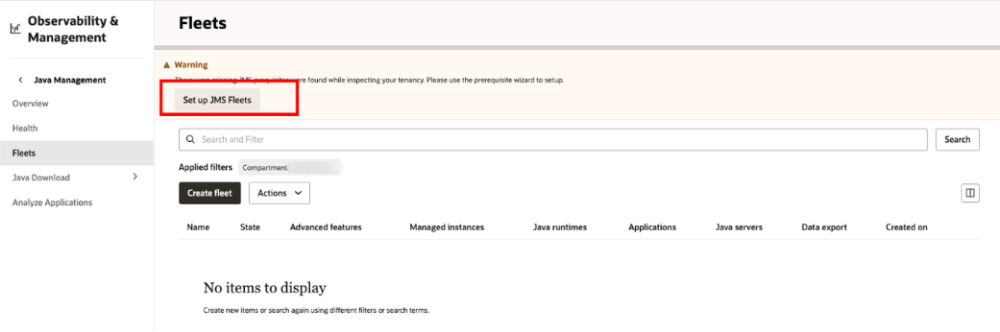

5. You will see the first step. Keep all options as default and click **Next** to proceed with the setup.

    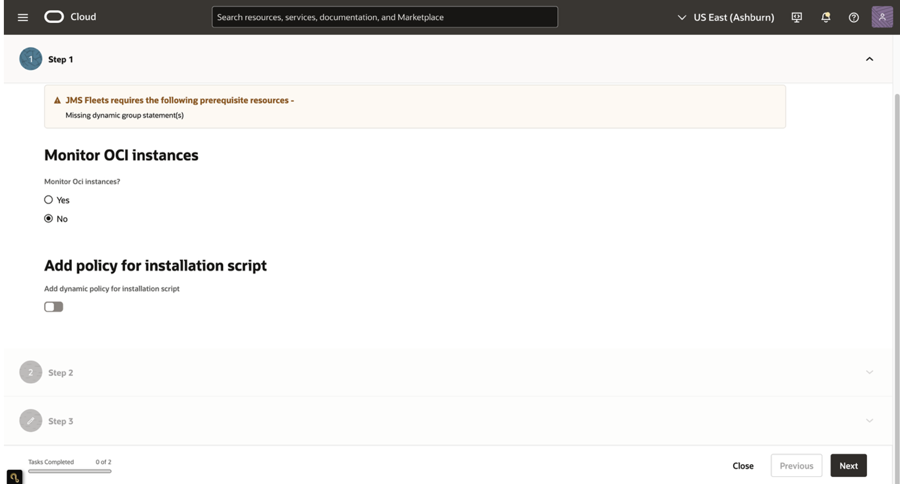

    You will see information about the compartment, user group, and policy statements that will be applied. Review the details and click **Next** to start the Onboarding Wizard.

    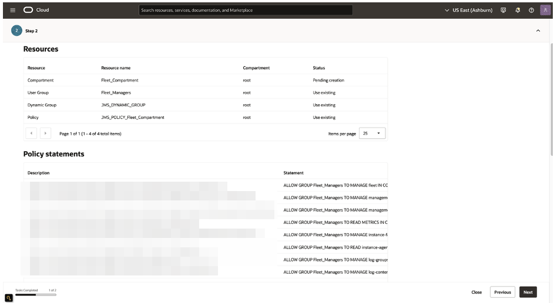

6. You will see a screen informing you that the prerequisites have been successfully set up. Click **Close** to close the window.

    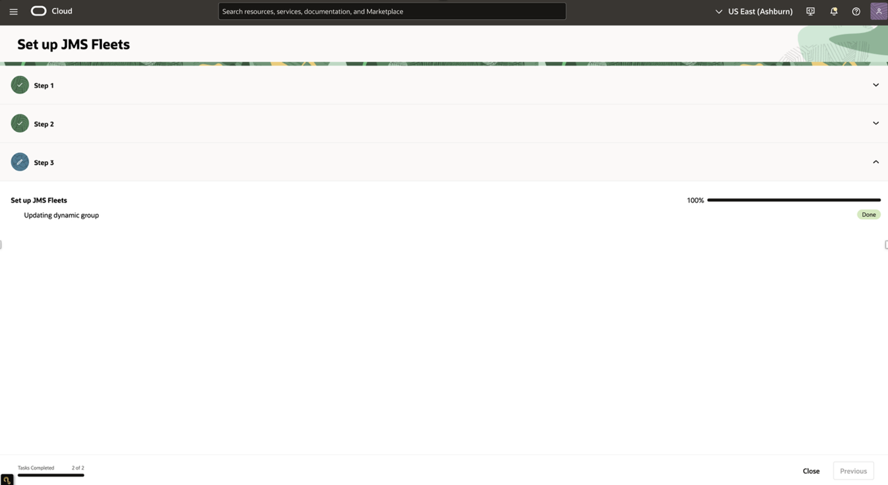
    > **Note:** If an error occurs in the creation process, you will see the error message being displayed. Resolve the error and restart the Onboarding Wizard to continue.

    You should receive a notification in green as seen below:

    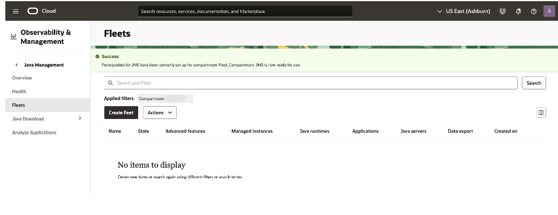

7. Verify creation of prerequisite resources (Optional)

    You can confirm the prerequisite resources have been created through your OCI console.
    &nbsp;
    * In the Oracle Cloud Console, open the navigation menu and click **Identity & Security**. Under **Identity**, click **Compartments**.
        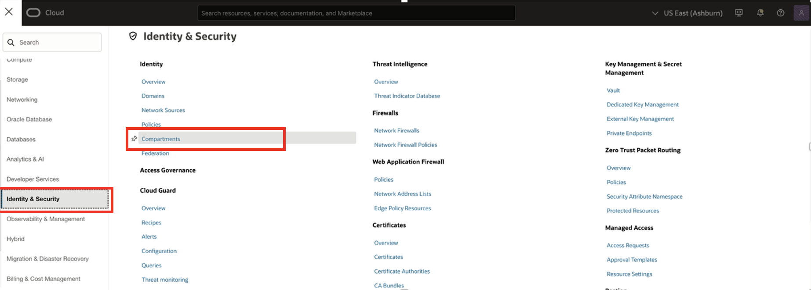
        &nbsp;
    * Confirm the creation of new compartment labeled `Fleet_Compartment`.
        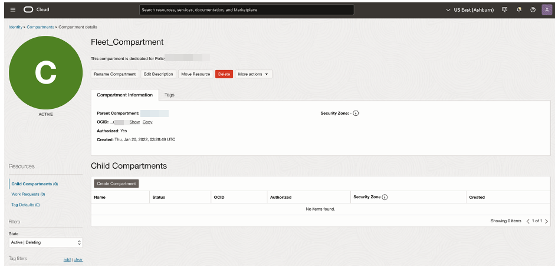
        &nbsp;
    * In the Oracle Cloud Console, open the navigation menu and click **Identity & Security**. Under **Identity**, click **Domains**.

        > **Note:** If **Domains** does not appear, your tenancy and/or region has not been updated to use identity domains. You can access groups and dynamic groups directly under **Identity**. For more information, see [Documentation to Use for Cloud Identity](https://docs.oracle.com/en-us/iaas/Content/Identity/getstarted/identity-domains.htm#identity_documentation).

        
    &nbsp;
    * On the **Domains** page, click **Default**, then go to the **User Management** section and scroll down to the **Groups** section. 
    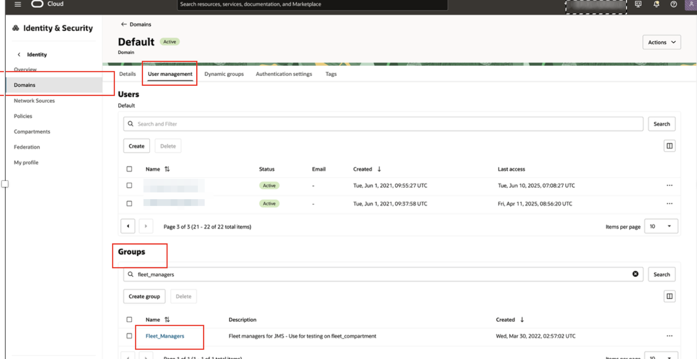
    * You can see the new user group labeled `FLEET_MANAGERS`.
        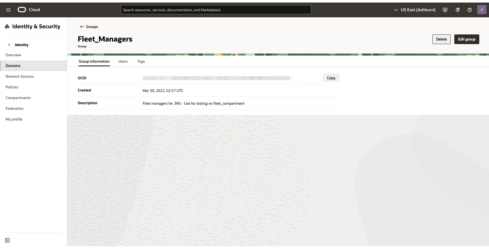
        &nbsp;
    * Return to the Overview page and click **Dynamic groups**.
        
        &nbsp;
    * Confirm the creation of new dynamic group labeled `JMS_DYNAMIC_GROUP` and 2 Matching Rules.
        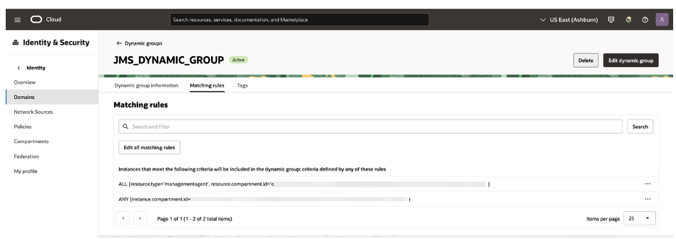
        &nbsp;
    * In the Oracle Cloud Console, open the navigation menu and click **Identity & Security**. Under **Identity**, click **Policies**.
        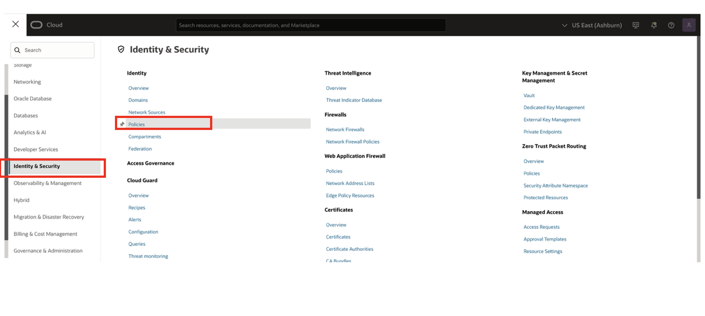
        &nbsp;
    * Confirm the creation of new policy labeled `JMS_Policy_Fleet_Compartment`.
        

You may now **proceed to the next lab**.

## Task 2: Create OCI Resources manually

If you would like to customize your OCI resources, you may do so manually with the following steps.

Sign in to the Oracle Cloud Console as an administrator using the credentials provided by Oracle, as described in [Sign In for the First Time](https://docs.oracle.com/en-us/iaas/Content/GSG/Tasks/signingin.htm). See [Get to Know the Console](https://docs.oracle.com/en-us/iaas/Content/GSG/Concepts/console.htm) for more information.

1. Create a compartment for your JMS resources.

    

    When you sign up for OCI, Oracle creates your tenancy with a root compartment that holds all of your cloud resources. You can think of the root compartment like the root folder in a file system. Oracle recommends that you set up a dedicated compartment for each project so you can associate a compartment with a particular activity or task.
    &nbsp;
    * In the Oracle Cloud Console, open the navigation menu and click **Identity & Security**. Under **Identity**, click **Compartments**.
        
        &nbsp;

        > **Note:** You can also use the search bar to navigate around the Oracle Cloud Console.
        
        

    * Click **Create Compartment**.
        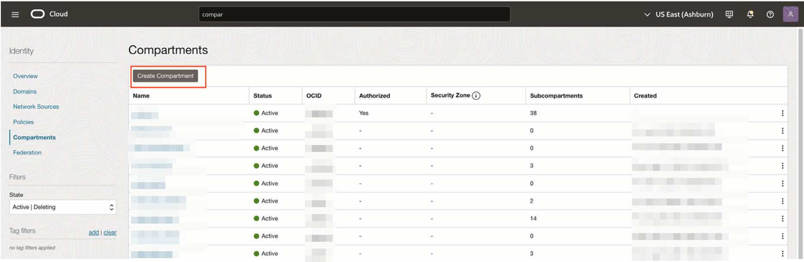
        &nbsp;
    * In the Create Compartment dialog box, enter a name for the compartment (for example, `Fleet_Compartment`), and a description. The compartment name is required when you create policies.
        &nbsp;
    * Specify the parent compartment: select the root compartment for your tenancy from the drop-down list.
        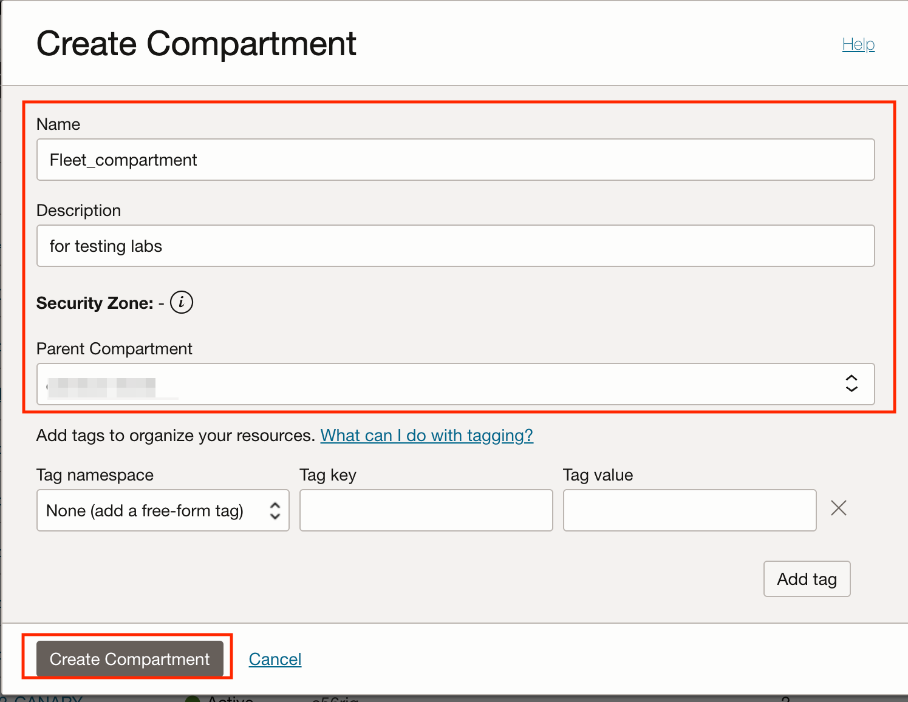
        &nbsp;
    * Click **Create Compartment**.
        &nbsp;
    * Find your new compartment in the table of compartments, then hover over the compartment's OCID. Click **Copy** to copy the OCID into the clipboard and then ***paste it into a text editor***. You will require it in a later step.
        &nbsp;
        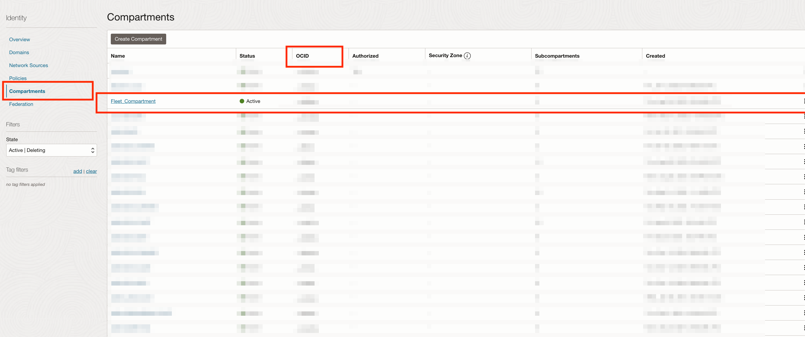
        &nbsp;

        For more information, see [Setting Up Your Tenancy](https://docs.oracle.com/en-us/iaas/Content/GSG/Concepts/settinguptenancy.htm) and [Managing Compartments](https://docs.oracle.com/en-us/iaas/Content/Identity/compartments/managingcompartments.htm).
        &nbsp;

2. Create a user group.

    

    * In the Oracle Cloud Console, open the navigation menu and click **Identity & Security**. Under **Identity**, click **Domains**.

        > **Note:** If **Domains** does not appear, your tenancy and/or region has not been updated to use identity domains. You can access groups and dynamic groups directly under **Identity**. For more information, see [Documentation to Use for Cloud Identity](https://docs.oracle.com/en-us/iaas/Content/Identity/getstarted/identity-domains.htm#identity_documentation).

        
        &nbsp;
    * In the Domains page, click **Default**.
        
        &nbsp;
    * On the **Overview** page, click **User Management**, scroll down to **Groups**, then click **Create group**.
        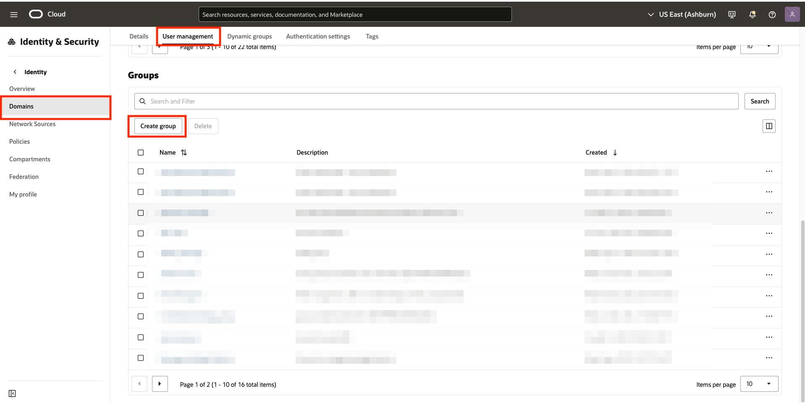
        &nbsp;
   
    * In the Create group dialog box, enter a name for the group (for example, `FLEET_MANAGERS`), and a description.
        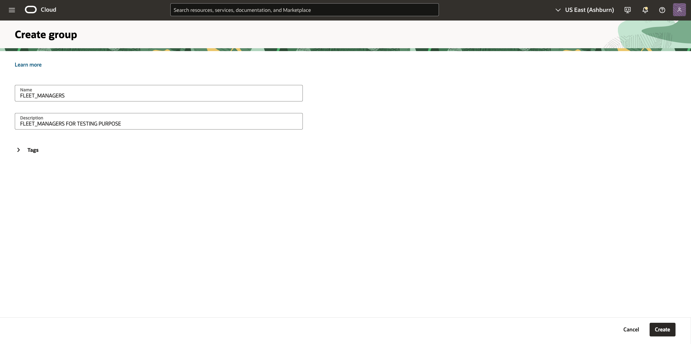
        &nbsp;
    * Click **Create**
        &nbsp;

        For more information, see [Managing Groups](https://docs.oracle.com/en-us/iaas/Content/Identity/groups/managinggroups.htm).
        &nbsp;

3. Create user accounts for each of your users by following these instructions: [Adding Users](https://docs.oracle.com/en-us/iaas/Content/GSG/Tasks/addingusers.htm).
    For more information, see [Managing Users](https://docs.oracle.com/en-us/iaas/Content/Identity/users/about-managing-users.htm).
    &nbsp;


4. Create Dynamic Group.

    

    Create a dynamic group of all agents. To interact with the Oracle Cloud Infrastructure service end-points, users must explicitly consent to let the management agents work with JMS.

    * In the Oracle Cloud Console, open the navigation menu and click **Identity & Security**. Under **Identity**, click **Domains**.
        
        &nbsp;
    * In the Domains page, click **Default**.
        
        &nbsp;
    * In the Overview page, click **Dynamic groups**.
        
        &nbsp;
    * Click **Create dynamic group**.
        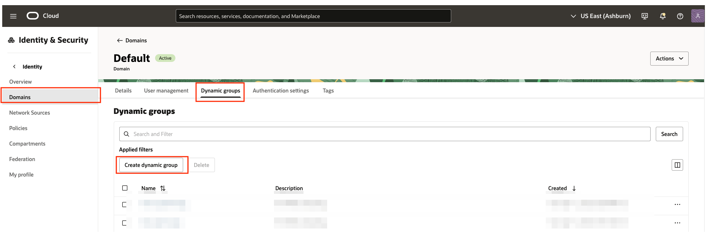
        &nbsp;
    * In the Create dynamic group dialog box, enter a name for the dynamic group (for example, `JMS_DYNAMIC_GROUP`), a description, and a matching rule.

        For **Rule 1**, enter
        ```
        <copy>
        ALL {resource.type='managementagent', resource.compartment.id='<fleet_compartment_ocid>'}
        </copy>
        ```
        Then click on `Additional Rule` button and add **Rule 2**
        ```
        <copy>
        ANY {instance.compartment.id = '<instance_compartment_ocid>'}
        </copy>
        ```

        Replace `<fleet_compartment_ocid>` with the OCID of the compartment that you created in step 1. (You should have pasted it into a text editor.)
        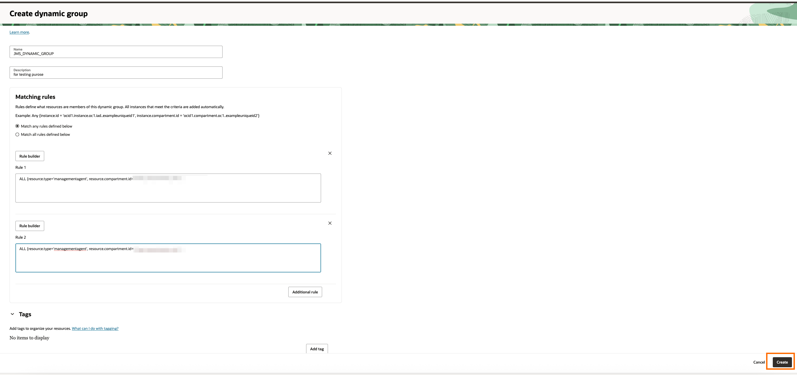
        &nbsp;
    * Click **Create**.
        &nbsp;

        For more information, see [Managing Dynamic Groups](https://docs.oracle.com/en-us/iaas/Content/Identity/dynamicgroups/managingdynamicgroups.htm).
        &nbsp;


5. Create Policies.

    

    **Policy**: A policy is a document that specifies who can access which Oracle Cloud Infrastructure resources that your company has, and how. A policy simply allows a group to work in certain ways with specific types of resources  in a particular compartment.

    [Learn more about the policy verbs (Inspect, Read, Use, Manage).](https://docs.oracle.com/en-us/iaas/Content/Identity/policyreference/policyreference_topic-Verbs.htm)<br>
    [Understand the permissions associated with each policy verb.](https://docs.oracle.com/en-us/iaas/Content/Identity/Concepts/policyadvancedfeatures.htm#Permissi)

    Create policies for the user group to access and manage JMS fleets, management agents, agent install keys, metrics, logging and LCM operations.
    &nbsp;
    * In the Oracle Cloud Console, open the navigation menu and click **Identity & Security**. Under **Identity**, click **Policies**.
    
    &nbsp;
    * Click **Create Policy**.
    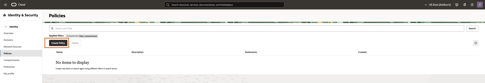
    &nbsp;
    * In the Create Policy dialog box, enter a name for the policy (for example, `JMS_Policy_Fleet_Compartment`), and a description.
    &nbsp;
    * Select the root compartment for your tenancy from the drop-down list.
    &nbsp;
    * Click **Show manual editor**.
    &nbsp;
    * In the text box, enter the following statements:
    ```
    <copy>
    ALLOW GROUP FLEET_MANAGERS TO MANAGE fleet IN COMPARTMENT Fleet_Compartment
    ALLOW GROUP FLEET_MANAGERS TO MANAGE management-agents IN COMPARTMENT Fleet_Compartment
    ALLOW GROUP FLEET_MANAGERS TO READ METRICS IN COMPARTMENT Fleet_Compartment
    ALLOW GROUP FLEET_MANAGERS TO MANAGE instance-family IN COMPARTMENT <instance_compartment>
    ALLOW GROUP FLEET_MANAGERS TO READ instance-agent-plugins IN COMPARTMENT <instance_compartment>
    ALLOW GROUP FLEET_MANAGERS TO MANAGE management-agent-install-keys IN COMPARTMENT Fleet_Compartment
    ALLOW GROUP FLEET_MANAGERS TO MANAGE log-groups IN COMPARTMENT Fleet_Compartment
    ALLOW GROUP FLEET_MANAGERS TO MANAGE log-content IN COMPARTMENT Fleet_Compartment
    ALLOW GROUP FLEET_MANAGERS TO MANAGE jms-plugins IN COMPARTMENT Fleet_Compartment

    ALLOW DYNAMIC-GROUP JMS_DYNAMIC_GROUP TO USE METRICS IN COMPARTMENT Fleet_Compartment
    ALLOW DYNAMIC-GROUP JMS_DYNAMIC_GROUP TO MANAGE management-agents IN COMPARTMENT Fleet_Compartment
    ALLOW DYNAMIC-GROUP JMS_DYNAMIC_GROUP TO MANAGE log-content IN COMPARTMENT Fleet_Compartment
    ALLOW DYNAMIC-GROUP JMS_DYNAMIC_GROUP TO MANAGE instances IN COMPARTMENT <instance_compartment>
    ALLOW DYNAMIC-GROUP JMS_DYNAMIC_GROUP TO MANAGE metrics IN COMPARTMENT Fleet_Compartment WHERE target.metrics.namespace='java_management_service'
    ALLOW DYNAMIC-GROUP JMS_DYNAMIC_GROUP TO MANAGE jms-plugins IN COMPARTMENT Fleet_Compartment

    ALLOW resource jms SERVER-COMPONENTS TO MANAGE metrics IN COMPARTMENT Fleet_Compartment WHERE target.metrics.namespace='java_management_service'
    ALLOW resource jms SERVER-COMPONENTS TO USE management-agent-install-keys IN COMPARTMENT Fleet_Compartment
    ALLOW resource jms SERVER-COMPONENTS TO MANAGE log-groups IN COMPARTMENT Fleet_Compartment
    ALLOW resource jms SERVER-COMPONENTS TO MANAGE log-content IN COMPARTMENT Fleet_Compartment
    ALLOW resource jms SERVER-COMPONENTS TO READ instances IN COMPARTMENT <instance_compartment>
    ALLOW resource jms SERVER-COMPONENTS TO INSPECT instance-agent-plugins IN COMPARTMENT <instance_compartment>
    </copy>
    ```
    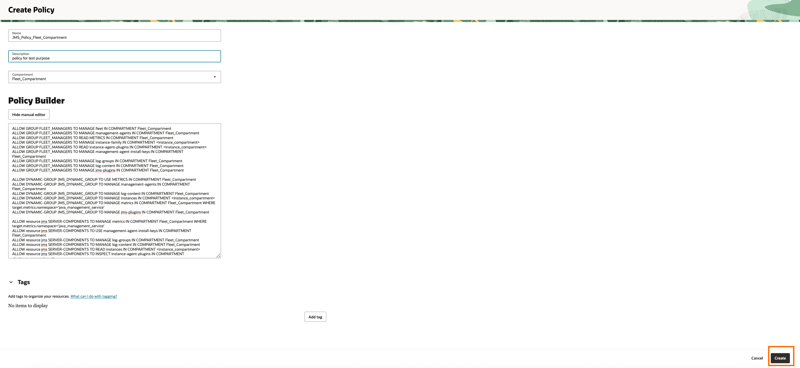

    &nbsp;
    * Click **Create**.
    &nbsp;


You may now **proceed to the next lab**.


## Learn More

* Refer to the [Getting Started with Java Management Service](https://docs.oracle.com/en-us/iaas/jms/doc/getting-started-jms.html) section of the JMS documentation for more details.

* Use the [Troubleshooting](https://docs.oracle.com/en-us/iaas/jms/doc/troubleshooting.html#GUID-2D613C72-10F3-4905-A306-4F2673FB1CD3) chapter for explanations on how to diagnose and resolve common problems encountered when installing or using Java Management Service.

* If the problem still persists or it is not listed, then refer to the [Getting Help and Contacting Support](https://docs.oracle.com/en-us/iaas/Content/GSG/Tasks/contactingsupport.htm) section. You can also open a support service request using the **Help** menu in the OCI console.

* Refer to the [How Policies Work](https://docs.oracle.com/en-us/iaas/Content/Identity/Concepts/policies.htm#How_Policies_Work) section of OCI documentation for more details.

## Acknowledgements

* **Author** - Alvin Lam, Java Management Service
* **Last Updated By** - El Maalmi Ayoub , Jul 2025