# Install Management Agent on your Managed Instances

## Introduction

This lab walks you through the steps to install a management agent and deploy plug-ins on your Managed Instance to allow Java usage tracking by the Java Management Service (JMS).

Estimated Time: 20 minutes

### Objectives

In this lab, you will:

- Install a Management Agent on your host machine.
- Verify Management Agent and Plug-ins.
- Monitor the Java runtime(s) and Java application(s) in JMS.

### Prerequisites

- You have signed up for an account with Oracle Cloud Infrastructure and have received your sign-in credentials.
- For Task 1, you should have created and are using an Oracle Linux Compute on OCI created in [Lab 4](?lab=create-a-java-application).
- If you are setting up JMS in other environments (non-OCI or non Oracle Linux host), skip Task 1 and proceed to Task 2.
- Access to the cloud environment and resources configured in [Lab 2](?lab=set-up-oci-for-jms).

## Task 1: Install Management Agent on Oracle Linux Compute on OCI

This task is for the installation of Management Agent in an OCI Host running Oracle Linux (OCI Compute Instance). If you have created an Oracle Linux instance in [Lab 4](?lab=create-a-java-application), continue with the steps here.

If you are installing the agent on other environments (e.g. on-premises, other cloud computes), skip to **Task 2**.

1. Navigate to your Oracle Linux Compute Instance that you have created in [Lab 4](?lab=create-a-java-application).

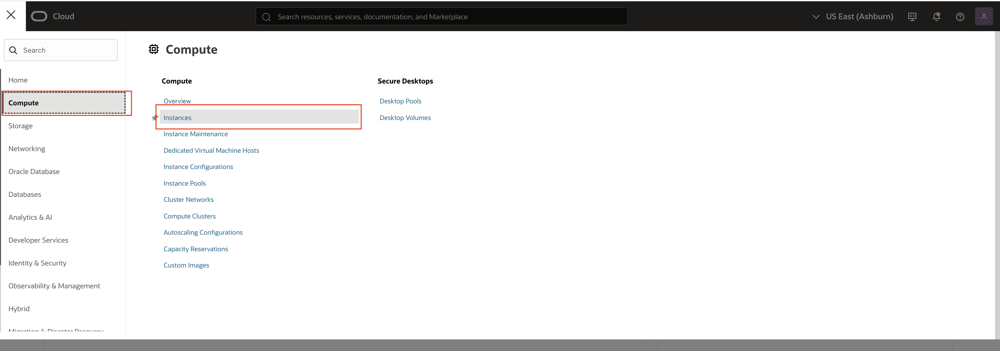

Select the correct compartment where your instance is located. If you have followed the instruction in [Lab 4](?lab=create-a-java-application), this should be **Fleet_Compartment**. Click on your instance to load the compute instance detail page.

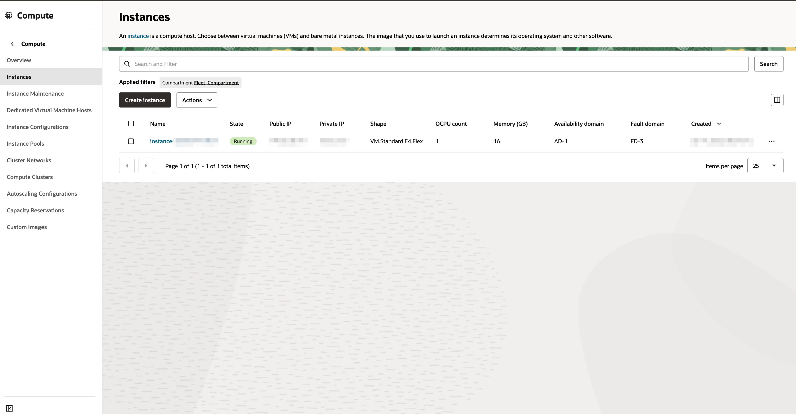

2. Once the instance detail page has loaded, click on the **Oracle Cloud Agent** tab. Then click on the **...** menu and enable the **Oracle Java Management Service** plugin.

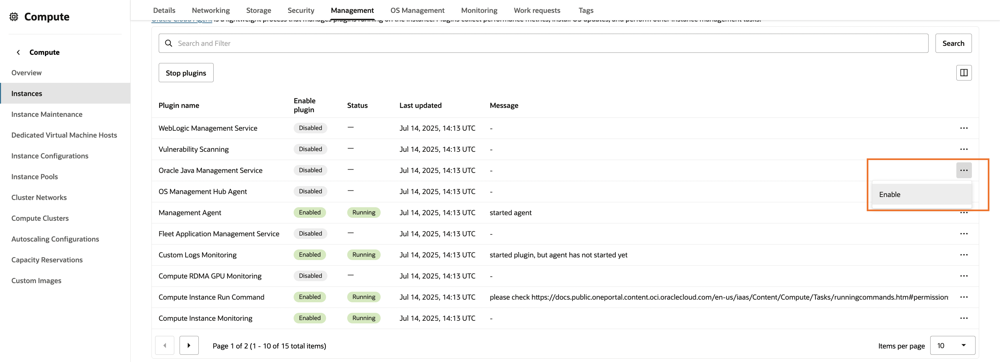

3. When you first toggle on **Oracle Java Management Service** plugin, the status for the plugin will show as **Stopped**. Wait for a few minutes, the status should change to **Running**.

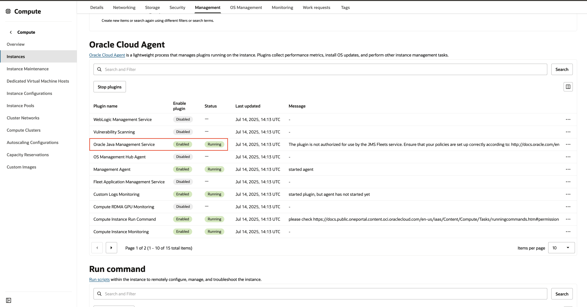

4. Follow the steps below to register your instance to your fleet:

- Navigate to the fleet that you have created in [Lab 3](?lab=setup-a-fleet).
- Click on the **Managed instances** under Resources on the left hand side.
- Click on the **Add managed instance(s)** button. A side panel of all the unregistered managed instances should show up.
- Select the compartment where the unregistered managed instances is located. If you have followed the instruction in [Lab 4](?lab=create-a-java-application), this should be **Fleet_Compartment**.
- Your managed instance from Step 3 should appear. Check the box next to your instance, or manually add an OCI instance, , then click **Add** to register this instance to your fleet.

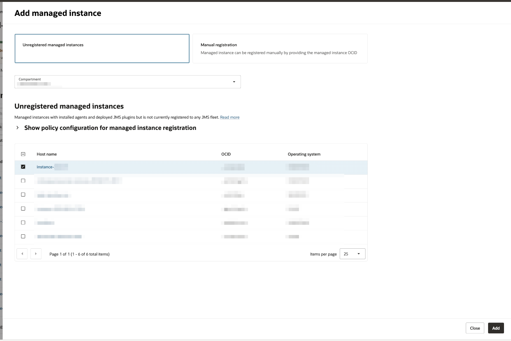

## Task 2: Install Management Agent on a non-OCI Host

> **Note:** If you have installed the management agent on an OCI instance in Task 1, skip this task and proceed to Task 3.

This task is for the installation of Management Agent in a non-OCI host(e.g. on-premises, other cloud compute). There are two possible methods of installations:

- Installation using **JMS installation script** with **Management Agent software**
      - For installation with JMS installation script, you would need to have installed the latest Oracle JDK 8 on your machine before you proceed.
- Installation using **JMS Agent Installer** with **JMS\_agent\_configuration.rsp** file
      - The JMS Agent Installer comes with the latest version of Oracle JDK 8 and Management Agent software. You do not need to pre-install Oracle JDK 8 on your machine as the **JMS Agent Installer** will manage this for you.

**This task will cover installation using the JMS Agent Installer.**

>**Note:** Installation using JMS installation script is not covered in this lab. If you intend to use the script based approach, ensure that you have installed the latest Oracle JDK 8 on your machine before you proceed.

**Download agent installer software**

1. Open the navigation menu and click **Observability & Management**, and then click **Fleets** under **Java Management**.


2. Select the Fleet created in [Lab 3](?lab=setup-a-fleet).
3. Click **Download Agent Installer**

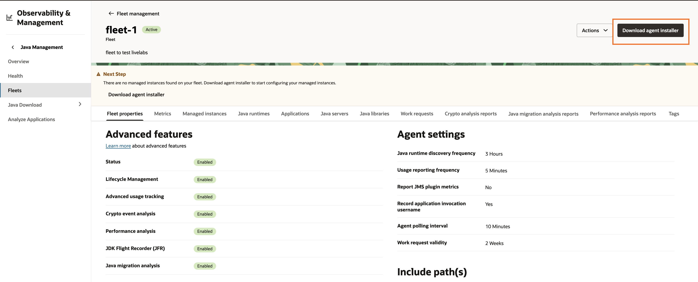

4. Select an appropriate version of the **Agent Installer** according to the operating system on your instance(s).

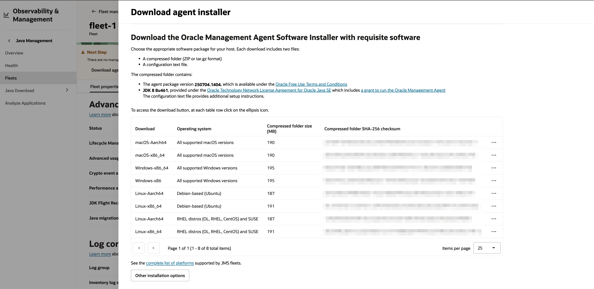

5. Click **Close**

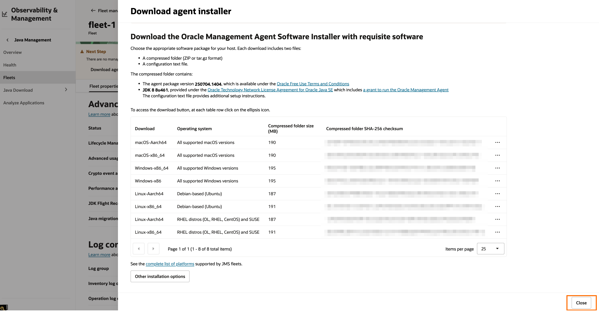

**On Linux (Non-OCI Host)**

1. Transfer the downloaded **Agent Installer** `jms_setup_<version-number>_<os-type>.tar.gz` and **configuration file** `JMS_agent_configuration.rsp` to your Linux machine. You can use the following sample command to transfer the **Agent Installer** and **configuration file** to your host machine.

  ```
  <copy>
  scp -r -i <path-to-private-key/your-private-key-file> <path-mgmt-agent-installer/your-mgmt-agent-installer> <path-agent-configuration/JMS_agent_configuration.rsp> <username>@<x.x.x.x>:<copy-to-path>
  </copy>
  ```

2. Connect to your instance and extract the **Agent Installer** and **configuration file** to a common directory.

  ```
  <copy>
  mkdir ./jmsInstaller && cp JMS_agent_configuration.rsp ./jmsInstaller && tar -xvf <your-mgmt-agent-installer>.tar.gz -C ./jmsInstaller
  </copy>
  ```

3. Navigate to the common directory and check that the **Agent Installer** is uncompressed to the same directory as the **configuration file**. Once verified, change the directory to jmsInstaller and run the `setupJMS.sh` script using the following command.

   ```
   <copy>
   sudo ./setupJMS.sh
   </copy>
   ```

4. If installation is successful, you'll see a message similar to the following:

     ```
     ...
      Agent was successfully registered using key <name-of-fleet>(ocid1.managementagentinstallkey.oc1.<region>.<some ocid hash>).
      Instance has been assigned to JMS fleet <name-of-fleet>(ocid1.jmsfleet.oc1.<region>.<some ocid hash>).
      A copy of this installation log can be found at /<path-to-log>/JMSInstallScript/JMSInstallScriptLogs-<Datestamp>-<Timestamp>-<log-number>.log
      Removing the temporary files.
      The JMS installer and configuration file can be removed from the machine.
      /<path-to-log>/JMSInstallScript/JMSInstallerLogs-<Datestamp>-<Timestamp>-<log-number>.log contains the install log.
      Agent is successfully installed and is running.
     ```

**On Windows (Non-OCI Host)**

1. Transfer the downloaded **Agent Installer** `jms_setup_<version-number>_<os-type>.zip` and **configuration file** `JMS_agent_configuration.rsp` to your Windows host machine. Ensure that the **Agent Installer** and **configuration file** are in the **same folder.**

2. Extract the **Agent Installer** zip file, then go into the extracted directory and right-click the `installJMSAgent.ps1` file in the extracted directory.

3. Select the option **"Run with Powershell"**.

    

    > Note: You can also run **installJMSAgent.ps1** from powershell as Administrator. Simply run powershell as Administrator and run this command
        ```
        <copy>
        .\installJMSAgent.ps1
        </copy>
        ```

4. An "Execution Policy Change" powershell terminal will pop up. Enter `A`, i.e. "Yes to All".

    

5. An "User Account Control" window will pop up. Click **"Yes"**. The installation will then start.

    

6. If installation is successful, you'll see a message similar to the following:

     ```
     ...
     Agent was successfully registered using key <name-of-fleet>(ocid1.managementagentinstallkey.oc1.<region>.<some ocid hash>).
     Instance has been assigned to JMS fleet <name-of-fleet>(ocid1.jmsfleet.oc1.<region>.<some ocid hash>).
     A copy of this installation log can be found at /<path-to-log>/JMSInstallScript/JMSInstallScriptLogs-<Datestamp>-<Timestamp>-<log-number>.log
     Removing the temporary files.
     The JMS installer and configuration file can be removed from the machine.
     /<path-to-log>/JMSInstallScript/JMSInstallerLogs-<Datestamp>-<Timestamp>-<log-number>.log contains the install log.
     Agent is successfully installed and is running.
     ```

**On MacOS (Non-OCI Host)**

> **Note:** Advanced features are not yet supported for mac.

1. Transfer the downloaded **Agent Installer** `jms_setup_<version-number>_<os-type>.tar.gz` and **configuration file** `JMS_agent_configuration.rsp` to your MacOS machine. Ensure that the **Agent Installer** and **configuration file** are in the **same folder.**

2. Navigate to the directory containing the agent installer files using the cd command. There is a `README.txt` in the folder. Read the `README.txt` for more details on installing the Managment Agent.

3. Open terminal and run the following command.

   ```
   <copy>
   sudo ./installJMSAgent.sh
   </copy>
   ```

4. If installation is successful, you'll see a message similar to the following:

   ```
   Agent was successfully registered using key <name-of-fleet>(ocid1.managementagentinstallkey.oc1.<region>.<some ocid hash>).
   Instance has been assigned to JMS fleet <name-of-fleet>(ocid1.jmsfleet.oc1.<region>.<some ocid hash>).
   A copy of this installation log can be found at /<path-to-log>/JMSInstallScript/JMSInstallScriptLogs-<Datestamp>-<Timestamp>-<log-number>.log
   Removing the temporary files.
   The JMS installer and configuration file can be removed from the machine.
   /<path-to-log>/JMSInstallScript/JMSInstallerLogs-<Datestamp>-<Timestamp>-<log-number>.log contains the install log.
   Agent is successfully installed and is running.
   ```

## Task 3: Verify Management Agent Installation (For non-OCI host)

1. In the Oracle Cloud Console, open the navigation menu, click **Observability & Management**, and then click **Agents** under **Management Agent**.

  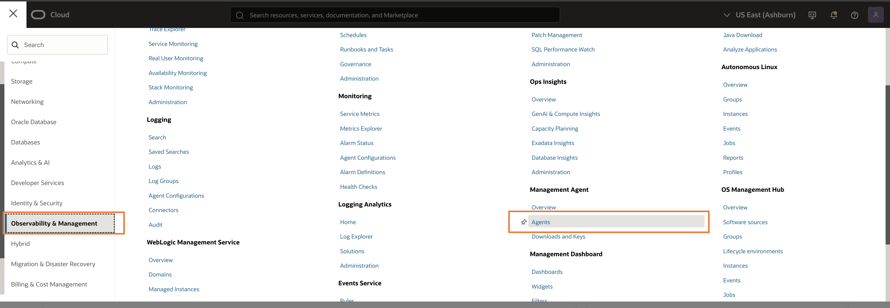

2. From the Agents list, look for the agent that was recently installed. This agent should be in the compartment created in [Lab 2](?lab=set-up-oci-for-jms). The Availability of the Agent should be Active.

  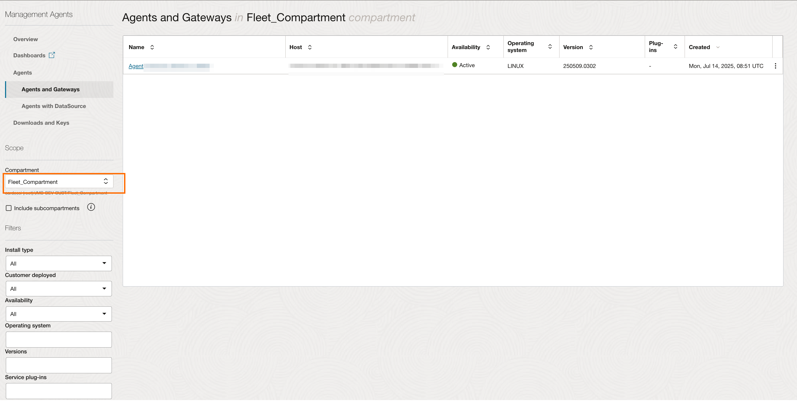

## Task 4: Verify JMS Plug-in Deployment

**On non-OCI Managed Instances:**

1. In your agent, click **Deploy plug-ins**.

  

2. The **Java Management Service** plug-in should be checked.

  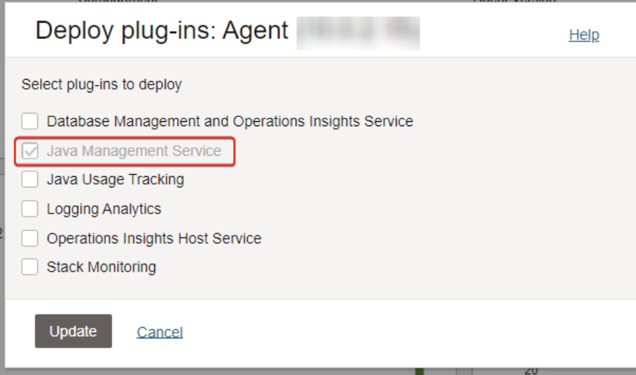

**On OCI Oracle Linux Managed Instances:**

1. Return to the Compute Instance page.

  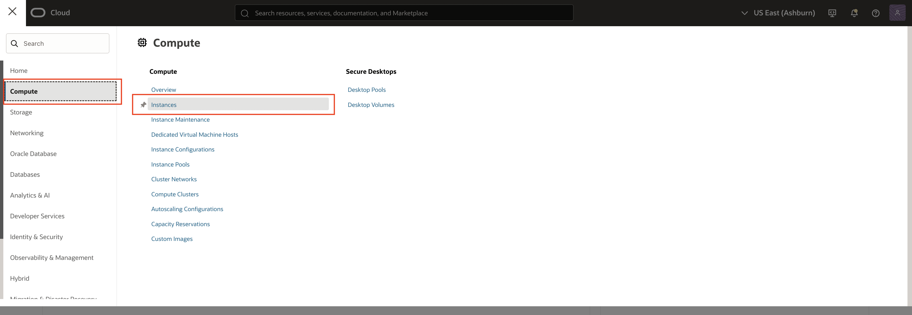

2. Select your instance, click the **Management** tab , then scroll down to the **Oracle Cloud Agent section**.

  

3. The status of **Oracle Java Management Service** plug-in should be **Running**.

  

## Task 5: Verify the successful association of Managed Instance to your fleet

1. Navigate to the fleet that you have created in [Lab 3](?lab=setup-a-fleet), and click on the inventory log object.


2. Inside the Fleet Inventory log page under the Explore Log section, you should see a new log entry **jms.agent.plugin.start.log** which has been emitted from your newly associated Managed Instance to your Fleet Inventory log.

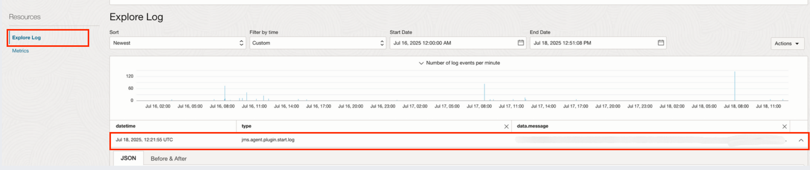

## Task 6: Verify detection of Java applications and runtimes

For application logging to be visible, re-run Java application after Management Agent installation. The Management Agent can detect new Java applications that are executed in your compute instance. You can observe this in the Oracle Cloud Console.

We shall demonstrate the detection of the Java compiler and HelloWorld application created in [Lab 4](?lab=create-a-java-application).

1. First, compile the HelloWorld.java file:

     ```
     <copy>
     javac HelloWorld.java
     </copy>
     ```

   Second, run the following command to create a HelloWorld jar file:

     ```
     <copy>
     jar -cfe HelloWorld.jar HelloWorld HelloWorld.class
     </copy>
     ```

   Third, create a new directory by entering this command:
     ```
     <copy>
     sudo mkdir introduction
     </copy>
     ```

   Fourth, enter this command to copy the HelloWorld.jar file into the introduction sub-directory:
     ```
     <copy>
     sudo cp HelloWorld.jar introduction
     </copy>
     ```

   Lastly, execute the HelloWorld applications in these two paths by running the following commands:
     ```
     <copy>
     java -jar ./HelloWorld.jar
     java -jar ./introduction/HelloWorld.jar
     </copy>
     ```

   This ensures the same name Java application is installed and deployed in two different paths for detection by JMS.

2. In the Oracle Cloud Console, open the navigation menu, click **Observability & Management**, and then click **Fleets** under **Java Management**.

  

3. Select the compartment that the fleet is in and click the fleet.

4. Click **Java Runtimes** in the navigation.

  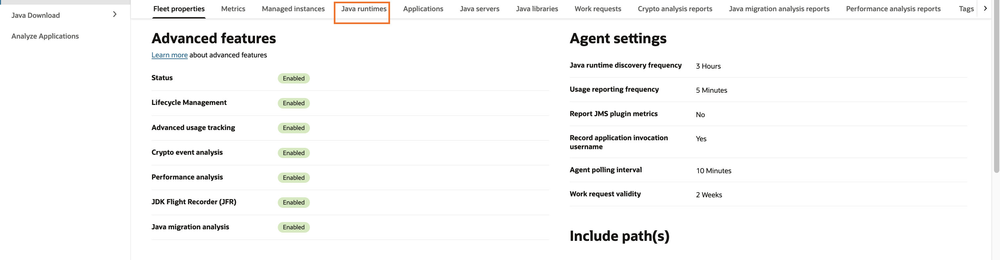

   You should now see Java runtimes belonging to your Managed Instances showing up in the Java runtimes table.
    
5. Click **Applications** in the navigation.

  

  You should now see two new applications. The first is from the HelloWorld application and the second is from the javac compiler command.

  

6. Click on the HelloWorld application to view its details. Click on **Application installations** to see the two paths where the HelloWorld application is installed, which will be displayed under **Application installation path**.

  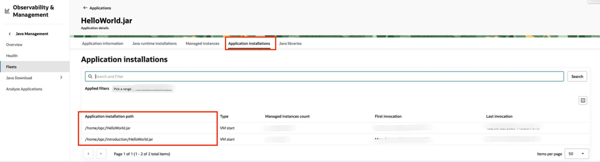

7. The application installation path can also be viewed under Fleet management by clicking **Managed Instances** in the navigation menu.

    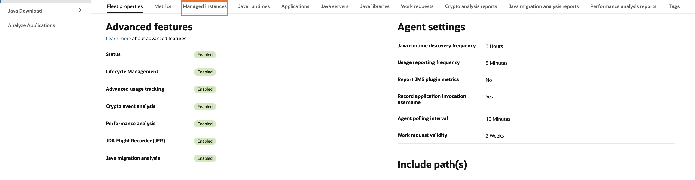

    Select your instance and then click on **Applications**.

    

    You may now **proceed to the next lab.**

## Learn More

- Refer to the [Management Agent Concepts](https://docs.oracle.com/en-us/iaas/management-agents/doc/you-begin.html) and [Installation of Management Agents](https://docs.oracle.com/en-us/iaas/management-agents/doc/install-management-agent-chapter.html) sections of the JMS documentation for more details.

- Use the [Troubleshooting](https://docs.oracle.com/en-us/iaas/jms/doc/troubleshooting.html#GUID-2D613C72-10F3-4905-A306-4F2673FB1CD3) chapter for explanations on how to diagnose and resolve common problems encountered when installing or using Java Management Service.

* If the problem still persists or it is not listed, then refer to the [Getting Help and Contacting Support](https://docs.oracle.com/en-us/iaas/Content/GSG/Tasks/contactingsupport.htm) section. You can also open a support service request using the **Help** menu in the OCI console.


## Acknowledgements

- **Author** - Esther Neoh, Java Management Service
* **Last Updated By** - El Maalmi Ayoub , Jul 2025
