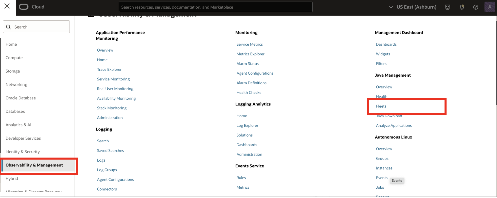
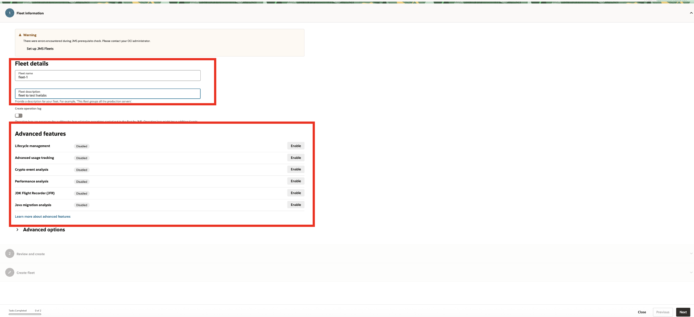
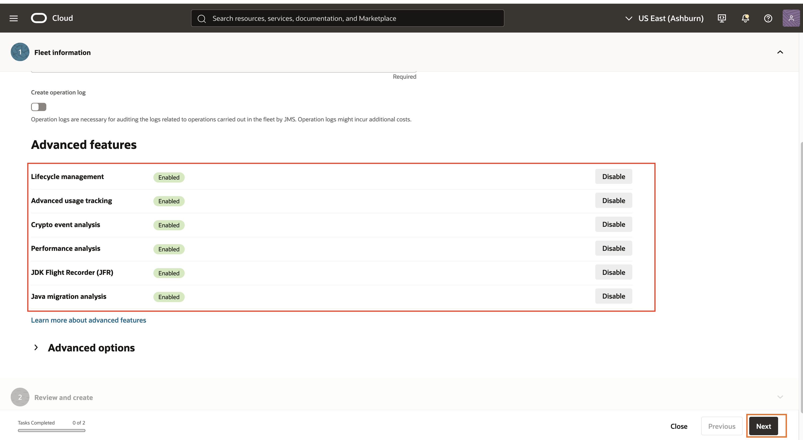
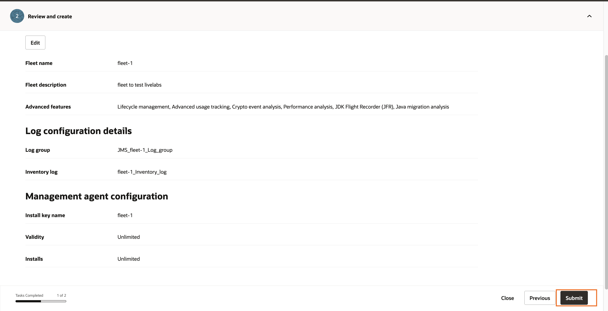
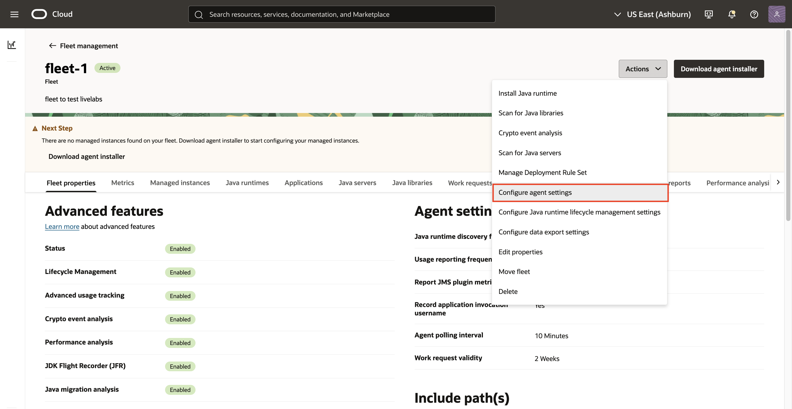
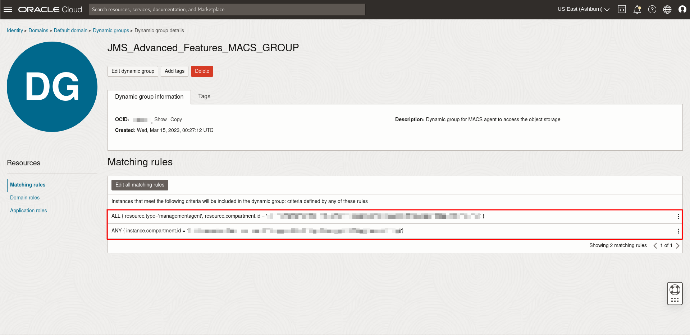
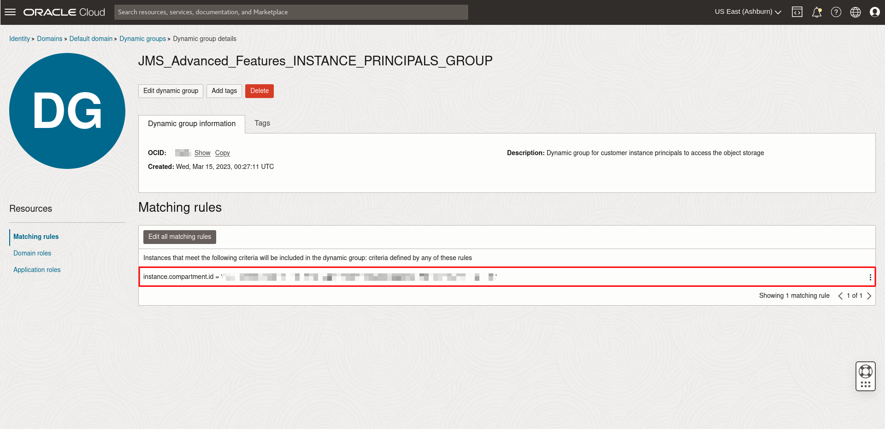
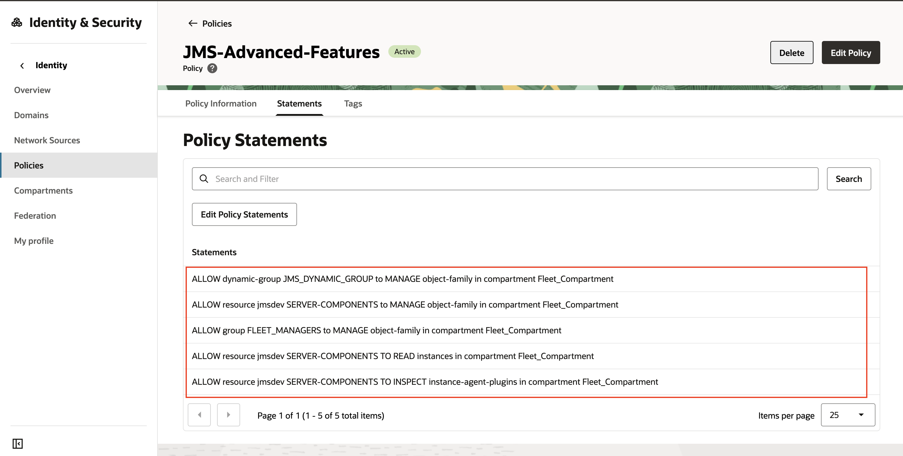

# Set up a Fleet

## Introduction

This lab walks you through the steps to set up a new fleet in Java Management Service (JMS).

Estimated Time: 5 minutes

### Objectives

In this lab, you will:

* Set up a Fleet using the Java Management Service user interface
* Download the installation script to be used in [Lab 5: Install Management Agent on your Managed Instances](?lab=set-up-of-management-agent)

### Prerequisites

* You have signed up for an account with Oracle Cloud Infrastructure and have received your sign-in credentials.
* You are using an Oracle Linux image on your Managed Instance for this workshop.

## Task 1: Set Up Java Management Service Fleet

1. In the Oracle Cloud Console, open the navigation menu, click **Observability & Management**, and then click **Fleets** under **Java Management**.

  

2. Select the compartment created for JMS resources in Lab 1 (Compartment name should be **Fleet_Compartment**) and **Create Fleet**.

  

3. In the Create Fleet dialog box, enter a name for the Fleet Name (for example, `fleet_1`), and a description.

4. Select **Enable all advanced features**.

  

  Click **Agree**. This is to enable all the advanced features. You can still edit it after the fleet is created.

  

  There are 4 different advanced features available:
     * Lifecycle management (LCM) - Manage the lifecycle of Java runtimes in your fleet by installing or removing reported Java runtime.
     * Advanced usage tracking - Gain advanced insights into your Java workloads in the fleet by tracking application server, Oracle JDK and openJDK used by applications.
     * Crypto event analysis - Assess the impact of Oracle JRE and JDK Cryptographic roadmap on the applications running in your fleet.
     * Java Flight Recorder (JFR) - Collect information about events in the application running in your fleet using Java Flight Recorder (JFR), a tool for collecting diagnostic and profiling data about a running Java application.


  To learn more about the advanced features, see [Using Java Management Service Advanced Features](https://apexapps.oracle.com/pls/apex/dbpm/r/livelabs/view-workshop?wid=3202).

  

5. Click **Next**. You are prompted to review the fleet information and management agent configuration. If you wish to modify your choices, click **Previous**.

6. Click **Create**. This creates a new fleet and its configuration.

  

7. Click **Download software and installation script**.

  

  Select an appropriate version of the management agent software according to the operating system on your instance(s).

  Select an appropriate version of the installation script according to the operating system on your instance(s).

  

  Click **Close** and **Done** once the download is complete. The downloaded file will be used in [Lab 5: Install Management Agent on your Managed Instances](?lab=set-up-of-management-agent) to install the Management Agent. You can still download the installation script after the fleet is created.

  

8. After JMS is linked to the management agent, it will collect information on your Java runtimes. As the management agent scans the instance periodically, the information may not appear immediately. The scanning frequency can be changed here.

9. Click the fleet. In the detail page, click **Modify Agent Settings**.

  

10. Change the **Java Runtime Usage**, **Agent Polling Interval**, **Work Request Validity** and  **Java Runtime Discovery** to the desired value. 

    **Java Runtime Usage**: How frequent agents reports Java usage. 

    **Agent Polling Interval**: How frequent which agents check for work request to execute
 
    **Work Request Validity**: The time period for accepting the work request by the agents involved.

    **Java Runtime Discovery**: How frequent agents scan for Java installation.


For this example, change **Java Runtime Discovery** to **3 hours**, and **Java Runtime Usage** to **5 minutes**.

  

11. Click **Save changes** to save the new setting.

  

You may now **proceed to the next lab**.

## Task 2: Verifying policies and Dynamic Groups required for advanced features
1. This task will verify the creation of the policies and Dynamic Groups required for the advanced features when advanced features was enabled during the fleet creation.

2. In the Oracle Cloud Console, open the navigation menu, click **Identity & Security**. Under **Identity**, select **Dynamic Groups**

  

3. There will be 2 additional dynamic groups created. 
    * **JMS\_Advanced\_Features\_MACS_GROUP** with 2 Matching Rules
    * **JMS\_Advance\_Features\_INSTANCE_PRINCIPALS\_GROUP** with 1 Matching Rule

   

   

   

4. Back on the Dynamic Groups page, click on **Policies** from the Identity menu on the left

  

5. Select the compartment where the fleet was created in Task 1 (Compartment name should be **Fleet_Compartment**). You should see the policy name **JMS-Advanced-Features**. Click on the policy name **JMS-Advanced-Features**.

  

6. The **JMS-Advanced-Features** policy contains 3 policy statements.

    ```
    ALLOW dynamic-group JMS_Advanced_Features_INSTANCE_PRINCIPALS_GROUP to MANAGE object-family in compartment Fleet_Compartment
    ALLOW dynamic-group JMS_Advanced_Features_MACS_GROUP to MANAGE objects in compartment Fleet_Compartment
    ALLOW service javamanagementservice to MANAGE object-family in compartment Fleet_Compartment
    ```

    

## Learn More

* Refer to the [Fleet Management](https://docs.oracle.com/en-us/iaas/jms/doc/fleet-management.html) section of the JMS documentation for more details.

* Use the [Troubleshooting](https://docs.oracle.com/en-us/iaas/jms/doc/troubleshooting.html#GUID-2D613C72-10F3-4905-A306-4F2673FB1CD3) chapter for explanations on how to diagnose and resolve common problems encountered when installing or using Java Management Service.

* If the problem still persists or it is not listed, then refer to the [Getting Help and Contacting Support](https://docs.oracle.com/en-us/iaas/Content/GSG/Tasks/contactingsupport.htm) section. You can also open a support service request using the **Help** menu in the OCI console.


## Acknowledgements

* **Author** - Esther Neoh, Java Management Service
* **Last Updated By** - Bao Jin Lee, November 2022
