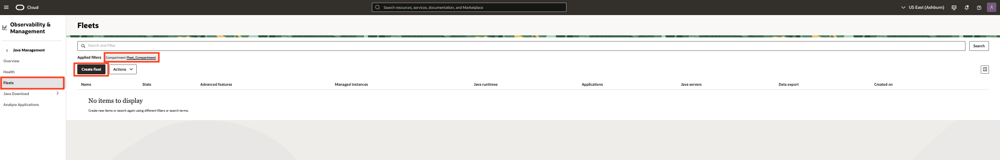
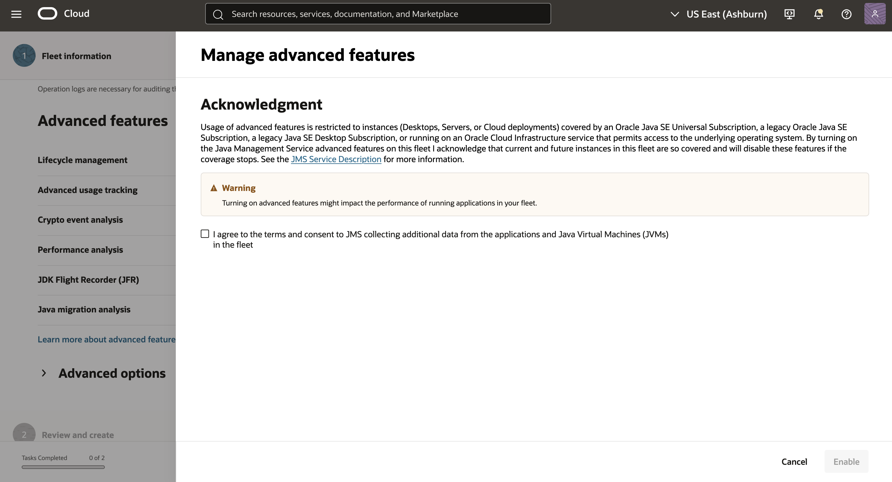
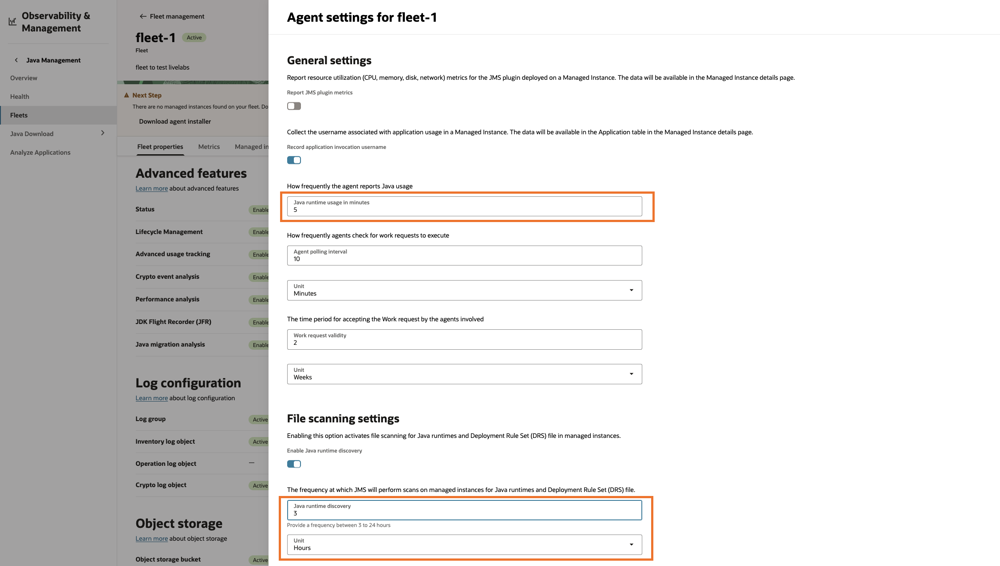
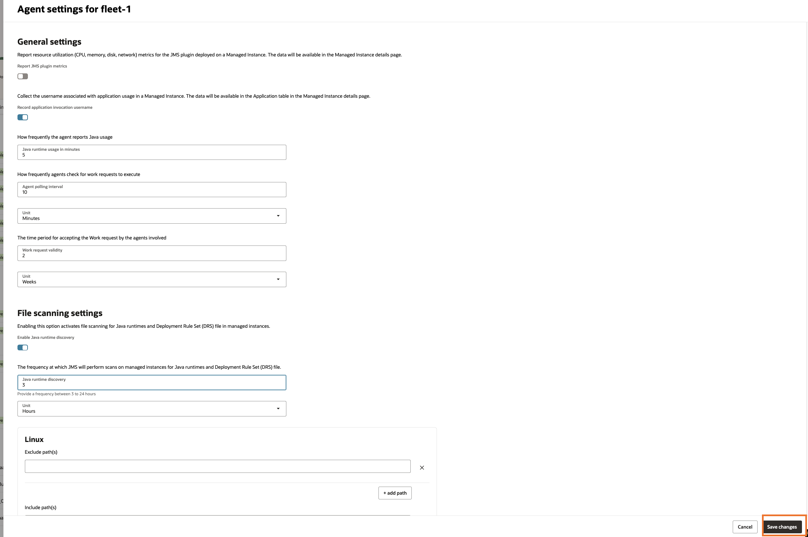
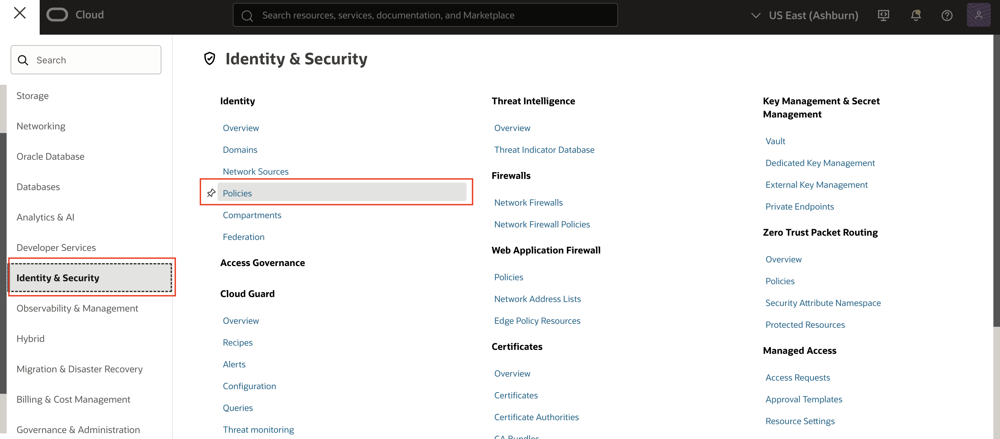
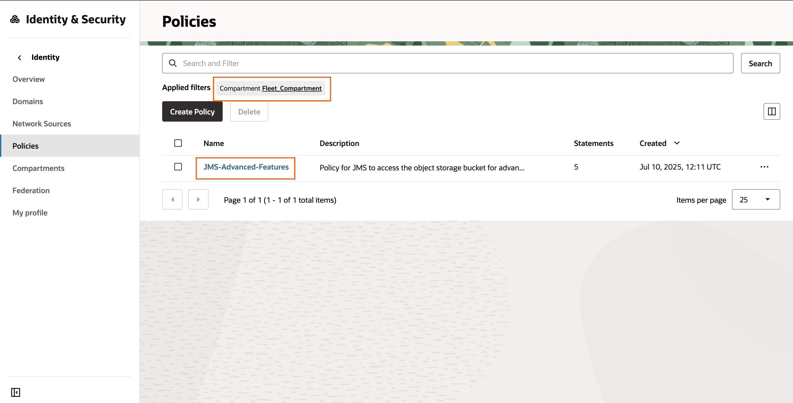
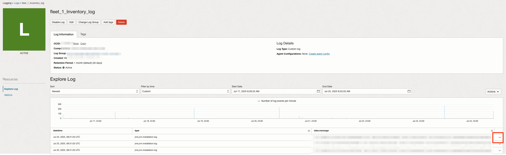
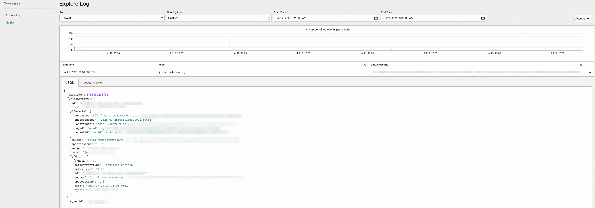

# Set up a Fleet

## Introduction

This lab walks you through the steps to set up a new fleet in Java Management Service (JMS).

Estimated Time: 5 minutes

### Objectives

In this lab, you will:

* Set up a Fleet using the Java Management Service user interface
* Download the installation script to be used in [Lab 6: Install Management Agent on your Managed Instances](?lab=set-up-of-management-agent)

### Prerequisites

* You have signed up for an account with Oracle Cloud Infrastructure and have received your sign-in credentials.
* You are using an Oracle Linux image on your Managed Instance for this workshop.

## Task 1: Set Up Java Management Service Fleet

1. In the Oracle Cloud Console, open the navigation menu, click **Observability & Management**, and then click **Fleets** under **Java Management**.

    

2. Select the compartment created for JMS resources in Lab 2 (Compartment name should be **Fleet_Compartment**) and **Create fleet**.

    

3. In the Create fleet dialog box, enter a name for the Fleet Name (for example, `fleet-1`), and a description.

4. Click **Enable** for each advanced feature.

    

    A side panel with acknowledgement should appear. Click the checkbox if you agree to the terms and a subsequent section regarding advanced features resources should appear below. You can leave this checkbox unchecked to let JMS create the resources for you.

    Once done, click **Enable**

   

    There are 6 different advanced features available:
     * Lifecycle management (LCM) - Manage the lifecycle of Java runtimes in your fleet by installing or removing reported Java runtime.
     * Advanced usage tracking - Gain advanced insights into your Java workloads in the fleet by tracking application server, Oracle JDK and openJDK used by applications.
     * Crypto event analysis - Assess the impact of Oracle JRE and JDK Cryptographic roadmap on the applications running in your fleet.
     * Performance analysis - Evaluates applications and provides customized recommendations to improve performance.
     * JDK Flight Recorder (JFR) - Collect information about events in the application running in your fleet using JDK Flight Recorder (JFR), a tool for collecting diagnostic and profiling data about a running Java application.
     * Java migration analysis - Assists in migrating applications from older JDK versions to newer JDK version by providing a detailed analysis that helps to assess the potential efforts and risks of migration.


    To learn more about the advanced features, see [Use Java Management Service Advanced Features](https://livelabs.oracle.com/pls/apex/dbpm/r/livelabs/view-workshop?wid=3202).

    

5. Click **Next**. You are prompted to review the fleet information and management agent configuration. If you want to modify your choices, click **Previous**.

6. Click **Submit**. This creates a new fleet and its configuration.

    

7. Click **Close** once the fleet is set up.

    

8. After JMS is linked to the management agent, it will collect information on your Java runtimes. As the management agent scans the instance periodically, the information may not appear immediately. The scanning frequency can be changed here.

9. Click the fleet. In the detail page, click **Configure agent settings**.

    

10. Change the **Java Runtime Usage**, **Agent Polling Interval**, **Work Request Validity** and  **Java Runtime Discovery** to the desired value.

    **Java runtime usage in minutes**: specify the frequency at which the management agent must report Java usage to JMS. The values must be between 5 and 90 minutes. The default value is 60 minutes.

    **Agent polling interval**: specify the frequency at which the management agent must check the work requests. For example, if the value specified is 10 minutes, the agent checks the work requests every 10 minutes and executes them. The values must be between 10 minutes and 12 hours. The default value is 10 minutes.

    **Work request validity**: specify the time for JMS to store the work requests. The values must be between 7 to 30 days. The default value is 2 weeks.

    **Java runtime discovery**: specify frequency at which the management agents should scan their hosts for Java runtime installations. The values must be between 3 to 24 hours. The default value is 24 hours.

    For this example, change **Java Runtime Usage** to **5 minutes**, and **Java Runtime Discovery** to **3 hours**

    

11. Click **Save changes** to save the new setting.

    

## Task 2: Verifying policies required for advanced features

1. This task will verify the creation of the policies required for the advanced features when advanced features was enabled during the fleet creation.

2. Navigate to the policies page.
    * In the Oracle Cloud Console, open the navigation menu and click **Identity & Security**. Under **Identity**, click **Policies**.
        

3. Select the compartment where the fleet was created in Task 1 (Compartment name should be **Fleet_Compartment**). You should see the policy name **JMS-Advanced-Features**. Click on the policy name **JMS-Advanced-Features**.

    

4. The **JMS-Advanced-Features** policy contains 5 policy statements.

    ```
    <copy>
    ALLOW dynamic-group JMS_DYNAMIC_GROUP to MANAGE object-family in compartment Fleet_Compartment
    ALLOW resource jms SERVER-COMPONENTS to MANAGE object-family in compartment Fleet_Compartment
    ALLOW group FLEET_MANAGERS to MANAGE object-family in compartment Fleet_Compartment
    ALLOW resource jms SERVER-COMPONENTS TO READ instances in compartment Fleet_Compartment
    ALLOW resource jms SERVER-COMPONENTS TO INSPECT instance-agent-plugins in compartment Fleet_Compartment
    </copy>
    ```

    

## Task 3: Understanding the Oracle Cloud Infrastructure Services which Java Management Service leverages on

JMS uses the following OCI services to generate logs, object storage information and fleet metrics for users to view:

1. Logging Service

    - These logs are event logs contributed by Java Management Service and by the service plugins deployed on the management agent of the host machine.

    - All log objects belong to the fleet log group.

    - Each log object has its own category of logs, for example, Inventory log contains the logs of Java installation scanning in the Managed Instance.

    - Note that the inventory logs are essential for fleet creation.

    To access the fleet logs, click the respective log object displayed on the fleet main page. For this demonstration, we will proceed with selecting the **Inventory log object**.

    

    You can view the logs as we proceed with subsequent labs.

    To view the logs in detail, click on the drop-down arrow.

    

    An example of a log event:

    

    - See [Logging in JMS](https://docs.oracle.com/en-us/iaas/jms/doc/appendix.html#GUID-559AECF8-4FAD-45CC-AE3B-69CA0DC9BDDD) to learn more details about the logs managed by JMS.

2. Object Storage Service

    - This is required for some of the advanced features of JMS and will be explained in the next workshop: [Use Java Management Service Advanced Features](https://livelabs.oracle.com/pls/apex/dbpm/r/livelabs/view-workshop?wid=3202)

3. **Monitoring Service**

    - This service processes the information generated by JMS and displays it as graphs showing Managed Instances, Java runtimes, and applications.

    - You can create custom alarms for notifications based on these metrics.

    Click **Metrics** in the navigation menu to view the fleet metrics on the fleet overview page.

    

    - See [Java Management Metrics](https://docs.oracle.com/en-us/iaas/jms/doc/appendix.html#GUID-E7908768-AE97-4BB9-85CB-17A1BD87A271) to learn more about metrics in JMS.


You may now **proceed to the next lab**.


## Troubleshoot fleet creation issues

If you encounter any errors similar to the following, check policy statements in your root compartment:

**For Task 1 Step 6: Create fleet**

  

    ```
    <copy>
    ALLOW GROUP <user_group> TO MANAGE fleet IN COMPARTMENT Fleet_Compartment
    ALLOW GROUP <user_group> TO MANAGE management-agents IN COMPARTMENT Fleet_Compartment
    ALLOW GROUP <user_group> TO READ METRICS IN COMPARTMENT Fleet_Compartment
    ALLOW GROUP <user_group> TO MANAGE instance-family IN COMPARTMENT <instance_compartment>
    ALLOW GROUP <user_group> TO READ instance-agent-plugins IN COMPARTMENT <instance_compartment>
    ALLOW GROUP <user_group> TO MANAGE management-agent-install-keys IN COMPARTMENT Fleet_Compartment
    ALLOW GROUP <user_group> TO MANAGE log-groups IN COMPARTMENT Fleet_Compartment
    ALLOW GROUP <user_group> TO MANAGE log-content IN COMPARTMENT Fleet_Compartment
    ALLOW GROUP <user_group> TO MANAGE jms-plugins IN COMPARTMENT Fleet_Compartment
    </copy>
    ```

**Fleet state failed**

  

    ```
    <copy>
    ALLOW resource jms server-components TO MANAGE log-groups IN COMPARTMENT <compartment_name>
    ALLOW resource jms server-components TO MANAGE log-content IN COMPARTMENT <compartment_name>
    ALLOW resource jms server-components TO USE management-agent-install-keys IN COMPARTMENT <compartment_name>
    ALLOW resource jms server-components TO MANAGE metrics IN COMPARTMENT <compartment_name> WHERE target.metrics.namespace='java_management_service'
    ALLOW resource jms server-components TO READ instances IN tenancy
    ALLOW resource jms server-components TO INSPECT instance-agent-plugins IN tenancy
    </copy>
    ```

## Learn More

* Refer to the [Fleet Management](https://docs.oracle.com/en-us/iaas/jms/doc/overview-java-management-service.html#GUID-836D680E-5577-45A0-81C0-C71BECD38F3F) section of the JMS documentation for more details.

* Use the [Troubleshooting](https://docs.oracle.com/en-us/iaas/jms/doc/troubleshooting.html#GUID-2D613C72-10F3-4905-A306-4F2673FB1CD3) chapter for explanations on how to diagnose and resolve common problems encountered when installing or using Java Management Service.

* If the problem still persists or it is not listed, then refer to the [Getting Help and Contacting Support](https://docs.oracle.com/en-us/iaas/Content/GSG/Tasks/contactingsupport.htm) section. You can also open a support service request using the **Help** menu in the OCI console.


## Acknowledgements

* **Author** - Esther Neoh, Java Management Service
* **Last Updated By** - El Maalmi Ayoub , Jul 2025
