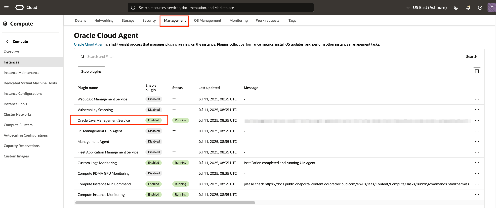
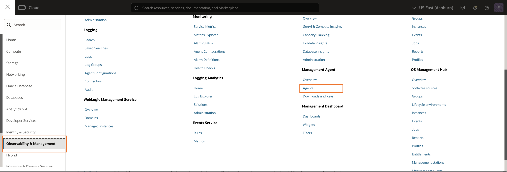
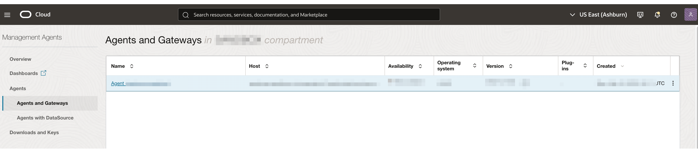

# Understand concepts related to Oracle Management Agent installation

## Introduction

This lab walks you through the key concepts to understand before installing a management agent on your Managed instance. This is part of the Java Management Service (JMS) setup on Oracle Cloud Infrastructure (OCI).

This lab is only for users to understand the concepts, not to configure the actual settings.

Estimated Time: 15 minutes

### Objectives

In this lab, you will:

- Understand important concepts in preparation for installation of Oracle Management Agents on a host (also known as a Managed Instance in JMS). A Managed Instance can be any computer running in your enterprise. In most cases, the Managed Instance is a computer on your premises, but it can be a compute instance on OCI or on any other cloud platform.

### Prerequisites
- You have signed up for an account with Oracle Cloud Infrastructure and have received your sign-in credentials.
- You are using an Oracle Linux image or Windows OS on your Managed Instance for this workshop.
- Access to the cloud environment and resources configured in [Lab 2](?lab=set-up-oci-for-jms).

## Task 1: Understand Concepts related to Management Agent installation

Before the set up of the Oracle Management Agent, it is important to understand the concepts behind the Java Management Service:

- **Java Management Service (JMS)**: A reporting and management infrastructure integrated with Oracle Cloud Infrastructure Platform services to observe and manage your use of Java SE (on-premises or in the Cloud) in your enterprise.

- **Oracle Management Agent (OMA)**: Oracle Management Agent is installed on a host. It allows the JMS plug-ins to monitor and collect data from the sources that reside on hosts or virtual hosts. OMA is typically provided for non-OCI hosts.

- **Oracle Cloud Agent (OCA)**: An Oracle Cloud Agent is a lightweight process that manages plug-ins running on a compute instance. Its plug-ins collect performance metrics, install OS updates, and perform other instance management tasks. An example plug-in is a JMS Plug-in. OCA is usually provided for OCI hosts.

- **JMS Plug-In**: Java Management Service (JMS) plug-in allows JMS to interact with hosts and send the data back to the cloud service. JMS plug-ins are provided by Oracle Management Agent and Oracle Cloud Agent for OCI Compute Instances.
Deploy JMS plug-ins on:

    * **Oracle Cloud Agent**: to monitor OCI Oracle Linux compute instances that are in the same tenancy and region

    * **Oracle Management Agent**: to monitor all other hosts

  A host that contain deployed JMS plug-ins is a Managed Instance.

- **Managed Instance**: A Managed Instance is a host that contain deployed JMS plug-ins. Hosts can be any computer running in your enterprise, either on premise or in the cloud. A managed instance has a unique identity that's used by JMS to distinguish it from other managed instances and can only be part of a single Fleet at any given time.

- **Java Usage Tracker**: JMS relies on Java Usage Tracker to report Java usage. Using the Java Usage Tracker, you can monitor Oracle Java Runtime Environment usage and capture information such as the JRE version, vendor, applications running, and other details.

## Task 2: OCI Compute Console For OCI Hosts

For Oracle Linux OCI hosts, JMS is deployed by Oracle Cloud Agent. Upon successful deployment (to be covered in Lab 6 Task 1), you should see **Oracle Java Management Service** being toggled on under the the Oracle Cloud Agent tab in your compute instance detail page.

> Note: While Oracle Cloud Agent(OCA) is available for other OSes on OCI, JMS deployment via OCA is only available for Oracle Linux at this juncture.

## Task 3: Management Agent Console For non-OCI Hosts

For non-OCI hosts, JMS is deployed by Oracle Management Agent. Upon successful deployment (to be covered in Lab 6 Task 2), your Agent should show up under the Management Agent Service Page.

- To access Management Agent service, open the navigation menu and click Observability & Management. Under Management Agent, click Agents

- You should see your agents showing up under the Agents and Gateways page.

- Click into your Agent, then click on the **Deploy plug-ins** button. You should see that **Java Management Service** plugin has been checked and greyed out

You may now **proceed to the next lab.**

## Learn More

* Refer to the [Management Agent Concepts](https://docs.oracle.com/en-us/iaas/management-agents/doc/you-begin.html),
  [JMS Plug-in](https://docs.oracle.com/en-us/iaas/jms/doc/management-agent.html#AJSUG-GUID-7BC69124-4807-4D79-B89B-2605D7EE9E71) and [Installation of Management Agents](https://docs.oracle.com/en-us/iaas/management-agents/doc/install-management-agent-chapter.html) sections of the JMS documentation for more details.

* Use the [Troubleshooting](https://docs.oracle.com/en-us/iaas/jms/doc/troubleshooting.html#GUID-2D613C72-10F3-4905-A306-4F2673FB1CD3) chapter for explanations on how to diagnose and resolve common problems encountered when installing or using Java Management Service.

* If the problem still persists or it is not listed, then refer to the [Getting Help and Contacting Support](https://docs.oracle.com/en-us/iaas/Content/GSG/Tasks/contactingsupport.htm) section. You can also open a support service request using the **Help** menu in the OCI console.

## Acknowledgements

* **Author** - Xin Yi Tay, Java Management Service
* **Last Updated By** - El Maalmi Ayoub, Jul 2025