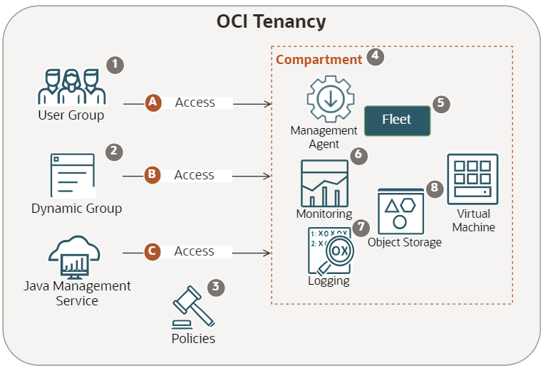

# Understand concepts related to Oracle Cloud Infrastructure Resources and Services for Java Management Service

## Introduction

This lab walks you through key concepts that need to be understood before setting up your Oracle Cloud Infrastructure (OCI) environment for Java Management Service (JMS).

Estimated Time: 30 minutes

### Objectives

In this lab, you will:

- Learn about the important concepts regarding OCI resources in preparation for setting up the OCI environment for JMS to operate. These OCI resources include compartment, user group, dynamic group, policies and fleet.
- Understand the relationships between these OCI resources and services, including Logging, Monitoring and Object Storage, and how JMS leverages these relationships to allow you to observe and manage Java SE usage in your enterprise.

## Task 1: Understand concepts related to Oracle Cloud Infrastructure Resources and Services for Java Management Service

Learn about Oracle Cloud Infrastructure (OCI) resources and services, and how Java Management Service (JMS) uses them to operate.

This diagram illustrates the purpose of OCI resources and services in JMS with details of each resource and service explained below:



1. User Group:

    - See [Managing Groups](https://docs.oracle.com/en-us/iaas/Content/Identity/groups/managinggroups.htm) for its definition and details.
    - Permissions to use and manage JMS related resources (such as creating a fleet) are controlled by applying policies (see polices below) to a user group (for example, "FLEET_MANAGERS" group).

2. Dynamic Group:

    - See [Managing Dynamic Groups](https://docs.oracle.com/en-us/iaas/Content/Identity/dynamicgroups/managingdynamicgroups.htm) for its definition and details.
    - The creation of a dynamic group is important as it allows for policies to be applied to a group of compute instances and management agents. This grants your managed instances (comprising of compute instances and management agents) the appropriate permissions to interact with the fleet through OCI service endpoints.
    
        Example: Dynamic group "JMS\_DYNAMIC\_GROUP":
        ```
        <copy>
        ALL {resource.type='managementagent', resource.compartment.id='<fleet_compartment_ocid>'}
        ANY {instance.compartment.id = '<fleet_compartment_ocid>'}
        </copy>
        ```

3. Policies:

    - See [How Policies Work](https://docs.oracle.com/en-us/iaas/Content/Identity/policieshow/how-policies-work.htm) for its definition and details.
    - To enable basic features, policies are applied to three categories:

        A. User group "FLEET\_MANAGERS":

        The policy statements below allow users in this user group to work with JMS such as creating a fleet, reading information about fleet and installing management agent on the instance.

        ```
        <copy>
        ALLOW GROUP FLEET_MANAGERS TO MANAGE fleet IN COMPARTMENT Fleet_Compartment
        ALLOW GROUP FLEET_MANAGERS TO MANAGE management-agents IN COMPARTMENT Fleet_Compartment
        ALLOW GROUP FLEET_MANAGERS TO READ METRICS IN COMPARTMENT Fleet_Compartment
        ALLOW GROUP FLEET_MANAGERS TO MANAGE instance-family IN COMPARTMENT <instance_compartment>
        ALLOW GROUP FLEET_MANAGERS TO READ instance-agent-plugins IN COMPARTMENT <instance_compartment>
        ALLOW GROUP FLEET_MANAGERS TO MANAGE management-agent-install-keys IN COMPARTMENT Fleet_Compartment
        ALLOW GROUP FLEET_MANAGERS TO MANAGE log-groups IN COMPARTMENT Fleet_Compartment
        ALLOW GROUP FLEET_MANAGERS TO MANAGE log-content IN COMPARTMENT Fleet_Compartment
        ALLOW GROUP FLEET_MANAGERS TO MANAGE jms-plugins IN COMPARTMENT Fleet_Compartment
        </copy>
        ```

        B. Dynamic group "JMS\_DYNAMIC\_GROUP":

        The policy statements below allow compute instances and management agents in this dynamic group to communicate information to OCI.

        ```
        <copy>
        ALLOW DYNAMIC-GROUP JMS_DYNAMIC_GROUP TO USE METRICS IN COMPARTMENT Fleet_Compartment
        ALLOW DYNAMIC-GROUP JMS_DYNAMIC_GROUP TO MANAGE management-agents IN COMPARTMENT Fleet_Compartment 
        ALLOW DYNAMIC-GROUP JMS_DYNAMIC_GROUP TO MANAGE log-content IN COMPARTMENT Fleet_Compartment
        ALLOW DYNAMIC-GROUP JMS_DYNAMIC_GROUP TO MANAGE instances IN COMPARTMENT <instance_compartment>
        ALLOW DYNAMIC-GROUP JMS_DYNAMIC_GROUP TO MANAGE metrics IN COMPARTMENT Fleet_Compartment WHERE target.metrics.namespace='java_management_service'
        ALLOW DYNAMIC-GROUP JMS_DYNAMIC_GROUP TO MANAGE jms-plugins IN COMPARTMENT Fleet_Compartment
        </copy>
        ```

        C. Resource "jms server-components":

        The policy statements below allow JMS to work with services including OCI Monitoring, OCI Logging in the fleet.

        ```
        <copy>
        ALLOW resource jms SERVER-COMPONENTS TO MANAGE metrics IN COMPARTMENT Fleet_Compartment WHERE target.metrics.namespace='java_management_service' 
        ALLOW resource jms SERVER-COMPONENTS TO USE management-agent-install-keys IN COMPARTMENT Fleet_Compartment
        ALLOW resource jms SERVER-COMPONENTS TO MANAGE log-groups IN COMPARTMENT Fleet_Compartment
        ALLOW resource jms SERVER-COMPONENTS TO MANAGE log-content IN COMPARTMENT Fleet_Compartment
        ALLOW resource jms SERVER-COMPONENTS TO READ instances IN COMPARTMENT <instance_compartment>
        ALLOW resource jms SERVER-COMPONENTS TO INSPECT instance-agent-plugins IN COMPARTMENT <instance_compartment>
        </copy>
        ```

    When advanced features are enabled during the fleet creation, additional dynamic groups and policies will be automatically created in OCI.
    This will be covered in [Lab 3 Task 2](?lab=setup-a-fleet#Task2:VerifyingpoliciesandDynamicGroupsrequiredforadvancedfeatures).

4. Compartment:

    - See [Managing Compartments](https://docs.oracle.com/en-us/iaas/Content/Identity/compartments/managingcompartments.htm) for its definition and details.

    - A compartment enables you to organize and control access to your cloud resources, such as a Fleet or a JMS Plug-in. A compartment should be thought of as a logical group and not as a physical container.

5. Fleet:

    - A fleet is the primary collection with which you interact when using JMS. It contains Managed Instances that share rules and policies. See [Managed Instance](https://docs.oracle.com/en-us/iaas/jms/doc/overview-java-management-service.html#GUID-141F2F39-8078-481A-ACE7-65792E314ABB) for the definition of a Managed Instance.

    - It is created in a compartment and contain information about the Managed Instances such as logs, object storage and metrics.

6. Logging service to generate logs
7. Object storage service to generate object storage information
8. Monitoring service to view fleet metrics

You will learn about these services in Lab 3 Task 3 after you setup the fleet.

You may now **proceed to the next lab.**

## Learn More

* Refer to the [Getting Started with Java Management Service](https://docs.oracle.com/en-us/iaas/jms/doc/getting-started-jms.html) for more details.

## Acknowledgements

- **Author** - Sherlin Yeo, Java Management Service
- **Last Updated By** - Ivan Eng, June 2023
