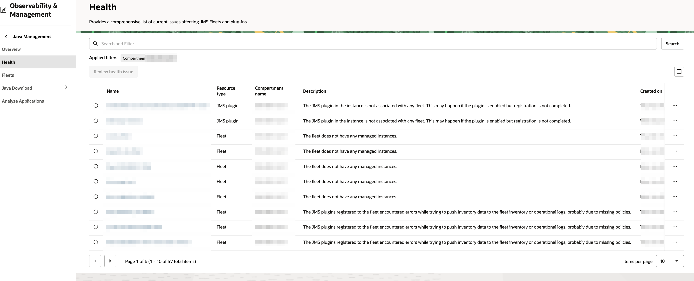
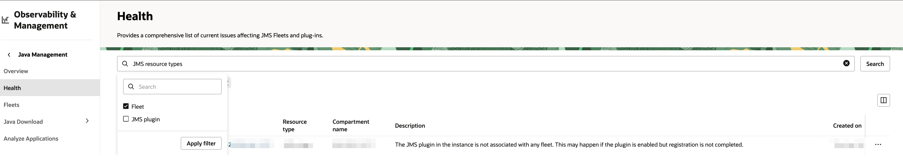
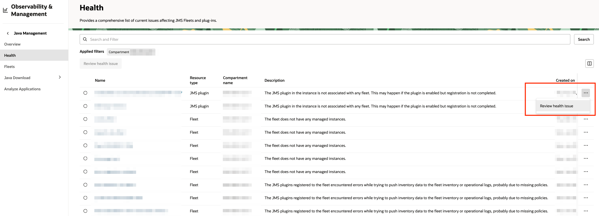

# Use JMS Resource Health

## Introduction  
This lab walks you through the steps to use Java Management Service (JMS) Resource Health to monitor the health of Java resources.

Estimated Time: 2 minutes 

### Objectives
In this lab, you will:
- Access the JMS Resource Health dashboard
- Troubleshoot common health issues

### Prerequisites

* You have signed up for an account with Oracle Cloud Infrastructure and have received your sign-in credentials.
* You are using an Oracle Linux image on your Managed Instance for this workshop.

## Task 1: View Resource Health

1. In the Oracle Cloud Console, open the navigation menu, click **Observability & Management**, and then click **Health** under **Java Management**.

    

2. Detailed information of the the resources with issues in the selected compartment will be displayed.

    

3. You can filter the displayed information based on resource type.

    

## Task 2: Troubleshoot the health issues

1. On the right side of the selected resource, click the action menu and select **Review health** issue option.

    

2. You can resolve the issue using one of the recommended options.

    

---

## Learn More

* Refer to the [JMS Resource Health](https://docs.oracle.com/en-us/iaas/jms/doc/resource-health.html) section of the JMS documentation for more details.

* If the problem still persists or it is not listed, then refer to the [Getting Help and Contacting Support](https://docs.oracle.com/en-us/iaas/Content/GSG/Tasks/contactingsupport.htm) section. You can also open a support service request using the **Help** menu in the OCI console.

## Acknowledgements

* **Author** - El Khaider Amine, Java Management Service
* **Last Updated By** - El Khaider Amine, March 2025
