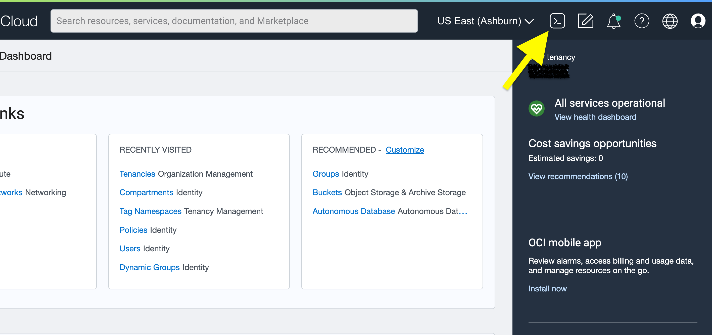

# Your workshop environment


## Introduction

You will use Java 19 on Oracle Cloud Infrastructure to perform this workshop. In theory, you can also do the workshop on your own machine with Java 19 installed but in the interest of time, it is easier to use OCI.


This lab introduces you to the workshop environement.

Estimated Time: ~10 minutes

### **Objectives**

In this lab, you will:
* Discover the OCI Cloud Shell and the OCI Cloud Editor.
* Do some minimal setup to prepare your environment.


## Task 1: Prepare your environment

You first need to find your OCI compartment. Click on the LiveLabs **View Login Info** link.


And take note of your compartment name.


You now need to select this compartment in the OCI Console so click on the **☁ Launch OCI** button.

The easiest way is to go to the **Instances Compute** page, either via the pinned link or by using the search facility. 


On the Instances Compute page, check the **Compartment** dropdown-list, and expand it until you see your own compartment. Select it in the dropdown list and that's it!


## Task 2: Cloud Shell


Cloud Shell is a browser-based terminal that provides an ephemeral Linux machine. Cloud Shell simplifies working with cloud resources on OCI. Under the hood, Cloud Shell uses an OCI pre-configured Virtual Machine with preinstalled tools, including Java. And as you will see in this workshop, Cloud Shell can also be used to develop simple applications.


To launch Cloud Shell, simply click on the Cloud Shell icon (see top right) in the [OCI console](https://cloud.oracle.com).

  

After 20~30 seconds, your Cloud Shell VM will be up and running, and your Cloud Shell terminal will be displayed in your browser.

  

You now can use Cloud Shell as a regular shell.


## Task 3: Add Java 19 support

This workshop uses Java 19 which was released in September 2022. And although Cloud Shell supports Java, it doesn't come yet with Java 19 support. You will now install Java 19. And don't worry, this is easy.

In Cloud Shell, enter the following command.

```text
<copy>source <(wget -qO- https://objectstorage.us-phoenix-1.oraclecloud.com/n/jpginfra/b/j12022-hol-bucket/o/download.sh)</copy>
```

Now you can launch the setup script.

```text
<copy>setup-ce.sh</copy>

```
This script will take roughly a minute to execute, it will download and configure Java 19, set environment variables, configure Cloud Editor Java 19 support, etc. You can check and confirm that Java 19 is now installed.

```text
> <copy>java -version</copy>
openjdk version "19" 2022-09-20
OpenJDK Runtime Environment (build 19+36-2238)
OpenJDK 64-Bit Server VM (build 19+36-2238, mixed mode, sharing)
```

## Task 4: Cloud Editor


During the workshop, you will also also use Cloud Editor, a Cloud Shell feature that offers a browser-based modern text editor.
To launch Cloud Editor, simply click, in the [OCI console](https://cloud.oracle.com), on the Cloud Editor icon next to the Cloud Shell icon.


After ~15 seconds, you will see Cloud Editor in your browser.


💡 Cloud Editor runs in the Cloud Shell VM but you don't have to start Cloud Shell prior to use Cloud Editor. If you don't, the Cloud Shell VM will automatically be started when Cloud Editor is launched. It is although required to perform Task 3 before launching Cloud Editor to have Java 19 properly set in Cloud Editor.

We suggest to perform the labs in a sepecifc directory. 

```text
<copy>mkdir ~/lab</copy>
```

And open this directory in Cloud Editor, **File**, **Open...** and select this new directory. Cloud Editor will restart and from now on, all new files will be created in that directory.


By default, Cloud Shell and Cloud Editor use a stacked layout.
You can adjust this layout to match your preferences by clicking on the top-left **View** option.


You can also re-size, maximize, minimize, swap, close the Cloud Shell and/or the Cloud Editor window, change fonts (check the **Gear** icon), etc.
We suggest spending 1 or 2 minutes getting familiar with both Cloud Shell and Cloud Editor.

💡 For the workshop, we suggest keeping both Cloud Shell and Cloud Editor open in the same window, and the workshop guide in a different browser window/tab.

💡 As mentioned earlier, Cloud Shell doesn't come yet with Java 19 support. For this workshop, Cloud Editor has been set up to support Java 19.


💡 Should you want to get at the end of this workshop a copy of the files you created, just use the Cloud Shell File Transfer feature to exchange files between your laptop and the Cloud Shell VM.

  


## Remark

In the interest of time and in the spirit of explaining how things work, the samples you will develop in these hands-on labs sometimes take a few shortcuts. For example, potential errors are not always handled properly, arguments are not always validated, etc. Those and other aspects such as security, synchronization, testing, etc. are important matters that should always be properly handled in any code that will go into production but that is not the focus of this lab. Today's goal is to give you, in a short amount of time, an overview of Project Panama and offer you some initial hands-on experiences with the Panama APIs and its tool.

Congratulations, you are now all set for the next step!

## Learn More


* [Cloud Shell](https://docs.oracle.com/en-us/iaas/Content/API/Concepts/cloudshellintro.htm) documentation
* [Code Editor](https://docs.oracle.com/en-us/iaas/Content/API/Concepts/code_editor_intro.htm) documentation


## Acknowledgements
* **Author** - [David Delabassée, DevRel, Java Platform Group - Oracle](https://twitter.com/delabassee)
* **Last Updated By/Date** - David Delabassée, Oct. 6 2022
