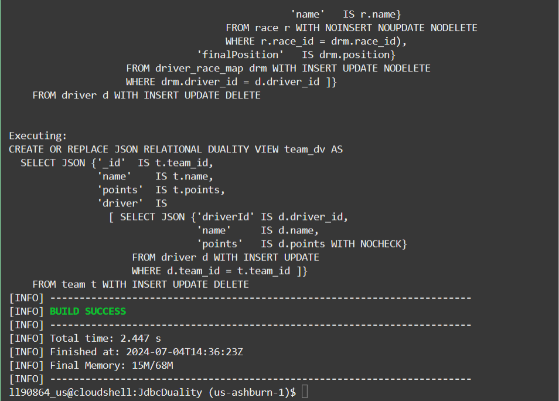
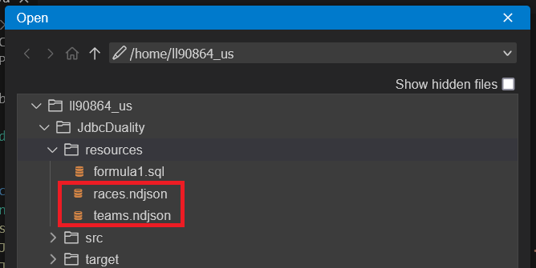

# Create the schema including JSON Duality Views

## Introduction

This lab walks you through the setup steps to create the user, tables, and JSON duality views needed to execute the rest of this workshop. Then you will populate the views and tables.

Estimated Time: 15 minutes

### Objectives

In this lab, you will:
* Login as your database user
* Create the JSON duality views and base tables needed
* Populate your database

### Prerequisites (Optional)

This lab assumes you have:
* Access to Oracle Cloud Infrastrucutre (OCI) console
* An Oracle Autonomous Database 23ai Free Tier or one running in a LiveLabs environment
* All previous labs successfully completed

<if type="livelabs">
Watch the video below for a quick walk-through of the lab. 
[Change password](videohub:1_lkkdkfj3)
</if>


## Task 1: Creating your database tables and JSON duality views

1. In Cloud Shell, go to the folder where the Java code is. This is the main project folder. All the commands must be executed from this folder.

    ```
    <copy>
    cd JdbcDuality
    </copy>
    ```
    

2. Get absolute path of your user home folder and use it to set the value of **TNS_ADMIN** variable as the absolute path of your wallet folder.

    ```
    <copy>
    pwd
    export TNS_ADMIN=/home/<livelabs_user>_us/Wallet_<ADB_NAME>
    </copy>
    ```
    

3. Open **Connections.java** in Code Editor to se the URL and password for your database instance.

    

4. Edit the URL and password fields to match your ADB instance **service name**, **wallet location**, and **hol23ai user password**.

    

5. Now, to actually execute a Java file. Open in Code Editor **CreateTablesAndViews.java**. We're going to create the necessary database objects to explore JSON Duality Views through Formula 1 racing data with this class.

    The full path to this file is `src/main/java/com/example/formula1/CreateTablesAndViews.java`, this can be seen in the breadcrumbs at the top of the Code Editor.

    

6. In the code, you can see the main class of the program is setting **formula1.sql** (resources/formula1.sql) as the file to read queries in from. This file contains the SQL commands that will create the necessary tables and views for this lab.

    The program reads in this file as input and breaks up the commands into individual queries. It will then execute each query within a try/catch block, so that errors will be printed in the console if they occur.

    

7. First, it will drop any of the listed tables and views if they exist. Then, it will create 4 base tables written in standard SQL. Those tables are:
    - team = representing F1 race teams
    - driver = the racecar drivers
    - race = all the races
    - driver\_race\_map = the positions each driver finished in for each race

    

8. Following that, the JSON relational duality views will be created from that same file. The syntax looks pretty different from creating a standard table. What it's doing is emulating JSON's hierarchal object structure with name/value pairs and nested arrays/objects. The 3 views created are:
    - race\_dv
    - driver\_dv
    - team\_dv

    

9. They each use data from the base tables to construct their views, but you can also directly insert, update, and delete onto these views as specified in the Create. 

    As each base table is specified in the view, it states things like `NOINSERT` or `UPDATE` or `NODELETE`. This will determine how underlying base tables can be modified by operations executed directly on the view. We will explore this throughout the lab.

    

10. Then following that, back in the Java file, it will create a trigger on the **driver\_race\_map** table to populate the points fields in team and driver based on race results.

    

11. Compile the Java application code and make sure there are no errors. Maven is the tool we will use to build and execute our Java project in Cloud Shell.

    ```
    <copy>
    mvn compile
    </copy>
    ```

    

12. This is the Maven command to excute **CreateTablesAndViews.java** file from our Java Application.

    ```
    <copy>
    mvn exec:java -Dexec.mainClass=com.example.formula1.CreateTablesAndViews
    </copy>
    ```
    

13. You may scroll through the output to see all the commands completed successfully.

    

14. SQL worksheet click **Refresh** button. New tables will appear in the Navigator list.

    


## Task 2: Populating the database

1. open **LoadData.java** file in Code Editor. 

    

2. In the main method, the program is connecting to the database and calling `loadJson` twice. Each time is to insert data from different JSON files into their respective duality views. The insert statements have bind variables to allow them to pass in different JSON documents without rewriting the statements.

    

3. Open **races.ndjson** and **teams.ndjson** in resources folder to look through the JSON to be inserted.

    

4. We are inserting a collection of team documents into `TEAM_DV`. This automatically populates the driver and team table as well as the driver collection. Additionally, we are inserting a collection of race documents into `RACE_DV`. This automatically populates the race table.

    

5. Run **LoadData.java** code with Maven. From the output, you can see we loaded the JSON documents without error.

    ```
    <copy>
    mvn exec:java -Dexec.mainClass=com.example.formula1.LoadData
    </copy>
    ```
    

6. Use SQL Worksheet to verify the data in your tables. Right-click the DRIVER table and click **Open**.

    

7. In **Data** tab you can see the records loaded into the table.

    


## Task 3: Examining data in the duality views
    
1. Now, we will look at the contents of `teams_dv` (the teams duality view). Open **ReadTeamsDv.java** in Code Editor.

    

2. You'll see that we provided you 3 different ways to list the contents of the duality views:
    - JSON text = The database represents the JSON as a binary format, but converts it into a text string in this method.
    - JSON API = This programmatic API allows you to not use strings. You can access the values in the JSON directly without having to convert to text strings, which can improve performance.
    - Java Objects = If you would prefer to not represent your data as a JSON object at all, you can return it as a Java object. In this case, you have the Team.java class. JSON-B can parse through each document the database returns and match each field to the different parameters of Team's constructor. 

    

3. **Team.java** can be accessed under com/example/formula1/model folder.

    

4. Run the file with Maven. Regardless of which method to access the data, you can see the `teams_dv` has been loaded with records now.

    ```
    <copy>
    mvn exec:java -Dexec.mainClass=com.example.formula1.ReadTeamsDv
    </copy>
    ```
    
    
    
5. We have also included classes to look at the contents of the `drivers_dv` and the `races_dv`. For simplicity, we will only be showing the data as JSON text strings from now on. First, please open **ReadRacesDv.java**. Run it with Maven. You will see that this view is populated now.

    

    ```
    <copy>
    mvn exec:java -Dexec.mainClass=com.example.formula1.ReadRacesDv
    </copy>
    ```
    

6. We want to emphasize that populating a duality view automatically updates data shown in related duality views by updating their underlying tables. 

    For example, in a previous step, documents were inserted into the `team_dv` duality view. This duality view joins the `team` table with the `driver` table, and so on insert into this duality view, both the `team` table as well as the `driver` table are populated. 
    
    So if you now list the contents of the `driver_dv` duality view, which is based on the driver table, it has documents as well.

    To see these contents, we will run **ReadDriversDv.java**.

    

    ```
    <copy>
    mvn exec:java -Dexec.mainClass=com.example.formula1.ReadDriversDv
    </copy>
    ```
    

You may **proceed to the next lab.**
  

## Learn More

* [JSON Relational Duality: The Revolutionary Convergence of Document, Object, and Relational Models](https://blogs.oracle.com/database/post/json-relational-duality-app-dev)
* [JSON Duality View documentation](http://docs.oracle.com)

## Acknowledgements
* **Author** - Valentin Tabacaru, Kaylien Phan, William Masdon, Josh Spiegel
* **Contributors** - David Start, Ranjan Priyadarshi
* **Last Updated By/Date** - Valentin Tabacaru, Database Product Management, July 2024
