# Introduction

## About the Exploring JSON Duality Views with Java Workshop

This workshop focuses on working with JSON Duality Views using Java in Oracle Database 23ai.


### **JSON Duality**

JSON Relational Duality is a landmark capability in Oracle Database 23ai providing game-changing flexibility and simplicity for Oracle Database developers. This breakthrough innovation overcomes the historical challenges developers have faced when building applications, using relational or document models.

“JSON Relational Duality in Oracle Database 23ai brings substantial simplicity and flexibility to modern app dev,” said Carl Olofson, research Vice President, Data Management Software, IDC. “It addresses the age-old object - relational mismatch problem, offering an option for developers to pick the best storage and access formats needed for each use case without having to worry about data structure, data mapping, data consistency, or performance tuning. No other specialized document databases offer such a revolutionary solution.”

JSON Relational Duality helps to converge the benefits of both document and relational worlds. Developers now get the flexibility and data access benefits of the JSON document model, plus the storage efficiency and power of the relational model. The new feature enabling this convergence is JSON Relational Duality View (Will be referred below as Duality View).

Key benefits of JSON Relational Duality:
- Experience extreme flexibility in building apps using Duality View. Developers can access the same data relationally or as hierarchical documents based on their use case and are not forced into making compromises because of the limitations of the underlying database. Build document-centric apps on relational data or create SQL apps on documents.
- Experience simplicity by retrieving and storing all the data needed for an app in a single database operation. Duality Views provide fully updateable JSON views over data. Apps can read a document, make necessary changes, and write the document back without worrying about underlying data structure, mapping, consistency, or performance tuning. 
- Enable flexibility and simplicity in building multiple apps on same data. Developers can use the power of Duality View to define multiple JSON Views across overlapping groups of tables. This flexible data modeling makes building multiple apps against the same data easy and efficient.
- Duality Views eliminate the inherent problem of data duplication and data inconsistency in document databases. Duality Views are fully ACID (atomicity, consistency, isolation, durability) transactions across multiple documents and tables. It eliminates data duplication across documents data, whereas consistency is maintained automatically. 
- Build apps that support high concurrency access and updates. Traditional locks don’t work well for modern apps. A new lock-free concurrency control provided with Duality View supports high concurrency updates. The new-lock free concurrency control also works efficiently for interactive applications since the data is not locked during human thinking time.

Estimated Time: 30 minutes

### Objectives

In this lab, you will:
* Create JSON Duality Views
* Perform insert, update, and delete operations against JSON Duality Views
* Perform both JSON and SQL operations against JSON Duality Views in a Java application

### Prerequisites

In order to do this workshop you need
* Access to Oracle Cloud Infrastrucutre (OCI) console
* An Oracle Autonomous Database 23ai Free Tier or one running in a LiveLabs environment

## Task 1: Preparing your database user

1. Your browser should be open at the Oracle LiveLabs My Reservations page. When your LiveLabs environment is ready, click **Launch Workshop**.

2. Click **View Login Info**.

    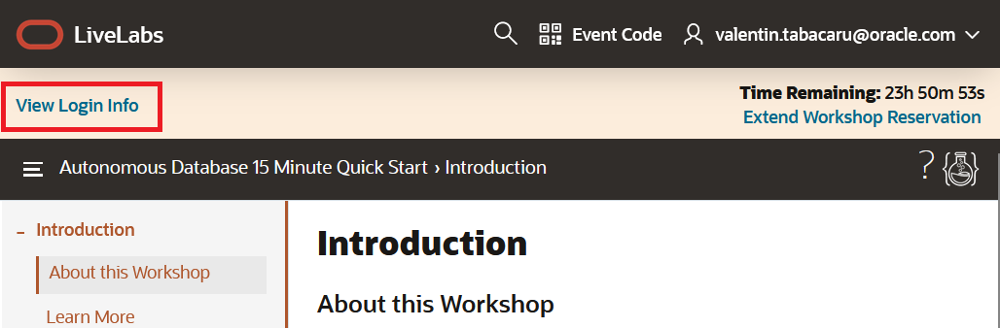

3. Click **Copy Password** and then **Launch OCI**.

    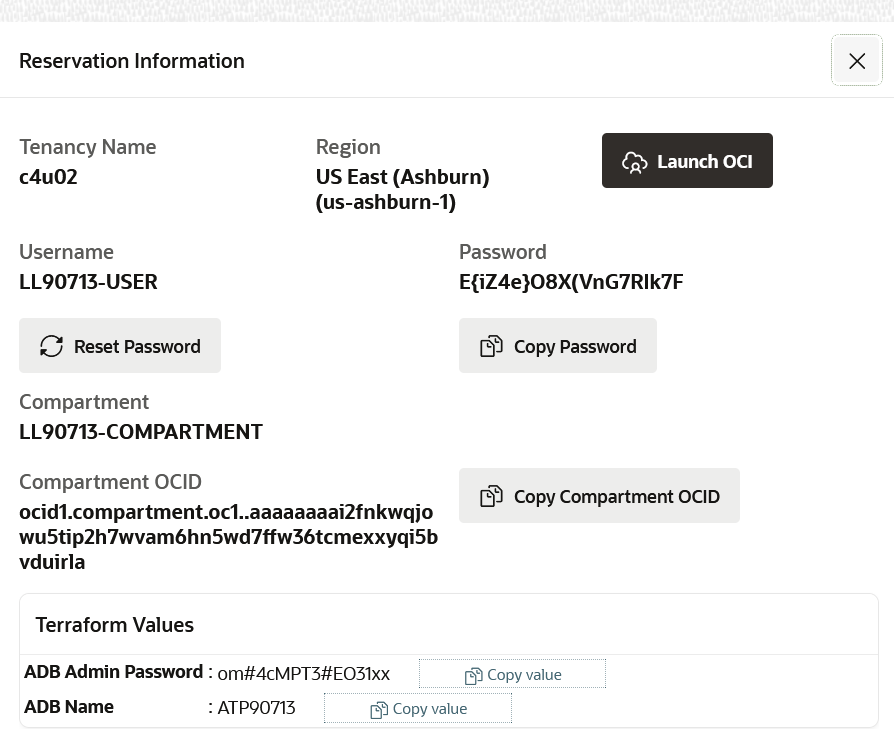

4. Use **Oracle Cloud Infrastructure Direct Sign-in** to paste the password you copied. When you log-in for the first time, it will ask you to update the password. Write down in your notes the new password.

    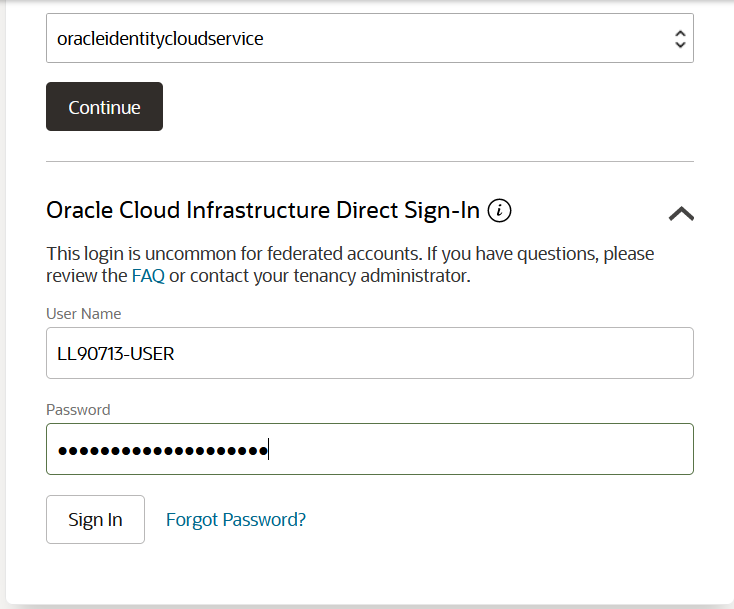

5. Use the main menu **≡** to navigate to Oracle Database > **Autonomous Database**.

    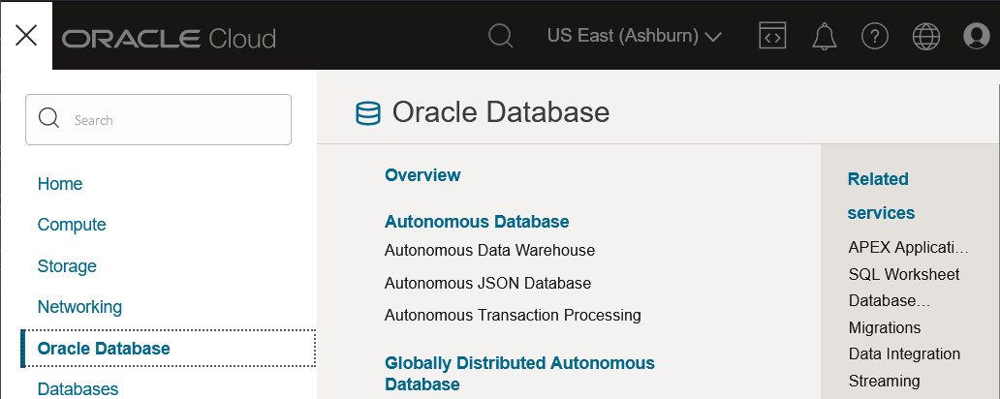

6. Select your reservation **Compartment** on the left side drop-down, and click on your Autonomous Database instance name.

    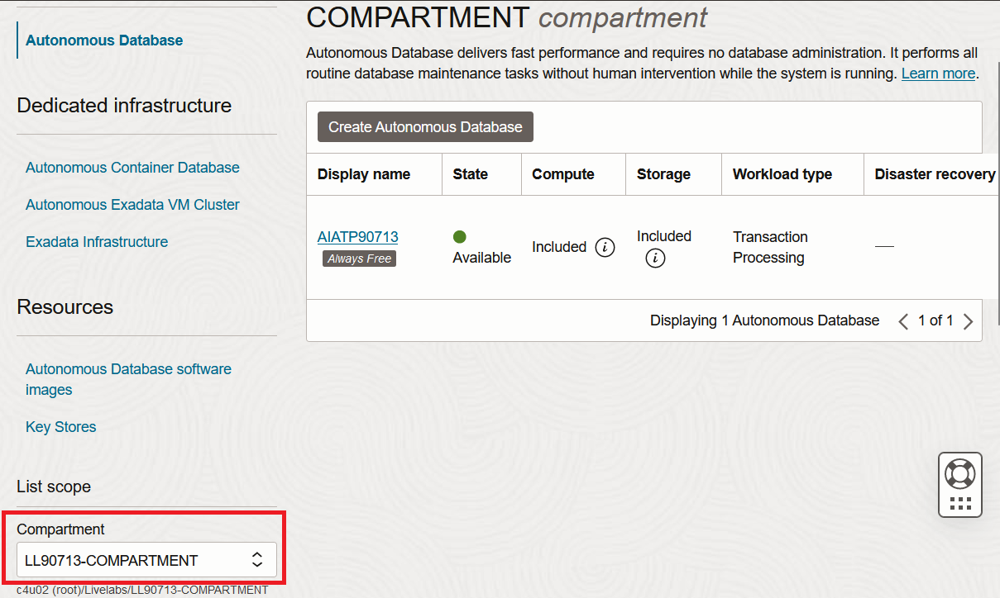

7. Familiarize yourself with the OCI console for Autonomous Database.

    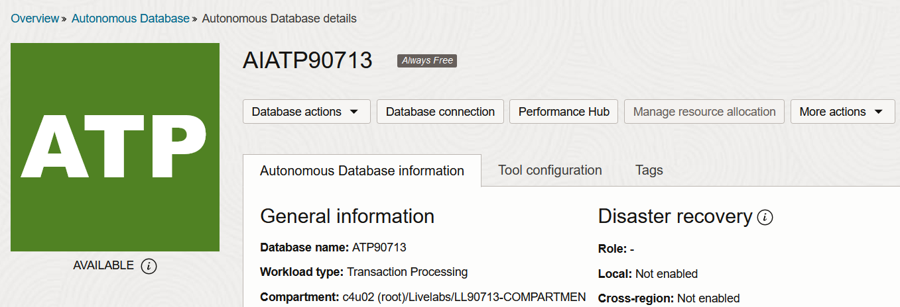

8. Click **Database connection**.

    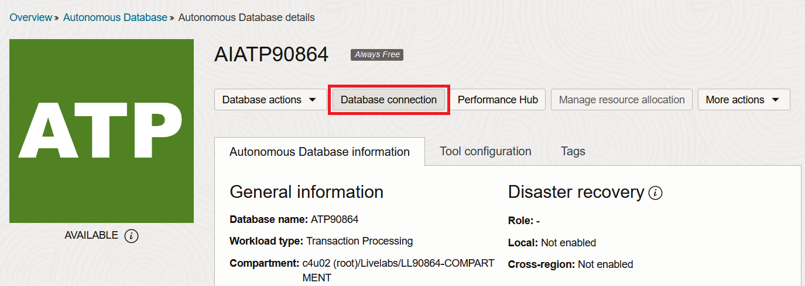

8. Under Download client credentials (Wallet), Instance wallet is selected, click **Download wallet**.

    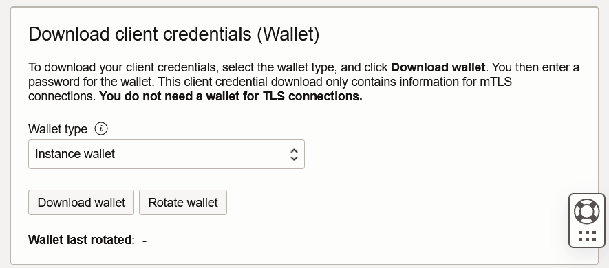

9. Specify a strong password. You may use the ADB Admin Password from Reservation Information page. After saved, click Close.

    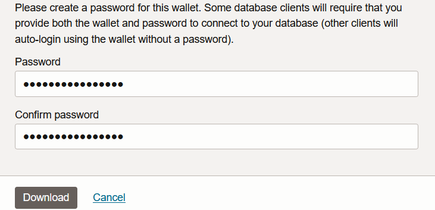

8. Use Database Actions menu to open **Database Users** console.

    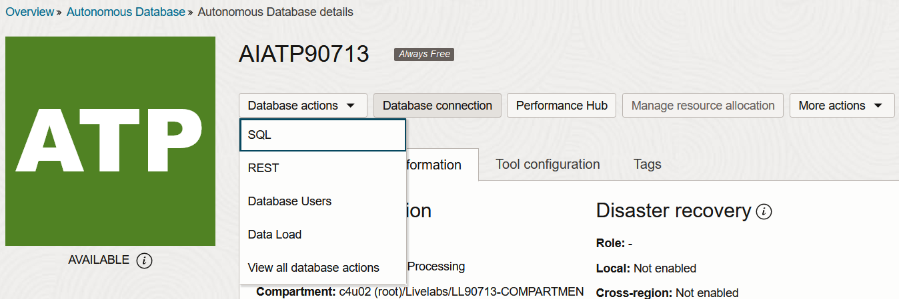

9. Click **Create User**.

    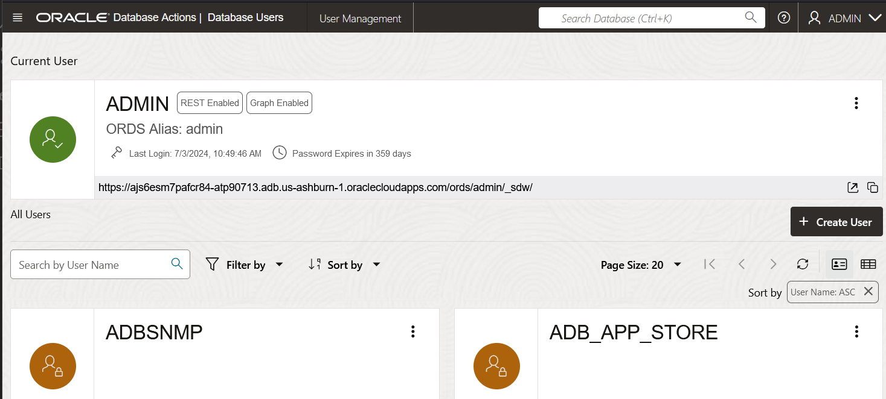

10. Create a new user called **hol23ai** (case insensitive). You may use the same password from admin user you received on Reservation Information dialog at step #3. Enable **Web Access** and set **UNLIMITED** quota on tablespace DATA.

    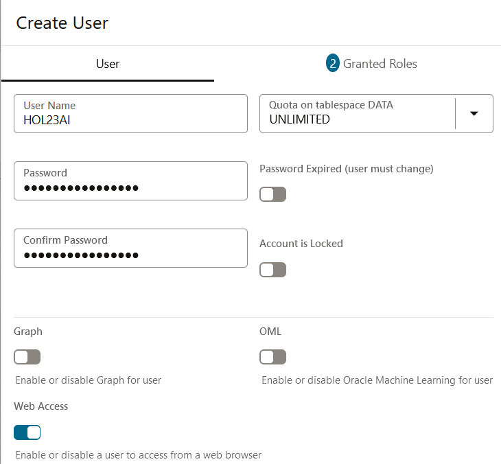

11. Click **Granted Roles**. Add ORDS_ADMINISTRATOR_ROLE, ORDS_RUNTIME_ROLE as Granted and Default.

    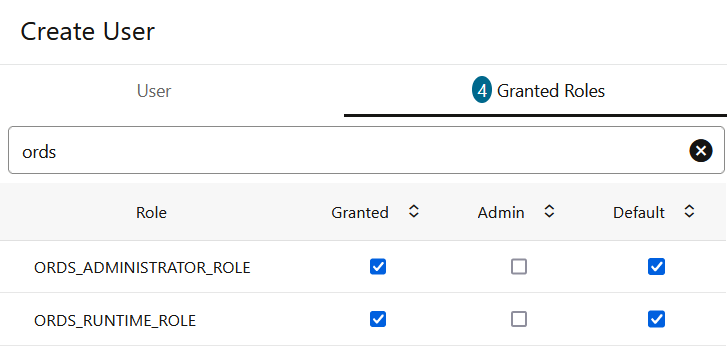

12. Add DWROLE as Granted and Default. Click **Create User**.

    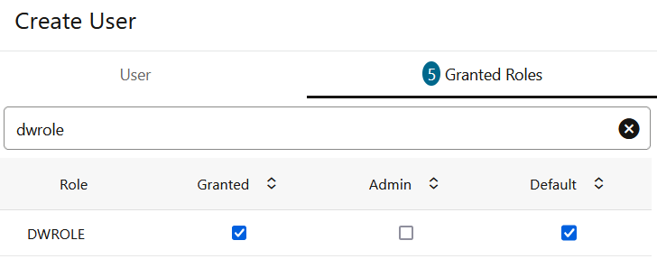

13. The new hol23ai user card will appear in the list. You can copy the SQL Developer URL in your notes.

    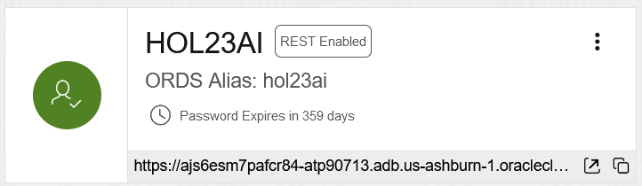

14. Click the ADMIN user menu, and **Sign Out**.

    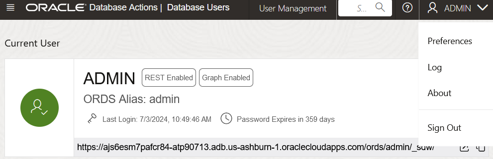

15. Sing-in with the new user **hol23ai**.

    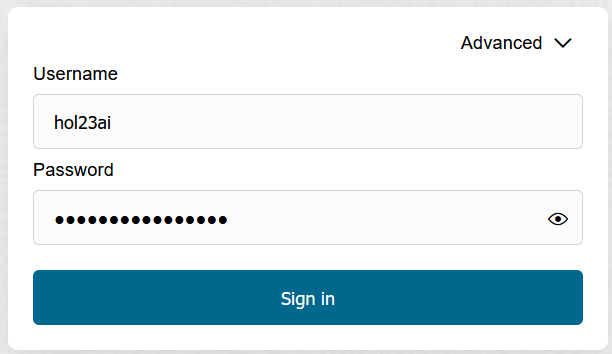

16. Click **SQL** worksheet button under Development.

    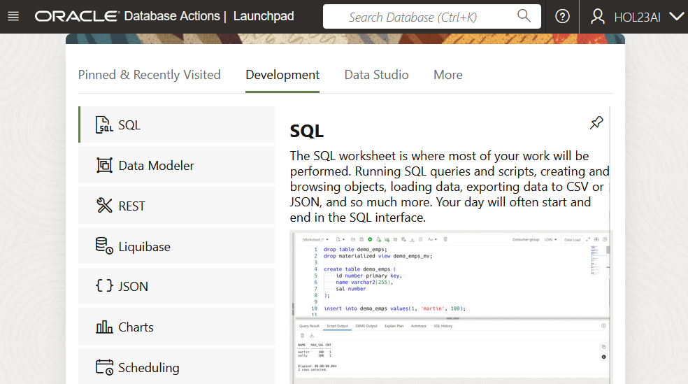

17. As you go through this workshop, we will specify click the Run button or Run Script button. The Run button runs just one SQL Statement and formats the output into a data grid. The Run Script button runs many SQL statements and spools their output. We will highlight which to use.

    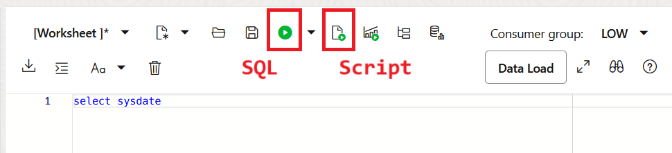
 

## Task 2: Use Cloud Shell and Code Editor for Java project

1. Click on Developer tools button in the OCI console, and launch **Cloud Shell**. You may maximize the dialog.

    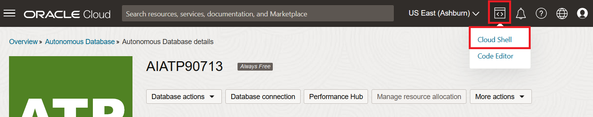

1. Click on Developer tools button in the OCI console, and launch **Code Editor**.

    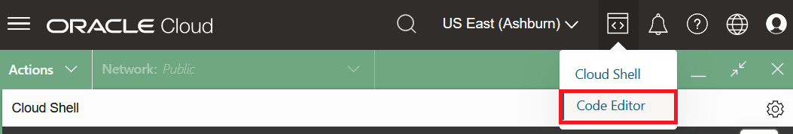

1. Under the Actions menu, set Cloud Shell and Code Editor **Side by side**.

    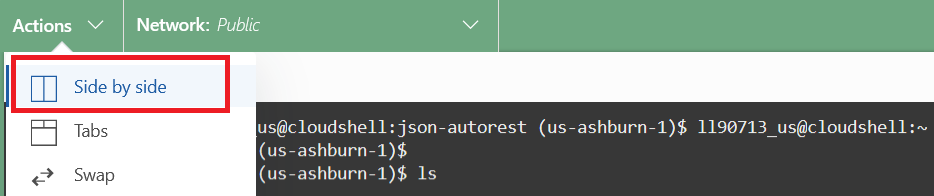

1. Click Cloud Shell menu and **Upload**.

    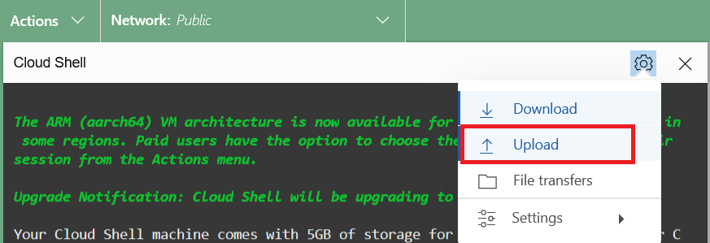

1. Add your ADB wallet zip file to the list and click **Upload**.

    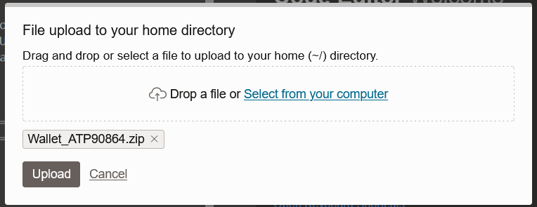

1. Create a directory with the same name as the wallet zip file, and uzip the wallet.

    ```
    <copy>
    mkdir Wallet_<ADB_NAME>
    unzip Wallet_<ADB_NAME>.zip -d Wallet_<ADB_NAME>
    </copy>
    ```
    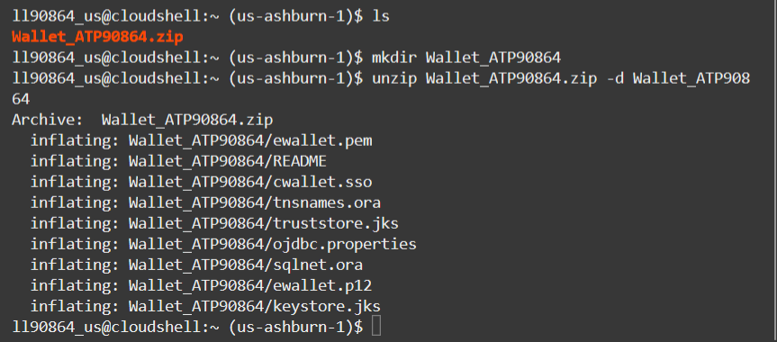

1. Open `Wallet_<ADB_NAME>/sqlnet.ora` file in Code Editor and change `?/network/admin` with `${TNS_ADMIN}`.

    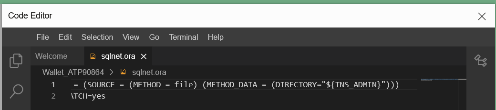

1. Cloud Shell uses Oracle JDK 11 by default. Set environment to use JDK 17. This is required by the Java application code.

    ```
    <copy>
    csruntimectl java list
    csruntimectl java set graalvmjdk-17
    </copy>
    ```
    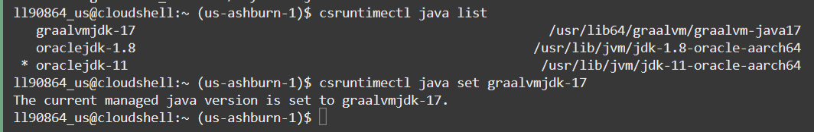

1. Open `Wallet_<ADB_NAME>/ojdbc.properties` in Code Editor and perfom the changes under `FOLLOW THESE STEPS FOR USING JKS`.

    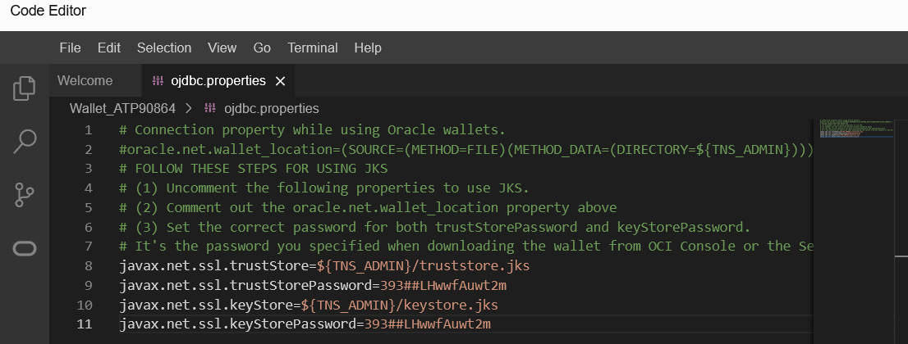

2. Now paste this in to grab the latest version of the Java code in your Cloud Shell.

    ```
    <copy>
    wget https://objectstorage.eu-frankfurt-1.oraclecloud.com/p/XRWqXIsbLfcW-YBVKOOv9rzWOl2jNmrz6-7e_3ZalwGdV7r6os6k7wDFlDbN238u/n/oraclepartnersas/b/WS-files/o/DualityWS/JdbcDuality.zip
    </copy>
    ```
    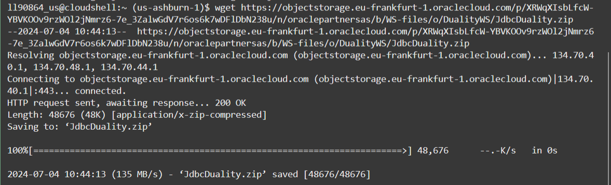

3. Unzip the file containing the project with Java application code.

    ```
    <copy>
    unzip -o JdbcDuality.zip
    </copy>
    ```
    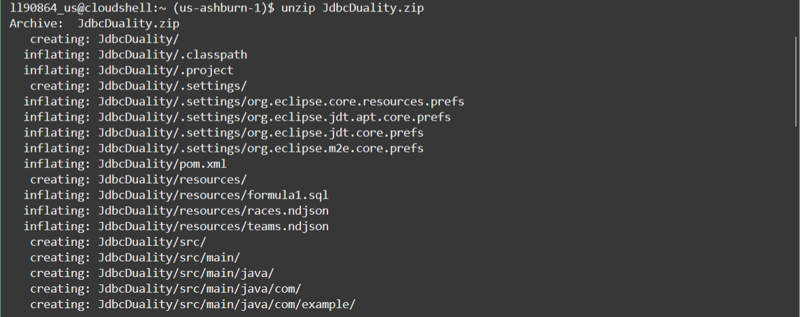

You may **proceed to the next lab.**


## Learn More

* [JSON Relational Duality: The Revolutionary Convergence of Document, Object, and Relational Models](https://blogs.oracle.com/database/post/json-relational-duality-app-dev)
* [JSON Duality View documentation](http://docs.oracle.com)
* [Blog: Key benefits of JSON Relational Duality](https://blogs.oracle.com/database/post/key-benefits-of-json-relational-duality-experience-it-today-using-oracle-database-23c-free-developer-release)

## Acknowledgements
* **Author** - Valentin Tabacaru, Kaylien Phan, William Masdon, Josh Spiegel
* **Contributors** - David Start, Ranjan Priyadarshi
* **Last Updated By/Date** - Valentin Tabacaru, Database Product Management, July 2024
