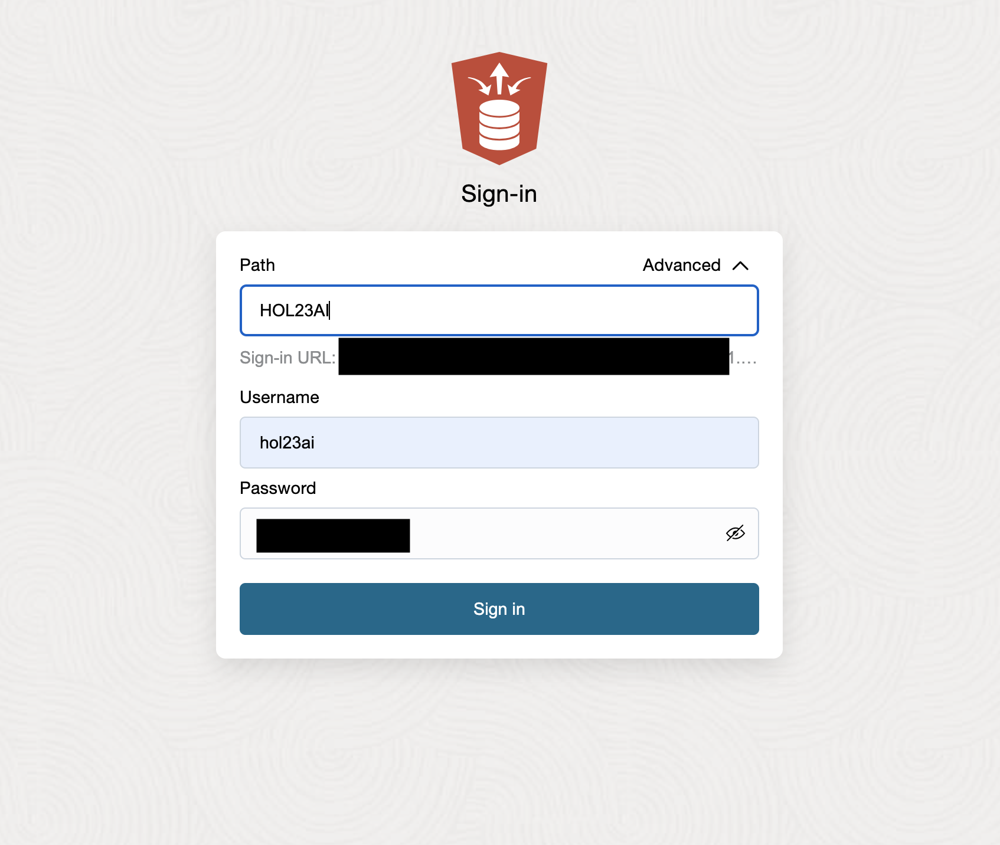
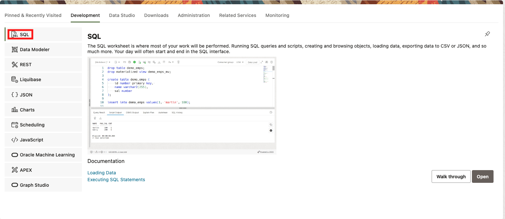
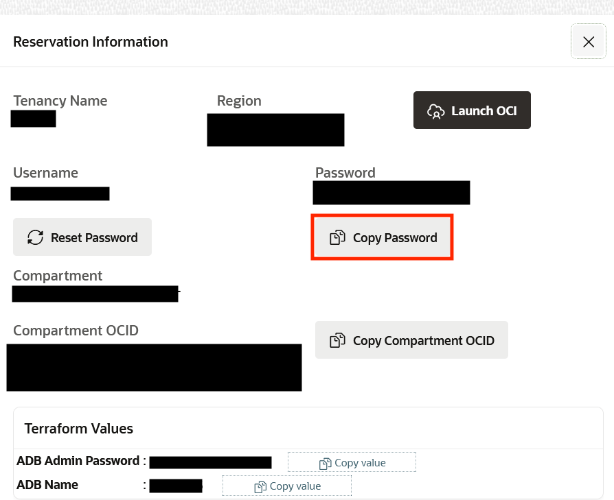
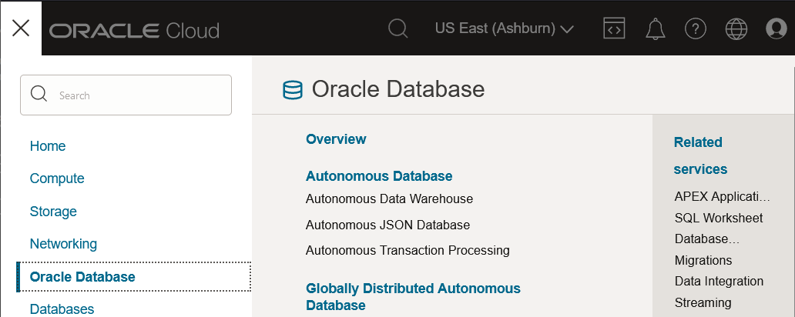
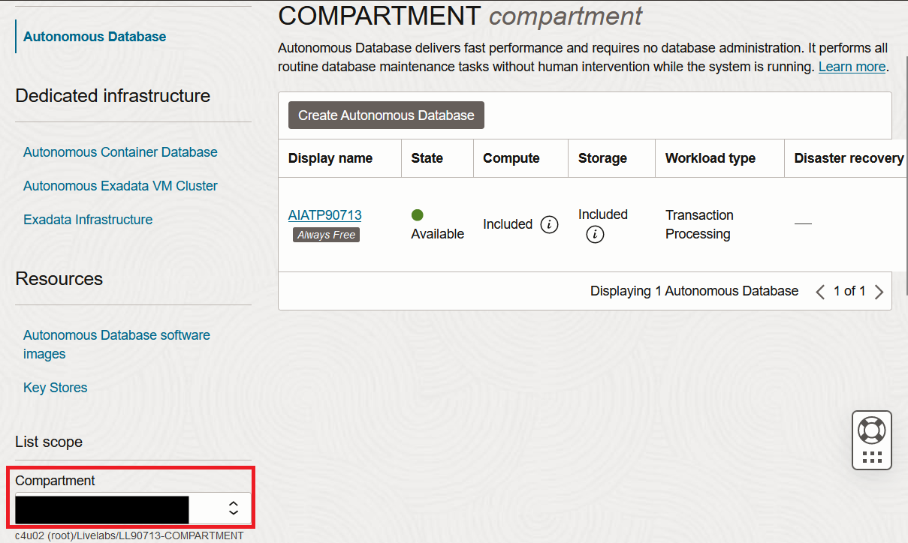
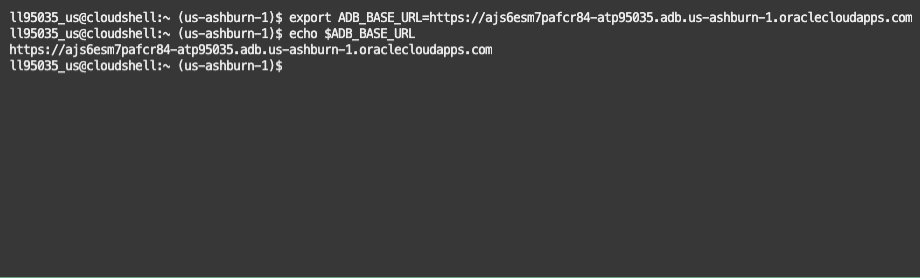
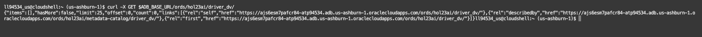

# Setup Your Environment

## Introduction

Oracle Database 23ai JSON Relational Duality converges the benefits of the Relational and Document worlds within a single database. Data is stored in relational tables and can be accessed as such for reporting or legacy applications. The JSON Duality Views provide an additional form of access - JSON Documents - for new applications or REST calls.  Developers can thus think in terms of JSON documents for data access while using the highly efficient relational model for data storage, without having to compromise simplicity or efficiency. In addition to this, Duality Views hide all the complexities of database level concurrency control from the user, providing document level serializability.

In this workshop, we will be using a set of tables used to store data on F1 racing teams, drivers, and race results. We will then create JSON Duality Views on top of these tables to reference them as JSON documents. Then we will use AutoREST to enable our duality views to be used with REST calls. 

Estimated Time: 10 minutes


### Objectives

In this lab, you will:

- Create relational tables
- Create JSON Duality Views on top of relational tables
- Enable REST on the JSON Duality Views

### Prerequisites

This lab assumes you have:
- Access to OCI console
- Oracle Autonomous Database 23ai Free Tier instance


## Task 1: Accessing your database

1. Your browser should be open at the Oracle LiveLabs My Reservations page. When your LiveLabs environment is ready, click **Launch Workshop**.

2. Click **View Login Info**.

    

3. Scroll down to the **Terraform Values** section and copy value for username **hol23ai**. Now click the **SQL Web Developer URL** to open the SQL Developer page.

    

4. Click **Advanced** and enter **HOL23AI**. Sign in with new user **hol23ai** and paste the password copied earlier.
    
    

5. Click **SQL** worksheet button under Development.

    

6. As you go through this workshop, use the **Run Script** button that runs many SQL statements and spools their output. Also use the delete option to clear the previous commands before running a new command.

    

## Task 2: Create database tables and JSON Duality Views

1. Now that you have logged into the database, we can create the tables that will be the underlying data structures for our JSON Duality Vies. Before doing this, drop the views tables in case they already exist, so you can start from scratch.

    ```sql
    SQL> <copy>drop view if exists team_dv;</copy>
    SQL> <copy>drop view if exists race_dv;</copy>
    SQL> <copy>drop view if exists driver_dv;</copy>
    SQL> <copy>drop table if exists driver_race_map;</copy>
    SQL> <copy>drop table if exists race;</copy>
    SQL> <copy>drop table if exists driver;</copy>
    SQL> <copy>drop table if exists team;</copy>
    ```

    

2. Now create the tables. 

    **NOTE:** Make sure to run each copy and paste so that each table is created individually. 

    ```sql
    SQL> <copy>CREATE TABLE IF NOT EXISTS team
        (team_id INTEGER GENERATED BY DEFAULT ON NULL AS IDENTITY,
        name    VARCHAR2(255) NOT NULL UNIQUE,
        points  INTEGER NOT NULL,
        CONSTRAINT team_pk PRIMARY KEY(team_id));</copy>
    ```
    ```sql
    SQL> <copy>CREATE TABLE IF NOT EXISTS driver
        (driver_id INTEGER GENERATED BY DEFAULT ON NULL AS IDENTITY,
        name      VARCHAR2(255) NOT NULL UNIQUE,
        points    INTEGER NOT NULL,
        team_id   INTEGER,
        CONSTRAINT driver_pk PRIMARY KEY(driver_id),
        CONSTRAINT driver_fk FOREIGN KEY(team_id) REFERENCES team(team_id));</copy>
    ```
    ```sql
    SQL> <copy>CREATE TABLE IF NOT EXISTS race
        (race_id   INTEGER GENERATED BY DEFAULT ON NULL AS IDENTITY,
        name      VARCHAR2(255) NOT NULL UNIQUE,
        laps      INTEGER NOT NULL,
        race_date DATE,
        podium    JSON,
        CONSTRAINT   race_pk PRIMARY KEY(race_id));</copy>  
    ```
    ```sql
    SQL> <copy>CREATE TABLE IF NOT EXISTS driver_race_map
        (driver_race_map_id INTEGER GENERATED BY DEFAULT ON NULL AS IDENTITY,
        race_id            INTEGER NOT NULL,
        driver_id          INTEGER NOT NULL,
        position           INTEGER,
        CONSTRAINT     driver_race_map_pk  PRIMARY KEY(driver_race_map_id),
        CONSTRAINT     driver_race_map_fk1 FOREIGN KEY(race_id)   REFERENCES race(race_id),
        CONSTRAINT     driver_race_map_fk2 FOREIGN KEY(driver_id) REFERENCES driver(driver_id));</copy>
    ```

    

3. Create a trigger to update the points for the teams and drivers. 

    ```sql
    SQL> <copy>CREATE OR REPLACE TRIGGER driver_race_map_trigger
    BEFORE INSERT ON driver_race_map
    FOR EACH ROW
    DECLARE
        v_points  INTEGER;
        v_team_id INTEGER;
    BEGIN
    SELECT team_id INTO v_team_id FROM driver WHERE driver_id = :NEW.driver_id;

    IF :NEW.position = 1 THEN
        v_points := 25;
    ELSIF :NEW.position = 2 THEN
        v_points := 18;
    ELSIF :NEW.position = 3 THEN
        v_points := 15;
    ELSIF :NEW.position = 4 THEN
        v_points := 12;
    ELSIF :NEW.position = 5 THEN
        v_points := 10;
    ELSIF :NEW.position = 6 THEN
        v_points := 8;
    ELSIF :NEW.position = 7 THEN
        v_points := 6;
    ELSIF :NEW.position = 8 THEN
        v_points := 4;
    ELSIF :NEW.position = 9 THEN
        v_points := 2;
    ELSIF :NEW.position = 10 THEN
        v_points := 1;
    ELSE
        v_points := 0;
    END IF;

    UPDATE driver SET points = points + v_points
        WHERE driver_id = :NEW.driver_id;
    UPDATE team SET points = points + v_points
        WHERE team_id = v_team_id;
    END;
    /</copy>
    ```

    

4. You will now create three JSON Duality Views: race\_dv, driver\_dv, and team\_dv. Take note that while each of these views are constructed to represent one table in particular, each of the views have information collected from different tables and reference them in child objects. 


5. Create a duality view for the race table. Notice that we are using 3 different tables to create one view. We are also using the `UNNEST` command to unnest the information from the driver table into the sub-object `result` instead of it being another sub-object within that same field. 

    **NOTE**: Worksheet might show errors in the code, but they can be ignored. Use Run Script button to run the whole code block.

    ```sql
    SQL> <copy>CREATE OR REPLACE JSON RELATIONAL DUALITY VIEW race_dv AS
    SELECT JSON {'_id'  IS r.race_id,
            'name'   IS r.name,
            'laps'   IS r.laps WITH NOUPDATE,
            'date'   IS r.race_date,
            'podium' IS r.podium WITH NOCHECK,
            'result' IS
                [ SELECT JSON {'driverRaceMapId' IS drm.driver_race_map_id,
                                'position'        IS drm.position,
                                UNNEST
                                (SELECT JSON {'driverId' IS d.driver_id,
                                                'name'     IS d.name}
                                    FROM driver d WITH NOINSERT UPDATE NODELETE
                                    WHERE d.driver_id = drm.driver_id)}
                    FROM driver_race_map drm WITH INSERT UPDATE DELETE
                    WHERE drm.race_id = r.race_id ]}
    FROM race r WITH INSERT UPDATE DELETE;</copy>
    ```

    

6. Create a duality view for the driver table. Notice in this duality view, we are specifying that no data alterations are allowed on the team information. That means when preforming PUT, POST, or DELETE actions on this view, we will not be able to alter the `teamId` or `team` fields. 

    ```sql
    SQL> <copy>CREATE OR REPLACE JSON RELATIONAL DUALITY VIEW driver_dv AS
    SELECT JSON {'_id'    IS d.driver_id,
            'name'     IS d.name,
            'points'   IS d.points,
            UNNEST
                (SELECT JSON {'teamId' IS t.team_id,
                            'team'   IS t.name WITH NOCHECK}
                    FROM team t WITH NOINSERT NOUPDATE NODELETE
                    WHERE t.team_id = d.team_id),
            'race'     IS
                [ SELECT JSON {'driverRaceMapId' IS drm.driver_race_map_id,
                                UNNEST
                                (SELECT JSON {'raceId' IS r.race_id,
                                                'name'   IS r.name}
                                    FROM race r WITH NOINSERT NOUPDATE NODELETE
                                    WHERE r.race_id = drm.race_id),
                                'finalPosition'   IS drm.position}
                    FROM driver_race_map drm WITH INSERT UPDATE NODELETE
                    WHERE drm.driver_id = d.driver_id ]}
    FROM driver d WITH INSERT UPDATE DELETE;</copy>
    ```

    

7. Create a duality view for the team table. 

    ```sql
    SQL> <copy>CREATE OR REPLACE JSON RELATIONAL DUALITY VIEW team_dv AS
    SELECT JSON {'_id'   IS t.team_id,
            'name'    IS t.name,
            'points'  IS t.points,
            'driver'  IS
                [ SELECT JSON {'driverId' IS d.driver_id,
                                'name'     IS d.name,
                                'points'   IS d.points WITH NOCHECK}
                    FROM driver d WITH INSERT UPDATE
                    WHERE d.team_id = t.team_id ]}
    FROM team t WITH INSERT UPDATE DELETE;</copy>
    ```

    


## Task 3: Enable the Duality Views for REST APIs

1. Enable each of the duality views for REST APIs. 

    ```sql
    SQL> <copy>
    begin
    ORDS.ENABLE_OBJECT(
        P_ENABLED        => TRUE,
        P_SCHEMA         => 'HOL23AI',
        P_OBJECT         =>  'DRIVER_DV',
        P_OBJECT_TYPE    => 'VIEW',
        P_OBJECT_ALIAS   => 'driver_dv',
        P_AUTO_REST_AUTH => FALSE
    );
    COMMIT;
    ORDS.ENABLE_OBJECT(
        P_ENABLED        => TRUE,
        P_SCHEMA         => 'HOL23AI',
        P_OBJECT         =>  'RACE_DV',
        P_OBJECT_TYPE    => 'VIEW',
        P_OBJECT_ALIAS   => 'race_dv',
        P_AUTO_REST_AUTH => FALSE
    );
    COMMIT;
    ORDS.ENABLE_OBJECT(
        P_ENABLED        => TRUE,
        P_SCHEMA         => 'HOL23AI',
        P_OBJECT         =>  'TEAM_DV',
        P_OBJECT_TYPE    => 'VIEW',
        P_OBJECT_ALIAS   => 'team_dv',
        P_AUTO_REST_AUTH => FALSE
    );
    COMMIT;
    end;
    /</copy>
    ```

    

2. To run the curl commands we will be using OCI cloud shell for the remainder of the lab. Click **View Login Info** on your livelab's home page.

    

3. Click **Copy Password** and then **Launch OCI**.

    

4. Use **Oracle Cloud Infrastructure Direct Sign-in** to paste the password you copied. When you log-in for the first time, it will ask you to update the password. Write down in your notes the new password. Also make a note of the compartment name.

    

5. Use the main menu **≡** to navigate to Oracle Database > **Autonomous Database**.

    

6. Select your reservation **Compartment** on the left side drop-down, and click on your Autonomous Database instance name. Your compartment name is the same which was noted from the reservation information screen.

    

7. Click on shell **Developer Tools** icon on the screen and select **Cloud Shell**. 

    

8. Use the SQL Developer Web URL to obtain your ADB instance base URL:

    ```
    <ADB_BASE_URL> = https://xxxxxxxxxx.adb.<region>.oraclecloudapps.com
    ```

    

9. As you go through this workshop, we will specify URLs for different REST services. Use your ADB instance base URL to build all URLs you will use with REST Data Service (ORDS) and AutoREST. Export the base url in your terminal or OCI Cloud Shell so that it can be reused.

    ```
    <copy>
    export ADB_BASE_URL=<YOUR_UNIQUE_ADB_URL>
    </copy>
    ```
    Check the value of variable ```ADB_BASE_URL```. It shouldn't have `/` in the end.
    ```
    <copy>
    echo $ADB_BASE_URL
    </copy>
    ```

    

    **NOTE:** This base url will be unique for each user, verify that you are using the correct URL.

10. Make a GET request to the REST API of the driver duality view from your laptop terminal command line.

    ```
    $ <copy>curl -X GET $ADB_BASE_URL/ords/HOL23AI/driver_dv/</copy>
    ```
    

    There is no data in the underlying tables, which is why the "items" array is empty. SODA paginates the results by default, so "offset" and "limit" fields refer to the offset of the results and the maximum number of resutls returned at a time. Also included in the reponse are links to common read and write operations that can be performed on the duality view collection. The contents of "links" is not show above for brevity. 

    **Note:** You can use also cURL in your laptop Terminal, or your web browser to open the URL when testing GET requests but this lab only uses OCI Cloud Shell.

## Task 4: Use getcURL option to generate curl commands in IDE

1. Go back to **SQL Developer** page and look for the hamburger icon on top-left corner of the screen. Click on **Rest** and then **AutoREST**.

    

    

2.  Now on any one of the views, you can click the three dots on the right and click **Get cURL**. Do this now for the `DRIVER_DV` view. 

    

3. This window contains different curl commands which can be using for the rest of the lab. Copy the **GET ALL** curl command.

    

4. Make a GET request to the REST API of the driver duality view from OCI Cloud Shell.

    

    You may continue using this tool for the rest of the workshop, but please be aware that the instructions will continue to use the cloudshell and cURL commands.    

You may **proceed to the next lab.**


## Learn More

- [JSON Relational Duality: The Revolutionary Convergence of Document, Object, and Relational Models](https://blogs.oracle.com/database/post/json-relational-duality-app-dev)
- [JSON Duality View documentation](https://docs.oracle.com/en/database/oracle/oracle-database/23/jsnvu/index.html)
- [Blog: Key benefits of JSON Relational Duality](https://blogs.oracle.com/database/post/key-benefits-of-json-relational-duality-experience-it-today-using-oracle-database-23c-free-developer-release)
- [ORDS Documentation](https://docs.oracle.com/en/database/oracle/oracle-rest-data-services/23.1/)

## Acknowledgements

* **Author** - Valentin Tabacaru, William Masdon, Kaylien Phan, Jeff Smith
* **Contributors** -  David Start, Ranjan Priyadarshi, Animesh Sahay
* **Last Updated By/Date** - Animesh Sahay, Cloud Engineering, August 2024
