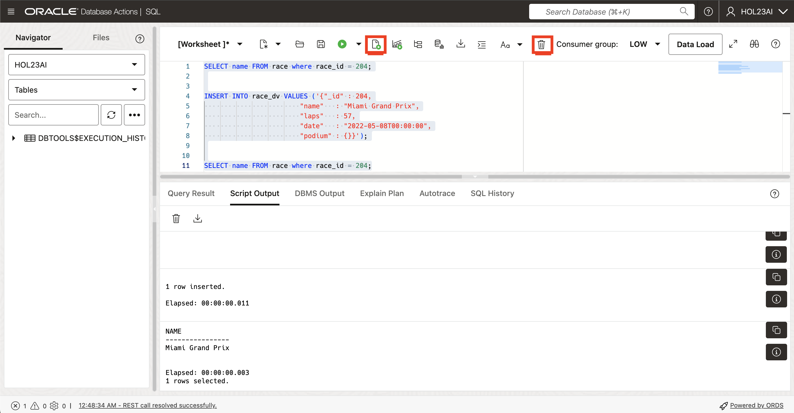
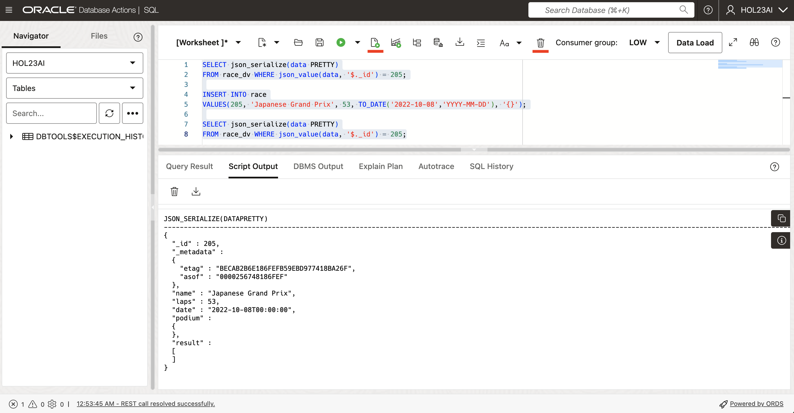
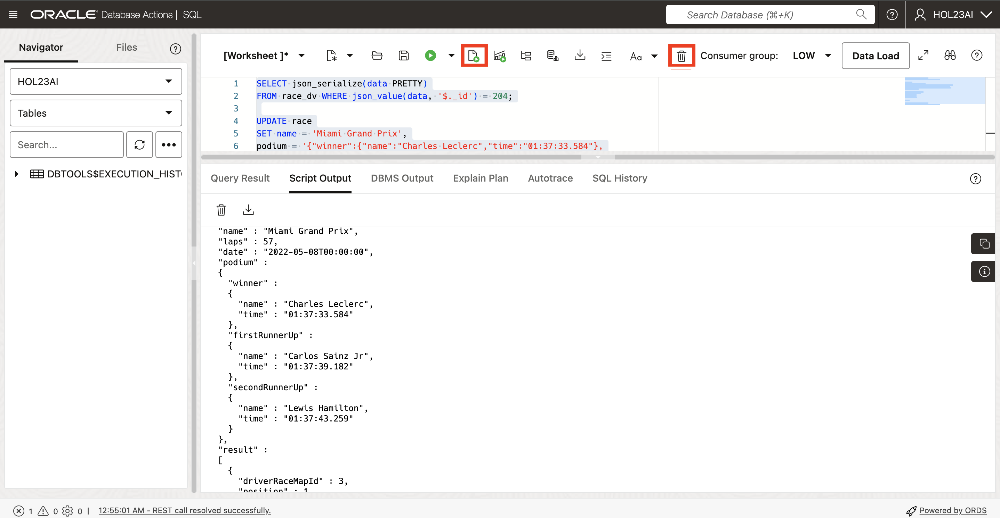
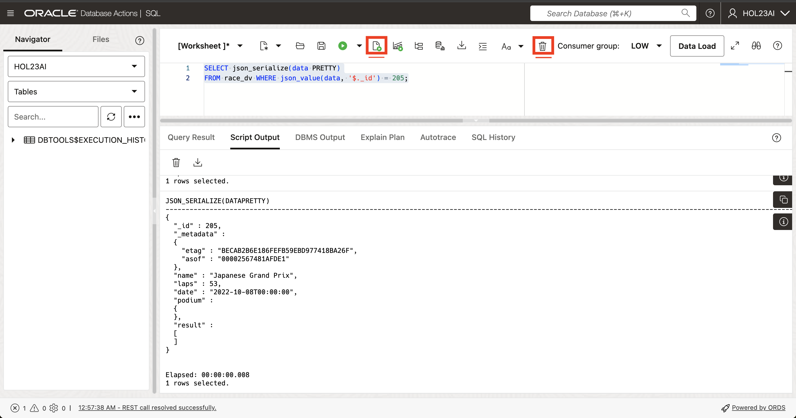
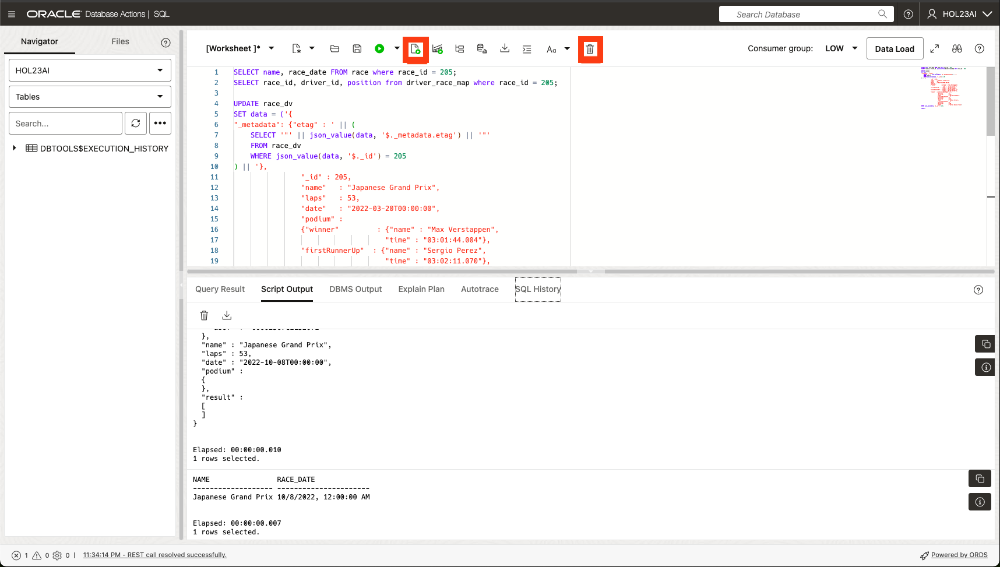
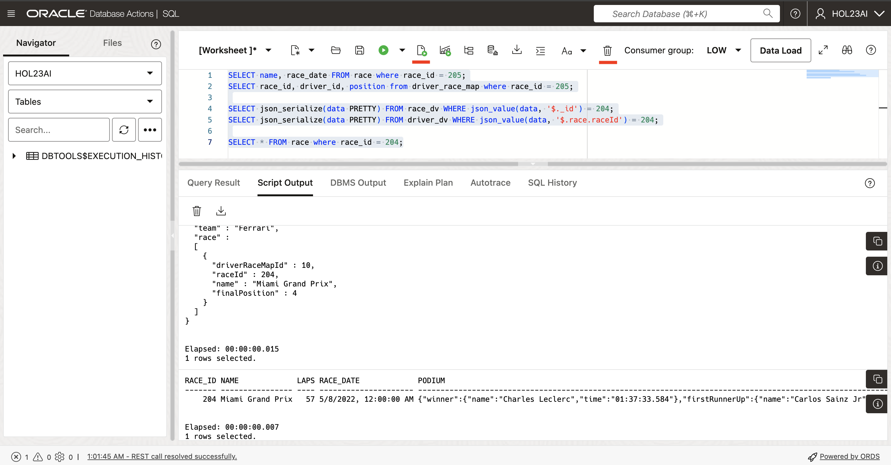
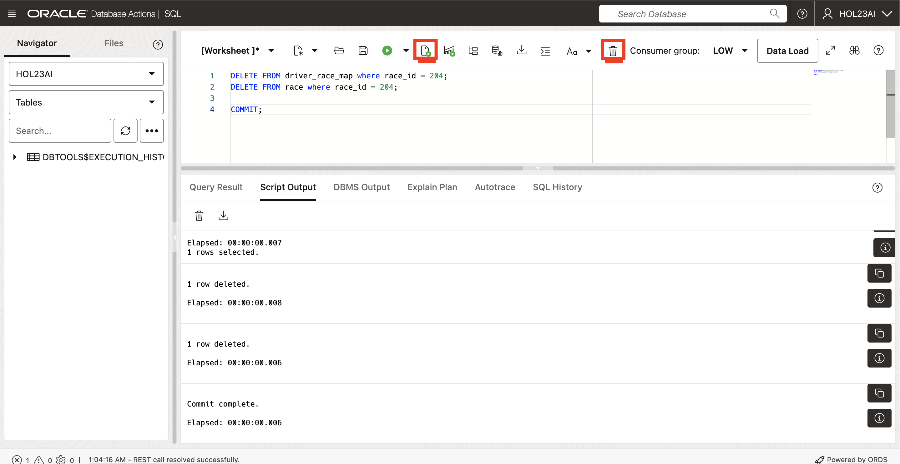
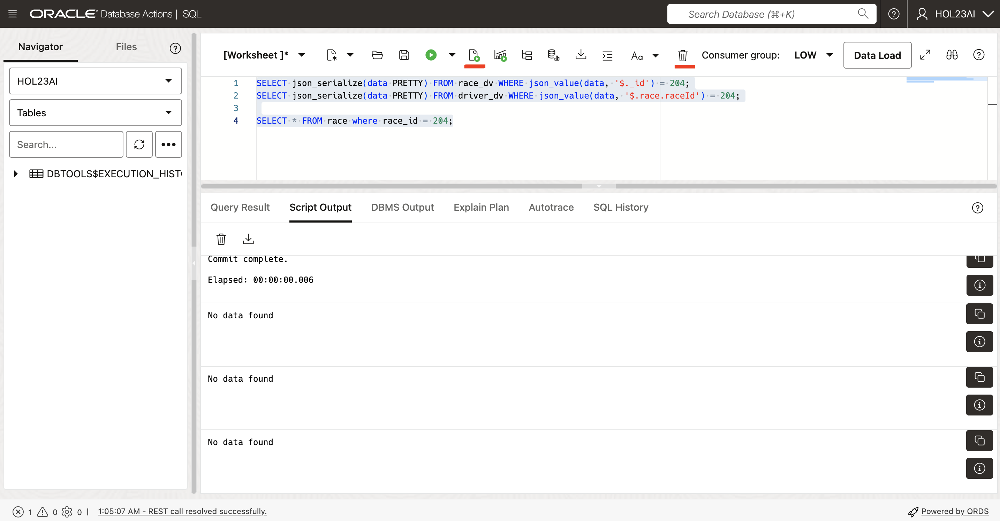
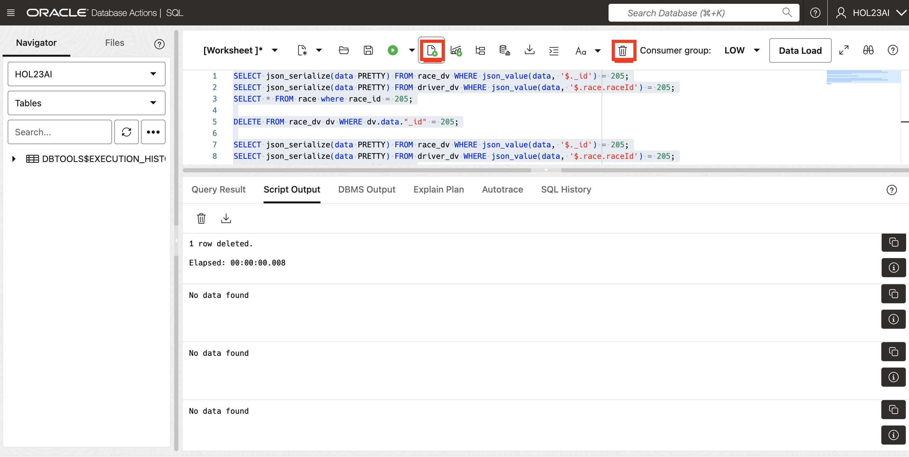

# The Extreme Flexibility of JSON Duality Views

## Introduction

This lab walks you through the steps to work with SQL data and JSON documents at the same time in the Oracle Database 23ai database, looking at the true duality of the views.

Regardless of which one you choose to work with, the underlying result in the database is the same: SQL access and JSON document access to all data. Developers now get the flexibility and data access benefits of the JSON document model as well as the storage efficiency and power of the relational model.

Estimated Time: 10 minutes

### Objectives

In this lab, you will:
* Insert, update, and delete on the Duality Views and SQL base tables

### Prerequisites

This lab assumes you have:
* Access to OCI console
* Oracle Autonomous Database 23ai Free Tier instance
* All previous labs successfully completed


## Task 1: Inserting into SQL tables and Duality Views

1. We mentioned how the underlying base table `race` gets populated when you add an entry into the `race_dv` JSON duality view. Here we will check the base table to ensure the record does not exist, insert the following into the duality view, and then check the base table. Clear the worksheet, copy the code below and click **Run Script**.

    ```
    <copy>
    SELECT name FROM race where race_id = 204;

    
    INSERT INTO race_dv VALUES ('{"_id" : 204,
                            "name"   : "Miami Grand Prix",
                            "laps"   : 57,
                            "date"   : "2022-05-08T00:00:00",
                            "podium" : {}}');


    SELECT name FROM race where race_id = 204;
    </copy>
    ```
    

2. Now we will check for the opposite. We will verify that inserting a record directly into the base table `race` is reflected in the `race_dv` JSON duality view. Let's look at the duality view, insert into the base table and then check the duality view for the record. Clear the worksheet, copy the code below and click **Run Script**.

    ```
    <copy>
    SELECT json_serialize(data PRETTY)
    FROM race_dv WHERE json_value(data, '$._id') = 205;

    INSERT INTO race
    VALUES(205, 'Japanese Grand Prix', 53, TO_DATE('2022-10-08','YYYY-MM-DD'), '{}');

    SELECT json_serialize(data PRETTY)
    FROM race_dv WHERE json_value(data, '$._id') = 205;
    </copy>
    ```
    

## Task 2: Update and replace a document by ID

1. In the last lab, you were able to replace a document with the OBJECT\_ID through the duality view. You are able to get the same functionality with the SQL table. Clear the worksheet, copy the code below and click **Run Script**.

    ```
    <copy>

    SELECT json_serialize(data PRETTY)
    FROM race_dv WHERE json_value(data, '$._id') = 204;

    UPDATE race
    SET name = 'Miami Grand Prix',
    podium = '{"winner":{"name":"Charles Leclerc","time":"01:37:33.584"},
    "firstRunnerUp":{"name":"Carlos Sainz Jr","time":"01:37:39.182"},
    "secondRunnerUp":{"name":"Lewis Hamilton","time":"01:37:43.259"}}'
    WHERE race_id = 204;

    INSERT INTO driver_race_map
    VALUES(3, 204, 103, 1),
    (4, 204, 104, 2),
    (9, 204, 106, 3),
    (10, 204, 105, 4);

    COMMIT;

    SELECT json_serialize(data PRETTY)
    FROM race_dv WHERE json_value(data, '$._id') = 204;

    </copy>
    ```
    

2. When updating the JSON, you can check out the changes in the SQL table as well. Here we will update race 205 and change several fields including the race\_date. We will also add records to the driver\_race\_map table. We have provided the SQL to check the document for race id 205. Clear the worksheet, copy the code below and click **Run Script**.

    ```
    <copy>
    SELECT json_serialize(data PRETTY)
    FROM race_dv WHERE json_value(data, '$._id') = 205;
    </copy>
    ```
    

3. Now in this step, we will update the information for race ID 205 in the `race_dv` view. We will change some details, such as the race date and who finished in the top three positions. We will also add records to the `driver_race_map` table to show the results of the race. This update uses the etag value to make sure that no one else has changed the document while we are updating it. Through this approach, you'll get to update the tables much easier than the method we displayed above. Clear the worksheet, copy the code below, and click **Run Script**.

    ```
    <copy>
    SELECT name, race_date FROM race where race_id = 205;
    SELECT race_id, driver_id, position from driver_race_map where race_id = 205;

    UPDATE race_dv
    SET data = ('{
    "_metadata": {"etag" : ' || (
        SELECT '"' || json_value(data, '$._metadata.etag') || '"'
        FROM race_dv
        WHERE json_value(data, '$._id') = 205
    ) || '},
                    "_id" : 205,
                    "name"   : "Japanese Grand Prix",
                    "laps"   : 53,
                    "date"   : "2022-03-20T00:00:00",
                    "podium" :
                    {"winner"         : {"name" : "Max Verstappen",
                                        "time" : "03:01:44.004"},
                    "firstRunnerUp"  : {"name" : "Sergio Perez",
                                        "time" : "03:02:11.070"},
                    "secondRunnerUp" : {"name" : "Carlos Sainz Jr",
                                        "time" : "03:02:15.767"}},
                    "result" : [ {"driverRaceMapId" : 3,
                                "position"        : 1,
                                "driverId"        : 101,
                                "name"            : "Max Verstappen"},
                                {"driverRaceMapId" : 4,
                                "position"        : 2,
                                "driverId"        : 102,
                                "name"            : "Sergio Perez"},
                                {"driverRaceMapId" : 9,
                                "position"        : 3,
                                "driverId"        : 104,
                                "name"            : "Carlos Sainz Jr"}]}')
    WHERE json_value(data, '$._id') = 205;

    COMMIT;
    </copy>
    ```
    

## Task 3: Delete by predicate

1. We're going to delete a couple entries, but we want to see the current state of these tables first. We'll review the `race` and `driver` data in both the base tables and duality views. Clear the worksheet, copy the code below and click **Run Script**.
    ```
    <copy>
    SELECT name, race_date FROM race where race_id = 205;
    SELECT race_id, driver_id, position from driver_race_map where race_id = 205;

    SELECT json_serialize(data PRETTY) FROM race_dv WHERE json_value(data, '$._id') = 204;
    SELECT json_serialize(data PRETTY) FROM driver_dv WHERE json_value(data, '$.race.raceId') = 204;

    SELECT * FROM race where race_id = 204;
    </copy>
    ```
    

2. Delete the race document for race 204. The underlying rows are first deleted from the `driver_race_map` table as they're child entries of the `race` entries in the `race` table and then we delete the race entries themselves from the `race` table. If you try to run the second command first, it'll throw an error. Clear the worksheet, copy the code below and click **Run Script**.

    ```
    <copy>

    DELETE FROM driver_race_map where race_id = 204;
    DELETE FROM race where race_id = 204;

    COMMIT;
    </copy>
    ```
    

3. Select from the tables again and you'll see they're gone from the duality view as well as the base SQL table. Clear the worksheet, copy the code below and click **Run Script**.


    ```
    <copy>
    SELECT json_serialize(data PRETTY) FROM race_dv WHERE json_value(data, '$._id') = 204;
    SELECT json_serialize(data PRETTY) FROM driver_dv WHERE json_value(data, '$.race.raceId') = 204;

    SELECT * FROM race where race_id = 204;
    </copy>
    ```
    

4. Lastly, we'll delete with JSON and view the tables again. Clear the worksheet, copy the code below and click **Run Script**.


    ```
    <copy>

    SELECT json_serialize(data PRETTY) FROM race_dv WHERE json_value(data, '$._id') = 205;
    SELECT json_serialize(data PRETTY) FROM driver_dv WHERE json_value(data, '$.race.raceId') = 205;
    SELECT * FROM race where race_id = 205;

    DELETE FROM race_dv dv WHERE dv.data."_id" = 205;

    SELECT json_serialize(data PRETTY) FROM race_dv WHERE json_value(data, '$._id') = 205;
    SELECT json_serialize(data PRETTY) FROM driver_dv WHERE json_value(data, '$.race.raceId') = 205;
    SELECT * FROM race where race_id = 205;

    COMMIT;

    </copy>
    ```
    

## Learn More

* [JSON Relational Duality: The Revolutionary Convergence of Document, Object, and Relational Models](https://blogs.oracle.com/database/post/json-relational-duality-app-dev)
* [JSON Duality View documentation](http://docs.oracle.com)
* [Blog: Key benefits of JSON Relational Duality](https://blogs.oracle.com/database/post/key-benefits-of-json-relational-duality-experience-it-today-using-oracle-database-23c-free-developer-release)

## Acknowledgements
* **Author** - Valentin Tabacaru, Kaylien Phan, William Masdon
* **Contributors** - David Start, Ranjan Priyadarshi, Francis Regalado
* **Last Updated By/Date** - Francis Regalado, Database Product Management, August 2024
