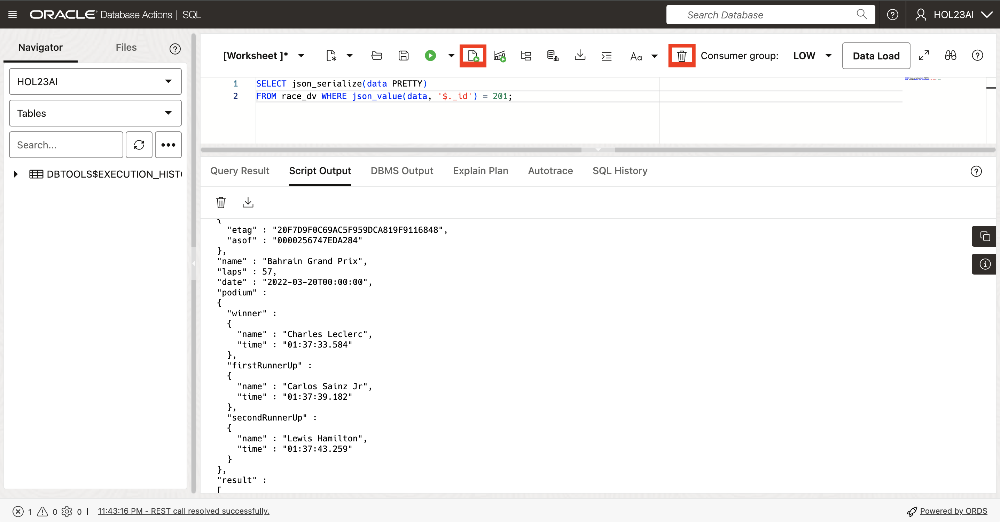
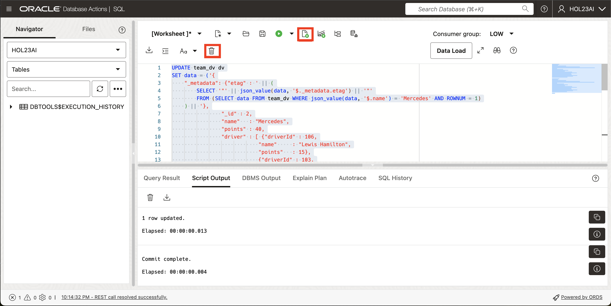
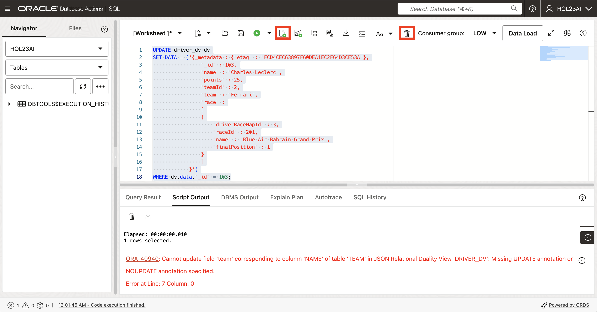

# Working with JSON and the Duality Views

## Introduction

This lab walks you through the steps to work with JSON documents in the Oracle 23ai database. We'll show you how to populate the tables and subsequent duality views, as well as filter, replace, fetch, update, and delete JSON documents by predicates. Finally, we'll let you test out non-updateable fields.

Estimated Time: 20 minutes

### Objectives

In this lab, you will:
* Populate the duality views
* Work with JSON documents and predicates
* Test non-updateable fields

### Prerequisites

This lab assumes you have:
* Access to OCI console
* Oracle Autonomous Database 23ai Free Tier instance
* All previous labs successfully completed


## Task 1: Find documents matching a filter (aka predicate)

1. In this step, we will use JSON functions to find race information from the `race_dv` duality view. We'll use the `json_value` function to extract and filter data based on a specific raceId.

    Another option is to use simplified dot notation in predicates, which we'll cover later on in the lab. The `json_exists` function is more versatile than the `json_value` function for expressing conditions and is used by the REST interface for query translation by examples. Clear the worksheet, copy the SQL below and click **Run Script**.

    ```
    <copy>
    SELECT json_serialize(data PRETTY)
    FROM race_dv WHERE json_value(data, '$._id') = 201;
    </copy>
    ```

    

## Task 2: Replace and fetch a document by ID

1. To announce the results for the Bahrain Grand Prix, we will update the appropriate race entry with the details after the race.

    The 'etag' value supplied in the content is used to prevent issues when multiple people try to update the same document at the same time. When you update a document by its ID, the database checks that the 'etag' provided in the new document matches the latest 'etag' in the database. 

    If the `etag` do not match, which can happen if someone else has updated the document, an error is thrown. When this happens, you need to get the latest version of the document(including the updated 'etag'), and try to make the update again, making any necessary changes.
    
    To automate the process of fetching the current 'etag', a subquery is used within the 'SET data' clause. This subquery automatically fetches the latest `etag` for the specified field. This ensures the correct `etag` is used every time without any manual intervention, avoiding conflicts and keeping our data accurate. Now, copy the SQL below and click **Run Script**. 

    ```
    <copy>
    UPDATE race_dv
    SET data = ('{
        "_metadata": {"etag" : ' || (
            SELECT '"' || json_value(data, '$._metadata.etag') || '"'
            FROM race_dv
            WHERE json_value(data, '$._id') = 201
        ) || '},
                    "_id" : 201,
                    "name"   : "Bahrain Grand Prix",
                    "laps"   : 57,
                    "date"   : "2022-03-20T00:00:00",
                    "podium" :
                    {"winner"         : {"name" : "Charles Leclerc",
                                        "time" : "01:37:33.584"},
                    "firstRunnerUp"  : {"name" : "Carlos Sainz Jr",
                                        "time" : "01:37:39.182"},
                    "secondRunnerUp" : {"name" : "Lewis Hamilton",
                                        "time" : "01:37:43.259"}},
                    "result" : [ {"driverRaceMapId" : 3,
                                "position"        : 1,
                                "driverId"        : 103,
                                "name"            : "Charles Leclerc"},
                                {"driverRaceMapId" : 4,
                                "position"        : 2,
                                "driverId"        : 104,
                                "name"            : "Carlos Sainz Jr"},
                                {"driverRaceMapId" : 9,
                                "position"        : 3,
                                "driverId"        : 106,
                                "name"            : "Lewis Hamilton"},
                                {"driverRaceMapId" : 10,
                                "position"        : 4,
                                "driverId"        : 105,
                                "name"            : "George Russell"} ]}')
    WHERE json_value(data, '$._id') = 201;

    COMMIT;
    </copy>
    ```

    
    
2. Now let's see the updated results for the Bahrain Grand Prix. Clear the worksheet, copy the SQL below and click **Run Script**.

    ```
    <copy>
    SELECT json_serialize(data PRETTY)
    FROM race_dv WHERE json_value(data, '$._id') = 201;
    </copy>
    ```
    

## Task 3: Update specific fields in the document identified by a predicate

1. Now we'll update the Bahrain Grand Prix's name with sponsor information. Here we use json\_transform to update specific fields.

    An alternative approach is to use json_mergepatch, which is standardized, but is limited to simple object field updates and cannot be used for updating specific array elements. The json\_transform function, however, can be used to update specific array elements.

    **Note:** We are using the dv.data.name in this example. This is just another way to access values. Copy the SQL below and click **Run Script**.

    ```
    <copy>
    UPDATE race_dv dv
    SET data = json_transform(data, SET '$.name' = 'Blue Air Bahrain Grand Prix')
    WHERE dv.data.name LIKE 'Bahrain%';

    COMMIT;
    </copy>
    ```
    

2. Select from the view to ensure the change is in. In this example we are also showing that you can use json\_value in the where clause. Clear the worksheet, copy the SQL below and click **Run Script**.

    ```
    <copy>
    SELECT json_serialize(data PRETTY)
    FROM race_dv WHERE json_value(data, '$.name') LIKE 'Blue Air Bahrain%';
    </copy>
    ```
    

## Task 4: Re-parenting of sub-objects between two documents

1. We will switch Charles Leclerc's and George Russell's teams. This can be done by updating the Mercedes and Ferrari `team_dv`. The documents can be updated by simply sending the new list of drivers for both documents in the input.

    First, show the team documents. Clear the worksheet, copy the SQL below and click **Run Script**.

    ```
    <copy>
    SELECT json_serialize(data PRETTY) FROM team_dv dv
    WHERE dv.data.name LIKE 'Mercedes%';
    SELECT json_serialize(data PRETTY) FROM team_dv dv
    WHERE dv.data.name LIKE 'Ferrari%';
    </copy>
    ```
    

2. Then we perform the updates. The 'UPDATE' statements for team\_dv use a subquery to automatically get the latest 'etag' for each team. The subquery inside the SET data looks at the team document with the name is 'Mercedes' or 'Ferrari' and only picks the first match, thanks to us using ROWNUM = 1. The script will update the `points` in "Mercedes" to 40, and also assigns Lewis 15 points and Charles 25 points. On the "Ferrari" side, they will get 30 points. George will receive 12 points and Carlos will receive 18 points. The updates are applied to the rows where the team name are "Mercedes" and "Ferrari". Now, clear the worksheet, copy the SQL below and click **Run Script**.

    ```
    <copy>
    UPDATE team_dv dv
    SET data = ('{
        "_metadata": {"etag" : ' || (
            SELECT '"' || json_value(data, '$._metadata.etag') || '"'
            FROM (SELECT data FROM team_dv WHERE json_value(data, '$.name') = 'Mercedes' AND ROWNUM = 1)
        ) || '},
                    "_id" : 2,
                    "name"   : "Mercedes",
                    "points" : 40,
                    "driver" : [ {"driverId" : 106,
                                "name"     : "Lewis Hamilton",
                                "points"   : 15},
                                {"driverId" : 103,
                                "name"     : "Charles Leclerc",
                                "points"   : 25} ]}')
        WHERE dv.data.name = 'Mercedes';

    UPDATE team_dv dv
    SET data = ('{
        "_metadata": {"etag" : ' || (
            SELECT '"' || json_value(data, '$._metadata.etag') || '"'
            FROM (SELECT data FROM team_dv WHERE json_value(data, '$.name') = 'Ferrari' AND ROWNUM = 1)
        ) || '},
                    "_id" : 302,
                    "name"   : "Ferrari",
                    "points" : 30,
                    "driver" : [ {"driverId" : 105,
                                "name"     : "George Russell",
                                "points"   : 12},
                                {"driverId" : 104,
                                "name"     : "Carlos Sainz Jr",
                                "points"   : 18} ]}')
        WHERE dv.data.name = 'Ferrari';

    COMMIT;
    </copy>
    ```
    

3. Now, show the team documents after the updates. You'll see that the former teams with Mercedes have now been swapped to Ferrari and vice versa. Clear the worksheet, copy the SQL below and click **Run Script**.

    ```
    <copy>
    SELECT json_serialize(data PRETTY) FROM team_dv dv
    WHERE dv.data.name LIKE 'Mercedes%';

    SELECT json_serialize(data PRETTY) FROM team_dv dv
    WHERE dv.data.name LIKE 'Ferrari%';
    </copy>
    ```
    

4. Show the driver documents after the updates as well. Clear the worksheet, copy the SQL below and click **Run Script**.
    ```
    <copy>
    SELECT json_serialize(data PRETTY) FROM driver_dv dv
    WHERE dv.data.name LIKE 'Charles Leclerc%';

    SELECT json_serialize(data PRETTY) FROM driver_dv dv
    WHERE dv.data.name LIKE 'George Russell%';
    </copy>
    ```
    


## Task 5: Update a non-updateable field

1. Now we will update team for a driver through driver\_dv. This will throw an error as we specified the JSON Duality View to not allow this field to be updatable through driver\_dv. Clear the worksheet, copy the SQL below and click **Run Script**.

    ```
    <copy>
    UPDATE driver_dv dv
    SET data = ('{
    "_metadata": {"etag" : ' || (
        SELECT '"' || json_value(data, '$._metadata.etag') || '"'
        FROM driver_dv
        WHERE json_value(data, '$._id') = 103
    ) || '},
                    "_id" : 103,
                    "name" : "Charles Leclerc",
                    "points" : 25,
                    "teamId" : 2,
                    "team" : "Ferrari",
                    "race" :
                    [
                    {
                        "driverRaceMapId" : 3,
                        "raceId" : 201,
                        "name" : "Blue Air Bahrain Grand Prix",
                        "finalPosition" : 1
                    }
                    ]
                }')
    WHERE dv.data."_id" = 103;
    </copy>
    ```
    

## Task 6: Delete by predicate

1. Delete the race document for Bahrain Grand Prix. The underlying rows are deleted from the `race` and `driver_race_map tables`, but leaves their `driver` table untouched, because it is marked read-only in the view definition. Clear the worksheet, copy the SQL below and click **Run Script**.

    **Note:** The "where" clause can have any valid SQL expression, e.g. equality on OBJECT\_ID, some condition using simplified syntax, or JSON function, such as json\_value or json\_exists.

    ```
    <copy>
    DELETE FROM race_dv dv WHERE dv.data."_id" = 201;

    SELECT json_serialize(data PRETTY) FROM race_dv;
    SELECT json_serialize(data PRETTY) FROM driver_dv;

    COMMIT;
    </copy>
    ```
    

You may **proceed to the next lab.** 

## Learn More

* [JSON Relational Duality: The Revolutionary Convergence of Document, Object, and Relational Models](https://blogs.oracle.com/database/post/json-relational-duality-app-dev)
* [JSON Duality View documentation](http://docs.oracle.com)
* [Blog: Key benefits of JSON Relational Duality](https://blogs.oracle.com/database/post/key-benefits-of-json-relational-duality-experience-it-today-using-oracle-database-23c-free-developer-release)

## Acknowledgements
* **Author** - Valentin Tabacaru, Kaylien Phan, William Masdon
* **Contributors** - David Start, Ranjan Priyadarshi, Francis Regalado
* **Last Updated By/Date** - Francis Regalado, Database Product Management, August 2024
