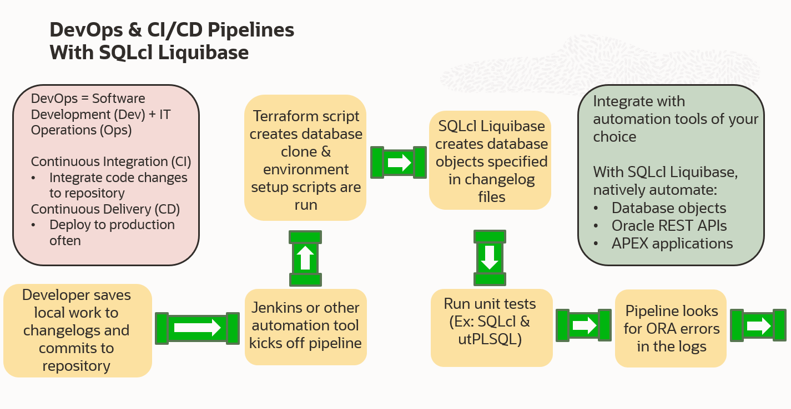
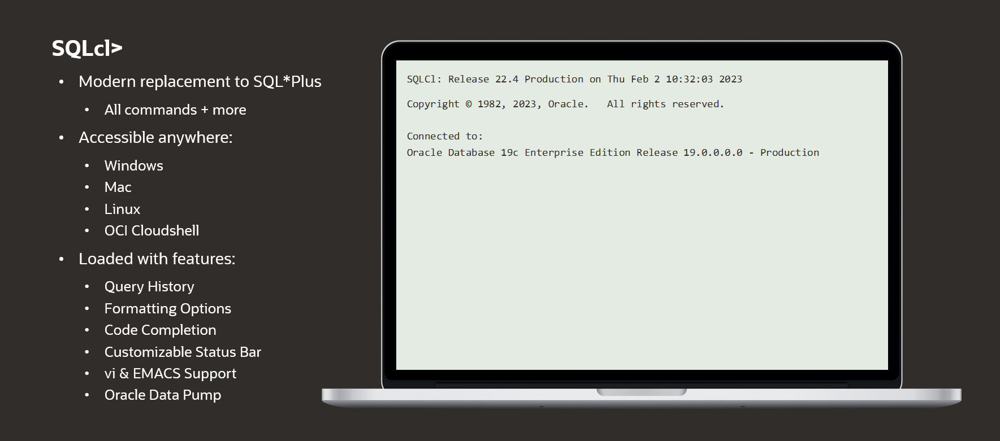
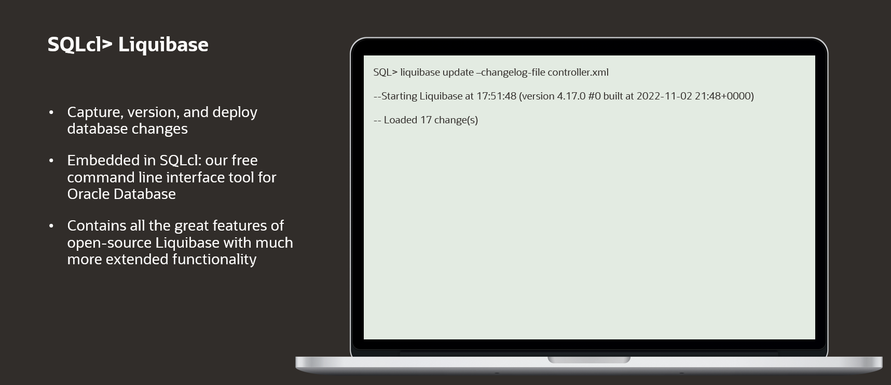
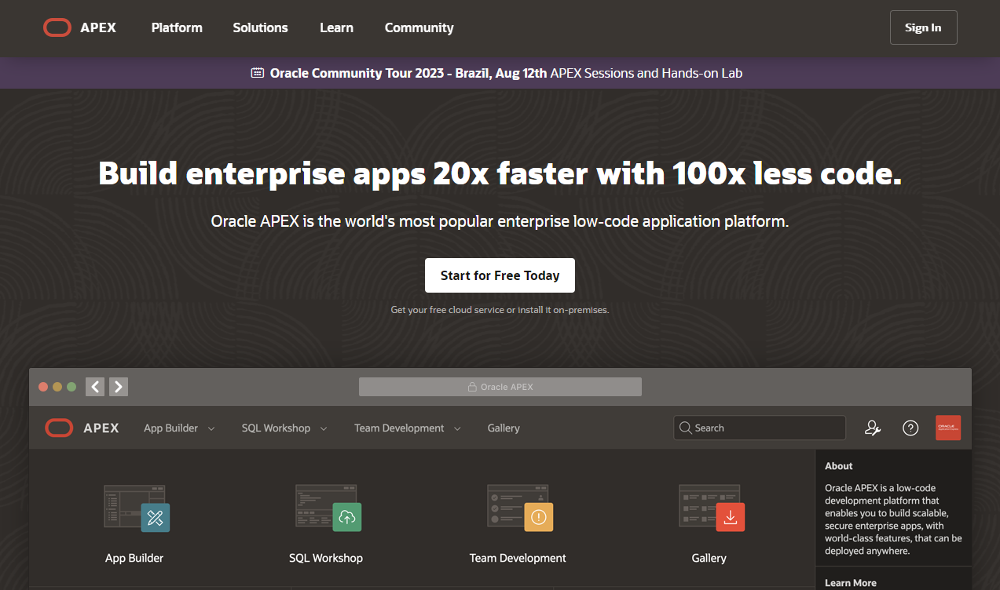
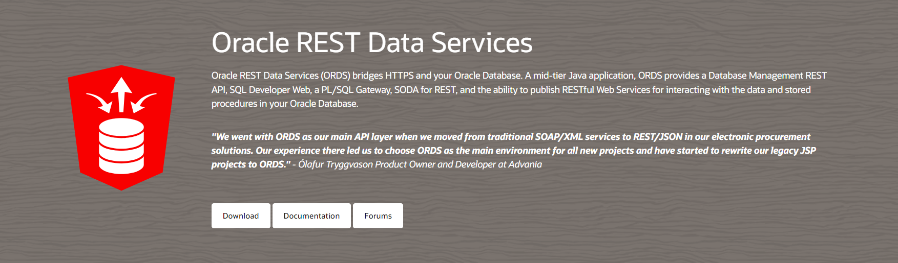
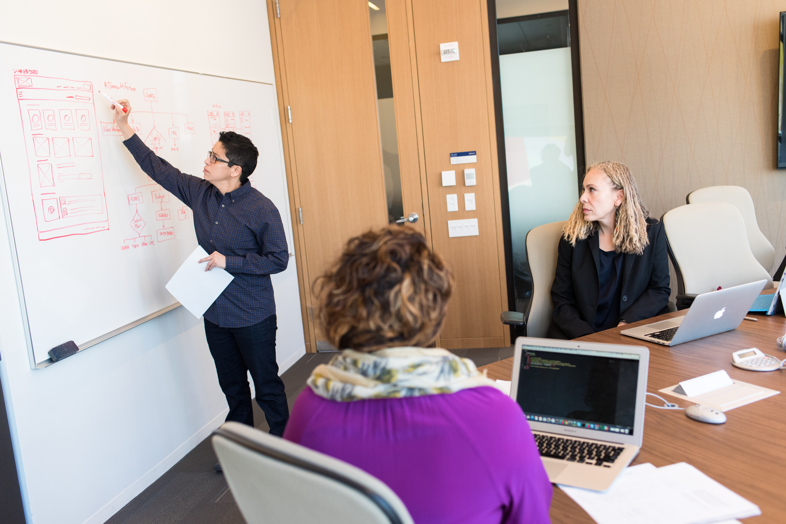

# Introduction

## About this workshop

In this workshop you will learn how you can automatically deploy APEX applications, REST APIs, and database objects to new databases in a matter of minutes using SQLcl's enhanced Liquibase feature.


With a few simple commands, you can capture sections of, or entire Oracle Database schemas into version control compatible Liquibase files called changelogs. These changelogs can then be deployed to recreate its contents in other users or databases entirely.

These labs will walk you through a full stack scenario where you will be given changelogs to not just deploy and update a core application, but also REST APIs, database objects, and data to power and enhance it.

With SQLcl Liquibase you can integrate database change automation into your larger CI/CD (Continuous Integration/Continuous Delivery) pipeline.


**Note:** Example database section of a CI/CD pipeline utilizing SQLcl Liquibase. Changelogs are the files Liquibase saves database objects to. 

*Estimated Workshop Time:* 25 Minutes


### Objectives
Learn to deploy an APEX application and supporting components using SQLcl Liquibase in this hands-on workshop:
* Create an Oracle Autonomous Database
* Create an APEX workspace
* Review your APEX workspace dashboards
* Fetch your database credential wallet
* Upload your Liquibase changelog files
* Connect to your database using SQLcl
* Deploy your APEX application, REST APIs, and database objects
* View your deployments
* Update your APEX application


### Prerequisites
This workshop requires an Oracle Cloud account or your own Oracle Database with SQLcl installed on your computer and an APEX instance.

For using your own Oracle Database, you may skip any workshop areas that don't apply to you (such as the create your Autonomous Database steps in [Lab 1: Setup](../workshops/tenancy/?lab=lab1-setup)) and simply input your connection credentials into SQLcl.

You may now **proceed to the next section**.

## How this workshop can help you


By automating your Oracle Database deployments with SQLcl Liquibase, you are unlocking a new level of control with your database not possible before. Create, update, and rollback environments with speed and precision so that you can save time, avoid manual errors, and check tedious tasks off your to do list.

Building off of the database object automation technology of open-source Liquibase, SQLcl Liquibase injects significant enhancements into this tool such as being able to capture and deploy: individual database objects, applications built using Oracle APEX, and Oracle REST APIs.

While the [Take Control of Your Database With Automated Schema Changes](https://apexapps.oracle.com/pls/apex/f?p=133:180:13297437230967::::wid:3692) workshop focuses on giving you a 101 bootcamp of the core SQLcl Liquibase concepts, **Deploy APEX Apps In The Time It Takes To Make Your Morning Coffee** focuses on giving you a bird's eye view of how your different deployment options can come together to create a powerful full stack development project utilizing database objects, data, and REST APIs to power your core application.


Complete [Take Control of Your Database With Automated Schema Changes](https://apexapps.oracle.com/pls/apex/f?p=133:180:13297437230967::::wid:3692) and **Deploy APEX Apps In The Time It Takes To Make Your Morning Coffee** in any order you please. Both were designed to stand on their own and introduce you to the necessary concepts for full workshop understanding as you progress through the labs; no matter your experience level with Liquibase.

## SQLcl



SQLcl (Structured Query Language command line) is a free tool for the Oracle Database that lets you connect to your database and execute SQL, PL/SQL, and SQL*Plus commands directly from the command line.

It’s a modern replacement to SQL\*Plus, our legacy command line interface solution for working with the Oracle Database. SQLcl contains all of SQL\*Plus’ commands and more.

SQLcl is loaded with features such as:
* Query History
* Formatting Options
* Code Completion
* Customizable Status Bar
* vi & EMACS Support
* Oracle Data Pump
* Liquibase

You can learn more in our [Documentation](https://docs.oracle.com/en/database/oracle/sql-developer-command-line/)

It’s available on Windows, Mac, Linux, and is also automatically embedded in our command prompt for [Oracle Cloud Infrastructure (OCI)](https://www.oracle.com/cloud/), Cloud Shell. You can download it directly from our website [Download Page](https://www.oracle.com/database/sqldeveloper/technologies/sqlcl/download/)

## SQLcl's Liquibase feature



SQLcl Liquibase is a database change management tool that allows you to capture, version, and deploy database changes simply and in an automated fashion. This cuts back on manual work such as recreating tables, making sure database object change scripts are properly working, and rolling back unwanted alterations.

You capture database objects such as tables, procedures, and constraints with one of the ````liquibase generate```` commands which then saves these objects to files called changelogs. Within changelog files are metadata information and changeset sections. Changesets are the actual set of instructions for the database changes being applied. These changeset instructions are the specific information being read when you run the ````liquibase update```` command to populate a new database user schema or update an existing one.

With SQLcl Liquibase, you can capture database objects on one user schema and use the changelogs to recreate these objects on a different user or Oracle Database entirely.

SQLcl Liquibase is built on top of the open-source Liquibase platform and contains all of its great features with much more extended functionality.

We’ve added commands optimized for capturing:
* The entire Oracle Database schema
* Individual database objects
* Objects for APEX ([Our Low Code Development Platform](https://apex.oracle.com/))
* Oracle REST Data Service (ORDS) objects ([Our API Building and Management Tool](https://www.oracle.com/database/technologies/appdev/rest.html))

All of these powerful new additions are exclusively for the Oracle Database.

SQLcl Liquibase is automatically included in our free command line interface tool: [SQLcl](https://www.oracle.com/database/sqldeveloper/technologies/sqlcl)

## Oracle APEX



Oracle Application Express (APEX) is a low code development platform for building powerful, secure, and scalable enterprise web and mobile applications.

With APEX, on average developers are able to build applications 20x faster with 100x less code. Combined with SQLcl's Liquibase feature, you can now deploy this power with speed, efficiency, and automation.

Oracle APEX comes free with your Oracle Database. You can learn more about APEX: [HERE](https://apex.oracle.com/)

## Oracle REST Data Services (ORDS)



Oracle REST Data Services (ORDS) is a tool to easily build powerful and secure REST APIs for the Oracle Database. These REST APIs allow you to seamlessly connect your applications and data.

Using SQLcl Liquibase, you can capture, deploy, and update REST APIs you create with ORDS to other database users or Oracle Databases entirely.

Oracle REST Data Services is included for free with your Oracle Database. You can learn more: [HERE](https://www.oracle.com/dk/database/technologies/appdev/rest.html)

## DevOps & Continuous Integration/Continuous Delivery (CI/CD)



The main objective of SQLcl Liquibase is to help you save time, energy, and money by freeing yourself of repetitive, tedious, and error prone tasks so that your DevOps and CI/CD processes are more efficient.

DevOps is a combination of software development (Dev) and IT operations (Ops). It is a philosophy aimed at seeking to shorten the software development lifecycle through the investigation and application of tools and practices. Traditionally a DevOps centered mindset seeks to erode the silos between development and operations teams so that better communication, collaboration, and automation can be achieved.

Continuous Integration/Continuous Delivery (CI/CD) falls within the umbrella of DevOps and specifically focuses on the combined practices of continuous integration and continuous delivery.

Continuous Integration (CI) is the act of regularly and frequently integrating your code changes into the main branch of your team’s shared code repository.

Continuous Integration done efficiently and effectively seeks to automate the tasks of:
* Creating new builds when you merge your code changes to your team’s repository
* Running tests against these builds.

While Continuous Integration focuses on automatically creating software builds from your team’s changes and testing them, Continuous Delivery (CD) by extension focuses on streamlining the software release process and seeks to deploy changes to production as early as possible and frequently. This breaks up released software changes into smaller batches making it easier to identify, troubleshoot, and address bugs.

The CD in CI/CD along with referring to Continuous Delivery, can additionally (and less frequently) refer to Continuous Deployment. While groups might vary on their specific interpretations of the difference between Continuous Delivery and Continuous Deployment, it is generally considered that Continuous Delivery is focused on creating simple and repeatable delivery steps to release software, which often includes automating elements of this process, whereas Continuous Deployment is about intentionally seeking to automate the entire release process or as much of it as possible.  


## Learn More
* [SQLcl Liquibase 101 LiveLabs Workshop](https://apexapps.oracle.com/pls/apex/f?p=133:180:1722441206322::::wid:3692)
* [Download (SQLcl)](https://www.oracle.com/database/sqldeveloper/technologies/sqlcl/download/)
* [Product Page (SQLcl)](https://www.oracle.com/database/sqldeveloper/technologies/sqlcl/)
* [Documentation (SQLcl & SQLcl Liquibase)](https://docs.oracle.com/en/database/oracle/sql-developer-command-line/)
* [Get Started (APEX)](https://apex.oracle.com/en/learn/getting-started/)
* [Product Page (APEX)](https://apex.oracle.com/en/)
* [Documentation (APEX)](https://apex.oracle.com/en/learn/documentation/)
* [Download (Oracle REST Data Services)](https://www.oracle.com/database/sqldeveloper/technologies/db-actions/download/)
* [Product Page (Oracle REST Data Services)](https://www.oracle.com/dk/database/technologies/appdev/rest.html)
* [Documentation (Oracle REST Data Services)](https://docs.oracle.com/en/database/oracle/oracle-rest-data-services/)
* Blog Posts/Articles
    * [CI/CD With Oracle Database and APEX](https://www.thatjeffsmith.com/archive/2021/04/ci-cd-with-oracle-database-and-apex/)
    * [SQLcl Liquibase in 6 Minutes](https://www.talke.tech/blog/learn-sqlcl-liquibase-in-6-minutes)
    * [Data Definition Language (DDL) Settings with SQLcl & Liquibase](https://www.thatjeffsmith.com/archive/2023/01/physical-properties-in-oracle-table-liquibase-changesets/)
    * [How to Run SQLcl Liquibase Updates in Different Target Schemas](https://www.thatjeffsmith.com/archive/2022/12/run-liquibase-updates-for-a-specific-schema-with-sqlcl/)
    * [Use JSON, XML, and YAML Formats With SQLcl Liquibase](https://www.thatjeffsmith.com/archive/2022/12/how-to-use-json-xml-yaml-liquibase-changesets-in-sqlcl/)
    * [What's The Difference Between An Oracle Database Schema & User](https://www.talke.tech/blog/whats-the-difference-between-a-db-schema-and-db-user)

## Acknowledgements

- **Author** - Zachary Talke, Senior Product Manager
- **Last Updated By/Date** - Zachary Talke, August 2023
