# Lab 2: Deploy Your APEX Application, REST APIs, and Database Objects

## Introduction
Welcome to Lab 2!


In this lab you will be provided the Liquibase changelog files that contain the APEX application, REST APIs and database objects that you will be deploying. You'll then connect to your database using SQLcl and run the changelogs using the Liquibase feature to create these components.

There will be two versions of the application you will be deploying. The first is pretty barebones. Once you confirm that the initial application and other components are successfully created, you'll be using the second set of application changelogs to showcase that not only can you use SQLcl Liquibase to import new applications, but additionally update existing ones.
   * The updated application will make use of your REST APIS, database objects, and data you import to generate an in-app report page

Estimated Time: 10 minutes

Watch the video below for a quick walk-through of the lab.
[Lab 2](videohub:1_bv11h5z8)

### Objectives
In this lab, you will:

-   Fetch your database credential wallet
-   Upload your Liquibase changelog files
-   Connect to your database using SQLcl
-   Deploy your APEX application, REST APIs, and database objects
-   View your deployments
-   Update your APEX application

### Prerequisites

Completion of:
-   [Introduction](../workshops/tenancy/?lab=intro)
-   [Get Started](../workshops/tenancy/?lab=cloud-login)
-   [Lab 1: Setup](../workshops/tenancy/?lab=lab1-setup)


## Task 1: Fetch Your Database Credential Wallet

 1. Now that your Autonomous Database and APEX Workspace are created, let's get ready to connect to your database using SQLcl.
    * You can do this from the Oracle Cloud dashboard by selecting the < > icon in the top right and clicking **Cloud Shell**.
        * Cloud Shell provides a Linux terminal in your Oracle Cloud webpage with a pre-authenticated Oracle Cloud Infrastructure (OCI) Command Line Interface (CLI) connected to it.

    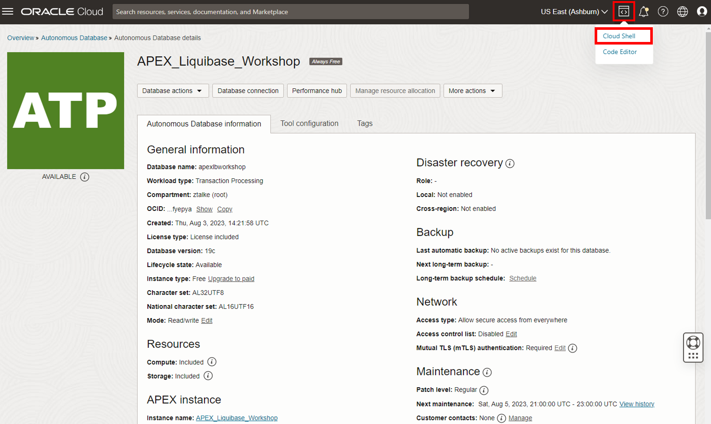

 2. On the bottom of your screen you'll see the Cloud Shell interface appear.

    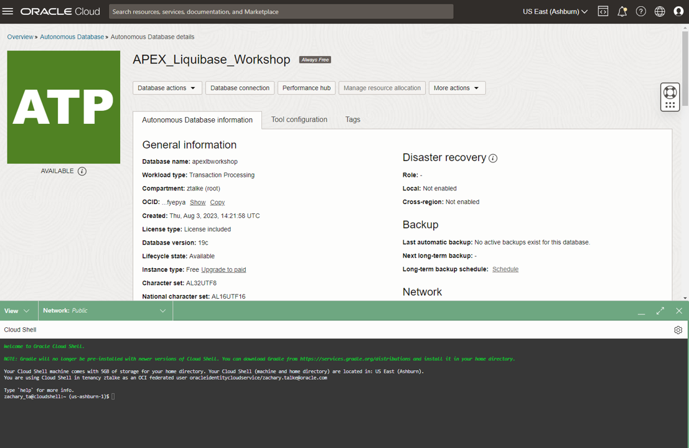

 3. Let's grab your connection credentials you will need to connect to your database. You can fetch your credential wallet with the following command.

    ```na
    <copy>
    oci db autonomous-database generate-wallet --generate-type ALL --file Wallet_APEXworkshop.zip --password [Insert Password] --autonomous-database-id [Insert OCID]
    </copy>
    ```

    * Before you paste the command in the Cloud Shell command prompt, place it in a text editor and edit the following areas (make sure to remove the brackets):
        * Replace [Insert Password] with a password of your choice for your wallet
            * The wallet password cannot contain special characters such as $
        * Replace [Insert OCID] with your Autonomous Database OCID
            * This can be found under your "Autonomous Database information" tab
   
    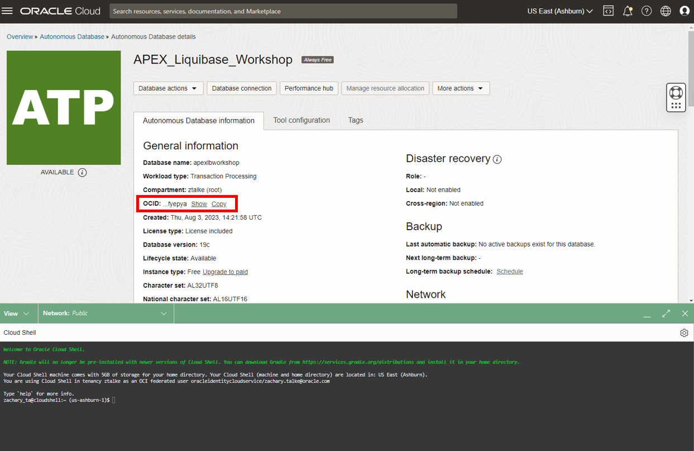

 4. Now you can place the command into Cloud Shell and generate your wallet.

    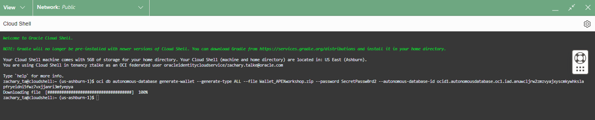

## Task 2: Upload Your Liquibase Changelog Files

 1. Before you connect to your database, let's upload the files that contain the APEX applications, REST APIs, and database objects you will be deploying.
    * Select the settings gear in the top right of the Cloud Shell interface then click "Upload".

    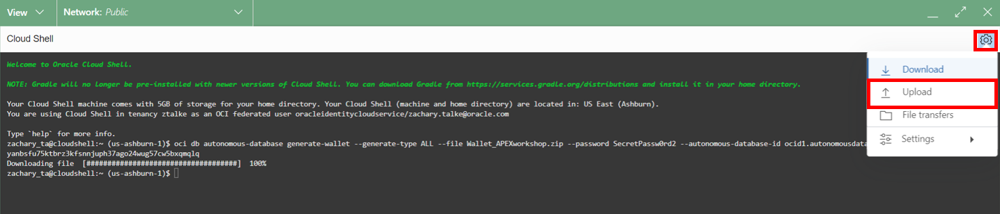

 2. Download [workshop_changelogs.zip](https://c4u04.objectstorage.us-ashburn-1.oci.customer-oci.com/p/EcTjWk2IuZPZeNnD_fYMcgUhdNDIDA6rt9gaFj_WZMiL7VvxPBNMY60837hu5hga/n/c4u04/b/livelabsfiles/o/developer-library/workshop_changelogs.zip) by clicking the link.
    * This contains the files you'll be using.

 3. Once that zip file has downloaded to your computer, select it in the "File Upload to your Home Directory" menu and click Upload.

    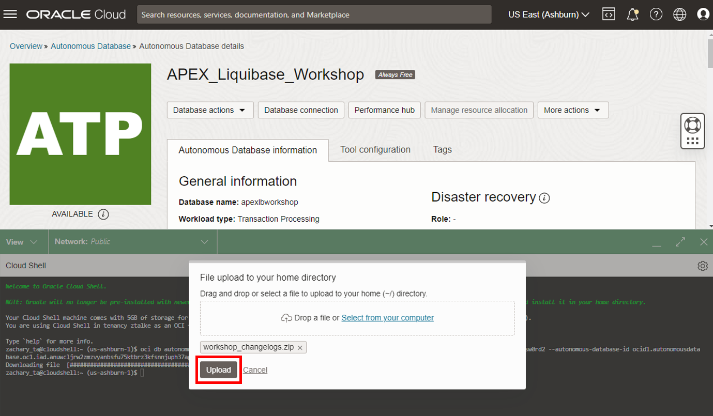

 4. There will be a notification in the top right "File Transfers" window when the upload is complete.

    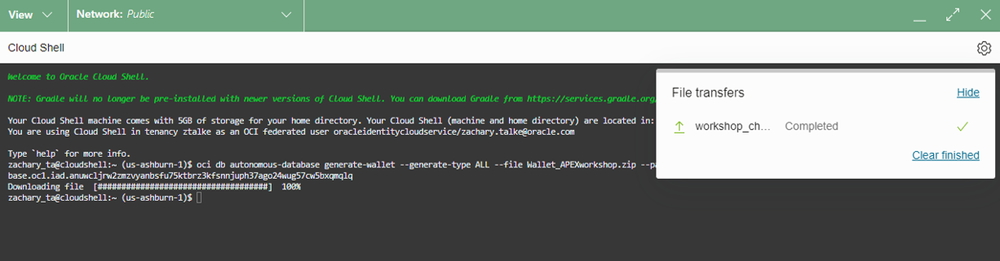

 5. Let's now unzip the workshop_changelogs folder in the Cloud Shell command line using the `unzip` Linux command.
    * `unzip` decompresses your files in the zip folder/directory. The -d option you will use extracts those files and subdirectories to a different directory in the format of `unzip -d [new/existing directory to extract to] [zip file/folder to extract from]`.

    ```na
    <copy>
    unzip -d workshop_changelogs workshop_changelogs.zip
    </copy>
    ```

    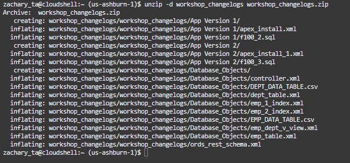

 6. You can view your wallet and changelog folder with the Linux list (`ls`) command

    ```na
    <copy>
    ls
    </copy>
    ```

    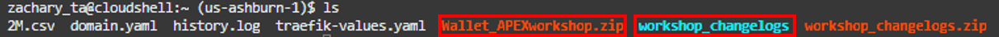

## Task 3: Connect To Your Database Using SQLcl

 1. Now that your workshop and SQLcl Liquibase files are downloaded, it's time to connect to SQLcl!

    ```na
    <copy>
    sql /nolog
    </copy>
    ```

    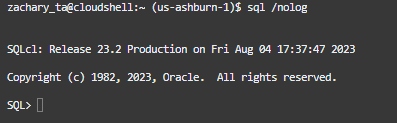

 2. Set cloudconfig to Wallet_APEXworkshop.zip so SQLcl knows to read your credentials from this wallet. In the `set cloudconfig` command below replace [OCI CLI Profile Name] with your profile name.
    * This is the name to the left of `@cloudshell` in your command prompt before you logged in to SQLcl.


    ```na
    <copy>
    set cloudconfig /home/[OCI CLI Profile Name]/Wallet_APEXworkshop.zip
    </copy>
    ```

    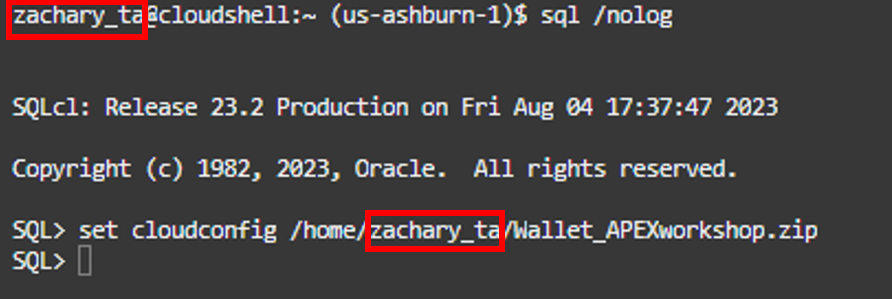

 3. Use the command `show tns` to show connection information.
    * Transparent Network Substrate (TNS) is an Oracle networking technology that serves as the foundational component for all of our network products.

    ```na
    <copy>
    show tns
    </copy>
    ```

    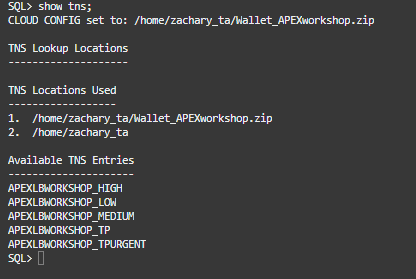

 4. Next, run the `connect` command to connect to your **WKSP_LIQUIBASEDEMO** database user that your APEX workspace is contained on.
    * Under the "Available TNS Entries" section of the `show tns` command, there are 3 connections by default for Autonomous Data Warehouse (ADW) and 5 for Autonomous Transaction Processing (ATP). The names are designated by `[database name]_[connection level]`.
    * These workshop instructions will use `apexlbworkshop_low` in the command below.

    ```na
    <copy>
    connect wksp_liquibasedemo@apexlbworkshop_low
    </copy>
    ```

    * If you prefer to use a different connection, simply replace the command with that connection. If you encounter any "cannot read/modify an object after modifying it in parallel" ORA errors while using other connection types with Liquibase, switch to the low connection type where parallelism is not active.
         * apexlbworkshop_high
            * High priority application connection service for reporting and batch operations. All operations run in parallel and are subject to queuing.
         * apexlbworkshop_medium
            * A typical application connection service for reporting and batch operations. All operations run in parallel and are subject to queuing. Using this service, the degree of parallelism is limited to four.
         * apexlbworkshop_low
            * A lowest priority application connection service for reporting or batch processing operations. This connection service does not run with parallelism.
         * apexlbworkshop_tpurgent (ATP only)
            * The highest priority application connection service for time critical transaction processing operations. This connection service supports manual parallelism.
         * apexlbworkshop_tp (ATP only)
            * A typical application connection service for transaction processing operations. This connection service does not run with parallelism.

 5. Enter your **WKSP_LIQUIBASEDEMO** password at the prompt.
    * This is the database password you set in [Lab 1: Setup Task 2 Step 6](../workshops/tenancy/?lab=lab1-setup#Task2:CreateYourAPEXWorkspace) when you were creating your APEX Workspace

    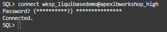

## Task 4: Deploy Your APEX Application, REST APIs, and Database Objects

 1. You are now connected to your **WKSP_LIQUIBASEDEMO** user. You can now start deploying your changelogs.
    * Let's start with creating your database objects and data that your APEX application will make use of.
    * First you will need to switch to the directory containing them using the change directory (`cd`) command.
    * Using the `ls` command you can confirm that you are in the correct directory containing the files shown in the screenshot.
        * In SQLcl, you can input a command directly to your operating system’s command line by putting a ! in front of it as is being done with `ls` here.

    ```na
    <copy>
    cd ~/workshop_changelogs/workshop_changelogs/Database_Objects
    !ls
    </copy>
    ```

    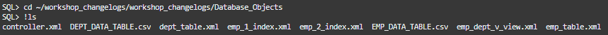

 2. Use the `liquibase update` command to read your database object changelog files and create the objects specified in them.
    * The `-changelog-file` mandatory parameter designates the Liquibase file to be ran.
        * Because you will be populating an entire database schema full of objects, the file you will be specifying is `controller.xml`.
            * This file manages the deployment of all the individual database object changelog files saved in this folder and makes sure they are ran in the proper order
            * If you only wanted to deploy one database object such as the department table, you can do so by just specifying that individual changelog file (`dept_table.xml`) in this field
    * If asked for a password, enter your **WKSP_LIQUIBASEDEMO** database user password you used to connect.

    ```na
    <copy>
    liquibase update -changelog-file controller.xml
    </copy>
    ```

    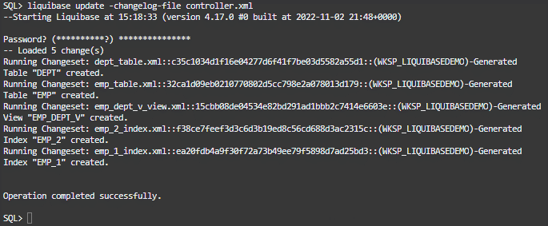

 3. Next let's run the the two CSV files also saved in this folder to populate our DEPT (Department) and EMP (Employees) tables with data.

    ```na
    <copy>
    load table dept DEPT_DATA_TABLE.csv
    load table emp EMP_DATA_TABLE.csv
    </copy>
    ```

    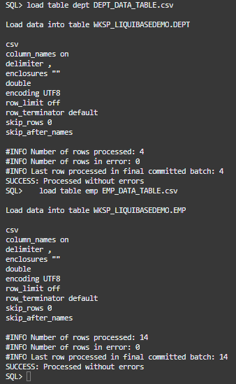

 4. With your database objects created and tables loaded with data, let's create the REST APIs your application will use.
    * Navigate to the folder containing this changelog with the `cd` command
    * You will be running the `ords_rest_schema.xml` file

    ```na
    <copy>
    cd ~/workshop_changelogs/workshop_changelogs
    !ls
    </copy>
    ```

    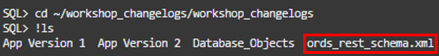

 5. You will now be using that same `liquibase update` command you used to create your database objects to create your Oracle REST Data Services (ORDS) REST API modules.
    * If asked for a password, enter your **WKSP_LIQUIBASEDEMO** database user password you used to connect.

    ```na
    <copy>
    liquibase update -changelog-file ords_rest_schema.xml
    </copy>
    ```

    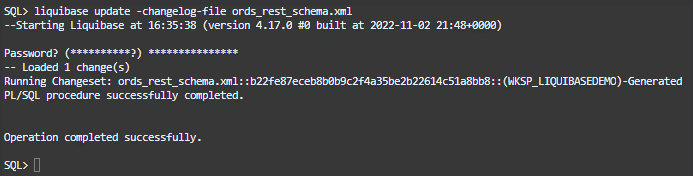

 6. Finally it's time to import the last component, the application itself!
    * Navigate with `cd` to the `App Version 1` directory.

    ```na
    <copy>
    cd ~/workshop_changelogs/workshop_changelogs/App Version 1
    !ls
    </copy>
    ```

    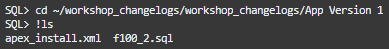

 7. Run the `liquibase update` command on the changelog file `apex_install.xml`.

    ```na
    <copy>
    liquibase update -changelog-file apex_install.xml
    </copy>
    ```

    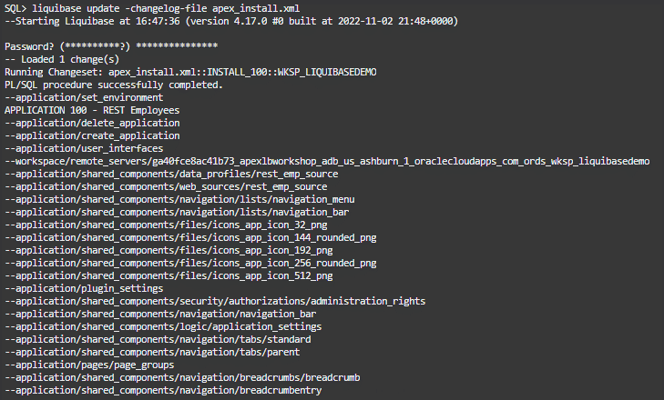   
    **...**
    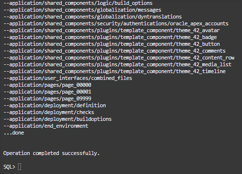

## Task 5: View Your Deployments

 1. Your APEX application, REST APIs, database objects, and data are now all created! Let's return to **Database Actions** and start viewing them.
    * Navigate back to your REST dashboard tab and refresh the page.
       * If you closed out of it, you can navigate back by selecting the **Database actions** dropdown, clicking **REST**, and making sure you are signed in to **WKSP\_LIQUIBASEDEMO**.

    

 2. You can see that your 3 REST API modules you created are now viewable on this dashboard. You can explore the page as you please.

    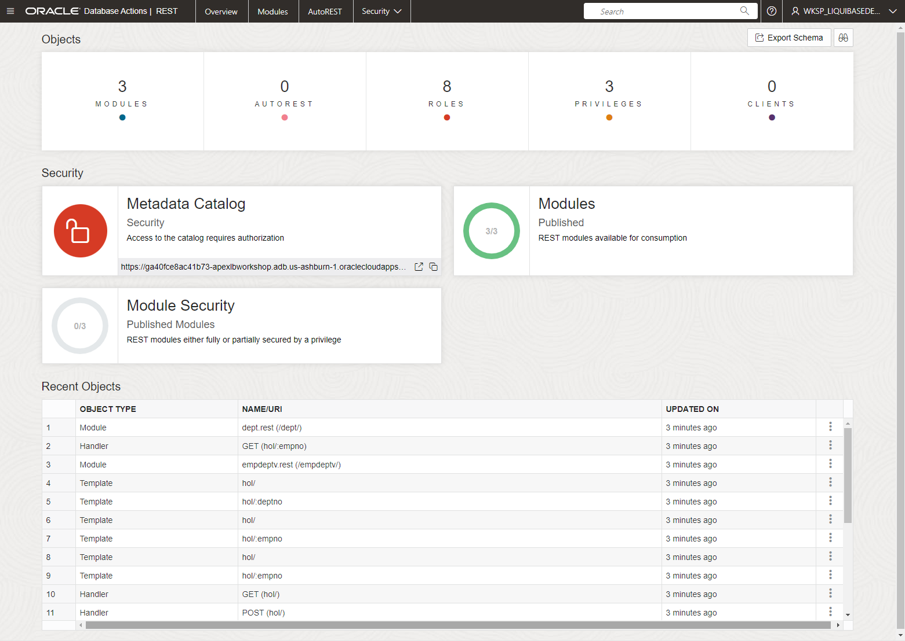

 3. Next let's take a look at your new database objects. 
    * Click the hamburger menu in the top left and select **SQL**

    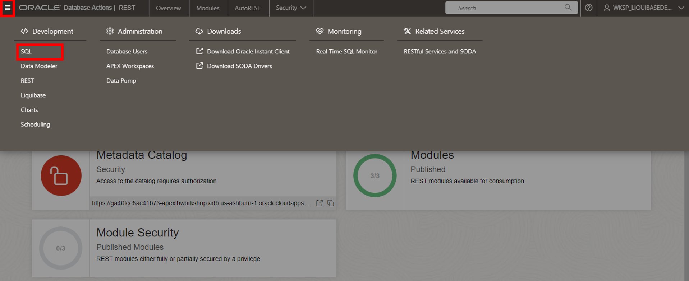

 4. Adjust the middle dropdown in the left hand **Navigator** menu to **All Objects** again. You can now view the database objects you created and expand the dropdown arrows for additional details.

    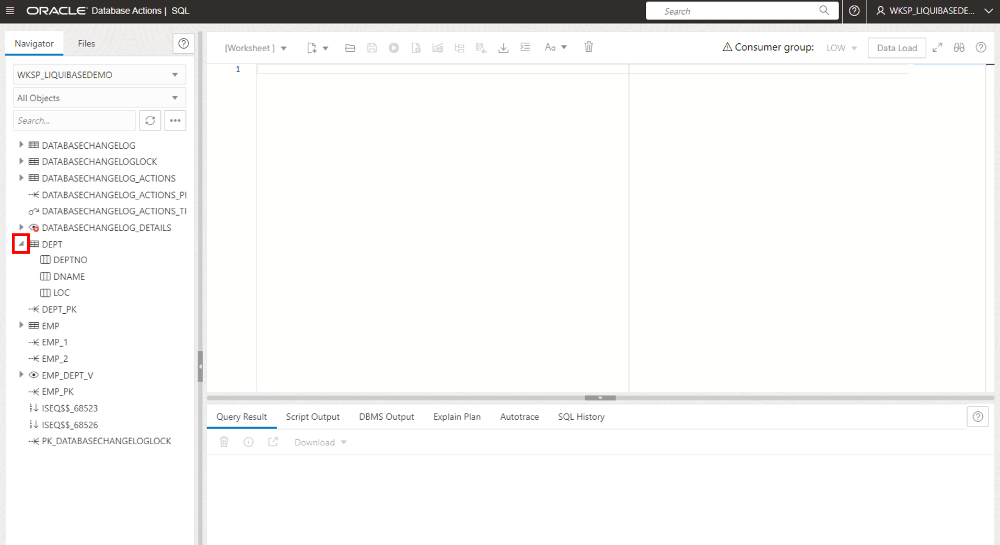

 5. Finally let's return to the APEX dashboard to view your application.
    * You can do this by navigating back to your App Builder tab in your web browser.
        * If you closed out of this tab you can return to it by following similar steps in the setup lab: 
            * Click **APEX\_Liquibase\_Workshop** on your Autonomous Database dashboard under APEX instance
            * Select Launch APEX in the upper left area
            * Sign into your APEX workspace (make sure you are signing into your APEX workspace, not Administration Services)

    

 6. Refresh the page to see that your application card is now available. Hover over the imported **REST Employees** application, and press the play button to run the app.

    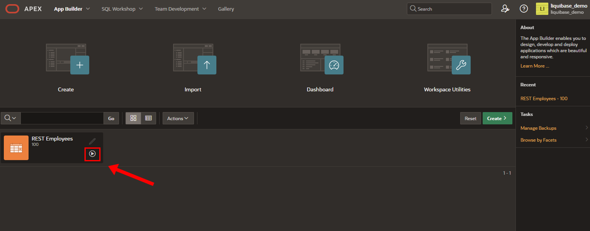

 5. Sign in to the application with your APEX workspace user password.

    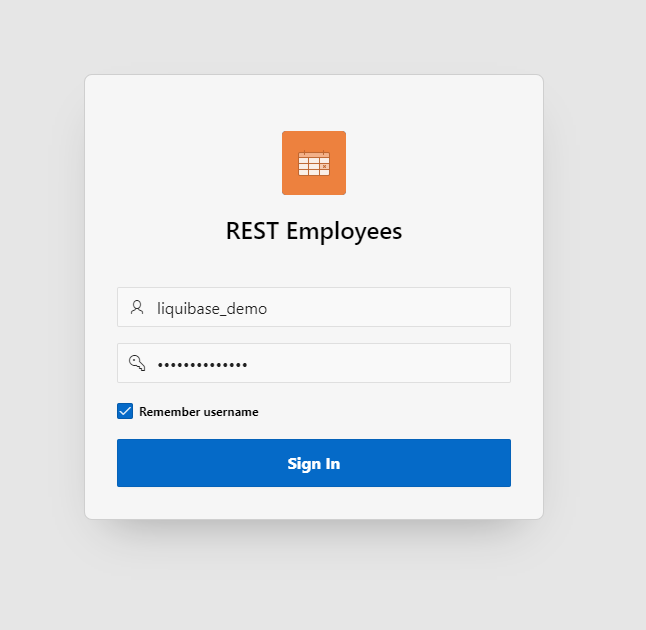

 6. You can now view the application! As you'll notice, even though you successfully imported the app, there isn't much to it yet. With SQLcl Liquibase, not only can you deploy applications to a new APEX workspace and Oracle Database, but you can also update existing applications.
    * In the next task you'll be deploying an update to this application that will add a page with a simple report.

    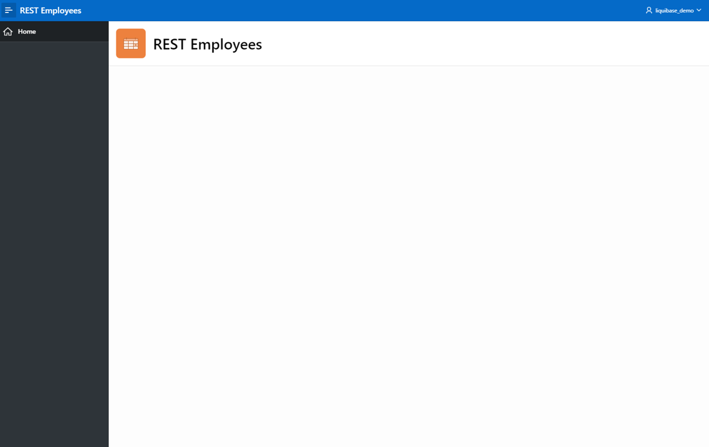


## Task 6: Update Your APEX Application

 1. Navigate back to your Autonomous Database web browser tab where you will be returning to your Cloud Shell SQLcl session.

    

 2. In your Cloud Shell terminal still connected to your database through SQLcl, you'll be going to the directory containing the changelog files for the updated version of your application.

    ```na
    <copy>
    cd ~/workshop_changelogs/workshop_changelogs/App Version 2
    !ls
    </copy>
    ```
    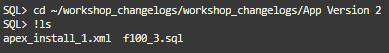

 3. Run the `liquibase update` command on the APEX install changelog in this folder titled `apex_install_1.xml`.

    ```na
    <copy>
    liquibase update -changelog-file apex_install_1.xml
    </copy>
    ```

    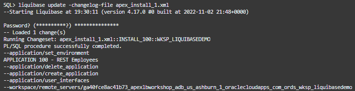   
    **...**
    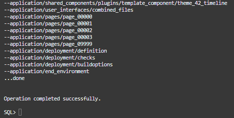

 4. With the changelog ran, your application is now updated. Navigate back to the REST Employees web browser tab where your application is running and refresh the page.

    

 5. Refreshing will most likely make you need to re-login to the application. Enter your workspace user password again.

    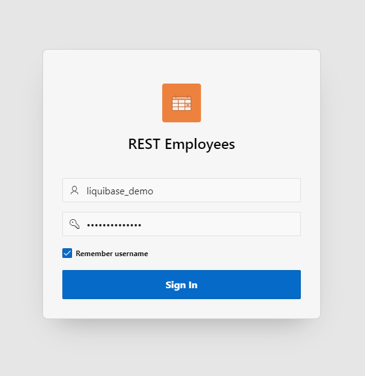

 6. You will now see your APEX app is updated with a report page that you can view by clicking **Employees** in the side bar. This Employees Report utilizes the database objects, data, and REST APIs that you deployed throughout this workshop.

    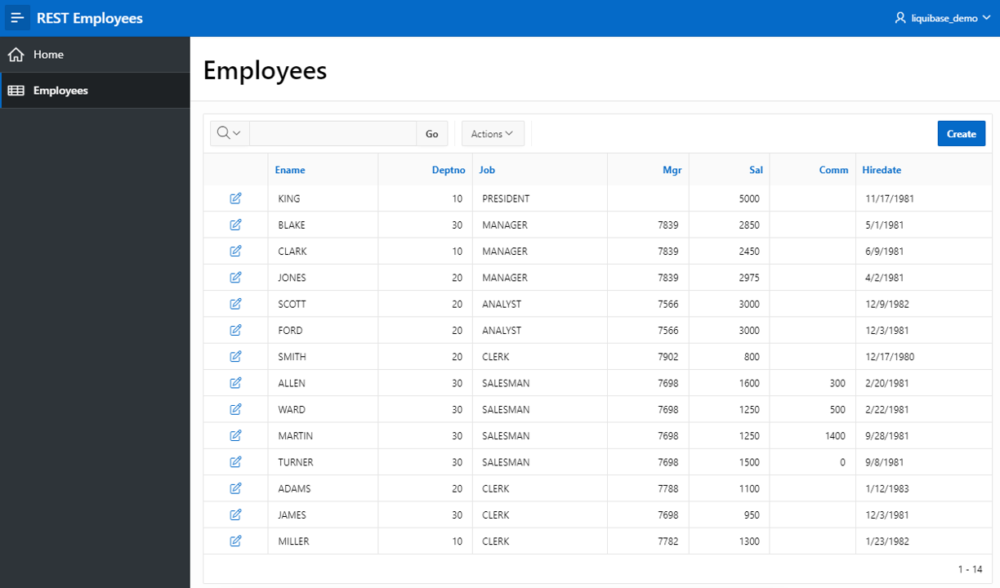

Congratulations! You have now completed the workshop.

## Conclusion
You have completed all the labs in this workshop and learned the fundamentals for deploying a full stack development project with SQLcl Liquibase. 

If you have any questions about SQLcl Liquibase at all, please reach out to Database Tools Product Manager Zachary Talke @:
* zachary.talke@oracle.com
* [LinkedIn](https://www.linkedin.com/in/zachary-talke/)
* [Twitter](https://twitter.com/talke_tech)

For more resources check out the Learn More section below.

Check out [Talke Tech](https://www.talke.tech/) and [thatjeffsmith](https://www.thatjeffsmith.com/) for the latest in SQLcl Liquibase news and educational content.

## Learn more

* [SQLcl Liquibase 101 LiveLabs Workshop](https://livelabs.oracle.com/pls/apex/f?p=133:180:1722441206322::::wid:3692)
* [Download (SQLcl)](https://www.oracle.com/database/sqldeveloper/technologies/sqlcl/download/)
* [Product Page (SQLcl)](https://www.oracle.com/database/sqldeveloper/technologies/sqlcl/)
* [Documentation (SQLcl & SQLcl Liquibase)](https://docs.oracle.com/en/database/oracle/sql-developer-command-line/)
* [Get Started (APEX)](https://apex.oracle.com/en/learn/getting-started/)
* [Product Page (APEX)](https://apex.oracle.com/en/)
* [Documentation (APEX)](https://apex.oracle.com/en/learn/documentation/)
* [Download (Oracle REST Data Services)](https://www.oracle.com/database/sqldeveloper/technologies/db-actions/download/)
* [Product Page (Oracle REST Data Services)](https://www.oracle.com/dk/database/technologies/appdev/rest.html)
* [Documentation (Oracle REST Data Services)](https://docs.oracle.com/en/database/oracle/oracle-rest-data-services/)
* Blog Posts/Articles
    * [CI/CD With Oracle Database and APEX](https://www.thatjeffsmith.com/archive/2021/04/ci-cd-with-oracle-database-and-apex/)
    * [SQLcl Liquibase in 6 Minutes](https://www.talke.tech/blog/learn-sqlcl-liquibase-in-6-minutes)
    * [Data Definition Language (DDL) Settings with SQLcl & Liquibase](https://www.thatjeffsmith.com/archive/2023/01/physical-properties-in-oracle-table-liquibase-changesets/)
    * [How to Run SQLcl Liquibase Updates in Different Target Schemas](https://www.thatjeffsmith.com/archive/2022/12/run-liquibase-updates-for-a-specific-schema-with-sqlcl/)
    * [Use JSON, XML, and YAML Formats With SQLcl Liquibase](https://www.thatjeffsmith.com/archive/2022/12/how-to-use-json-xml-yaml-liquibase-changesets-in-sqlcl/)
    * [What's The Difference Between An Oracle Database Schema & User](https://www.talke.tech/blog/whats-the-difference-between-a-db-schema-and-db-user)

## Acknowledgements

- **Author** - Zachary Talke, Senior Product Manager
- **Last Updated By/Date** - Zachary Talke, May 2024
