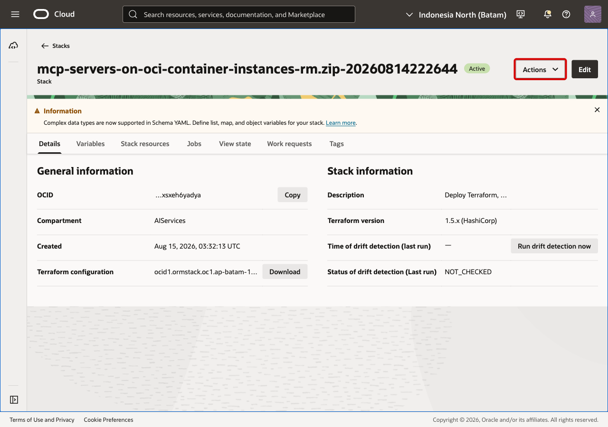
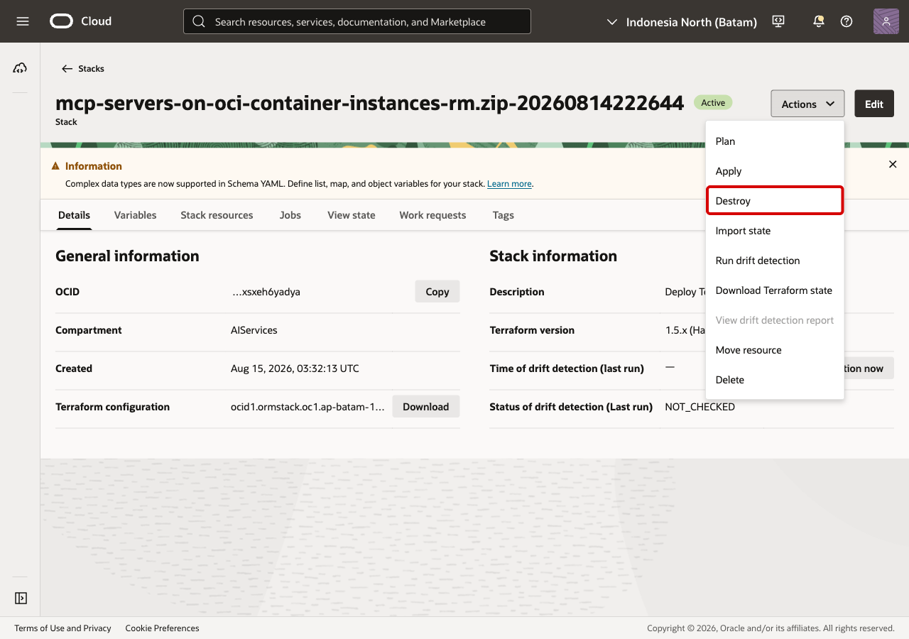
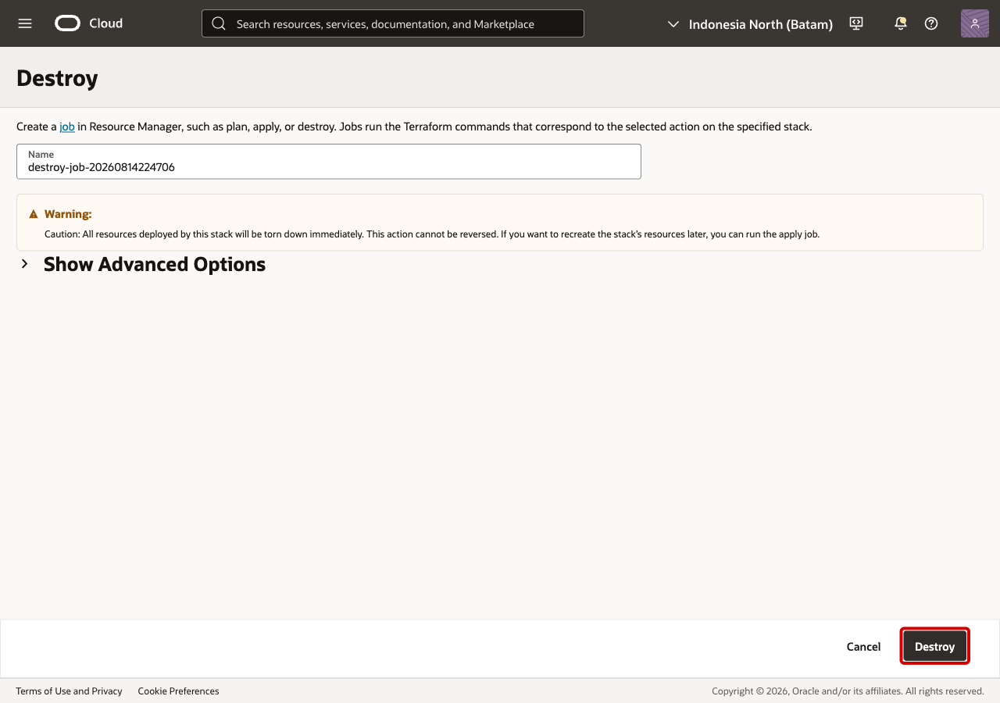

# Lab 7: Clean Up

## Introduction

In this lab, you use Resource Manager to destroy the OCI resources created for
the workshop.

Estimated Time: 10 minutes

### Objectives

In this lab, you will:

* open the Resource Manager stack;
* start the destroy workflow;
* confirm cleanup is complete.

## Task 1: Open the stack actions menu

Open the Resource Manager stack used for this workshop.

Open **Stack actions** and select **Destroy**.

## Task 2: Review the destroy dialog

Review the destroy dialog before continuing.

Select **Destroy** only when you are ready to remove the lab resources.

## Task 3: Confirm cleanup

Wait for the destroy job to complete successfully. After cleanup, the API
Gateway endpoints and Container Instance created by this workshop are no longer
available.

## Task 4: Revoke the GitHub token

If you created a GitHub token for the lab, revoke or delete it after the
workshop.

## Acknowledgements

* **Kevin Liu**, Lead Principal Product Manager
* **Adekola Okunola**, Cloud Solution Engineer
* **Last Updated By/Date** - Adekola Okunola, Cloud Solution Engineer, August 2026
