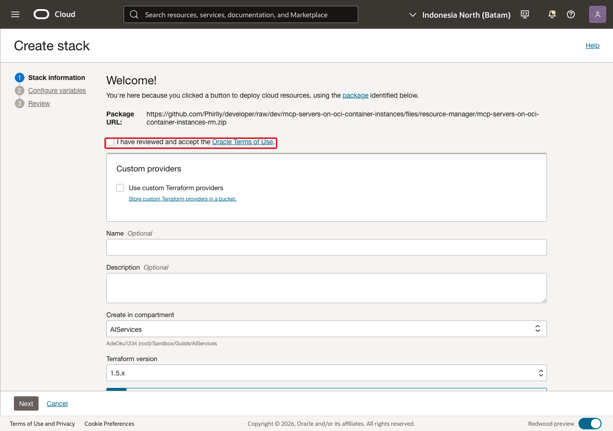
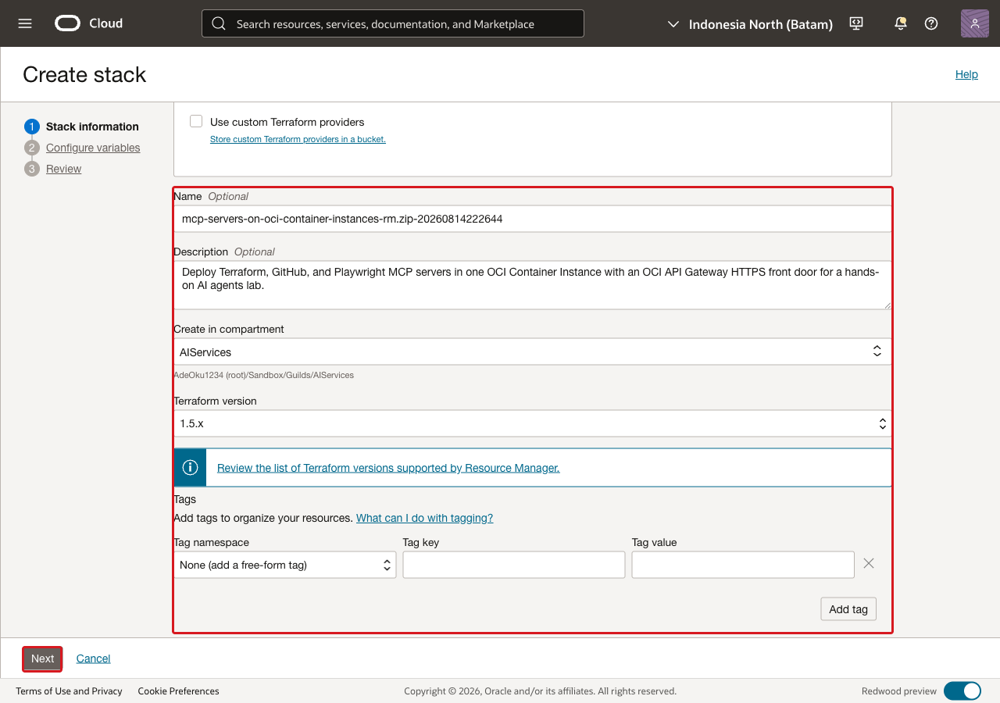
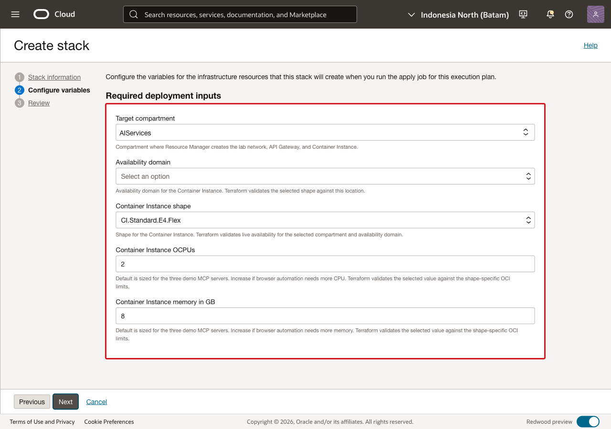
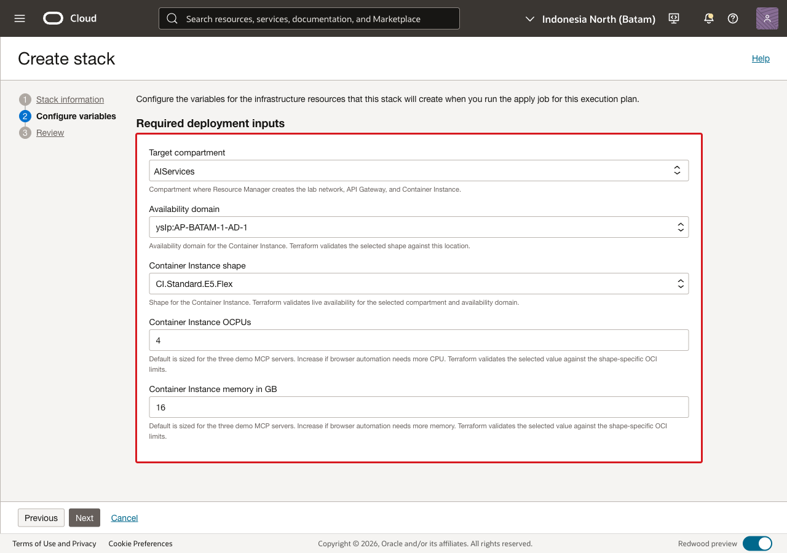
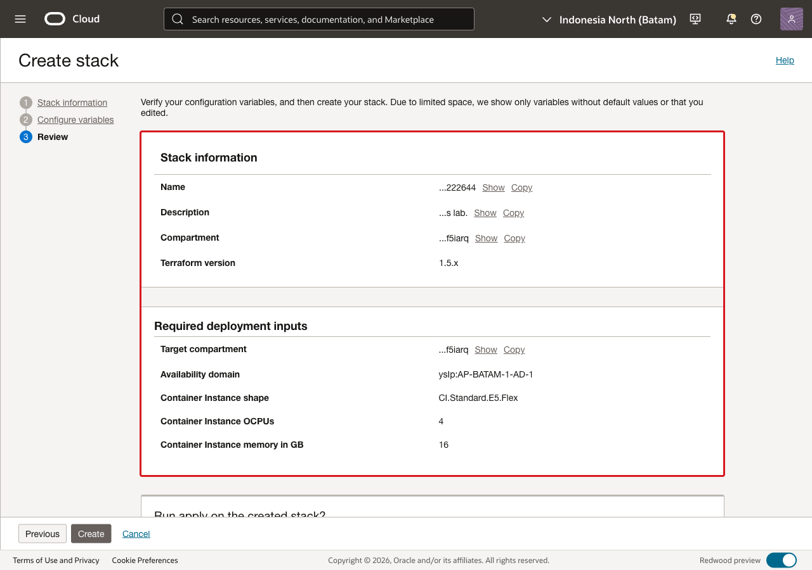
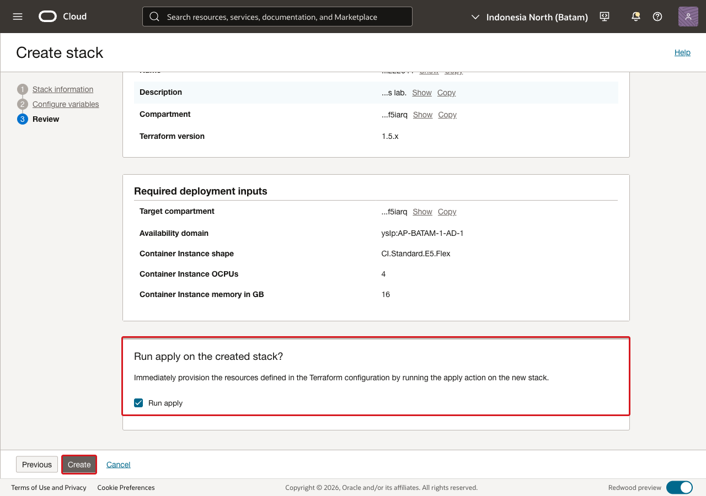

# Lab 1: Deploy the MCP Servers

## Introduction

In this lab, you create an OCI Resource Manager stack from the workshop package
and run the apply job. Resource Manager creates the OCI networking, API Gateway,
Container Instance, and three MCP server containers.

Estimated Time: 15 minutes

### Objectives

In this lab, you will:

* launch the Resource Manager stack from the Deploy to Oracle Cloud button in
  this lab;
* select the required deployment inputs;
* review the stack configuration;
* run the apply job.

### Prerequisites

Complete the workshop introduction and the Get Started lab. Make sure you can
access an OCI tenancy and a compartment where you can create Resource Manager,
networking, API Gateway, and Container Instance resources.

## Task 1: Launch the Resource Manager stack

1. Select **Deploy to Oracle Cloud**.

    

    

2. Confirm Resource Manager opens the **Create stack** page with the workshop
    package loaded.

## Task 2: Complete stack information

1. On the **Stack information** page:

    * keep the package source selected;
    * choose the compartment where the stack definition should be stored;
    * accept the Oracle terms of use.

    

2. Select **Next**.

## Task 3: Configure variables

1. On the **Configure variables** page, select the deployment values for your
    tenancy.

    

2. Review the required inputs:

    * **Target compartment**: the compartment where the lab resources will be
      created.
    * **Availability domain**: the availability domain for the Container
      Instance.
    * **Container Instance shape**: one of the shape choices available in the
      form.
    * **Container Instance OCPUs**: prefilled, but editable.
    * **Container Instance memory in GB**: prefilled, but editable.

3. Compare your values with the validated workshop run:

    * shape: `CI.Standard.E5.Flex`
    * OCPUs: `4`
    * memory: `16` GB

    You may use a different available shape or size if your tenancy requires it.

    

4. Select **Next**.

## Task 4: Review and create the stack

1. Review the stack configuration.

    

2. Select **Run apply**, then select **Create**.

    

3. Confirm Resource Manager starts the apply job.

4. You may now **proceed to the next lab**

## Acknowledgements

* **Kevin Liu**, Lead Principal Product Manager
* **Adekola Okunola**, Cloud Solution Engineer
* **Last Updated By/Date** - Adekola Okunola, Cloud Solution Engineer, August 2026
