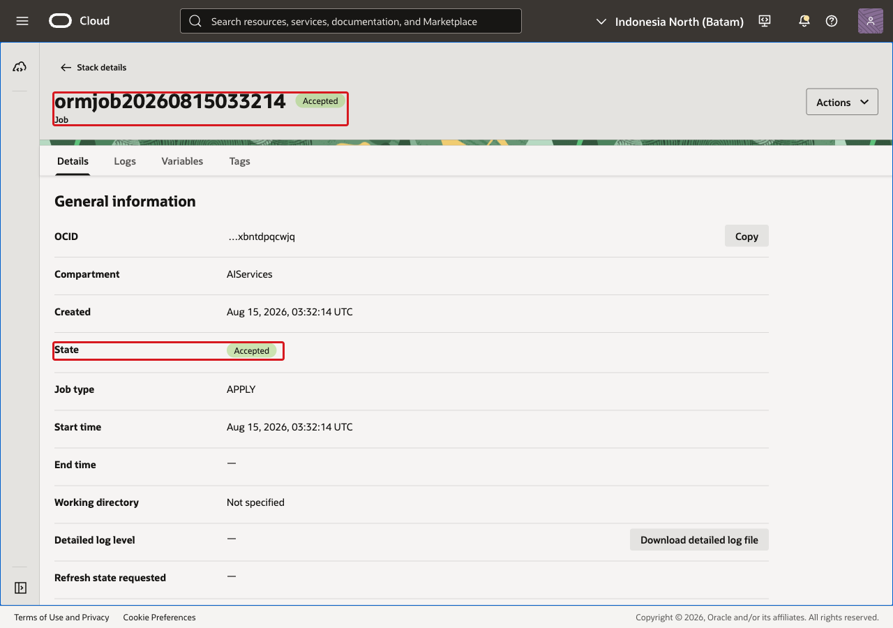
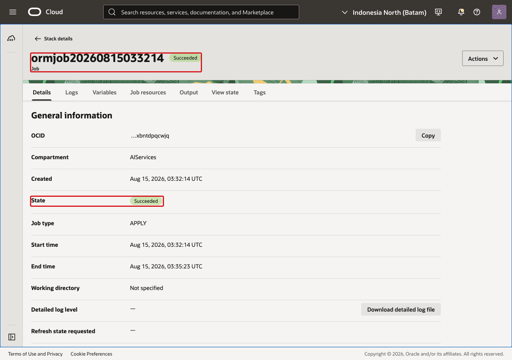
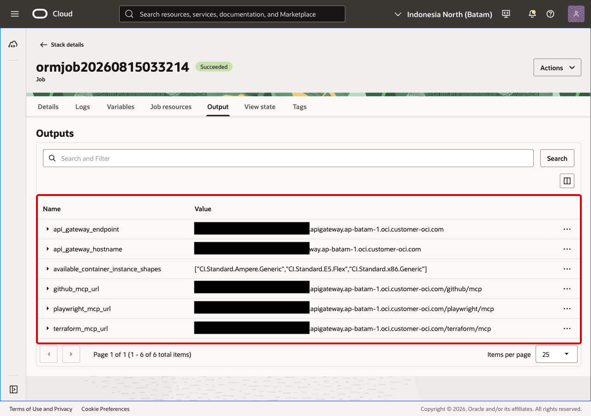
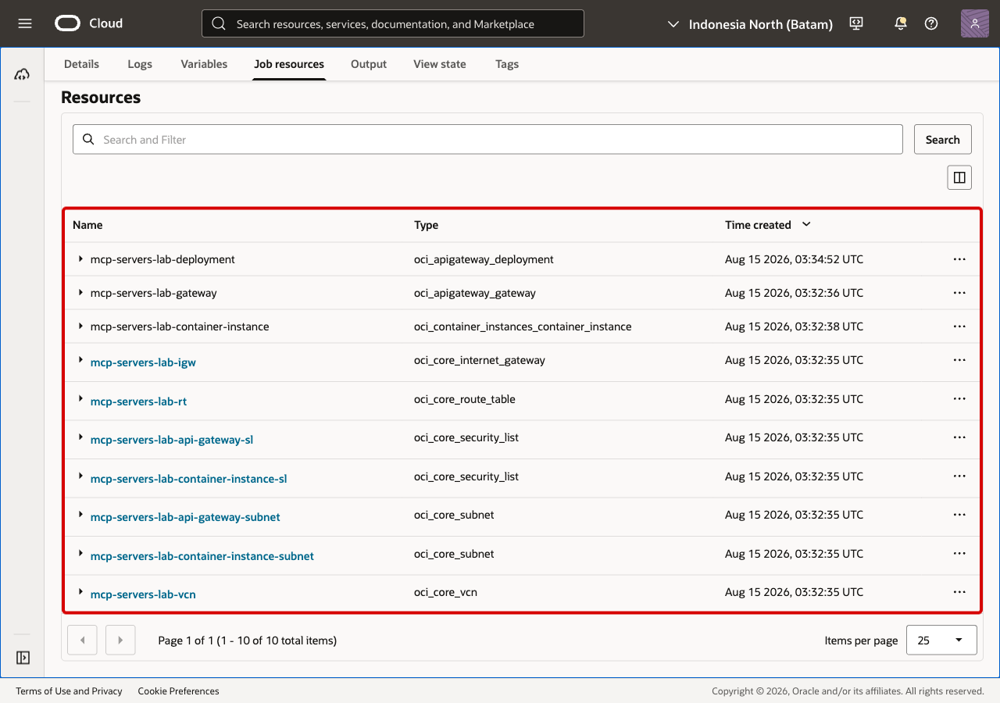
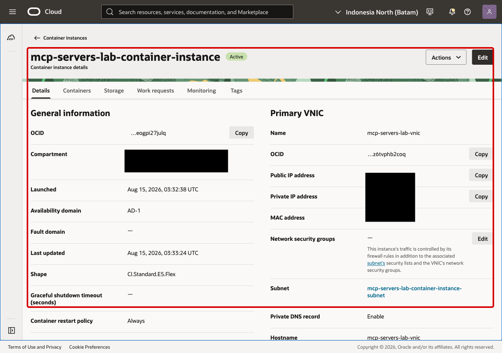
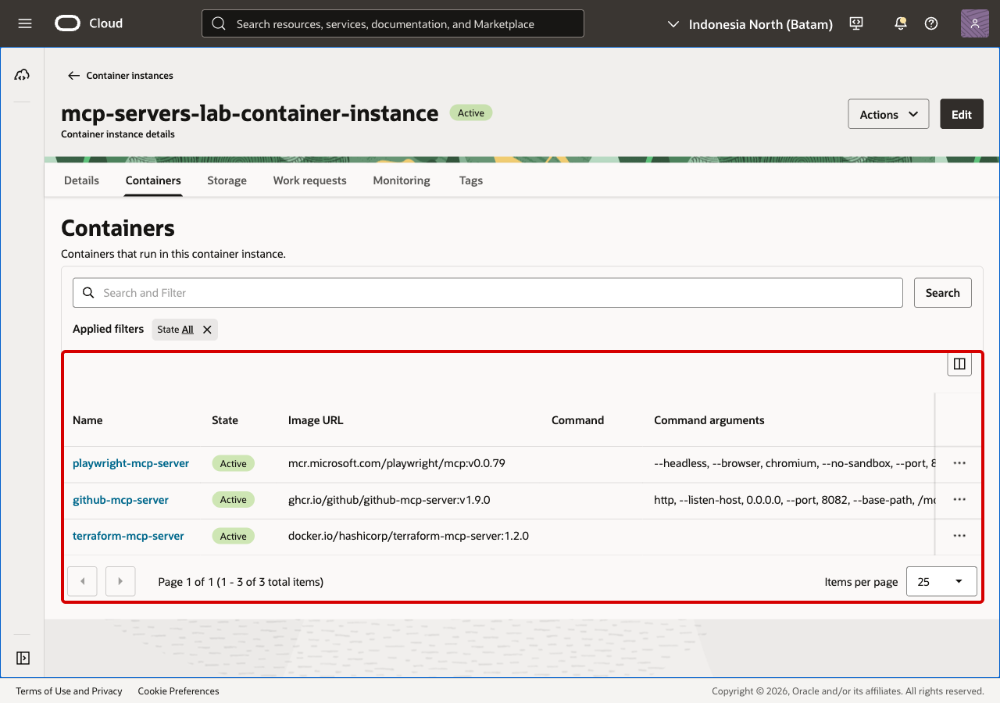

# Lab 2: Validate the OCI Deployment

## Introduction

In this lab, you confirm that Resource Manager created the stack successfully,
copy the MCP endpoint outputs, and inspect the Container Instance resources.

Estimated Time: 15 minutes

### Objectives

In this lab, you will:

* confirm the Resource Manager apply job succeeded;
* locate the MCP endpoint outputs;
* review the created OCI resources;
* confirm the Container Instance contains the three MCP server containers.

### Prerequisites

Complete Lab 1 and start the Resource Manager apply job for this workshop.

## Task 1: Confirm the apply job succeeded

1. Open the Resource Manager job created by the stack and wait until the job
    state is **Succeeded**.

    

2. After the job succeeds, continue to the outputs.

    

## Task 2: Copy the MCP endpoint outputs

1. Open the job outputs and note these values:

    * `terraform_mcp_url`
    * `github_mcp_url`
    * `playwright_mcp_url`
    * `api_gateway_endpoint`

    

2. Keep these URLs for the AI client configuration lab.

## Task 3: Review the created resources

1. Open the job resources and confirm Resource Manager created the expected API
    Gateway, networking, and Container Instance resources.

    

## Task 4: Inspect the Container Instance

1. Open the Container Instance resource and confirm it is active.

    

2. Open the containers list and confirm the three MCP server containers are
    present:

    * Terraform MCP Server;
    * GitHub MCP Server;
    * Playwright MCP Server.

    

3. You may now **proceed to the next lab**

## Acknowledgements

* **Kevin Liu**, Lead Principal Product Manager
* **Adekola Okunola**, Cloud Solution Engineer
* **Last Updated By/Date** - Adekola Okunola, Cloud Solution Engineer, August 2026
