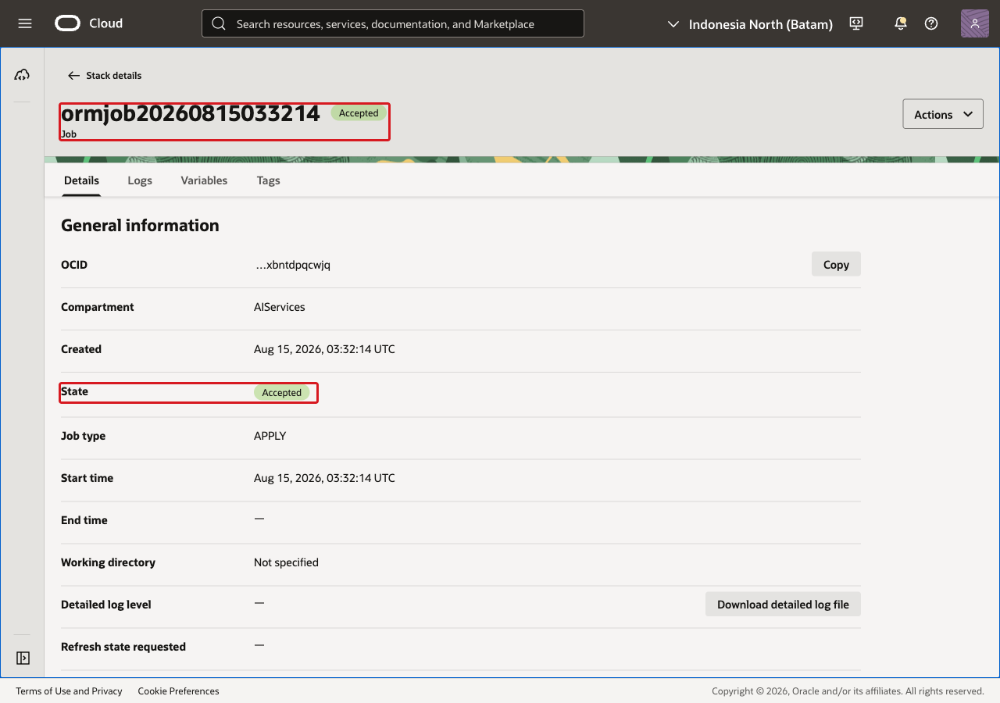
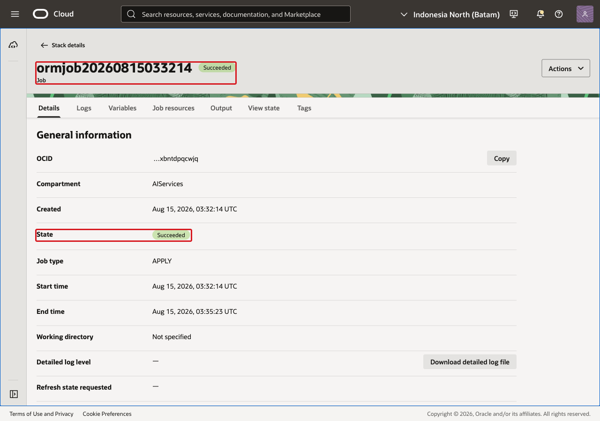
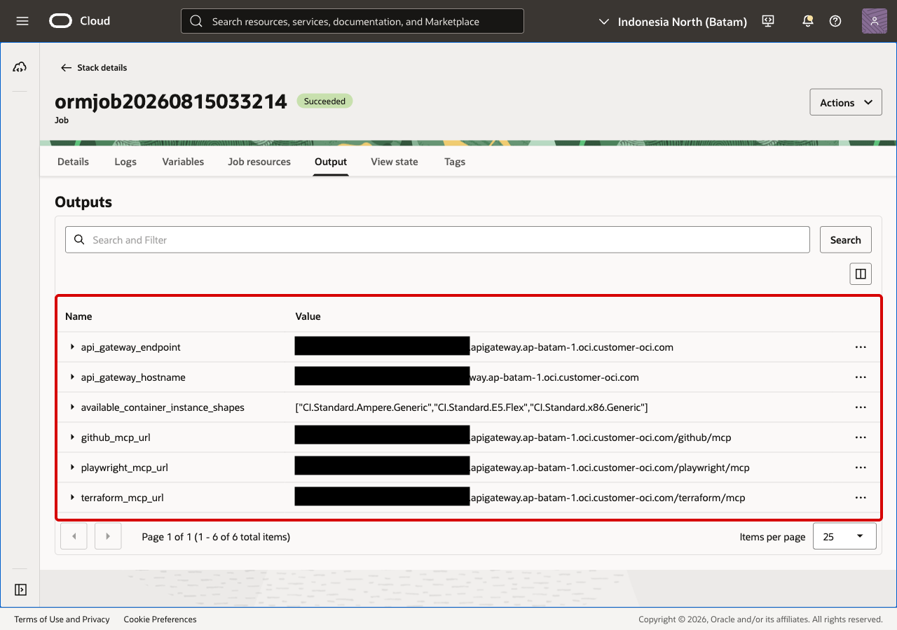

# Lab 2: Validate the OCI Deployment

## Introduction

In this lab, you confirm that Resource Manager created the stack successfully,
copy the MCP endpoint outputs, and inspect the Container Instance resources.

Estimated Time: 15 minutes

### Objectives

In this lab, you will:

* confirm the Resource Manager apply job succeeded;
* locate the MCP endpoint outputs;
* review the created OCI resources;
* confirm the Container Instance contains the three MCP server containers.

### Prerequisites

Complete Lab 1 and start the Resource Manager apply job for this workshop.

## Task 1: Confirm the apply job succeeded

1. Open the Resource Manager job created by the stack and wait until the job
    state is **Succeeded**.

    

2. After the job succeeds, continue to the outputs.

    

## Task 2: Copy the MCP endpoint outputs

1. Open the job outputs and note these values:

    * `terraform_mcp_url`
    * `github_mcp_url`
    * `playwright_mcp_url`
    * `api_gateway_endpoint`

    

2. Keep these URLs for the AI client configuration lab.

## Task 3: Review the created resources

1. Open the job resources and confirm Resource Manager created the expected API
    Gateway, networking, and Container Instance resources.

    The network includes one VCN, two subnets, two route tables, two security
    lists, and Internet, NAT, and Service Gateways. API Gateway provides the
    HTTPS entry point. Container outbound traffic uses Service Gateway for
    regional Oracle services and NAT Gateway for other destinations.

## Task 4: Inspect the Container Instance

1. Open the Container Instance resource and confirm it is **Active**. Its VNIC
    should have a private IP address and no public IP address. The AI client
    connects through the API Gateway URLs copied in Task 2.

2. Open the containers list and confirm all three MCP server containers are
    **Active**:

    * Terraform MCP Server;
    * GitHub MCP Server;
    * Playwright MCP Server.

3. Inspect each container's image URL. Each must start with
    `ocir.ca-toronto-1.oci.oraclecloud.com/yzrh1ull1ess/mcp-servers-on-oci-container-instances/`
    and identify the corresponding server with a `@sha256:` digest. Registry
    login credentials are not required for these public images.

4. If a container cannot pull its image, inspect the Container Instance work
    request errors and the stack's network resources before continuing. A
    successful package download alone does not prove the containers started.

5. You may now **proceed to the next lab**

## Acknowledgements

* **Kevin Liu**, Lead Principal Product Manager
* **Adekola Okunola**, Cloud Solution Engineer
* **Last Updated By/Date** - Adekola Okunola, Cloud Solution Engineer, August 2026
