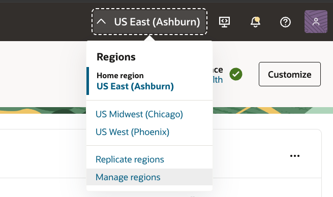
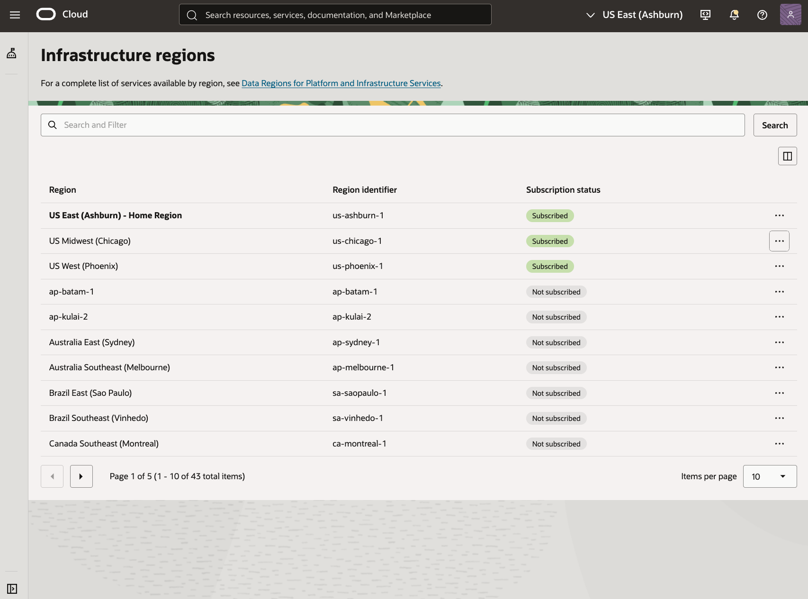
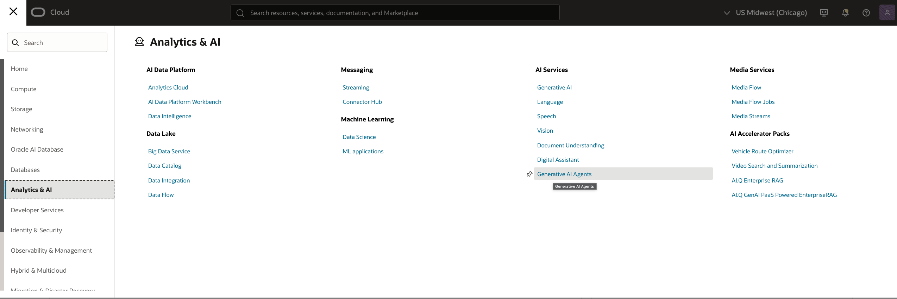
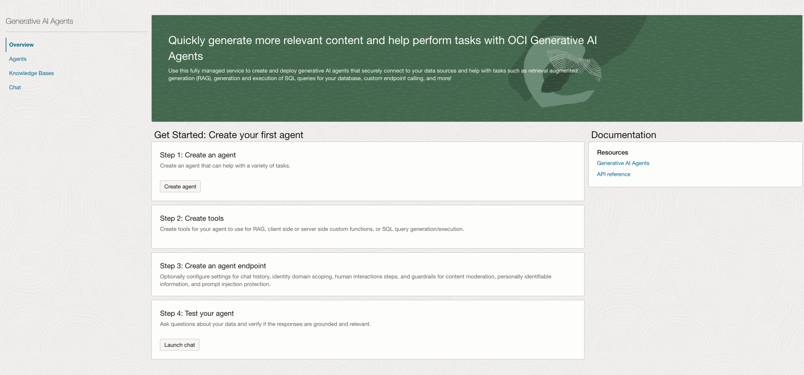
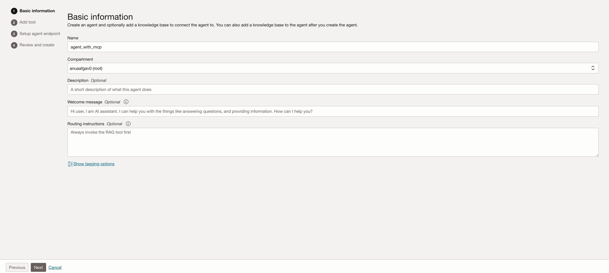
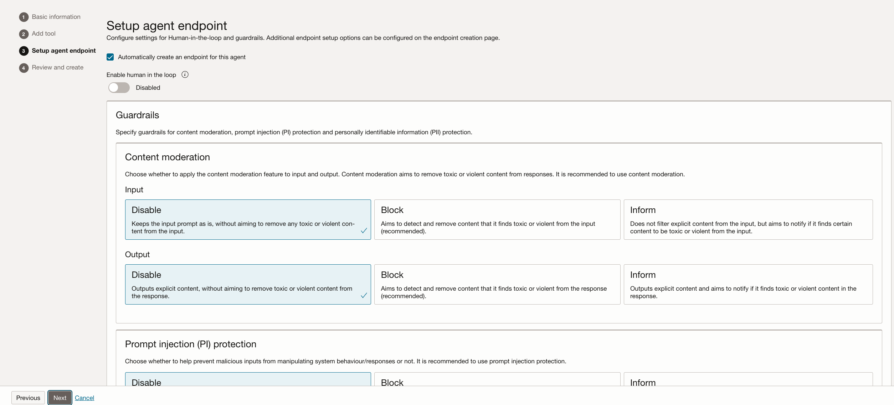
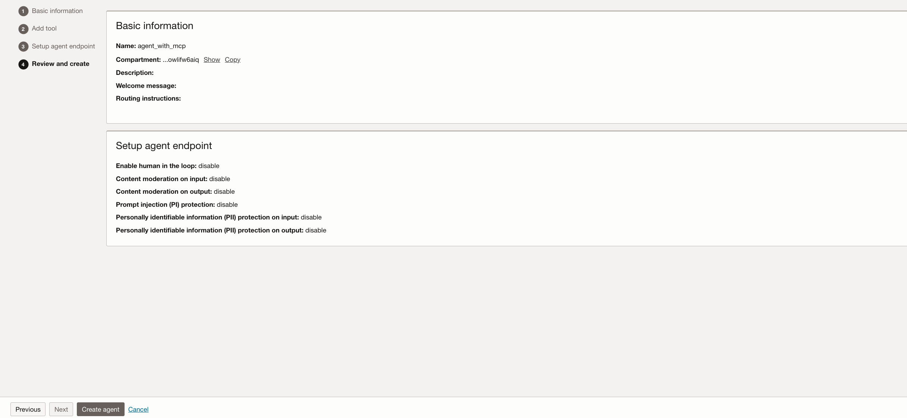
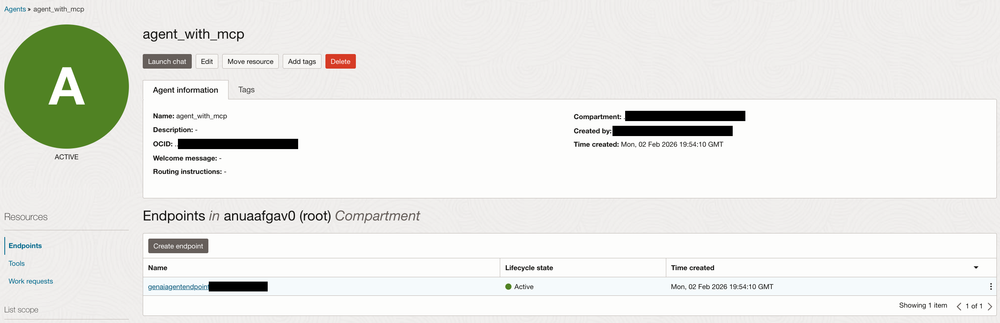
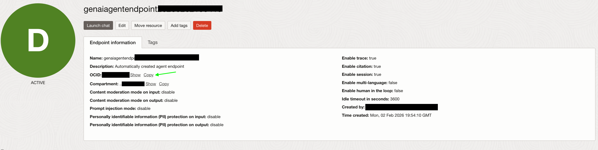

# Lab 1: Provision and Configure GenAI Agent

This lab will walk through the steps of writing access policies to the agent service, deploying and configuring a Generative AI Agent, and deploying a function application. 

Estimated Time: 15 minutes

### Objectives

In this lab, you will:

* Make sure that our tenancy is subscribed to the Chicago region.
* Create the required permissions for us to be able to use the service in our tenancy.
* Provision GenAI Agent
* Configure Tools for Agent in console UI
* Provision Functions Application

### Prerequisites (Optional)

This lab assumes you have:

* Access to the Chicago Region
* Administrator permissions or permissions to use the Generative AI Agents, Digital Assistant, Functions, Visual Builder and Identity Domains

## Task 1: Ensure Chicago region subscription

The OCI Generative AI Agents service is currently only available in the Chicago region.
If your tenancy is already subscribed to the Chicago region, please skip to the next task.

1. On the top right, click the Regions drop down menu.

  

1. Review the list of regions your tenancy is subscribed in. If you find the **US Midwest (Chicago)** region in the list, please skip to the next task.

2. Click the Manage Regions link at the bottom of the list.

3. In the **Infrastructure Regions** list, locate the **US Midwest (Chicago)** region.

  > **Note:** When you subscribe to a region, you cannot unsubscribe from it.

  

4. Select the **Actions** menu (three dots) and then select **Subscribe**.
  > **Note:** It could take several minutes to activate your tenancy in the new region.

The operation might take a few minutes to complete. When complete, the new region will appear on the **US Midwest (Chicago)** will appear in the **Regions** drop down menu on the main screen.

## Task 2: Create Generative AI Agent

In this task, we are going to create a Generative AI agent.

1. Open the Generative AI Agent page by from the left menu.

    

2. Then click on “Create agent” button

    

3. Fill in the Name and select a compartment. Click next

    

4. Click next on the Add Tool page. We will not be adding any tool from here.

5. On the "Setup agent endpoints" keep the defaults.

    

6. Review and click "Create Agent" . Read and Accept the "Llama 3 License Agreement and Acceptable Use Policy". 

    

7. Wait for the agent to be Active. This typically takes around 5 minutes (may vary by tenancy and region). Once Active, open the agent and copy the agent endpoint ocid. The ocid will be used in the next Lab.
    
    

8. You may now **proceed to the next lab**

## Learn More

* [Region subscription](https://docs.oracle.com/en-us/iaas/Content/Identity/Tasks/managingregions.htm#ariaid-title7)
* [Function Calling Tools](https://docs.oracle.com/en-us/iaas/Content/generative-ai-agents/function-calling-tool.htm)
* [API Endpoint Calling Tools](https://docs.oracle.com/en-us/iaas/Content/generative-ai-agents/api-calling-tool.htm)

## Acknowledgements

**Authors**
* **Anuragg Mohan**, Principal Cloud Architect, NACIE

**Last Updated By/Date:**
* **Anuragg Mohan**, Principal Cloud Architect, NACIE, Feb 2026