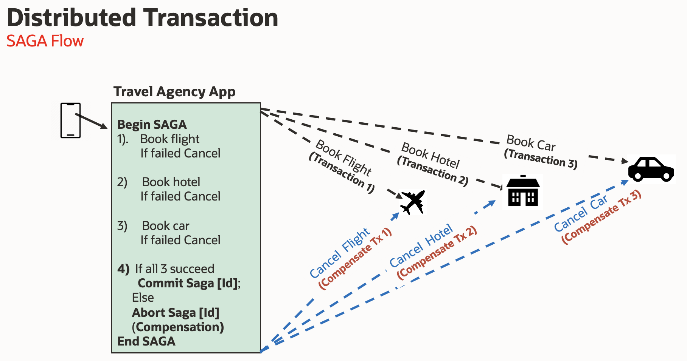
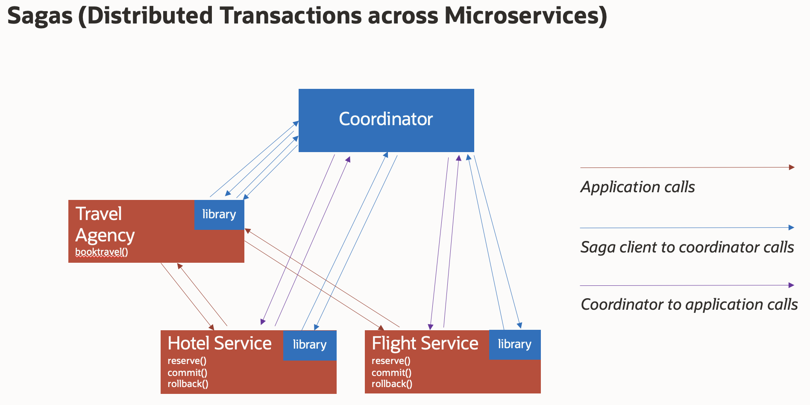
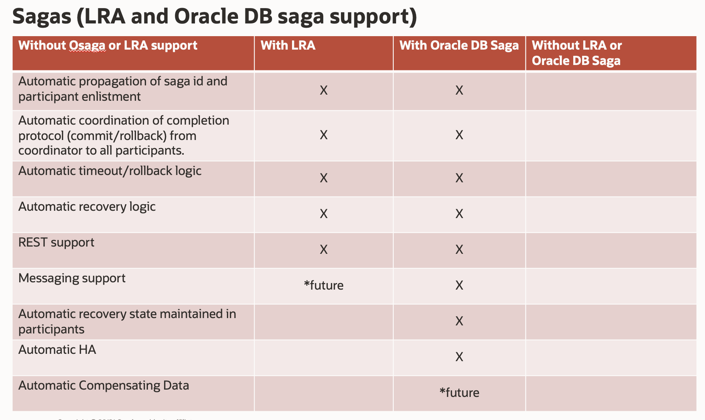

# Introduction

## About this Workshop

This workshop will help you understand the technical capabilities of the forthcoming saga support in the Oracle database.

Estimated Workshop Time: 50 minutes

###About Product/Technology

PL/SQL, Java, and (in the near future) Apex Workflow saga examples will be demonstrated.

###Objectives

- Learn about Oracle's forthcoming saga support in the Oracle database and how to use the Osaga API.

### Prerequisites

- This workshop assumes you have an Oracle cloud account and have signed in to the account.

A travel booking application is used to demonstrate.

The application comes in three versions: PL/SQL, Java, and in the near future an Apex Workflow

The following illustrates the flow of the application where an attempt is made to book participants (flight, hotel, and car) and depending upon the outcoming of these reservations, the booking saga is either completed/committed or compensated/rolledback.

The following shows the overall communication flow of an (orchestration) saga.  

The blue boxes refer to the Oracle Database Saga implementation and the red the application itself.
The TravelAgency contacts the Coordinator in order to begin a saga and then calls participants to reserve bookings. These participants are enrolled in the saga with the Coordinator, providing the Coordinator with a callback to them. Finally, the TravelAgency instructs the Coordinator to either commit or rollback the saga and the Coordinator calls the related commit or rollback callbacks on the participants. 

The following table shows a comparison of support between the MicroProfile Long Running Actions specification*, the Oracle Database Saga implementation (*which follows the LRA spec), the case where neither LRA nor the Oracle Database Saga support are used.

### Let's Get Started

You may now **proceed to the next lab.**..

## Want to Learn More?

* [Blog On This Workshop](https://dzone.com/articles/simplify-microservice-transactions-with-oracle-dat)
* [Related Blogs](https://dzone.com/users/4571557/paulparkinson.html)
* [Oracle Advanced Queuing](https://docs.oracle.com/en/database/oracle/oracle-database/19/adque/aq-introduction.html)
* [https://developer.oracle.com/](http://developer.oracle.com/microservices/)

## Acknowledgements
* **Author** - Paul Parkinson, Architect and Developer Advocate
