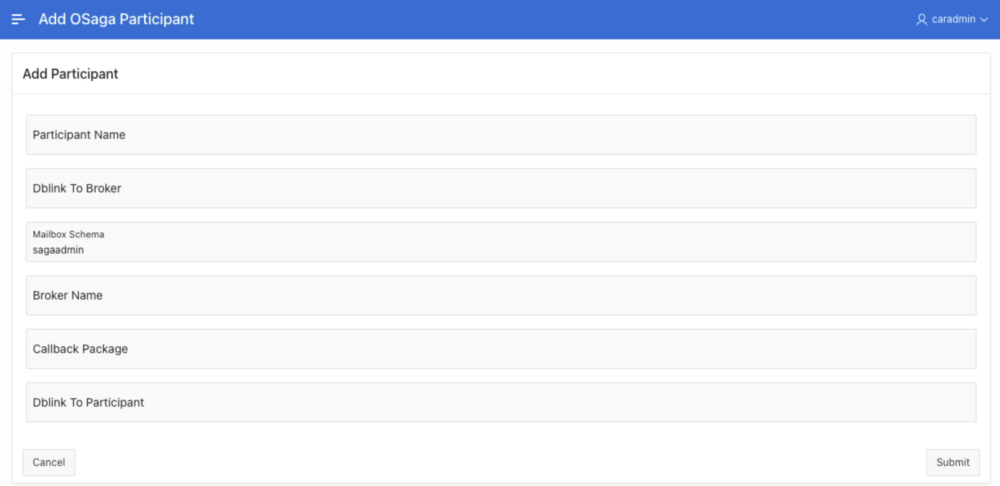

# Use Oracle Database Sagas with Apex Microservices

## Introduction

This lab will show you how to use Oracle Database Sagas with Apex Microservices

Estimated Time:  5 minutes

### Objectives

-   Add Apex saga participants
-   Test sagas 

### Prerequisites

* An Oracle Cloud paid account or free trial in a region with Oracle database 21c available. To sign up for a trial account with $300 in credits for 30 days, click [Sign Up](http://oracle.com/cloud/free).

### Objectives

-   Understand the concepts of Oracle Database Sagas with Apex Microservices

### Prerequisites

- This lab presumes you have already completed the earlier labs.

## Task 1: Add Participants

1.    Add Participants with Complete/Commit and Compensate/Rollback Callbacks

   

## Task 2: Test Enroll/Enlist and Complete/Commit

1.    Notice src and Complete/Commit path and make curl request .

## Task 3: Test Enroll/Enlist and Compensate/Rollback

1.    Notice src and Compensate/Rollback path and make curl request .

You may now **proceed to the next lab.**..

## Acknowledgements
* **Author** - Paul Parkinson, Architect and Developer Evangelist
* **Last Updated By/Date** - Paul Parkinson, December 2021
