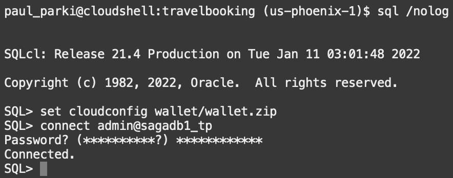
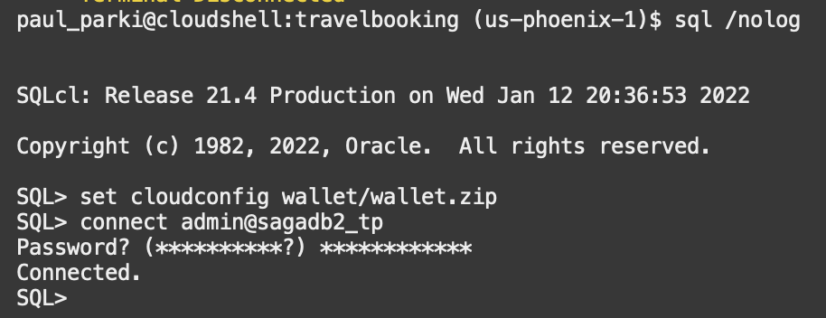
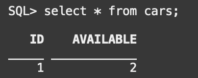
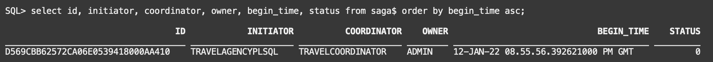
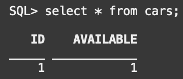
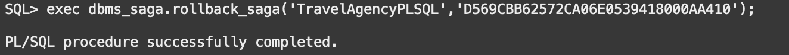
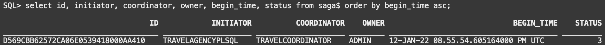
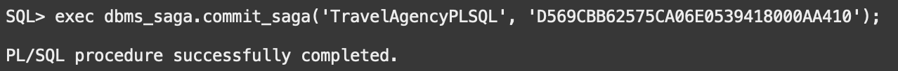
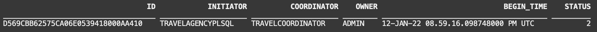

# Use Oracle Database Sagas with PL/SQL Microservices

## Introduction

This lab will show you how to use Oracle Database Sagas with PL/SQL Microservices

Estimated Time:  10 minutes

### Objectives

-   Test sagas with PL/SQL participants

### Prerequisites

* An Oracle Cloud paid account or free trial in a region with Oracle database 21c available. To sign up for a trial account with $300 in credits for 30 days, click [Sign Up](http://oracle.com/cloud/free).

### Objectives

-   Understand the concepts of Oracle Database Sagas with PL/SQL Microservices

### Prerequisites

- This lab presumes you have already completed the earlier labs.

## Task 1: Login to `sagadb1` database using SQLcl and add  TravelAgency participant/initiator

1.    Enter the Cloud Shell and enter the following command to enter SQLcl
    ```
    <copy>sql /nolog</copy>
    ```
    
2.    Set config using the following command
    ```
    <copy>set cloudconfig wallet/wallet.zip</copy>
    ```

3.    Enter the following command and then enter your password when prompted to connect to `sagadb1`

    ```
    <copy>connect admin@sagadb1_tp</copy>
    ```  
    
   The output should look similar to the following.

   
      
4.   Enter the following command to install the saga broker, coordinator, and `TravelAgencyPLSQL` participant/initiator along with it's associated saga callback package.

    ```
    <copy>@sql/1_saga1db.sql</copy>
    ```

   Notice the PL/SQL calls made including the callback package for the TravelAgency which includes `request` and `response` operations.
   This is a one time setup operation to configure the PL/SQL participants.
   
    
        --Add TravelAgency callback package
        create table travelagencytest(text VARCHAR2(100));
        create or replace package dbms_ta_cbk as
        function request(saga_id in raw, saga_sender in varchar2, payload in JSON default null) return JSON;
        procedure response(saga_id in raw, saga_sender in varchar2, payload in JSON default null);
        end dbms_ta_cbk;
        /
        create or replace package body dbms_ta_cbk as
        function request(saga_id in raw, saga_sender in varchar2, payload in JSON default null) return JSON as
        begin
          null;
        end;
        
        procedure response(saga_id in raw, saga_sender in varchar2, payload in JSON default null) as
        begin
          insert into travelagencytest values(saga_sender);
          insert into travelagencytest values(json_serialize(payload));
        end;
        end dbms_ta_cbk;
        /
        
        --Add participant
        exec dbms_saga_adm.add_participant(  participant_name => 'TravelAgencyPLSQL',   coordinator_name => 'TravelCoordinator' ,   dblink_to_broker => null ,   mailbox_schema => 'admin' ,   broker_name => 'TEST' ,   callback_package => 'dbms_ta_cbk' ,   dblink_to_participant => null);
    
    

## Task 2: Login to `sagadb2` database using SQLcl and add Flight, Hotel, and Car participants

1.    Open a new browser tab with another OCI console and enter the Cloud Shell there. 

       This is done for convenience so that one tab/Cloud Shell/SQLcl console can be use for saga initiator (TravelAgency) operations and the other for saga participant (Flight, Hotel, and Car) operations. 

2.    Repeat steps 1 and 2 in Task 1 in order to enter SQLcl.

3.    Enter the following command and then enter your password when prompted to connect to `sagadb2`

    ```
    <copy>connect admin@sagadb2_tp</copy>
    ```  
   
   The output should look similar to the following.

   
   
4.   Enter the following command to install `FlightPLSQL`, `HotelPLSQL`, and `CarPLSQL` participants and their saga callback packages.

        ```
        <copy>@sql/2_saga2db.sql</copy>
        ```

       Notice the PL/SQL calls made to in this script to add the participants including the callback package for the TravelAgency which includes `request` and `after_rollback` operations.
   Again this is a one time setup operation to configure the PL/SQL participants.
   
       
        create table flighttest(text VARCHAR2(100));
        create table flights(id NUMBER, available NUMBER);
        insert into flights values(1,2);
        create or replace package dbms_flight_cbk as
        function request(saga_id in RAW, saga_sender IN VARCHAR2, payload IN JSON DEFAULT NULL) return JSON;
        procedure after_rollback(saga_id in RAW, saga_sender IN varchar2, payload IN JSON DEFAULT NULL);
        end dbms_flight_cbk;
        /
        create or replace package body dbms_flight_cbk as
        function request(saga_id in RAW, saga_sender IN VARCHAR2, payload IN JSON DEFAULT NULL) return JSON as
        response JSON;
        tickets NUMBER;
        begin
          insert into flighttest values(saga_sender);
          insert into flighttest values(json_serialize(payload));
          select available into tickets from flights where id = 1;
          IF tickets > 0 THEN
            response := json('[{"result":"success"}]');
          ELSE
            response := json('[{"result":"failure"}]');
          END IF;
          update flights set available = available - 1 where id = 1;
          return response;
        end;
        
        procedure after_rollback(saga_id in RAW, saga_sender IN varchar2, payload IN JSON DEFAULT NULL)as
        begin
          update flights set available = available + 1 where id = 1;
        end;
        end dbms_flight_cbk;
        /
     
        --Add participant
        exec dbms_saga_adm.add_participant(participant_name=> 'FlightPLSQL' ,  dblink_to_broker=> 'travelagencyadminlink',mailbox_schema=> 'admin',broker_name=> 'TEST', callback_package => 'dbms_flight_cbk' , dblink_to_participant=> 'participantadminlink');
        
       


## Task 3: Conduct saga rollback test


1.   In the Participant/sagadb2 SQLcl console, check the initial inventory level of one or more participants by copying and pasting the following. 
    
      ```
      <copy>select * from cars;</copy>
      ```
    
      Note the value.

      
      
2.    In the TravelAgency/sagadb1 SQLcl console, begin a saga and enroll participants by copying and pasting the following.

    ```
    <copy>
    declare
      saga_id raw(16);
      flightrequest JSON;
      hotelrequest JSON;
      carrequest JSON;
     begin
      saga_id := dbms_saga.begin_saga('TravelAgencyPLSQL');
      flightrequest := json('[{"flight":"myflight"}]');
      dbms_saga.enroll_participant(saga_id, 'TravelAgencyPLSQL', 'FlightPLSQL', 'TravelCoordinator', flightrequest);
      hotelrequest := json('[{"hotel":"myhoteg"}]');
      dbms_saga.enroll_participant(saga_id, 'TravelAgencyPLSQL', 'CarPLSQL', 'TravelCoordinator', hotelrequest);
      carrequest := json('[{"car":"mycar"}]');
      dbms_saga.enroll_participant(saga_id, 'TravelAgencyPLSQL', 'HotelPLSQL', 'TravelCoordinator', carrequest);
    end;
    /
    </copy>
    ```
      
3.    Check the existence and status of the saga on both the TravelAgency/sagadb1 and Participants/sagadb2 by copying and pasting the following into SQLcl

        ```
        <copy>select id, initiator, coordinator, owner, begin_time, status from saga$ order by begin_time asc;</copy>
        ```
    
       You should notice the saga and it's status as `0` indicating it is in the active state.

       
      
4.    Again check the Participant/sagadb2 SQLcl console, check the inventory level of one or more participants by copying and pasting the following. 
  
         ```
         <copy>select * from cars;</copy>
         ```
          
       Note the value has decreased by one due to the active saga activity.
   
       
               
5.    In the TravelAgency/sagadb1 SQLcl console, copy and paste the following `rollback_saga` command, replacing `REPLACE_THIS_WITH_SAGAID` with the saga id from the query in step 3.
         ```
         <copy>exec dbms_saga.rollback_saga('TravelAgencyPLSQL', 'REPLACE_THIS_WITH_SAGAID');</copy>
         ```
          
       Note the value has decreased by one due to the active saga activity.
   
       
       
6.    Check the status of the saga on both the TravelAgency/sagadb1 and Participants/sagadb2 by copying and pasting the following into SQLcl
        ```
        <copy>select id, initiator, coordinator, owner, begin_time, status from saga$ order by begin_time asc;</copy>
        ```
    
       You should notice the saga and it's status as `3` indicating it is in the rolledback/aborted state.

       
            
7.    Once again, in the Participant/sagadb2 SQLcl console, check the inventory level of one or more participants by copying and pasting the following. 
         ```
         <copy>select * from cars;</copy>
         ```
    
       Note the value has returned to the original value due to the compensating saga activity.
   
       
               
      
## Task 4: Conduct saga commit test

1.   In the Participant/sagadb2 SQLcl console, check the initial inventory level of one or more participants by copying and pasting the following. 
    
      ```
      <copy>select * from cars;</copy>
      ```
    
      Note the value.

      
      
2.    In the TravelAgency/sagadb1 SQLcl console, begin a saga and enroll participants by copying and pasting the following.
        ```
      <copy>
        declare
          saga_id raw(16);
          flightrequest JSON;
          hotelrequest JSON;
          carrequest JSON;
         begin
          saga_id := dbms_saga.begin_saga('TravelAgencyPLSQL');
          flightrequest := json('[{"flight":"myflight"}]');
          dbms_saga.enroll_participant(saga_id, 'TravelAgencyPLSQL', 'FlightPLSQL', 'TravelCoordinator', flightrequest);
          hotelrequest := json('[{"hotel":"myhoteg"}]');
          dbms_saga.enroll_participant(saga_id, 'TravelAgencyPLSQL', 'CarPLSQL', 'TravelCoordinator', hotelrequest);
          carrequest := json('[{"car":"mycar"}]');
          dbms_saga.enroll_participant(saga_id, 'TravelAgencyPLSQL', 'HotelPLSQL', 'TravelCoordinator', carrequest);
        end;
        / 
      </copy>
      ```

3.    Check the existence and status of the saga on both the TravelAgency/sagadb1 and Participants/sagadb2 by copying and pasting the following into SQLcl

        ```
        <copy>select id, initiator, coordinator, owner, begin_time, status from saga$ order by begin_time asc;</copy>
        ```
    
       You should notice the saga and it's status as `0` indicating it is in the active state.

       
      
4.    Again check the Participant/sagadb2 SQLcl console, check the inventory level of one or more participants by copying and pasting the following. 
  
         ```
         <copy>select * from cars;</copy>
         ```
          
       Note the value has decreased by one due to the active saga activity.
   
       
               
5.    In the Participant/sagadb2 SQLcl console, copy and paste the following `commit_saga` command, replacing `REPLACE_THIS_WITH_SAGAID` with the saga id from the query in step 3.
         ```
         <copy>exec dbms_saga.commit_saga('TravelAgencyPLSQL', 'REPLACE_THIS_WITH_SAGAID');</copy>
         ```
          
       Note the value has decreased by one due to the active saga activity.
   
       
       
6.    Check the status of the saga on both the TravelAgency/sagadb1 and Participants/sagadb2 by copying and pasting the following into SQLcl

        ```
        <copy>select id, initiator, coordinator, owner, begin_time, status from saga$ order by begin_time asc;</copy>
        ```
    
       You should notice the saga and it's status as `2` indicating it is in the committed/completed state.

       
            
7.    Once again, in the Participant/sagadb2 SQLcl console, check the inventory level of one or more participants by copying and pasting the following. 

        ```
        <copy>select * from cars;</copy>
        ```
          
       Note the value has remained reduced as the saga was successfully committed.
   
       
             

You may now **proceed to the next lab.**..

## Acknowledgements
* **Author** - Paul Parkinson, Architect and Developer Evangelist
* **Last Updated By/Date** - Paul Parkinson, December 2021
