# Setup

## Introduction

In this lab, we will provision two 21c ATP PDBs, clone the workshop source code, and setup the OSaga infrastructure

Estimated Time: 15 minutes

### Objectives

* Provision 
* Clone the setup and microservices code
* Execute setup

### Prerequisites

- This workshop assumes you have an Oracle cloud account and have signed in to the account.
- The workshop also requires Always Free 21c ATP instances and so is limited to the following regions: Ashburn (IAD), Phoenix (PHX), Frankfurt (FRA) and London (LHR) regions

## Task 1: Provision 2 ATP 21c PDBs

1. From the drop-down menu in the upper left of the OCI Console, select `Oracle Databases` and then `Autonomous Transaction Processing`

   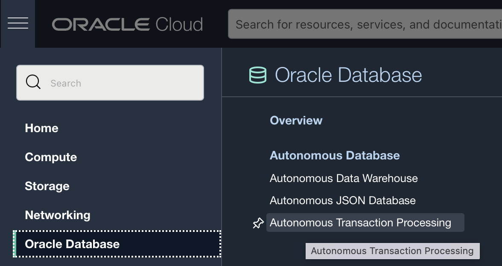

2. Click `Create Autonomous Database` button

   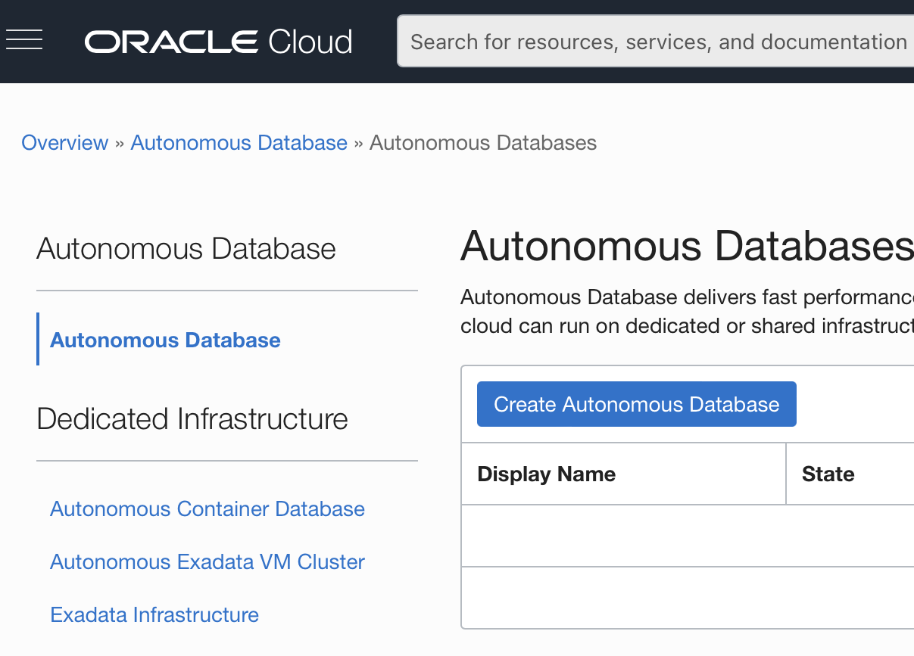
  
3. Enter `sagadb1` for `Display Name` and `Database Name`

   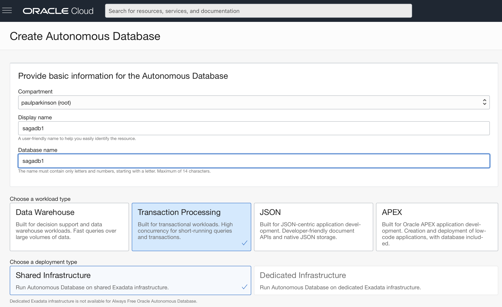
  
4. Select `Always Free` option and `21c` from `Version` dropdown.

   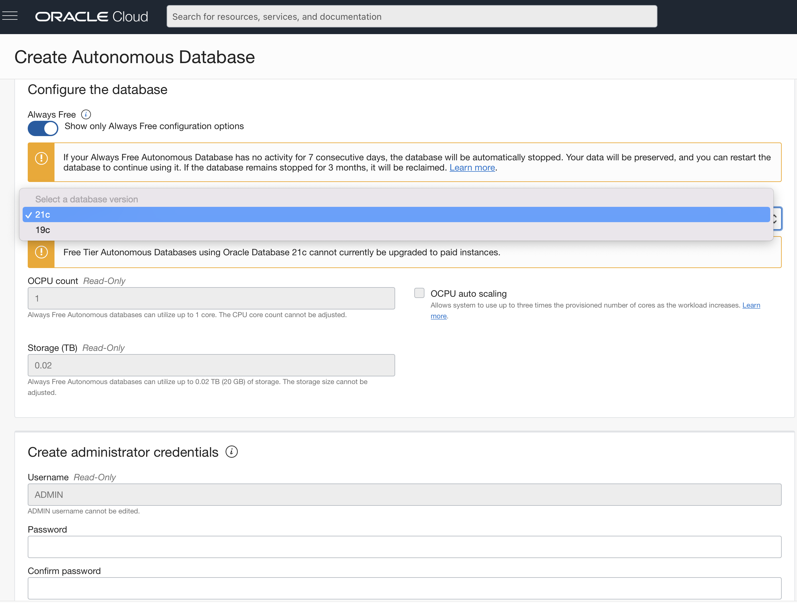
  
5. Provide a password for `ADMIN` user, leave the default values for network and license, and click `Create Autonomous Database` button.

   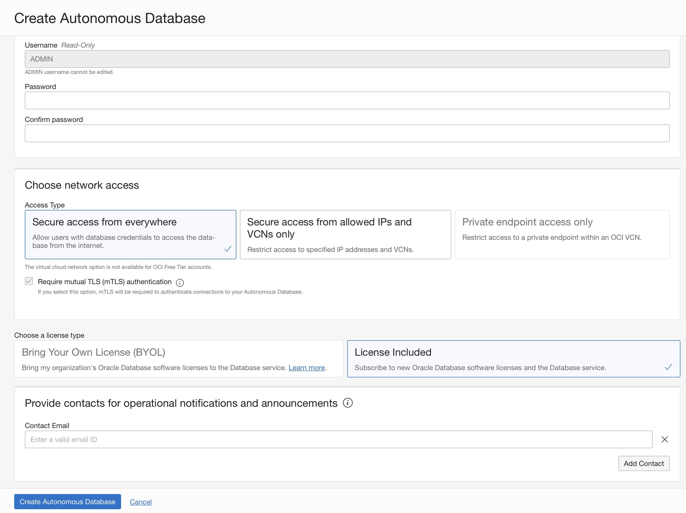
  
6. Notice the PDB is provisioning.

   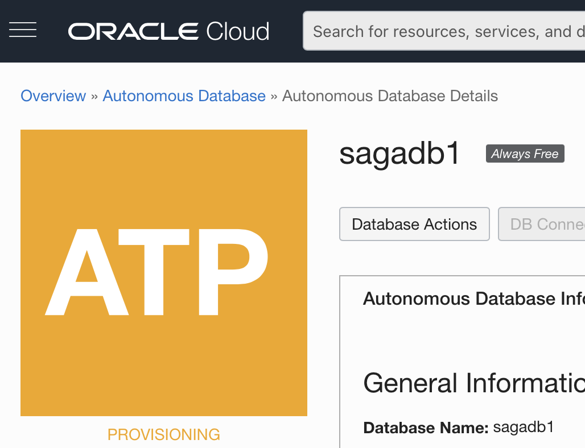
  
7. Repeat the process, creating a second database called `sagadb2`. Wait a few minutes until both databases are in `Available` state.

   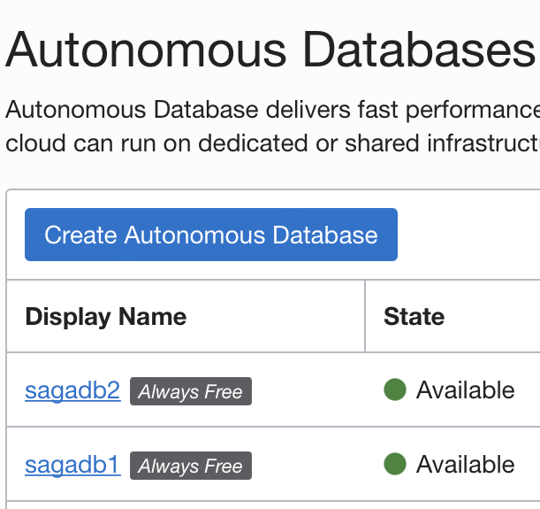
  
8. Select the drop-down menu on the far right of either database and select `Copy OCID` . This OCID will be used in Task 3 of the setup below.

   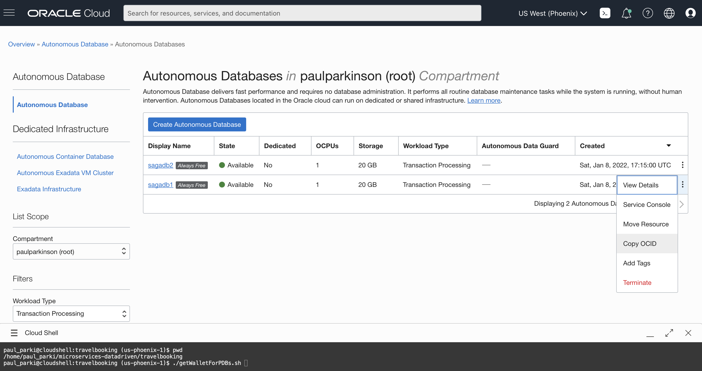


## Task 2: Launch Cloud Shell and make a clone of the workshop source code in your home directory

Cloud Shell is a small virtual machine running a "bash" shell which you access through the Oracle Cloud Console. Cloud Shell comes with a pre-authenticated command line interface in the tenancy region. It also provides up-to-date tools and utilities.

1. Click the Cloud Shell icon in the top-right corner of the Console.

  

  NOTE: Cloud Shell uses websockets to communicate between your browser and the service. If your browser has websockets disabled or uses a corporate proxy that has websockets disabled you will see an error message ("An unexpected error occurred") when attempting to start Cloud Shell from the console. You also can change the browser cookies settings for a specific site to allow the traffic from *.oracle.com

2. Clone from the GitHub repository using the following command.  

    ```
    <copy>git clone -b 22.1.4 --single-branch https://github.com/oracle/microservices-datadriven.git</copy>
    ```

   You should now see the directory `microservices-datadriven` in the home directory.

3. Run the following command to edit your .bashrc file so that you will return to the workshop directory when you connect to cloud shell in the future and also to include the Java 11 (GraalVM) in the path.

    ```
    <copy>
    echo "cd ~/microservices-datadriven/travelbooking" >>~/.bashrc
    export JAVA_HOME=~/graalvm-ce-java11-20.1.0
    echo "export JAVA_HOME=~/graalvm-ce-java11-20.1.0" >>~/.bashrc
    echo "export PATH=$JAVA_HOME/bin:$PATH" >>~/.bashrc
    source ~/.bashrc
    </copy>
    ```

## Task 3: Create DB Links Between the ATP PDBs and Setup Oracle Database Saga Infrastructure

1. Run the following command, providing the OCID of the database that you copied in Task 1

    ```
    <copy>./getWalletForPDBs.sh REPLACE_THIS_VALUE_WITH_DB_OCID</copy>
    ```
   
   The output should look similar to the following.
   
     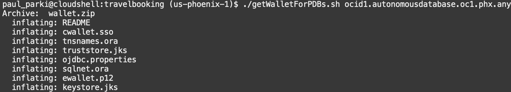

2. Run the following command to install Java 11 (GraalVM)  

    ```
    <copy>./installGraalVM.sh</copy>
    ```

2. Run the following command to create DB Links between the two PDBs and install the Oracle Saga infrastructure.

    ```
    <copy>./createDBLinksAndOsagaInfra.sh</copy>
    ```
   You will be prompted for the admin password you used when creating sagapdb1 and sagapdb2.
   
   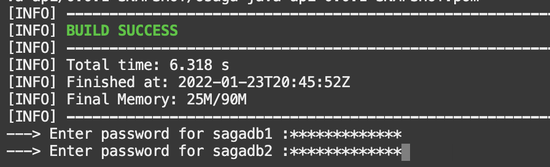
     
   This setup will take one or two minutes and you should see output such as the following.  
   
   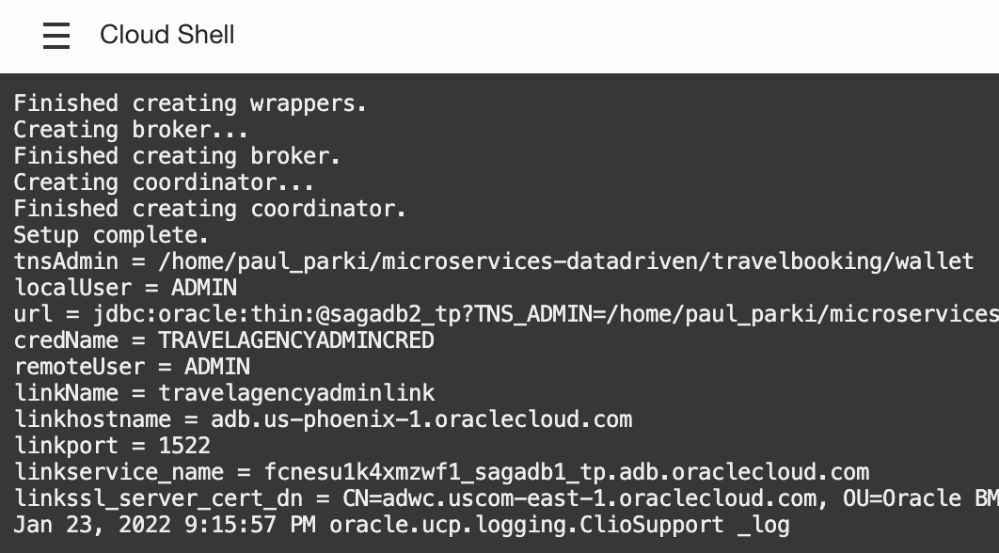
   
   And finally see successful completion and exit of the setup.
   
   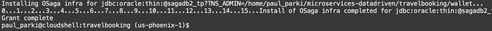
   
     If at any point you are disconnected from the Cloud Shell, you can start from the last command that did not complete.

You may now **proceed to the next lab.**.

## Acknowledgements

* **Authors** - Paul Parkinson, Architect and Developer Advocate
* **Last Updated By/Date** - Paul Parkinson, December 2021
