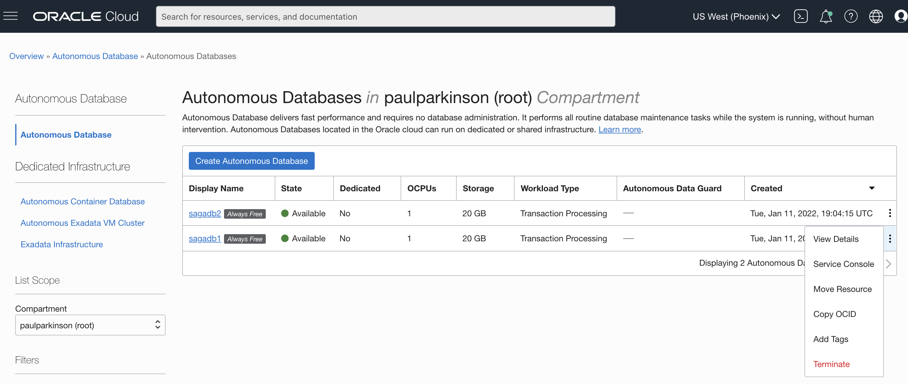

# Tear Down

## Introduction

In this lab, we will tear down the 21c ATP PDBs your tenancy and the workshop directory in the Oracle cloud shell.

Estimates Time: 3 minutes

### Objectives

* Cleanup the tenancy resources.

### Prerequisites

* Have successfully completed the earlier labs

## Task 1: Terminate the 21c ATP PDBs

1. Enter the same `Oracle Database` console page that was used to provision the 21c ATP PDBs during setup and select the `Terminate` option for `sagagdb1` and `sagadb2` PDBs

   

## Task 2: Delete the Directory

1. Enter the Cloud Shell and delete the directory where you installed the workshop.

    ```
    <copy>rm -rf ~/microservices-datadriven</copy>
    ```

## Acknowledgements

* **Authors** - Paul Parkinson, Architect and Developer Advocate
* **Last Updated By/Date** - Paul Parkinson, December 2021
