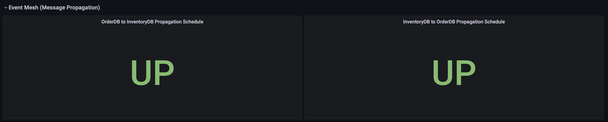
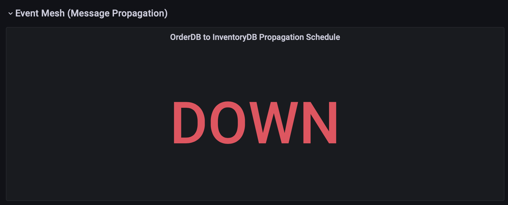

# Diagnosability and Debugging Use Case

## Introduction

This lab will show you how to determine when an exception/failure occurs in the system and allow you to diagnose and debug the issue.

Estimated Time:  5 minutes

### Objectives

-   Observe propagation health status
-   Induce propagation failure and notice `DOWN` health status.
-   Re-enable propagation and notice `UP` health status.
  
  
### Prerequisites

This lab presumes you have already completed the earlier labs.

## Task 1: Notice propagation health singlestat metric

1. Notice propagation to and from the `Order` and `Inventory` databases of the event mesh are up.
  
     
    *Note that Grafana plans to support alert rules for singlestat panels such as this one in the future but does not currently.
     
    We demonstrate alert rules in the `Performance Monitoring Use Case` lab of this workshop.

## Task 2: Use SQLcl to disable propagation

1. Issue the following commands to connect to the Order PDB using SQLcl (SQLcl is pre-installed in Cloud Shell for you):

       ```
       <copy>sql /nolog</copy>
       ```

      You will now be in the SQLcl prompt. Issue the following commands to get a list of tnsnames in the wallet.
       
       ```
       <copy>set cloudconfig wallet/wallet.zip</copy>
       ```

       ```
       <copy>show tns</copy>
       ```
       
2.   Find the tns entry for your OrderDB. This will be in the form of `compartment name` + `O_TP`. 
      
      For example, `grabdishO_TP`
       
      Connect to the OrderDB using the following commands, replacing the tnsnames entry with yours.

       ```
       <copy>connect orderuser@grabdishO_TP</copy>
       ```
     You will be prompted for the password you provided during setup.
     
3.    After you connect successfully, issue the following command to disable propagation from the OrderDB to the InventoryDB

       ```
       <copy>EXECUTE DBMS_AQADM.DISABLE_PROPAGATION_SCHEDULE ( 'orderuser.orderqueue', 'ORDERTOINVENTORYLINK', 'inventoryuser.orderqueue');</copy>
       ```

## Task 3: Notice 'down' metric for EventMesh / propagation and Slack message from alert

1. Return to the Grafana dashboard and notice the down state for the `OrderDB to InventoryDB propagation` metric:

     


## Task 4: Use SQLcl to re-enable propagation


1.  If necessary, follow the steps in Task 2 to reconnect to the Order DB with SQLcl
     
2.    After you connect successfully, issue the following command to re-enable propagation from the OrderDB to the InventoryDB

       ```
       <copy>EXECUTE DBMS_AQADM.ENABLE_PROPAGATION_SCHEDULE ( 'orderuser.orderqueue', 'ORDERTOINVENTORYLINK', 'inventoryuser.orderqueue');</copy>
       ```


## Task 5: Notice metric showing that messaging/propagation is working again

1. Return to the Grafana dashboard and notice the up state for the `OrderDB to InventoryDB propagation` metric:

     

   
You may now **proceed to the next lab.**.

## Acknowledgements
* **Author** - Paul Parkinson, Architect and Developer Advocate
* **Last Updated By/Date** - Paul Parkinson, August 2021
