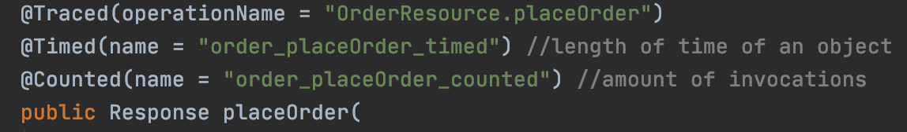
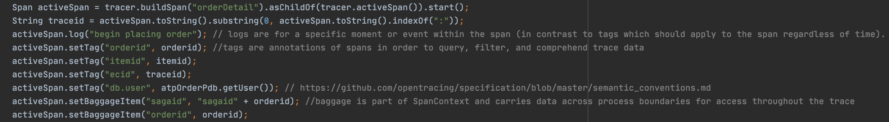
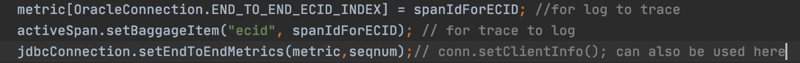

# Better Understand and Modify Metrics, Logging, and Tracing

## Introduction

This lab will take a deeper dive into expliaining Metrics, Logging, and Tracing and will show you how extend the observability framework for your own needs and use cases.

You can extend the observability functionality provided here in a number of ways by modifying the metrics and log exporter config, tracing in your microservices, dashboards, etc.

Estimated Time:  5 minutes

### Objectives

-   Understand the concepts of unified observability and modify the configuration of exporters and and microservices in order to see various metrics, logs, and tracing from both the application and database tier.

### Prerequisites

- This lab presumes you have already completed the earlier labs.

## Task 1: Modify metrics exporter config

1.    Modify and save  
   `$GRABDISH_HOME/observability/db-metrics-exporter/db-metrics-inventorypdb-exporter-metrics.toml`
   and/or 
   `$GRABDISH_HOME/observability/db-metrics-exporter/db-metrics-inventorypdb-exporter-metrics.toml and run the following command.`
   
2. Notice metrics are defined using the following toml convention.
   
   
 
 2. After making any changes, run the following command.   
    ```
    <copy>cd $GRABDISH_HOME/observability;./updatedbteqexporters.sh</copy>
    ```
   You will notice the related configmap is updated and the deployment is reapplied such that they can be observed in the dashboard.

## Task 2: Modify application tracing

1. Study the tracing behavior in `$GRABDISH_HOME/order-helidon/src/main/java/io/helidon/data/examples/OrderResource.java` and `OrderServiceEventProducer.java`

2. Notice the `@Traced` MicroProfile annotation for automatically adding tracing spans for this method call.

    


3. Notice the programmatically added spans via `tracer.buildSpan`  logic.

    


4. Notice how the OpenTracing id is set as the ECID for end to end tracing across app/Kubernetes tier and database tier.

    

5. Modify and save the source. Then rebuild, and redeploy by deleting the previous pod version (deployments are configured with image-pull=always) using the following command.

    ```
    <copy>cd $GRABDISH_HOME/order-helidon;./build.sh;deletepod order-helidon</copy>
    ```
     
6. Notice the related tracing changes in the dashboard.

The observability-exporter image corresponding to the repos at https://github.com/oracle/oracle-db-appdev-monitoring  will soon be available as will more advanced customization of the DB log exporter, etc.

You may now **proceed to the next lab.**.

## Acknowledgements
* **Author** - Paul Parkinson, Developer Evangelist
* **Last Updated By/Date** - Paul Parkinson, August 2021
