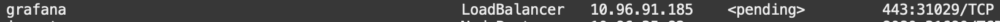
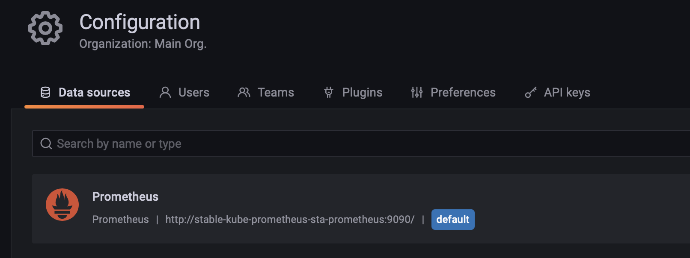
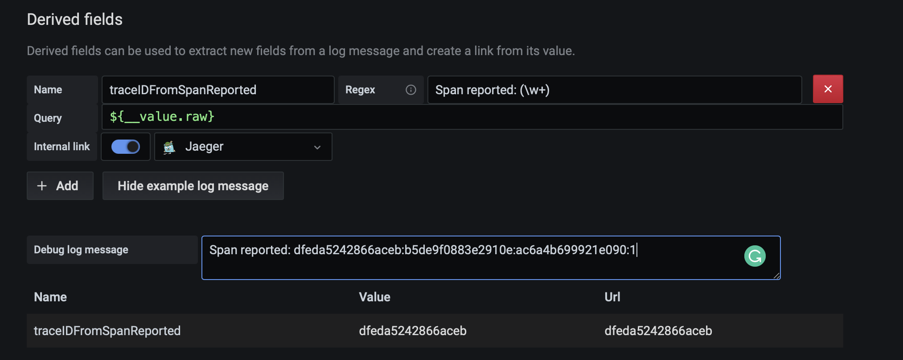
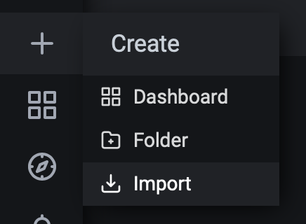
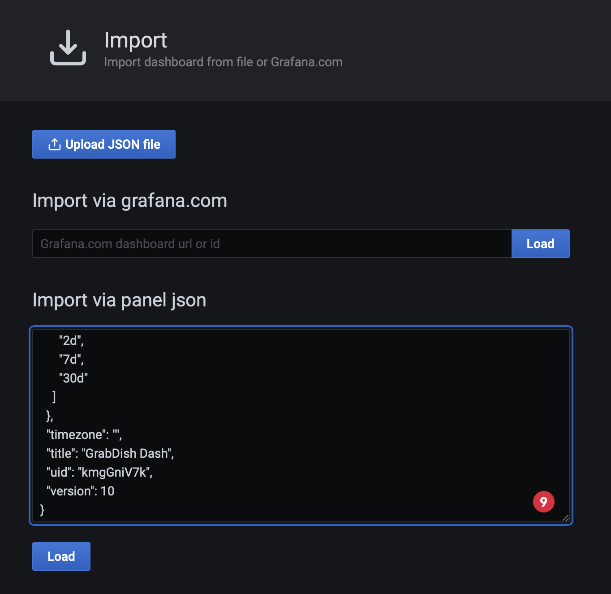
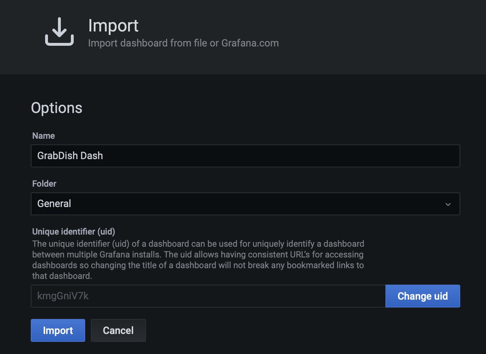
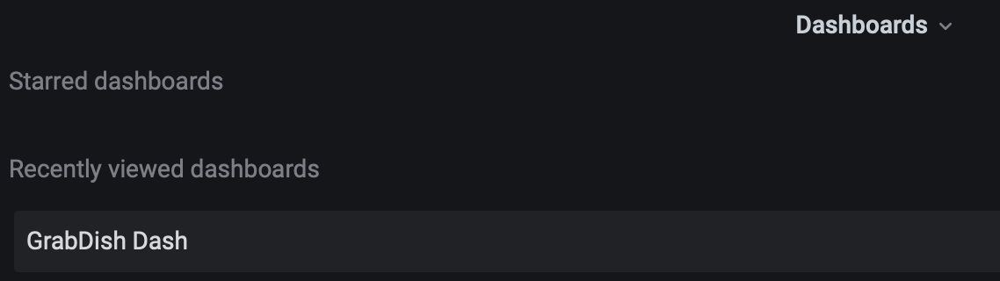
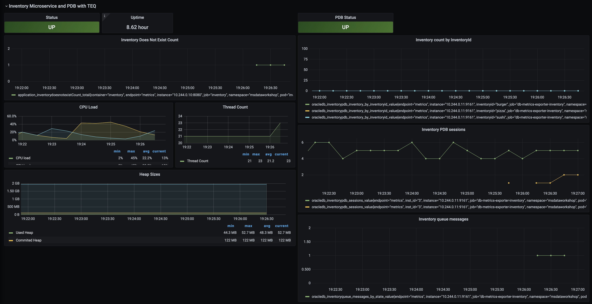

# Unified Observability

## Introduction

This lab will show you how you can trace microservice activity using Jaeger.

Estimated Time: 25 minutes

Watch the video below for a quick walk through of the lab.

[](youtube:MuoMHJ54PHE)

### Objectives

* Install and configure Grafana, Prometheus, Loki, Promtail, and Jaeger
* Understand single-pane-of glass unified observability using Grafana to analyze metrics, logs, and tracing of the microservices architecture across the application and Oracle database tier.

### Prerequisites

- This lab presumes you have already completed the earlier labs.
 

## Task 1: Install and Configure Observability Software and Metrics with Log Exporters

1. Run the install script to install Jaeger, Prometheus, Loki, Promtail, Grafana and an SSL secured LoadBalancer for Grafana

    ```
    <copy>cd $GRABDISH_HOME/observability;./install.sh</copy>
    ```

2. Run the `/createMonitorsAndExporters.sh` script. This will do the following:
   - Create Prometheus ServiceMonitors to scrape the Frontend, Order, and Inventory microservices.
   - Create Prometheus ServiceMonitors to scrape the Order PDB, and Inventory PDB metric exporter services.
   - Create configmpas, deployments, and services for PDB metrics exporters.
   - Create configmaps, deployments, and services for PDB log exporters.

    ```
    <copy>cd $GRABDISH_HOME/observability;./createMonitorsAndExporters.sh</copy>
    ```

## Task 2: Configure Grafana

1. Identify the EXTERNAL-IP address of the Grafana LoadBalancer by executing the following command:

       ```
       <copy>services</copy>
       ```

     

     Note, it will take a few minutes for the LoadBalancer to provision during which time it will be in a `pending` state

2. Open a new browser tab and enter the external IP URL:

     `https://<EXTERNAL-IP>`

      Note, for convenience a self-signed certificate is used to secure this https address and so you will be prompted by the browser to allow access.

3. Login using the default username `admin` and password `prom-operator`

      

4. View pre-configured Prometheus data source:

    Select the `Configuration` gear icon on the left-hand side and select `Data Sources`.

      

    Click `select` button of Prometheus option.

      

    The URL for Prometheus should be pre-populated

      

    Click `Test` button and verify success.

      

    Click the `Back` button.

5. Select the `Data sources` tab and select `Jaeger`

    Click `Add data source`.

      

    Click `select` button of Jaeger option.

      

    Enter `http://jaeger-query.msdataworkshop:8086/jaeger` in the URL field.

      

    Click the `Save and test` button and verify successful connection message.
      

    Click the `Back` button.

6. Add and configure Loki data source:

    Click `Add data source`.

      

    Click `select` button of Loki option.

      

    Enter `http://loki-stack.loki-stack:3100` in the URL field

      

    Create the two Derived Fields shown in the picture below.
    The values are as follows:

       ```
       <copy>services
        Name: traceIDFromSpanReported
        Regex: Span reported: (\w+)
        Query: ${__value.raw}
        Internal link enabled and `Jaeger` selected from the drop-down list.
        (Optional) Debug log message: Span reported: dfeda5242866aceb:b5de9f0883e2910e:ac6a4b699921e090:1

        Name: traceIDFromECID
        Regex: ECID=(\w+)
        Query: ${__value.raw}
        Internal link enabled and `Jaeger` selected from the drop-down list
        (Optional) Debug log message: ECID=dfeda5242866aceb
        </copy>
       ```
       
      

      

    Click the `Save & Test` button and verify successful connection message.

      

    Click the `Back` button.

7. Install the GrabDish Dashboard

    Select the `+` icon on the left-hand side and select `Import`

      

    Copy the contents of the [GrabDish Dashboard JSON](https://raw.githubusercontent.com/oracle/microservices-datadriven/main/grabdish/observability/dashboards/grabdish-dashboard.json)

    Paste the contents in the `Import via panel json` text field and click the `Load` button
      

    Confirm upload and click `Import` button.
      


## Task 3: Open and Study the Main GrabDish Grafana Dashboard Screen and Metrics

1. Select the four squares icon on the left-hand side and select 'Dashboards'
      

2. In the `Dashboards` panel select `GrabDish Dashboard`

      

3. Notice the collapsible panels for each microservices and their content which includes
    - Metrics about the kubernetes microservice runtime (CPU load, etc.)
    - Metrics about the kubernetes microservice specific to that microservice (`PlaceOrder Count`, etc.)
    - Metrics about the PDB used by the microservice (open sessions, etc.)
    - Metrics about the PDB specific to that microservice (inventory count)

      
      
      

4. If not already done, place an order using the application or run the scaling test in the earlier labs to see the metric activity in the dashboard.

5. Select the 'Explore' option from the drop-down menu of any panel to show that metric and time-span on the Explore screen

      

## Task 4: Use Grafana to Drill Down on Metrics, Tracing, and Log Correlation and Logs to Trace Feature

1. Click the `Split` button on the Explore screen.
      

2. Click the `Loki` option from the drop-down list on the right-hand panel.
      

3. Click the chain icon on either panel. This will result in the Prometheus metrics on the left and Loki logs on the right are of the same time-span.
      

4. Click the `Log browser` drop-down list on the right-hand panel and select the `app` label under "1. Select labels to search in"
      

5. Select the `order` (microservice) and `db-log-exporter-orderpdb` values under "2. Find values for selected label" and click `Show logs` button.
      
      

6. Select one of the green info log entries to expand it. Notice the `Jaeger` button next to the trace id.
      

7. Click the `Jaeger` to view the corresponding trace information and drill down into detail.
      

You may now **proceed to the next lab.**

## Acknowledgements
* **Author** - Paul Parkinson, Developer Evangelist
* **Last Updated By/Date** - Paul Parkinson, August 2021
