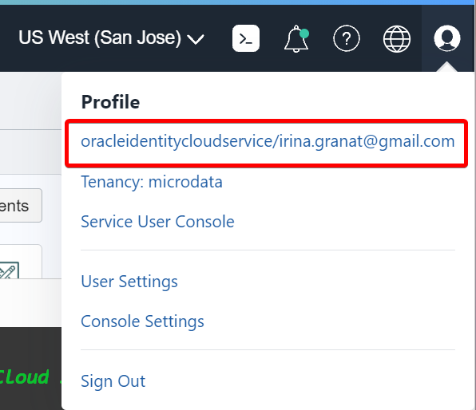
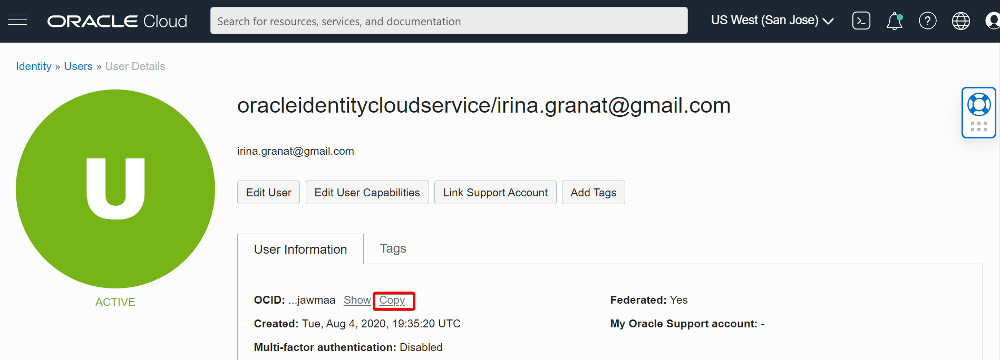

# Setup

## Introduction

In this lab, we will provision and setup the resources to execute microservices in your tenancy.  

Estimated Time: 25 minutes

Watch the video below for a quick walk through of the lab.

[](youtube:yqCbkHh9EVA)

### Objectives

* Clone the setup and microservices code
* Execute setup

### Prerequisites

- This workshop assumes you have an Oracle cloud account and have signed in to the account.

## Task 1: Select the Home Region

1. Be sure to select the **home region** of your tenancy. Setup will only work in the home region.

    

## Task 2: Check Your Tenancy Service Limits

1. If you have a **fresh** free trial account with credits then you can be sure that you have enough quota and you can proceed to the next step.

    If, however, you have already used up some quota on your tenancy, perhaps while completing other workshops, there may be insufficient quota left to run this workshop. The most likely quota limits you may reach are summarized in the following table.

    | Service          | Scope  | Resource                                             | Available | Free Account Limit |
    |------------------|:------:|------------------------------------------------------|:---------:|:------------------:|
    | Compute          | AD-1   | Cores for Standard.E2 based VM and BM Instances      | **3**     | 6                  |
    | Container Engine | Region | Cluster Count                                        | **1**     | 1                  |
    | Database         | Region | Autonomous Transaction Processing Total Storage (TB) | **2**     | 2                  |
    |                  | Region | Autonomous Transaction Processing OCPU Count         | **4**     | 8                  |
    | LbaaS            | Region | 100Mbps Load Balancer Count                           | **3**     | 3                  |

2. Quota usage and limits can be check through the console: **Limits, Quotas and Usage** in the **Governance & Administration** section , For example:

    
  
3. The Tenancy Explorer is used to locate existing resources: **Governance & Administration** --> **Governance** --> **Tenancy Explorer**. Use the "Show resources in subcompartments" feature to locate all the resources in your tenancy:

    

4. It may be necessary to delete some resources to make space to run the workshop. Once you have enough space you may proceed to the next step.

## Task 3: Launch Cloud Shell

Cloud Shell is a small virtual machine running a "bash" shell which you access through the Oracle Cloud Console. Cloud Shell comes with a pre-authenticated command line interface in the tenancy region. It also provides up-to-date tools and utilities.

1. Click the Cloud Shell icon in the top-right corner of the Console.

  

  NOTE: Cloud Shell uses websockets to communicate between your browser and the service. If your browser has websockets disabled or uses a corporate proxy that has websockets disabled you will see an error message ("An unexpected error occurred") when attempting to start Cloud Shell from the console. You also can change the browser cookies settings for a specific site to allow the traffic from *.oracle.com

## Task 4: Create a Folder to Contain the Workshop Code

1. Create a directory to contain the workshop code. The directory name is used to create a compartment of the same name in your tenancy. The directory name must have between 1 and 13 characters, contain only letters or numbers, and start with a letter. Make sure that a compartment of the same name does not already exist in your tenancy or the setup will fail. For example:

    ```
    <copy>mkdir grabdish
    </copy>
    ```

   All the resources created by the setup are created in this compartment. This will let you to quickly delete and cleanup afterward.  

2. Change directory to the directory that you have created. The setup will fail if you do not complete this step. For example:

    ```
    <copy> cd grabdish
    </copy>
    ```

## Task 5: Make a Clone of the Workshop Setup Script and Source Code

1. To work with the application code, you need to make a clone from the GitHub repository using the following command.  

    ```
    <copy>git clone -b 21.12.1 --single-branch https://github.com/oracle/microservices-datadriven.git
    </copy>
    ```

   You should now see the directory `microservices-datadriven` in the directory that you created.

2. Run the following command to edit your .bashrc file so that you will return to the workshop directory when you connect to cloud shell in the future.

    ```
    <copy>
    sed -i.bak '/grabdish/d' ~/.bashrc
    echo "source $PWD/microservices-datadriven/grabdish/env.sh" >>~/.bashrc
    </copy>
    ```

## Task 6: Start the Setup

1. Execute the following sequence of commands to start the setup.  

    ```
    <copy>
    source microservices-datadriven/grabdish/env.sh
    source setup.sh
    </copy>
    ```

   Note, cloud shell may disconnect after a period of inactivity. If that happens, you can reconnect and then run this command to resume the setup:

    ```
    <copy>
    source setup.sh
    </copy>
    ```
   The setup process will typically take around 20 minutes to complete.  

2. The setup will ask for you to enter your User OCID.  

   Be sure to provide the user OCID and not the user name or tenancy OCID.

   User information is available in the Oracle Cloud Console.

   The user OCID will look something like `ocid1.user.oc1..aaaaaaaanu5dhxbl4oiasdfasdfasdfasdf4mjhbta`. Note the "ocid1.user" prefix.

   Note, sometimes the name link is missing in which case select the `User Settings` link. Do not select the "Tenancy" link.

   Locate your menu bar and click the person icon at the far upper right. From the drop-down menu, select your user's name.

    

   Click Show to see the details and then click Copy to copy the user OCID to the clipboard, paste in the copied data in console.

    

3. The setup will ask for you to enter your Compartment OCID.

    

4. The setup will automatically upload an Auth Token to your tenancy so that docker can log in to the Oracle Cloud Infrastructure Registry. If there is no space for a new Auth Token, the setup will ask you to remove an existing token to make room. This is done through the Oracle Cloud Console.

   Locate your menu bar and click the person icon at the far upper right. From the drop-down menu, select your user's name.

   

   On the User Details console, click Auth Tokens under Resources.

   

   On the Auth Tokens screen, highlight the existing token(s) and delete by clicking Delete from the drop-down menu.

   

5. The setup will ask you to enter an admin password for the databases. For simplicity, the same password will be used for both the order and inventory databases. Database passwords must be 12 to 30 characters and contain at least one uppercase letter, one lowercase letter, and one number. The password cannot contain the double quote (") character or the word "admin".

6. The setup will also ask you to enter a UI password that will be used to enter the microservice frontend user interface. Make a note of the password as you will need it later.  The UI password must be 8 to 30 characters.

7. The setup will ask you to confirm that there are no other un-terminated OKE clusters exist in your tenancy.

    ```
    <copy>
    You are limited to only one OKE cluster in this tenancy. This workshop will create one additional OKE cluster and so any other OKE clusters must be terminated.
    Please confirm that no other un-terminated OKE clusters exist in this tenancy and then hit [RETURN]?
    </copy>
    ```
   To confirm that there are no other un-terminated OKE clusters, click the Navigation Menu in the upper left of Oracle Cloud Console, navigate to Developer Services and click on Kubernetes Clusters (OKE).

    

    

   If there are any un-terminated OKE cluster(s), please delete it(them) and continue with setup steps.

    


## Task 7: Monitor the Setup

1. The setup will provision the following resources in your tenancy:

    | Resources              | Oracle Cloud Console Navigation                                               |
    |------------------------|-------------------------------------------------------------------------------|
    | Object Storage Buckets | Storage --> Object Storage --> Buckets                                        |
    | Databases (2)          | Oracle Database -- Autonomous Database -- Autonomous Transaction Processing   |
    | OKE Cluster            | Developer Services -- Containers -- Kubernetes Clusters (OKE)                 |
    | Registry Repositories  | Developer Services -- Containers -- Container Registry                        |

2. You should monitor the setup progress from a different browser window or tab.  It is best not to use the original browser window or not to refresh it as this may disturb the setup or you might lose your shell session. Most browsers have a "duplicate" feature that will allow you to quickly created a second window or tab.

     

    From the new browser window or tab, navigate around the console to view the resources within the new compartment. The table includes the console navigation for each resource. For example, here we show the database resources:

    

    Note, Cloud Shell sessions have a maximum length of 24 hours, and time out after 20 minutes of inactivity.

## Task 8: Complete the Setup

1. Once the majority of the setup has been completed the setup will periodically provide a summary of the setup status. Once everything has completed you will see the message: **SETUP_VERIFIED completed**.

    If any of the background setup jobs are still running you can monitor their progress with the following command.

    ```
    <copy>
    ps -ef | grep "$GRABDISH_HOME/utils" | grep -v grep
    </copy>
    ```

2. Their log files are located in the $GRABDISH_LOG directory.

    ```
    <copy>
    ls -al $GRABDISH_LOG
    </copy>
    ```

3. You can also cat through the logs by using the `showsetuplogs` shortcut command.

    ```
    <copy>
    showsetuplogs
    </copy>
    ```


Note, the non-java-builds.sh script may continue to run even after the setup has completed. The non-Java builds are only required in Lab 3 and so we can continue with Lab 2 while the builds continue in the background.

You may now **proceed to the next lab.**.

## Acknowledgements

* **Authors** - Paul Parkinson, Developer Evangelist; Richard Exley, Consulting Member of Technical Staff, Oracle MAA and Exadata; Irina Granat, Consulting Member of Technical Staff, Oracle MAA and Exadata
* **Adapted for Cloud by** - Nenad Jovicic, Enterprise Strategist, North America Technology Enterprise Architect Solution Engineering Team
* **Documentation** - Lisa Jamen, User Assistance Developer - Helidon
* **Contributors** - Jaden McElvey, Technical Lead - Oracle LiveLabs Intern
* **Last Updated By/Date** - Richard Exley, April 2021
