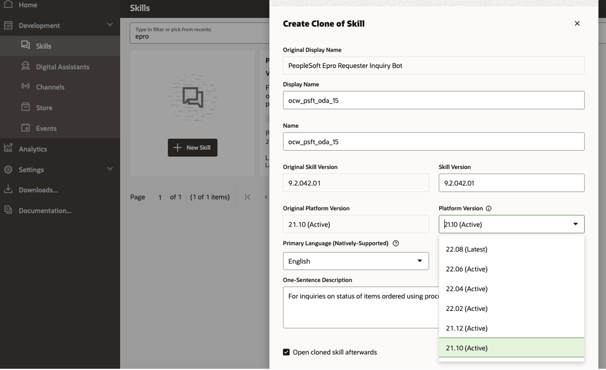
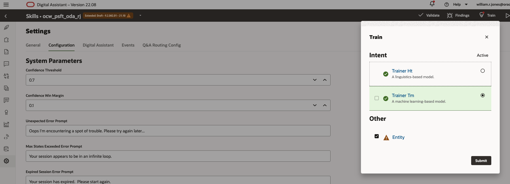
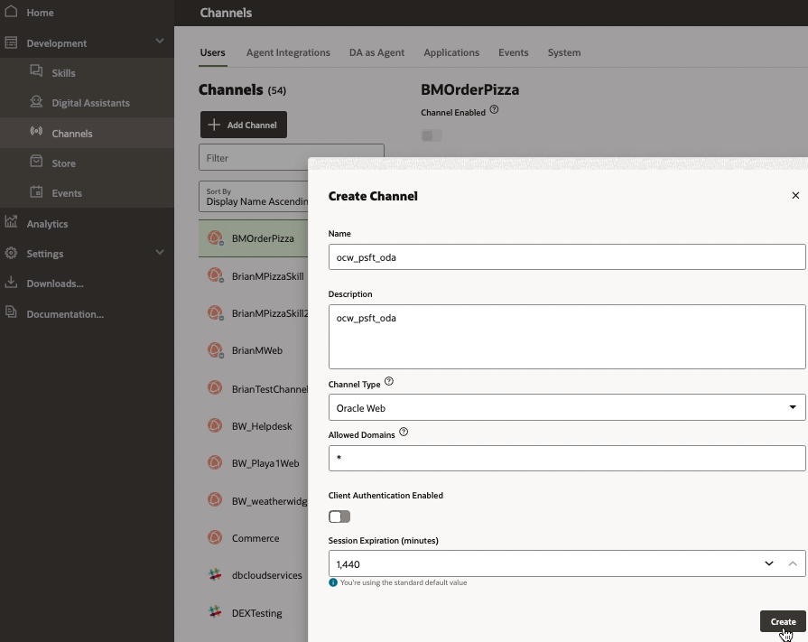
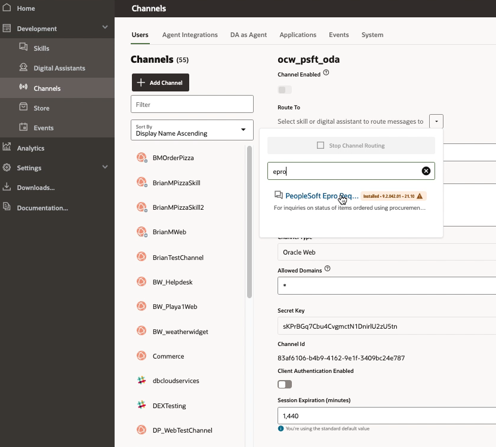
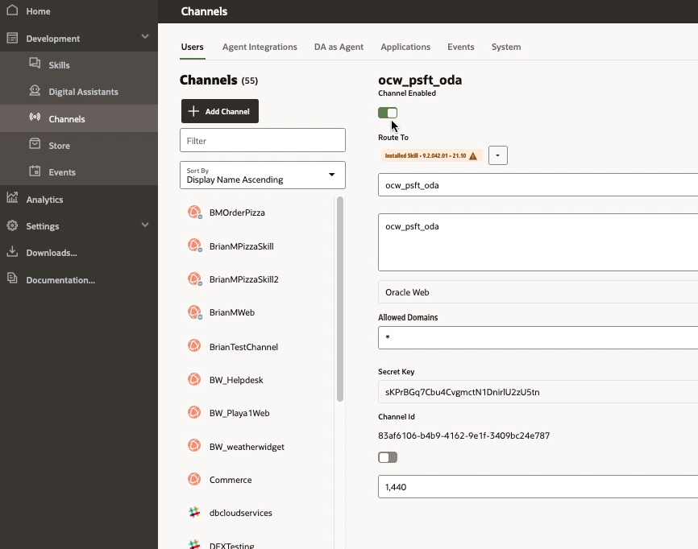

# Configure the Requisition Skill on Oracle Digital Assistant

## **Introduction**

This lab will guide you through the steps to configure the Requisition Skill on Oracle Digital Assistant. **Prior to the class, the moderators 'pulled' the "PeopleSoft Epro Requester Inquiry Bot" from the ODA Skill Store.**

Estimated Time: 10 minutes

### **Objectives**

- Install and configure the Requisition Skill in Oracle Digital Assistant

## **Step 1:** Install and Configure the Skill

1. Sign in to your ODA instance; URL and credentials will be provided by the moderators. 

2. Click on the Hamburger icon in the far left to expand the side menu; then navigate to Development > Skills and search for Epro (this is what was 'pulled' in prior). Click on the 3 dots icons and select **Clone**.

    * In the ensuing dialog name the skill ocw\_psft\_oda\_YOURSTUDENTNUMBER 

    * Also select **21.10** from the drop-down Platform Versions then click Clone to save the changes.

 

3. In upper right corner click Train and accept the defaults.

 

## **Step 2:** Create the web channel for this Skill

4. Navigate to Development > Channels. Click on + Add Channel button and set the values:

 Enter the Channel name as webchannel_YOURSTUDENTNUMBER, any brief Description, Channel type - Oracle Web, Allowed Domain '*', Client Authentication Enabled  uncheck and select Create. 

   

5. Route the channel to the Skill you have created above via this dropdown (and filter the ensuing list for the name of the skill you cloned earlier.)

    
    
6.  Slide the Channel Enabled widget above it so that it is On

    

## **Step 3:** Copy config values

7. On that same screen copy a. the generated Channel ID and b. the ODA URI from the browser window - Ex: "oda-XXXX-da2.data.digitalassistant.oci.oraclecloud.com" and save them locally in NotePad as they'll be used in a later lab.