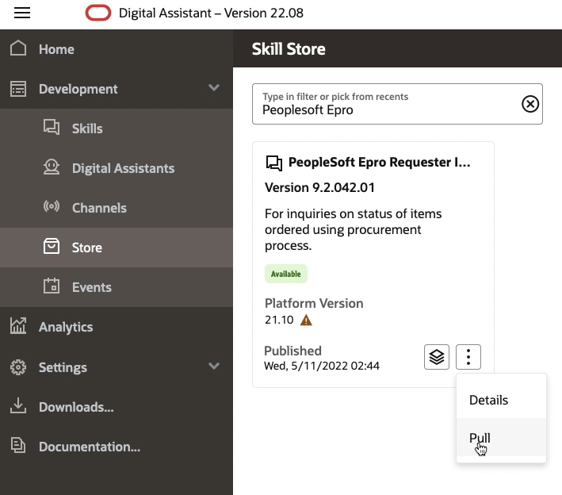

# Configure the Requisition Skill on Oracle Digital Assistant

## **Introduction**

- This lab will guide you through the steps to configure the Requisition Skill on Oracle Digital Assistant.

Estimated Time: 10 minutes

### **Objectives**

- Install and configure the Requisition Skill in Oracle Digital Assistant

## **Step 1:** Install and Configure the Skill

1. Sign in to your ODA instance. Click on the hamburger icon on the left and navigate to Development > Store. 

2. (Do not do this step, since prior to the class, the instructor searched for "PeopleSoft Epro Requester Inquiry Bot" and clicked on the 3 dots icon in the lower left corner and selected Pull.)

    

3. Navigate to Development > Skills and search from Epro. Click on the 3 dots icons and select Extend.

	 

 In the ensuing dialog name the skill **'ocw\_psft\_oda_YOURINITIALS'** and then click Extend to dismiss that dialog.

## **Step 2:** Create the web channel for this Skill

4. Navigate to **Development > Channels**. Click on **+ Add Channel** to add one and set the values as seen in this picture. 

    

Ie, Enter the Channel name, Description, Channel type - Oracle Web, Allowed Domain *, Client authentication enabled - uncheck and select Create.

3. Route the channel to the Skill you have configured in Step 1 via this dropdown.  Slide the Channel Enabled widget above it so that it is On.

    
    
4.  Slide the Channel Enabled widget above it so that it is On

    

## **Step 3:** Copy config values

Copy 
1. the generated Channel ID
2. ODA URI - Ex: "oda-XXXX-da2.data.digitalassistant.oci.oraclecloud.com" and save them as they'll be used in a later lab.

