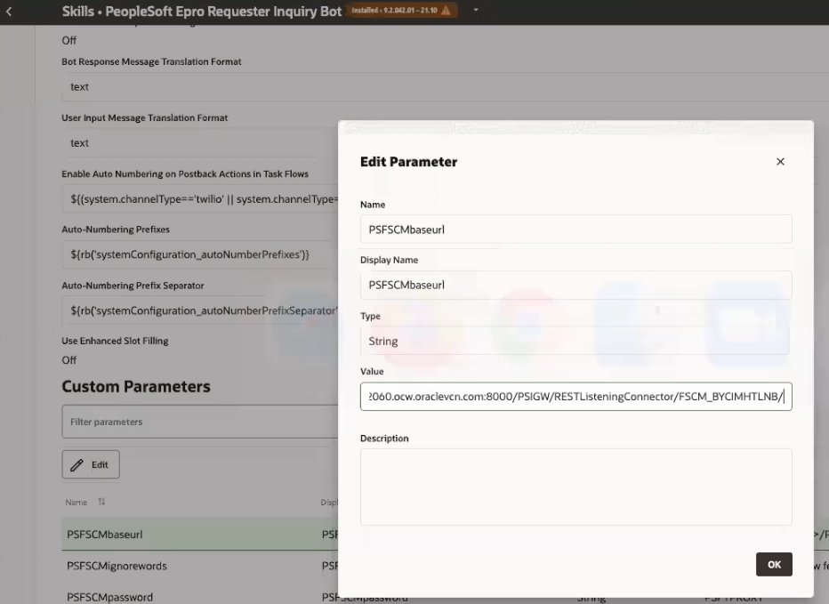

# Configuring ODA on PeopleSoft instance 

## Introduction

- This lab will guide you to connect the PeopleSoft environment with the Requisition Skill.

Estimated Time: 60 minutes

### Objectives

- Connect the Requisition Bot to the FSCM PeopleSoft instance.

## **Step 1:** Web Service configuration

1. Via a browser go to your PSFT instance you copied to NotePad during the PreReqs/Intro; login with the credentials **userID=VP1 pwd=oracle**
					 

    

2. Go to NavBar (compass icon upper right corner) and then select Menu > P > PeopleTools > Integration Broker > WebServices > Provide Webservices   

    
 
3. On the first screen of the ensuing wizard, click on the checkbox for ReST Service and search for PTCB; when the result is found, click on the checkbox as seen in this screen and then click Next:

    
    
4. On this screen click on both checkboxes as seen here:
  
    

5. Continue to click next through the wizard (3 times) until it completes and you see this screen:

    
    
6. Notice what is highlighted in the above image; in your instance, copy the FSCM_XYZ value to NotePad as you'll need it later in the lab.

									   

## **Step 2:** Proxy user creation

7. Go to NavBar (compass icon upper right corner) and then select Menu > P > PeopleTools > Security > User Profiles > User Profiles.

8.  Click on Add a new Value tab and use PSFTPROXY. Click on the Add button.

    
	
																																															 
9. Select the Symbolic ID as SYSADM1, type a new password (oracle123) and confirm the password. 

   

10.  On the next tab (ie, ID)	, Update the ID type pulldown as "None". Click Save.

    

11.  On the next tab (ie, Roles), click 2 times on the + button in the lower right corner to insert 2 rows; search for the 2 roles in this image and click the Save button only after your screen looks like this one.

    
																										 								 
    
12. We are now going to add a role to another user similar to what we have just done. Go to NavBar (compass icon upper right corner) and go Recently Visited > User Profiles, or select Menu > P > PeopleTools > Security > User Profiles > User Profiles

13. Search for VP1; add roles for EOCB Admin User, EOCB Client User, and ePro Requester Inquiry Bot. Click Save and ignore any warning dialogs.

    

## **Step 3:** Configure Bot ID and Roles

14.  Navigate to Menu > E > Enterprise Components > Chatbot Configurations > **Global** Chatbot Definitions

    

15.  Enter the ODA URI which you copied in Lab 1 ODA Server URI field **without** the HTTP prefix (see image). Click Save.

    
    
16. On that same screen, click the Add button; click edit (pencil) next to Epro Requester Bot

    

17. Add the ODA web channel ID which you copied in Lab 1 in the Bot App ID field. Click Done, and then click Next.

    

18. You should now be on the Global Settings tab, and enter these values:

    
																																																													   
 Click Next, and then **Submit**.

19. You should now be on a screen such as this, so click the Enable slider next to Epro Requestor and then Save.

    

## **Step 4:** Verify Restricted Services 

20. Go to NavBar > Menu > P > PeopleTools > Integration Broker > Configuration > Service Configuration. Ignore any warnings, and click on the Restricted Services tab. Search with the keyword "PTCB_APPL", click on the checkbox Restricted Service, and *use the magnifier icon*; select the hyperlink in the ensuing result.
	
     
     
 (**If the service didn't populate in the table under Services, click the Search button**.)

21. Uncheck the Restricted service in the ***Table*** so that you can edit Service configurations. Now save all the changes and dismiss any warnings if they appear.

     
																																																					
22. Now, go to NavBar > Menu > PeopleTools > Integration Broker > Integration Setup > Service Definitions; search for the service "PTCB\_APPL\_SVC". Click on the Search button so the field populates. Click to enable the ReST Service button.

   

23. Now click on the hyperlinked result, and note the two ensuing hyperlinked results in the table below:

   

24. For both results ("PTCB\_APPL\_SVC\_GET" and "PTCB\_APPL\_SVC\_POST"), click on them one at a time and update the Req. Verification pull-down to "Basic Authentication". Click Save.
																																														
    

 Note: The Basic Authentication uses a username and password to make any request whereas SSL Authentication uses securely encrypted certificate based authentication. You can use any of them based on your Organization's need.

## **Step 5:** Update the Authentication type for the Application Service

25. Navigate to PeopleTools > Integration Broker > Application Services >  Administration > Application Services Security. Click on the Token Required tab. Expand the Chat Bot Token Type field and select PSFT. Your screen now looks like this:

     

***Click Save***

## **Step 6:** Update the Skill Configuration

26. Switch back to the ***ODA console*** and select the skill you used in Lab 1

    

27. Once inside that skill select the Settings (gear icon):

    
    
28. Click on the Configuration tab:

    
    
29. Scroll to the bottom of the page

    

30. Once you select a Custom Parameter, an edit icon (pencil) becomes available so you can set the following values:

***PSFSCMbaseurl***: denotes the base url of the application service. Replace with your **IP Address** you copied in the PreReqs lab the URL and port; for Node use "FSCM_BYCIMHTLNB". **Use HTTP not HTTPS**
            
																																

***PSFSCMpassword***: It denotes the password for a Proxy user which you set in *Step 1*. 

   

    
Congratulations! Move on to the final lab