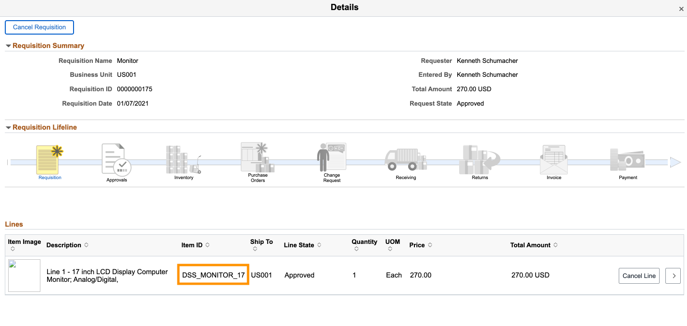

# Test the Requisition Skill

## Introduction

- This lab will guide you to test the Requisition Skill on the PeopleSoft instance.

Estimated Time: 5 minutes

### Objectives

- Test the Requisition Skill deployed on FSCM PeopleSoft instance

## **Step 1:** Test your Skill

1. Go back to the Employee Self Service page and select the New_Skill tile to access your bot.

    

2. Test your bot.

    - User: Hi
    - Bot: Hello! I am a virtual assistant. I can help you inquire on the status of your Requisitions. 
    You can ask me questions like: 

        1) Where is Item (Item ID)?  
        2) Where is my ''Item Description'' (part or full Item description)?

    - User: where is item XXX?
    - Bot: Requisition(s) for Item XXX ......

      

        
      
      

## **Extra Credit:** Check the Requisition details

1. On your PeopleSoft instance, navigate to the Employee Self Service Page.

    

2. Select the eProcurement tile > My Requisitions. If you don't find any requisitions, go back to the eProcurement page and create a Requisition.

3. Now select '>' next to any Requisition name to check the details of the requisition.

    

4. Copy the Item ID in a *Notepad* to verify the item details from the bot.

    

## **Summary**

Congratulations, you have successfully deployed the Requisition Skill on PeopleSoft instance.

## **Trouble-shooting? Verify whether the Integration Broker is active and the Node is responding**

1. Navigate to PeopleTools > Integration Broker > Integration Network > Configuration Status and select Gateway Configured.

2. On the next screen, select Ping Gateway button to check whether the gateway is active.

    

3. Now, go back to the Configuration Status page and select Node Network configured.

4. Next screen shows the list of Nodes available. You can select your nodename with the prefix FSCM_XXXX.

5. Switch to the Connectors tab and select Ping Node button corresponding to your Node name to check whether the Node is responding.

    
