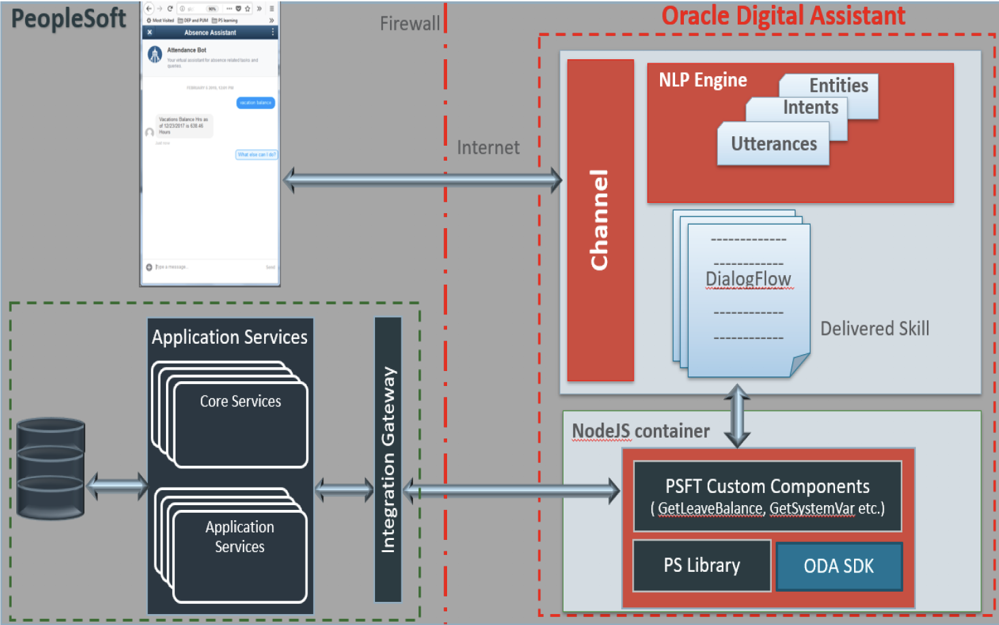

# Configure Requisition bot on PeopleSoft

## **Introduction**

This tutorial describes the process to deploy a Requisition Chatbot on PeopleSoft Financials and Supply Chain Management from Oracle Cloud Infrastructure Marketplace instance and Oracle Digital Assistant. 

The Oracle Digital Assistant is an OCI solution provided by Oracle and connectivity must be ensured through the firewall to enable Integration with on premise PeopleSoft Instances. ***The following has already been set up for you***:

**Chat Client**: The Chatbot Integration Framework supports the Web Channel as a part of integration with ODA. Chat clients rendered within PeopleSoft PIA page establish a connection with ODA Skills through the Web channel. ODA provides a set of Javascript files named as WebSDK, which takes care of construction of Chat Client within PeopleSoft PIA. The communication between PeopleSoft chat client and ODA instance is established using the WebSDK files provided by ODA. 

**Skills**: This refers to the actual bot deployed on the ODA instance. This contains the different Intents, Utterances and Dialogflows for the bot. The conversation between the user and bot is designed and defined in the skill. Please refer the ODA documentation for more details.

**PSFT Custom Components**: This is Node JS code that gets deployed in the embedded Node JS container in ODA. The custom components are local to a skill within ODA. The PeopleSoft delivered Skills and Skill Template come with a packaged custom components code. (The instructions on how to add/generate custom components for a newly added service is beyond the scope of this lab but can be done on your own.)

**Application Services**: The Application Services framework is delivered as part of the Integration Broker in PeopleTools. The Chatbot Integration Framework requires configuration to be deployed using this framework.

Estimated Time: 1.5 hours

## **Via your laptop's browser we have an environment where:**

1. ODA is running

1. PeopleSoft Application Service is accessible on the open internet for the ODA Cloud instance to consume

4. Integration Broker is configured, up and running

Note: You will need a browser that allows HTTP connections (ie, Safari) since our lab environment is not using HTTPS

You may now *proceed to the next lab*.

