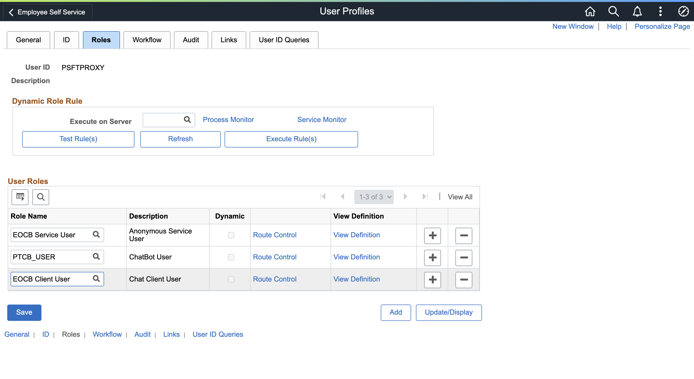
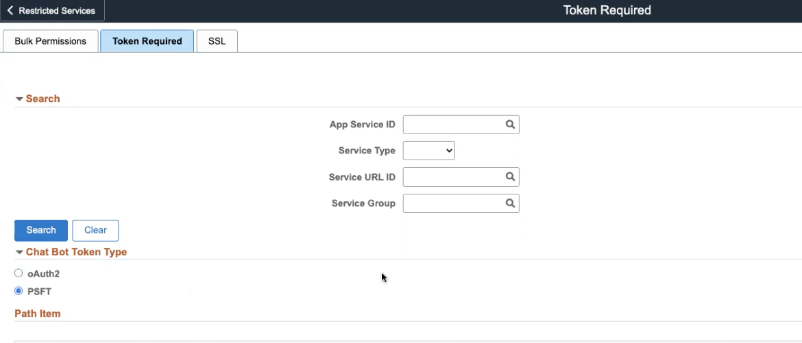

# Configuring ODA on PeopleSoft instance 

## Introduction

- This lab will guide you to connect the PeopleSoft environment with the Requisition Skill.

Estimated Time: 60 minutes

### Objectives

- Connect the Requisition Bot to the FSCM PeopleSoft instance.

## **Step 1:** Proxy user creation

1. Via a browser login to your classroom assigned PeopleSoft instance with the credentials 
2. 		usr=VP1 pwd=oracle

2. Go to NavBar (compass icon upper right corner) and then select Menu > P > PeopleTools > Security > User Profiles > User Profiles.

    

3.  Add a new user profile - PSFTPROXY. Click on the Add button.

    

4. Select the Symbolic ID as SYSADM1, type your new password and confirm the password.

   

5.  On the next tab, Update the ID type as "None". 

    

6.  Now select the roles as follows and click the Save button.

    

## **Step 2:** Configure Bot ID and Roles

7.  Navigate to Menu > Enterprise Components > Chatbot Configurations > Chatbot Definition page

    

8.  Give it a name and enter the ODA URI which you copied in Lab 1 ODA Server URI field. Click Save.

    
    
9. On that same screen, click the edit (pencil) icon next to Epro Requester Bot

10. Add the ODA web channel ID which you generated in *Lab 1* in the Bot App ID field

11. ***Search*** and then ***select*** EOCB Client User role to this bot definition. Now hit the Save button.

    

18. Go to NavBar > Menu > P > PeopleTools > Security> User Profiles > User Profiles and then look up for the user "VP1"

19. Switch to the Roles tab and click on the + button next to any user role. Now, under User Roles, click on any + sign (lower right corner of screenshot) to add a row.

    
    
19. In the new blank row you just created, type 'ePro' and then the magnifier button. Select Epro Requester Inquiry Bot so it populates your new field. Click Save and OK to any ensuing dialogs.

    

20. Repeat the last two steps but with the "EOCB Client User" role, and click on the Save button.

## **Step 3:** Verify Restricted Services TO DO: Stop... is this still needed?

20. Go to NavBar > Menu > P > PeopleTools > Integration Broker > Service Configuration and click on the Restricted Services tab. Search with the keyword "PTCB" and *use the magnifier icon*; select the hyperlink in the ensuing result.
	
     
     
(If the service didn't populate in the table under Services, click the Search button.)

21. ***Uncheck the Restricted service*** so that you can edit Service configurations. Now save all the changes.

     

22. Now, go to NavBar > Menu > PeopleTools > Integration Broker > Integration setup > Service Operations and search for the service "PTCB\_APPL\_SVC".

23. Update the req. verification field as "Basic Authentication" instead of "SSL" for both Service Operations "PTCB\_APPL\_SVC\_GET" and "PTCB\_APPL\_SVC\_POST".
    

    

Note: The Basic Authentication uses a username and password to make any request whereas SSL Authentication uses securely encrypted certificate based authentication. You can use any of them based on your Organization's need.

## **Step 3:** Update the Authentication type for the Application Service

24. Navigate to PeopleTools > Integration Broker > Application Services >  Administration > Application Services Security. Click on the Token Required tab. Expand the Chat Bot Token Type field and select PSFT. Your screen now looks like this:

     

***Click Save***

<!--25. Search for PT_CONFIGIRATION and click on the Configure button. 

26. By default, the authentication type is OAuth but switch that to PS ODA Authentication and save the changes.

    
-->
## **Step 4:** Update the Skill Configuration

27. Switch back to the ***ODA console*** and select the skill you used in Lab 1

    

28. Once inside that skill select the Settings (gear icon):

    
    
29. Click on the Configuration tab:

    
    
30. Scroll to the bottom of the page

    

31. If you select a Custom Parameter, an edit icon (pencil) becomes available so you can set the following values:

***PSFSCMbaseurl***: It denotes the base url of the application service. Replace with an actual server, port and nodename. Use HTTP not HTTPS
            
http://(WebserverName.com):(port)/PSIGW/RESTListeningConnector/FSCM\_BYCIMHTLNB/PTCB\_APPL\_SVC.v1

   

Note: Webserver name - Public IP address of the PeopleSoft Instance and Nodename - Paste the Nodename which you copied in *Step 2*.

***PSFSCMuserid***: Set the PeopleSoft proxy user who has access to invoke application services. Leave it, as it is (PSFTPROXY).

***PSFSCMpassword***: It denotes the password for a Proxy user which you set in *Step 1*. 

    
Congratulations! Move on to lab 3

