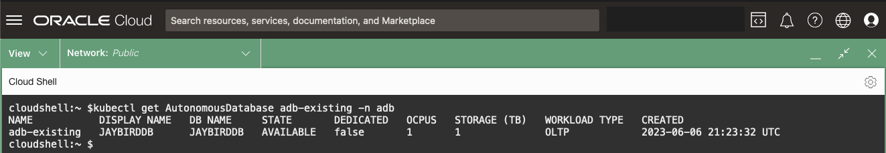

# Bind to an Oracle Autonomous Database (ADB)

## Introduction

In this lab, you will bind to an existing Oracle Autonomous Database (ADB) using the **OraOperator**.

*Estimated Time:* 10 minutes

[Lab 7](videohub:1_wdee00m6)

### Objectives

* Bind to an existing ADB using the **OraOperator**

### Prerequisites

This lab assumes you have completed previous labs.

## Task 1: Retrieve the existing ADB OCID


1. Retrieve the OCID for the ADB, by running the following in Cloud Shell:

    ```bash
    <copy>
    # Get the Compartment OCID
    COMPARTMENT_OCID=$(oci iam compartment list \
      --name [](var:oci_compartment) |
      jq -r '.data[].id')

    # Get the ADB OCID from the Compartment
    ADB_OCID=$(oci db autonomous-database list \
      --lifecycle-state AVAILABLE \
      --compartment-id $COMPARTMENT_OCID |
      jq -r '.data[].id')

    echo "ADB OCID: $ADB_OCID"
    </copy>
    ```

## Task 2: Create a manifest to Bind

1. Create a *manifest file* to define the resource of an existing ADB, leveraging the *AutonomousDatabase CRD* from the OraOperator:

    ```bash
    <copy>
    cat > adb_existing.yaml << EOF
    ---
    apiVersion: database.oracle.com/v1alpha1
    kind: AutonomousDatabase
    metadata:
      name: adb-existing
    spec:
      hardLink: false
      details:
        autonomousDatabaseOCID: $ADB_OCID
    EOF
    </copy>
    ```

The above YAML sends a request to the `database.oracle.com/v1alpha1` API exposed by the **OraOperator** to define a resource of `kind: AutonomousDatabase`.

The resource `name` will be called `adb-existing`.

It will bind to an existing ADB with `autonomousDatabaseOCID` equal to `$ADB_OCID` (substituted by the real value stored in *Task 1*).

**Important:** the `spec.hardLink: false` (default) field indicates that if you delete this `AutonomousDatabase` resource from the Kubernetes cluster, *do not* delete the ADB associated with it.

> Good for Production... Bad for DevOps!

If it were set to `true` then deleting the resource from Kubernetes *WOULD* delete ADB itself.

## Task 3: Apply the existing ADB Manifest

1. Define the **AutonomousDatabase** *CRD* in Kubernetes by applying the *manifest file*:

    ```bash
    <copy>
    kubectl apply -f adb_existing.yaml
    </copy>
    ```

    

## Task 4: Review the Existing ADB Custom Resource

1. Retrieve the `adb-existing` resource details by running (`kubectl get <resource> <resource_name> [-n <namespace>]`).  You can omit the `-n <namespace>` as your *kubeconfig* context has already set it for you:

    ```bash
    <copy>
    kubectl get AutonomousDatabase adb-existing
    </copy>
    ```

    With the exception of the **DISPLAY NAME** and **DB NAME**, you should see similar output:

    

2. Describe the `adb-existing` resource (`kubectl describe <resource_type> <resource_name> [-n <namespace>]`) to get more details.

    Use the resource_type alias `adb` for `AutonomousDatabase` to save some typing.

    You can view all the resource_type alias short names by running: `kubectl api-resources`

    ```bash
    <copy>
    kubectl describe adb adb-existing
    </copy>
    ```

    A lot of useful information will be displayed including CPU and Storage settings, Connection Strings, and its Lifecycle State (AVAILABLE).  You will modify these fields later to manage the ADB via K8s.


From here you can do a number of database administration functions as describe in the [OraOperator documentation](https://github.com/oracle/oracle-database-operator).

You can also create Kubernetes secrets for connecting to the database, however, we will use a more secure approach which is described in the next lab.

You may now **proceed to the next lab**

## Learn More

* [Oracle Database Operator (OraOperator)](https://github.com/oracle/oracle-database-operator)
* [Oracle Autonomous Database](https://www.oracle.com/uk/autonomous-database/)
* [Kubernetes Secrets](https://K8s.io/docs/concepts/configuration/secret/)

## Acknowledgements

* **Authors** - [](var:authors)
* **Contributors** - [](var:contributors)
* **Last Updated By/Date** - John Lathouwers, July 2023
